# CONVOLUTIONAL NEURAL NETWORK (CNN)
## I. ENTRENAMIENTO
### - El algoritmo de entrenamiento, `train.py`, permite los siguientes argumentos:

````python
def main():
  parser = argparse.ArgumentParser(description="Entrena el modelo HD-only para detección de plagas")
  parser.add_argument("data_dir", help="Directorio raíz con subcarpetas de clases")
  parser.add_argument("-e", "--epochs", type=int, default=20, help="Número máximo de épocas")
  parser.add_argument("-a", "--alpha", type=float, default=0.50, help="Alpha")
  parser.add_argument("-g", "--gamma", type=float, default=3.0, help="Gamma")
  parser.add_argument("-lt", "--loss_type", type=str, choices=["focal_loss", "binary_crossentropy"], help="Tipo de funcion de perdida")
  parser.add_argument("-rgb", "--rgb", action='store_true', default=False, help="Es RGB?")
  parser.add_argument("-mt", "--model_type", type=str, required=True, choices=["cnn", "rf"], help="Tipo de modelo a entrenar (cnn o rf)")
  parser.add_argument("-t", "--threshold", type=float, default=0.5, help="Umbral de decisión (0.0 a 1.0)")
  args = parser.parse_args()
  run_training(args.data_dir, args.epochs, args.loss_type, args.rgb, args.alpha, args.gamma, args.model_type, args.threshold)
````

# 1. FOCAL LOSS MULTIESPECTRAL (FL MS)
### 1.1 Comando:

````bash
python src\pest_detection_models\train.py data\multiespectral\TTADDA-dataset\TTADDA_NARO_2023_F1\drone_data -lt focal_loss -e 80 -a 0.75 -g 2.0 -mt cnn
````

### 1.2 Consola:

````bash
2026-03-24 12:35:57.871010: I tensorflow/core/util/port.cc:153] oneDNN custom operations are on. You may see slightly different numerical results due to floating-point round-off errors from different computation orders. To turn them off, set the environment variable `TF_ENABLE_ONEDNN_OPTS=0`.
2026-03-24 12:35:59.238525: I tensorflow/core/util/port.cc:153] oneDNN custom operations are on. You may see slightly different numerical results due to floating-point round-off errors from different computation orders. To turn them off, set the environment variable `TF_ENABLE_ONEDNN_OPTS=0`.

--- [Fecha/hora inicio=20260324_1236] ---

--- [T=0.00s] ---
init. Iniciando entrenamiento MULTIESPECTRAL con perdida Focal Loss

--- [Fecha/hora inicio=20260324_1236] ---

--- [T=0.00s] ---
1. 1. Extrayendo datos

--- [Fecha/hora inicio=20260324_1236] ---

--- [T=0.01s] ---
1. Carga de datos cnn Multiespectral

--- [Fecha/hora inicio=20260324_1236] ---

--- [T=0.07s] ---
2. Filtrado y extracción de datos

--- [Fecha/hora inicio=20260324_1236] ---

--- [T=0.08s] ---
2.1. Iniciando procesamiento de 665 imágenes etiquetadas...

--- [Fecha/hora inicio=20260324_1236] ---

--- [T=0.08s] ---
2.2. Archivos seleccionados: ['red.tif', 'red edge.tif', 'nir.tif', 'blue.tif', 'green.tif']

--- [Fecha/hora inicio=20260324_1236] ---

--- [T=57.09s] ---
7. Extracción de imágenes completada.

Datos listos para entrenamiento. Total de muestras: 665

Resumen de Datos Multiespectrales:
Total de parches extraídos: 665
X Train/Val Split: 532 / 133
Y Train/Val Split: 532 / 133
Forma X_train: (532, 224, 224, 5)
Forma Y_train: (532,)
Shape train: (532, 224, 224, 5)
2026-03-24 12:36:58.234818: I tensorflow/core/platform/cpu_feature_guard.cc:210] This TensorFlow binary is optimized to use available CPU instructions in performance-critical operations.
To enable the following instructions: SSE3 SSE4.1 SSE4.2 AVX AVX2 AVX_VNNI FMA, in other operations, rebuild TensorFlow with the appropriate compiler flags.
Pesos de Clase Calculados: Plaga (0): 1.11, Sana (1): 1.55
------------------------------
DEBUG - Conteo: Plaga: 360, Sana: 172
RESULTADO - Pesos Finales: Plaga (0): 1.11, Sana (1): 1.55
------------------------------
Epoch 1/80
2026-03-24 12:36:58.619713: E tensorflow/core/framework/node_def_util.cc:680] NodeDef mentions attribute use_unbounded_threadpool which is not in the op definition: Op<name=MapDataset; signature=input_dataset:variant, other_arguments: -> handle:variant; attr=f:func; attr=Targuments:list(type),min=0; attr=output_types:list(type),min=1; attr=output_shapes:list(shape),min=1; attr=use_inter_op_parallelism:bool,default=true; attr=preserve_cardinality:bool,default=false; attr=force_synchronous:bool,default=false; attr=metadata:string,default=""> This may be expected if your graph generating binary is newer  than this binary. Unknown attributes will be ignored. NodeDef: {{node ParallelMapDatasetV2/_15}}
17/17 ━━━━━━━━━━━━━━━━━━━━ 0s 1s/step - accuracy: 0.4025 - auc: 0.5092 - loss: 0.0907 - precision: 0.3543 - recall: 0.96302026-03-24 12:37:25.767124: E tensorflow/core/framework/node_def_util.cc:680] NodeDef mentions attribute use_unbounded_threadpool which is not in the op definition: Op<name=MapDataset; signature=input_dataset:variant, other_arguments: -> handle:variant; attr=f:func; attr=Targuments:list(type),min=0; attr=output_types:list(type),min=1; attr=output_shapes:list(shape),min=1; attr=use_inter_op_parallelism:bool,default=true; attr=preserve_cardinality:bool,default=false; attr=force_synchronous:bool,default=false; attr=metadata:string,default=""> This may be expected if your graph generating binary is newer  than this binary. Unknown attributes will be ignored. NodeDef: {{node ParallelMapDatasetV2/_15}}

Epoch 1: val_recall improved from None to 0.00000, saving model to C:\workspace\hd-image-pest-detection-cnn-and-rf\src\pest_detection_models\best_models\best_model_final_MULTIESPECTRAL_focal_loss.keras
17/17 ━━━━━━━━━━━━━━━━━━━━ 29s 1s/step - accuracy: 0.4925 - auc: 0.6282 - loss: 0.0722 - precision: 0.3799 - recall: 0.9012 - val_accuracy: 0.6767 - val_auc: 0.8704 - val_loss: 0.0696 - val_precision: 0.0000e+00 - val_recall: 0.0000e+00 - learning_rate: 1.0000e-04
Epoch 2/80
17/17 ━━━━━━━━━━━━━━━━━━━━ 0s 1s/step - accuracy: 0.7315 - auc: 0.8180 - loss: 0.0487 - precision: 0.5784 - recall: 0.7018 
Epoch 2: val_recall did not improve from 0.00000
17/17 ━━━━━━━━━━━━━━━━━━━━ 24s 1s/step - accuracy: 0.7274 - auc: 0.8069 - loss: 0.0461 - precision: 0.5605 - recall: 0.7267 - val_accuracy: 0.6767 - val_auc: 0.8668 - val_loss: 0.0918 - val_precision: 0.0000e+00 - val_recall: 0.0000e+00 - learning_rate: 1.0000e-04
Epoch 3/80
17/17 ━━━━━━━━━━━━━━━━━━━━ 0s 1s/step - accuracy: 0.7564 - auc: 0.8765 - loss: 0.0344 - precision: 0.5901 - recall: 0.8708 
Epoch 3: val_recall did not improve from 0.00000
17/17 ━━━━━━━━━━━━━━━━━━━━ 24s 1s/step - accuracy: 0.7500 - auc: 0.8622 - loss: 0.0340 - precision: 0.5747 - recall: 0.8721 - val_accuracy: 0.6767 - val_auc: 0.8738 - val_loss: 0.1072 - val_precision: 0.0000e+00 - val_recall: 0.0000e+00 - learning_rate: 1.0000e-04
Epoch 4/80
17/17 ━━━━━━━━━━━━━━━━━━━━ 0s 1s/step - accuracy: 0.7631 - auc: 0.8713 - loss: 0.0300 - precision: 0.5917 - recall: 0.9203 
Epoch 4: val_recall did not improve from 0.00000
17/17 ━━━━━━━━━━━━━━━━━━━━ 24s 1s/step - accuracy: 0.7575 - auc: 0.8522 - loss: 0.0306 - precision: 0.5811 - recall: 0.8953 - val_accuracy: 0.6767 - val_auc: 0.8742 - val_loss: 0.1146 - val_precision: 0.0000e+00 - val_recall: 0.0000e+00 - learning_rate: 1.0000e-04
Epoch 5/80
17/17 ━━━━━━━━━━━━━━━━━━━━ 0s 1s/step - accuracy: 0.7600 - auc: 0.8651 - loss: 0.0284 - precision: 0.5895 - recall: 0.9071 
Epoch 5: val_recall did not improve from 0.00000
17/17 ━━━━━━━━━━━━━━━━━━━━ 24s 1s/step - accuracy: 0.7538 - auc: 0.8616 - loss: 0.0286 - precision: 0.5779 - recall: 0.8837 - val_accuracy: 0.6767 - val_auc: 0.8720 - val_loss: 0.1197 - val_precision: 0.0000e+00 - val_recall: 0.0000e+00 - learning_rate: 1.0000e-04
Epoch 6/80
17/17 ━━━━━━━━━━━━━━━━━━━━ 0s 1s/step - accuracy: 0.7783 - auc: 0.8798 - loss: 0.0253 - precision: 0.6115 - recall: 0.9104 
Epoch 6: ReduceLROnPlateau reducing learning rate to 4.999999873689376e-05.

Epoch 6: val_recall did not improve from 0.00000
17/17 ━━━━━━━━━━━━━━━━━━━━ 23s 1s/step - accuracy: 0.7575 - auc: 0.8602 - loss: 0.0275 - precision: 0.5830 - recall: 0.8779 - val_accuracy: 0.6767 - val_auc: 0.8760 - val_loss: 0.1195 - val_precision: 0.0000e+00 - val_recall: 0.0000e+00 - learning_rate: 1.0000e-04
Epoch 7/80
17/17 ━━━━━━━━━━━━━━━━━━━━ 0s 1s/step - accuracy: 0.7774 - auc: 0.8851 - loss: 0.0239 - precision: 0.6115 - recall: 0.8994 
Epoch 7: val_recall did not improve from 0.00000
17/17 ━━━━━━━━━━━━━━━━━━━━ 24s 1s/step - accuracy: 0.7744 - auc: 0.8642 - loss: 0.0269 - precision: 0.6032 - recall: 0.8837 - val_accuracy: 0.6767 - val_auc: 0.8747 - val_loss: 0.1093 - val_precision: 0.0000e+00 - val_recall: 0.0000e+00 - learning_rate: 5.0000e-05
Epoch 8/80
17/17 ━━━━━━━━━━━━━━━━━━━━ 0s 1s/step - accuracy: 0.7735 - auc: 0.8866 - loss: 0.0244 - precision: 0.6059 - recall: 0.9078 
Epoch 8: val_recall did not improve from 0.00000
17/17 ━━━━━━━━━━━━━━━━━━━━ 23s 1s/step - accuracy: 0.7707 - auc: 0.8668 - loss: 0.0259 - precision: 0.5969 - recall: 0.8953 - val_accuracy: 0.6767 - val_auc: 0.8753 - val_loss: 0.0996 - val_precision: 0.0000e+00 - val_recall: 0.0000e+00 - learning_rate: 5.0000e-05
Epoch 9/80
17/17 ━━━━━━━━━━━━━━━━━━━━ 0s 1s/step - accuracy: 0.7866 - auc: 0.8763 - loss: 0.0242 - precision: 0.6225 - recall: 0.9033 
Epoch 9: val_recall did not improve from 0.00000
17/17 ━━━━━━━━━━━━━━━━━━━━ 23s 1s/step - accuracy: 0.7763 - auc: 0.8655 - loss: 0.0258 - precision: 0.6073 - recall: 0.8721 - val_accuracy: 0.6767 - val_auc: 0.8773 - val_loss: 0.0906 - val_precision: 0.0000e+00 - val_recall: 0.0000e+00 - learning_rate: 5.0000e-05
Epoch 10/80
17/17 ━━━━━━━━━━━━━━━━━━━━ 0s 1s/step - accuracy: 0.7884 - auc: 0.8841 - loss: 0.0236 - precision: 0.6226 - recall: 0.9172 
Epoch 10: val_recall improved from 0.00000 to 0.02326, saving model to C:\workspace\hd-image-pest-detection-cnn-and-rf\src\pest_detection_models\best_models\best_model_final_MULTIESPECTRAL_focal_loss.keras
17/17 ━━━━━━━━━━━━━━━━━━━━ 24s 1s/step - accuracy: 0.7707 - auc: 0.8591 - loss: 0.0265 - precision: 0.5984 - recall: 0.8837 - val_accuracy: 0.6842 - val_auc: 0.8778 - val_loss: 0.0786 - val_precision: 1.0000 - val_recall: 0.0233 - learning_rate: 5.0000e-05
Epoch 11/80
17/17 ━━━━━━━━━━━━━━━━━━━━ 0s 1s/step - accuracy: 0.8054 - auc: 0.8806 - loss: 0.0233 - precision: 0.6433 - recall: 0.9295 
Epoch 11: val_recall improved from 0.02326 to 0.06977, saving model to C:\workspace\hd-image-pest-detection-cnn-and-rf\src\pest_detection_models\best_models\best_model_final_MULTIESPECTRAL_focal_loss.keras
17/17 ━━━━━━━━━━━━━━━━━━━━ 24s 1s/step - accuracy: 0.7838 - auc: 0.8617 - loss: 0.0258 - precision: 0.6126 - recall: 0.9012 - val_accuracy: 0.6992 - val_auc: 0.8784 - val_loss: 0.0665 - val_precision: 1.0000 - val_recall: 0.0698 - learning_rate: 5.0000e-05
Epoch 12/80
17/17 ━━━━━━━━━━━━━━━━━━━━ 0s 1s/step - accuracy: 0.8027 - auc: 0.8664 - loss: 0.0249 - precision: 0.6409 - recall: 0.9226 
Epoch 12: val_recall improved from 0.06977 to 0.11628, saving model to C:\workspace\hd-image-pest-detection-cnn-and-rf\src\pest_detection_models\best_models\best_model_final_MULTIESPECTRAL_focal_loss.keras
17/17 ━━━━━━━━━━━━━━━━━━━━ 24s 1s/step - accuracy: 0.7838 - auc: 0.8621 - loss: 0.0255 - precision: 0.6135 - recall: 0.8953 - val_accuracy: 0.6992 - val_auc: 0.8787 - val_loss: 0.0565 - val_precision: 0.7143 - val_recall: 0.1163 - learning_rate: 5.0000e-05
Epoch 13/80
17/17 ━━━━━━━━━━━━━━━━━━━━ 0s 1s/step - accuracy: 0.7941 - auc: 0.8981 - loss: 0.0212 - precision: 0.6280 - recall: 0.9292 
Epoch 13: val_recall improved from 0.11628 to 0.23256, saving model to C:\workspace\hd-image-pest-detection-cnn-and-rf\src\pest_detection_models\best_models\best_model_final_MULTIESPECTRAL_focal_loss.keras
17/17 ━━━━━━━━━━━━━━━━━━━━ 24s 1s/step - accuracy: 0.7876 - auc: 0.8780 - loss: 0.0237 - precision: 0.6157 - recall: 0.9128 - val_accuracy: 0.7368 - val_auc: 0.8787 - val_loss: 0.0478 - val_precision: 0.8333 - val_recall: 0.2326 - learning_rate: 5.0000e-05
Epoch 14/80
17/17 ━━━━━━━━━━━━━━━━━━━━ 0s 1s/step - accuracy: 0.8026 - auc: 0.9010 - loss: 0.0206 - precision: 0.6382 - recall: 0.9320 
Epoch 14: val_recall improved from 0.23256 to 0.37209, saving model to C:\workspace\hd-image-pest-detection-cnn-and-rf\src\pest_detection_models\best_models\best_model_final_MULTIESPECTRAL_focal_loss.keras
17/17 ━━━━━━━━━━━━━━━━━━━━ 24s 1s/step - accuracy: 0.7895 - auc: 0.8760 - loss: 0.0235 - precision: 0.6200 - recall: 0.9012 - val_accuracy: 0.7594 - val_auc: 0.8787 - val_loss: 0.0414 - val_precision: 0.7619 - val_recall: 0.3721 - learning_rate: 5.0000e-05
Epoch 15/80
17/17 ━━━━━━━━━━━━━━━━━━━━ 0s 1s/step - accuracy: 0.7863 - auc: 0.8893 - loss: 0.0221 - precision: 0.6210 - recall: 0.9104 
Epoch 15: val_recall improved from 0.37209 to 0.51163, saving model to C:\workspace\hd-image-pest-detection-cnn-and-rf\src\pest_detection_models\best_models\best_model_final_MULTIESPECTRAL_focal_loss.keras
17/17 ━━━━━━━━━━━━━━━━━━━━ 23s 1s/step - accuracy: 0.7801 - auc: 0.8626 - loss: 0.0252 - precision: 0.6113 - recall: 0.8779 - val_accuracy: 0.7895 - val_auc: 0.8788 - val_loss: 0.0369 - val_precision: 0.7586 - val_recall: 0.5116 - learning_rate: 5.0000e-05
Epoch 16/80
17/17 ━━━━━━━━━━━━━━━━━━━━ 0s 1s/step - accuracy: 0.7813 - auc: 0.8911 - loss: 0.0216 - precision: 0.6167 - recall: 0.8977   
Epoch 16: val_recall improved from 0.51163 to 0.58140, saving model to C:\workspace\hd-image-pest-detection-cnn-and-rf\src\pest_detection_models\best_models\best_model_final_MULTIESPECTRAL_focal_loss.keras
17/17 ━━━━━━━━━━━━━━━━━━━━ 42s 1s/step - accuracy: 0.7707 - auc: 0.8651 - loss: 0.0244 - precision: 0.5984 - recall: 0.8837 - val_accuracy: 0.7970 - val_auc: 0.8788 - val_loss: 0.0335 - val_precision: 0.7353 - val_recall: 0.5814 - learning_rate: 5.0000e-05
Epoch 17/80
17/17 ━━━━━━━━━━━━━━━━━━━━ 0s 1s/step - accuracy: 0.7800 - auc: 0.8784 - loss: 0.0232 - precision: 0.6106 - recall: 0.9267   
Epoch 17: val_recall improved from 0.58140 to 0.62791, saving model to C:\workspace\hd-image-pest-detection-cnn-and-rf\src\pest_detection_models\best_models\best_model_final_MULTIESPECTRAL_focal_loss.keras
17/17 ━━━━━━━━━━━━━━━━━━━━ 40s 1s/step - accuracy: 0.7782 - auc: 0.8656 - loss: 0.0247 - precision: 0.6063 - recall: 0.8953 - val_accuracy: 0.8045 - val_auc: 0.8782 - val_loss: 0.0317 - val_precision: 0.7297 - val_recall: 0.6279 - learning_rate: 5.0000e-05
Epoch 18/80
17/17 ━━━━━━━━━━━━━━━━━━━━ 0s 1s/step - accuracy: 0.7817 - auc: 0.8847 - loss: 0.0221 - precision: 0.6169 - recall: 0.8992 
Epoch 18: val_recall improved from 0.62791 to 0.65116, saving model to C:\workspace\hd-image-pest-detection-cnn-and-rf\src\pest_detection_models\best_models\best_model_final_MULTIESPECTRAL_focal_loss.keras
17/17 ━━━━━━━━━━━━━━━━━━━━ 24s 1s/step - accuracy: 0.7782 - auc: 0.8591 - loss: 0.0256 - precision: 0.6089 - recall: 0.8779 - val_accuracy: 0.7970 - val_auc: 0.8784 - val_loss: 0.0301 - val_precision: 0.7000 - val_recall: 0.6512 - learning_rate: 5.0000e-05
Epoch 19/80
17/17 ━━━━━━━━━━━━━━━━━━━━ 0s 1s/step - accuracy: 0.7991 - auc: 0.8801 - loss: 0.0229 - precision: 0.6370 - recall: 0.9157 
Epoch 19: val_recall did not improve from 0.65116
17/17 ━━━━━━━━━━━━━━━━━━━━ 23s 1s/step - accuracy: 0.7838 - auc: 0.8639 - loss: 0.0249 - precision: 0.6145 - recall: 0.8895 - val_accuracy: 0.7744 - val_auc: 0.8780 - val_loss: 0.0287 - val_precision: 0.6512 - val_recall: 0.6512 - learning_rate: 5.0000e-05
Epoch 20/80
17/17 ━━━━━━━━━━━━━━━━━━━━ 0s 1s/step - accuracy: 0.7814 - auc: 0.8898 - loss: 0.0215 - precision: 0.6162 - recall: 0.9010 
Epoch 20: val_recall improved from 0.65116 to 0.74419, saving model to C:\workspace\hd-image-pest-detection-cnn-and-rf\src\pest_detection_models\best_models\best_model_final_MULTIESPECTRAL_focal_loss.keras
17/17 ━━━━━━━━━━━━━━━━━━━━ 24s 1s/step - accuracy: 0.7744 - auc: 0.8700 - loss: 0.0242 - precision: 0.6048 - recall: 0.8721 - val_accuracy: 0.7970 - val_auc: 0.8786 - val_loss: 0.0272 - val_precision: 0.6667 - val_recall: 0.7442 - learning_rate: 5.0000e-05
Epoch 21/80
17/17 ━━━━━━━━━━━━━━━━━━━━ 0s 1s/step - accuracy: 0.7935 - auc: 0.8798 - loss: 0.0225 - precision: 0.6290 - recall: 0.9187 
Epoch 21: val_recall improved from 0.74419 to 0.79070, saving model to C:\workspace\hd-image-pest-detection-cnn-and-rf\src\pest_detection_models\best_models\best_model_final_MULTIESPECTRAL_focal_loss.keras
17/17 ━━━━━━━━━━━━━━━━━━━━ 23s 1s/step - accuracy: 0.7801 - auc: 0.8684 - loss: 0.0243 - precision: 0.6096 - recall: 0.8895 - val_accuracy: 0.7669 - val_auc: 0.8784 - val_loss: 0.0262 - val_precision: 0.6071 - val_recall: 0.7907 - learning_rate: 5.0000e-05
Epoch 22/80
17/17 ━━━━━━━━━━━━━━━━━━━━ 0s 1s/step - accuracy: 0.7951 - auc: 0.8969 - loss: 0.0209 - precision: 0.6308 - recall: 0.9198 
Epoch 22: val_recall improved from 0.79070 to 0.81395, saving model to C:\workspace\hd-image-pest-detection-cnn-and-rf\src\pest_detection_models\best_models\best_model_final_MULTIESPECTRAL_focal_loss.keras
17/17 ━━━━━━━━━━━━━━━━━━━━ 23s 1s/step - accuracy: 0.7895 - auc: 0.8776 - loss: 0.0233 - precision: 0.6220 - recall: 0.8895 - val_accuracy: 0.7669 - val_auc: 0.8783 - val_loss: 0.0256 - val_precision: 0.6034 - val_recall: 0.8140 - learning_rate: 5.0000e-05
Epoch 23/80
17/17 ━━━━━━━━━━━━━━━━━━━━ 0s 1s/step - accuracy: 0.7887 - auc: 0.8885 - loss: 0.0213 - precision: 0.6222 - recall: 0.9208 
Epoch 23: val_recall improved from 0.81395 to 0.88372, saving model to C:\workspace\hd-image-pest-detection-cnn-and-rf\src\pest_detection_models\best_models\best_model_final_MULTIESPECTRAL_focal_loss.keras
17/17 ━━━━━━━━━━━━━━━━━━━━ 23s 1s/step - accuracy: 0.7763 - auc: 0.8751 - loss: 0.0231 - precision: 0.6056 - recall: 0.8837 - val_accuracy: 0.7820 - val_auc: 0.8783 - val_loss: 0.0249 - val_precision: 0.6129 - val_recall: 0.8837 - learning_rate: 5.0000e-05
Epoch 24/80
17/17 ━━━━━━━━━━━━━━━━━━━━ 0s 1s/step - accuracy: 0.7962 - auc: 0.8713 - loss: 0.0243 - precision: 0.6317 - recall: 0.9230 
Epoch 24: val_recall did not improve from 0.88372
17/17 ━━━━━━━━━━━━━━━━━━━━ 23s 1s/step - accuracy: 0.7838 - auc: 0.8548 - loss: 0.0258 - precision: 0.6126 - recall: 0.9012 - val_accuracy: 0.7820 - val_auc: 0.8783 - val_loss: 0.0248 - val_precision: 0.6129 - val_recall: 0.8837 - learning_rate: 5.0000e-05
Epoch 25/80
17/17 ━━━━━━━━━━━━━━━━━━━━ 0s 1s/step - accuracy: 0.8035 - auc: 0.8910 - loss: 0.0209 - precision: 0.6443 - recall: 0.9081 
Epoch 25: val_recall did not improve from 0.88372
17/17 ━━━━━━━━━━━━━━━━━━━━ 23s 1s/step - accuracy: 0.7932 - auc: 0.8698 - loss: 0.0239 - precision: 0.6270 - recall: 0.8895 - val_accuracy: 0.7820 - val_auc: 0.8788 - val_loss: 0.0243 - val_precision: 0.6129 - val_recall: 0.8837 - learning_rate: 5.0000e-05
Epoch 26/80
17/17 ━━━━━━━━━━━━━━━━━━━━ 0s 1s/step - accuracy: 0.7914 - auc: 0.8955 - loss: 0.0208 - precision: 0.6257 - recall: 0.9224 
Epoch 26: val_recall did not improve from 0.88372
17/17 ━━━━━━━━━━━━━━━━━━━━ 23s 1s/step - accuracy: 0.7820 - auc: 0.8696 - loss: 0.0239 - precision: 0.6120 - recall: 0.8895 - val_accuracy: 0.7820 - val_auc: 0.8786 - val_loss: 0.0244 - val_precision: 0.6129 - val_recall: 0.8837 - learning_rate: 5.0000e-05
Epoch 27/80
17/17 ━━━━━━━━━━━━━━━━━━━━ 0s 1s/step - accuracy: 0.7943 - auc: 0.8936 - loss: 0.0219 - precision: 0.6323 - recall: 0.9085 
Epoch 27: val_recall did not improve from 0.88372
17/17 ━━━━━━━━━━━━━━━━━━━━ 23s 1s/step - accuracy: 0.7820 - auc: 0.8749 - loss: 0.0240 - precision: 0.6129 - recall: 0.8837 - val_accuracy: 0.7820 - val_auc: 0.8783 - val_loss: 0.0245 - val_precision: 0.6129 - val_recall: 0.8837 - learning_rate: 5.0000e-05
Epoch 28/80
17/17 ━━━━━━━━━━━━━━━━━━━━ 0s 1s/step - accuracy: 0.7905 - auc: 0.8831 - loss: 0.0220 - precision: 0.6239 - recall: 0.9260 
Epoch 28: val_recall did not improve from 0.88372
17/17 ━━━━━━━━━━━━━━━━━━━━ 24s 1s/step - accuracy: 0.7820 - auc: 0.8656 - loss: 0.0240 - precision: 0.6120 - recall: 0.8895 - val_accuracy: 0.7820 - val_auc: 0.8792 - val_loss: 0.0243 - val_precision: 0.6129 - val_recall: 0.8837 - learning_rate: 5.0000e-05
Epoch 29/80
17/17 ━━━━━━━━━━━━━━━━━━━━ 0s 1s/step - accuracy: 0.7847 - auc: 0.8970 - loss: 0.0215 - precision: 0.6185 - recall: 0.9125 
Epoch 29: val_recall did not improve from 0.88372
17/17 ━━━━━━━━━━━━━━━━━━━━ 23s 1s/step - accuracy: 0.7782 - auc: 0.8740 - loss: 0.0242 - precision: 0.6089 - recall: 0.8779 - val_accuracy: 0.7820 - val_auc: 0.8787 - val_loss: 0.0242 - val_precision: 0.6129 - val_recall: 0.8837 - learning_rate: 5.0000e-05
Epoch 30/80
17/17 ━━━━━━━━━━━━━━━━━━━━ 0s 1s/step - accuracy: 0.7961 - auc: 0.8871 - loss: 0.0211 - precision: 0.6298 - recall: 0.9333 
Epoch 30: val_recall did not improve from 0.88372
17/17 ━━━━━━━━━━━━━━━━━━━━ 23s 1s/step - accuracy: 0.7838 - auc: 0.8700 - loss: 0.0232 - precision: 0.6109 - recall: 0.9128 - val_accuracy: 0.7820 - val_auc: 0.8786 - val_loss: 0.0239 - val_precision: 0.6129 - val_recall: 0.8837 - learning_rate: 5.0000e-05
Epoch 31/80
17/17 ━━━━━━━━━━━━━━━━━━━━ 0s 1s/step - accuracy: 0.7682 - auc: 0.8823 - loss: 0.0231 - precision: 0.6032 - recall: 0.8771 
Epoch 31: val_recall did not improve from 0.88372
17/17 ━━━━━━━━━━━━━━━━━━━━ 23s 1s/step - accuracy: 0.7707 - auc: 0.8676 - loss: 0.0248 - precision: 0.6008 - recall: 0.8663 - val_accuracy: 0.7744 - val_auc: 0.8784 - val_loss: 0.0236 - val_precision: 0.6032 - val_recall: 0.8837 - learning_rate: 5.0000e-05
Epoch 32/80
17/17 ━━━━━━━━━━━━━━━━━━━━ 0s 1s/step - accuracy: 0.7951 - auc: 0.8979 - loss: 0.0210 - precision: 0.6302 - recall: 0.9235 
Epoch 32: val_recall did not improve from 0.88372
17/17 ━━━━━━━━━━━━━━━━━━━━ 23s 1s/step - accuracy: 0.7801 - auc: 0.8717 - loss: 0.0238 - precision: 0.6087 - recall: 0.8953 - val_accuracy: 0.7744 - val_auc: 0.8780 - val_loss: 0.0236 - val_precision: 0.6032 - val_recall: 0.8837 - learning_rate: 5.0000e-05
Epoch 33/80
17/17 ━━━━━━━━━━━━━━━━━━━━ 0s 1s/step - accuracy: 0.7939 - auc: 0.8833 - loss: 0.0220 - precision: 0.6293 - recall: 0.9209 
Epoch 33: val_recall did not improve from 0.88372
17/17 ━━━━━━━━━━━━━━━━━━━━ 23s 1s/step - accuracy: 0.7801 - auc: 0.8647 - loss: 0.0245 - precision: 0.6087 - recall: 0.8953 - val_accuracy: 0.7669 - val_auc: 0.8786 - val_loss: 0.0235 - val_precision: 0.5938 - val_recall: 0.8837 - learning_rate: 5.0000e-05
Epoch 34/80
17/17 ━━━━━━━━━━━━━━━━━━━━ 0s 1s/step - accuracy: 0.8045 - auc: 0.8868 - loss: 0.0218 - precision: 0.6414 - recall: 0.9304 
Epoch 34: val_recall did not improve from 0.88372
17/17 ━━━━━━━━━━━━━━━━━━━━ 23s 1s/step - accuracy: 0.7914 - auc: 0.8694 - loss: 0.0238 - precision: 0.6206 - recall: 0.9128 - val_accuracy: 0.7669 - val_auc: 0.8787 - val_loss: 0.0234 - val_precision: 0.5938 - val_recall: 0.8837 - learning_rate: 5.0000e-05
Epoch 35/80
17/17 ━━━━━━━━━━━━━━━━━━━━ 0s 1s/step - accuracy: 0.7829 - auc: 0.8839 - loss: 0.0219 - precision: 0.6144 - recall: 0.9248 
Epoch 35: val_recall did not improve from 0.88372
17/17 ━━━━━━━━━━━━━━━━━━━━ 23s 1s/step - accuracy: 0.7744 - auc: 0.8650 - loss: 0.0241 - precision: 0.6016 - recall: 0.8953 - val_accuracy: 0.7669 - val_auc: 0.8786 - val_loss: 0.0234 - val_precision: 0.5938 - val_recall: 0.8837 - learning_rate: 5.0000e-05
Epoch 36/80
17/17 ━━━━━━━━━━━━━━━━━━━━ 0s 1s/step - accuracy: 0.7835 - auc: 0.8920 - loss: 0.0213 - precision: 0.6171 - recall: 0.9139 
Epoch 36: val_recall did not improve from 0.88372
17/17 ━━━━━━━━━━━━━━━━━━━━ 26s 2s/step - accuracy: 0.7726 - auc: 0.8674 - loss: 0.0242 - precision: 0.6000 - recall: 0.8895 - val_accuracy: 0.7669 - val_auc: 0.8792 - val_loss: 0.0233 - val_precision: 0.5938 - val_recall: 0.8837 - learning_rate: 5.0000e-05
Epoch 37/80
17/17 ━━━━━━━━━━━━━━━━━━━━ 0s 1s/step - accuracy: 0.7915 - auc: 0.8998 - loss: 0.0207 - precision: 0.6247 - recall: 0.9281 
Epoch 37: val_recall did not improve from 0.88372
17/17 ━━━━━━━━━━━━━━━━━━━━ 25s 1s/step - accuracy: 0.7801 - auc: 0.8690 - loss: 0.0240 - precision: 0.6078 - recall: 0.9012 - val_accuracy: 0.7669 - val_auc: 0.8796 - val_loss: 0.0233 - val_precision: 0.5938 - val_recall: 0.8837 - learning_rate: 5.0000e-05
Epoch 38/80
17/17 ━━━━━━━━━━━━━━━━━━━━ 0s 1s/step - accuracy: 0.7782 - auc: 0.8980 - loss: 0.0209 - precision: 0.6086 - recall: 0.9258 
Epoch 38: val_recall did not improve from 0.88372
17/17 ━━━━━━━━━━━━━━━━━━━━ 24s 1s/step - accuracy: 0.7688 - auc: 0.8695 - loss: 0.0238 - precision: 0.5939 - recall: 0.9012 - val_accuracy: 0.7669 - val_auc: 0.8796 - val_loss: 0.0233 - val_precision: 0.5938 - val_recall: 0.8837 - learning_rate: 5.0000e-05
Epoch 39/80
17/17 ━━━━━━━━━━━━━━━━━━━━ 0s 1s/step - accuracy: 0.7939 - auc: 0.8899 - loss: 0.0217 - precision: 0.6266 - recall: 0.9356 
Epoch 39: val_recall did not improve from 0.88372
17/17 ━━━━━━━━━━━━━━━━━━━━ 23s 1s/step - accuracy: 0.7838 - auc: 0.8755 - loss: 0.0232 - precision: 0.6109 - recall: 0.9128 - val_accuracy: 0.7669 - val_auc: 0.8787 - val_loss: 0.0233 - val_precision: 0.5938 - val_recall: 0.8837 - learning_rate: 5.0000e-05
Epoch 40/80
17/17 ━━━━━━━━━━━━━━━━━━━━ 0s 1s/step - accuracy: 0.7953 - auc: 0.8901 - loss: 0.0216 - precision: 0.6309 - recall: 0.9201 
Epoch 40: val_recall did not improve from 0.88372
17/17 ━━━━━━━━━━━━━━━━━━━━ 24s 1s/step - accuracy: 0.7857 - auc: 0.8742 - loss: 0.0236 - precision: 0.6169 - recall: 0.8895 - val_accuracy: 0.7669 - val_auc: 0.8796 - val_loss: 0.0232 - val_precision: 0.5938 - val_recall: 0.8837 - learning_rate: 5.0000e-05
Epoch 41/80
17/17 ━━━━━━━━━━━━━━━━━━━━ 0s 1s/step - accuracy: 0.7921 - auc: 0.8796 - loss: 0.0222 - precision: 0.6242 - recall: 0.9357 
Epoch 41: val_recall did not improve from 0.88372
17/17 ━━━━━━━━━━━━━━━━━━━━ 24s 1s/step - accuracy: 0.7820 - auc: 0.8663 - loss: 0.0241 - precision: 0.6102 - recall: 0.9012 - val_accuracy: 0.7669 - val_auc: 0.8787 - val_loss: 0.0232 - val_precision: 0.5938 - val_recall: 0.8837 - learning_rate: 5.0000e-05
Epoch 42/80
17/17 ━━━━━━━━━━━━━━━━━━━━ 0s 2s/step - accuracy: 0.7793 - auc: 0.8686 - loss: 0.0230 - precision: 0.6075 - recall: 0.9446 
Epoch 42: val_recall did not improve from 0.88372
17/17 ━━━━━━━━━━━━━━━━━━━━ 32s 2s/step - accuracy: 0.7744 - auc: 0.8595 - loss: 0.0242 - precision: 0.5985 - recall: 0.9186 - val_accuracy: 0.7669 - val_auc: 0.8805 - val_loss: 0.0232 - val_precision: 0.5938 - val_recall: 0.8837 - learning_rate: 5.0000e-05
Epoch 43/80
17/17 ━━━━━━━━━━━━━━━━━━━━ 0s 2s/step - accuracy: 0.7955 - auc: 0.8921 - loss: 0.0206 - precision: 0.6287 - recall: 0.9357 
Epoch 43: val_recall did not improve from 0.88372
17/17 ━━━━━━━━━━━━━━━━━━━━ 41s 2s/step - accuracy: 0.7857 - auc: 0.8681 - loss: 0.0232 - precision: 0.6133 - recall: 0.9128 - val_accuracy: 0.7669 - val_auc: 0.8804 - val_loss: 0.0231 - val_precision: 0.5938 - val_recall: 0.8837 - learning_rate: 5.0000e-05
Epoch 44/80
17/17 ━━━━━━━━━━━━━━━━━━━━ 0s 2s/step - accuracy: 0.7842 - auc: 0.8821 - loss: 0.0220 - precision: 0.6157 - recall: 0.9297 
Epoch 44: val_recall improved from 0.88372 to 0.90698, saving model to C:\workspace\hd-image-pest-detection-cnn-and-rf\src\pest_detection_models\best_models\best_model_final_MULTIESPECTRAL_focal_loss.keras
17/17 ━━━━━━━━━━━━━━━━━━━━ 28s 2s/step - accuracy: 0.7782 - auc: 0.8659 - loss: 0.0236 - precision: 0.6047 - recall: 0.9070 - val_accuracy: 0.7744 - val_auc: 0.8791 - val_loss: 0.0230 - val_precision: 0.6000 - val_recall: 0.9070 - learning_rate: 5.0000e-05
Epoch 45/80
17/17 ━━━━━━━━━━━━━━━━━━━━ 0s 1s/step - accuracy: 0.7866 - auc: 0.8910 - loss: 0.0218 - precision: 0.6198 - recall: 0.9224 
Epoch 45: val_recall did not improve from 0.90698
17/17 ━━━━━━━━━━━━━━━━━━━━ 24s 1s/step - accuracy: 0.7744 - auc: 0.8710 - loss: 0.0237 - precision: 0.6016 - recall: 0.8953 - val_accuracy: 0.7744 - val_auc: 0.8797 - val_loss: 0.0230 - val_precision: 0.6000 - val_recall: 0.9070 - learning_rate: 5.0000e-05
Epoch 46/80
17/17 ━━━━━━━━━━━━━━━━━━━━ 0s 2s/step - accuracy: 0.7836 - auc: 0.8935 - loss: 0.0217 - precision: 0.6165 - recall: 0.9166 
Epoch 46: val_recall did not improve from 0.90698
17/17 ━━━━━━━━━━━━━━━━━━━━ 29s 2s/step - accuracy: 0.7744 - auc: 0.8665 - loss: 0.0248 - precision: 0.6032 - recall: 0.8837 - val_accuracy: 0.7744 - val_auc: 0.8795 - val_loss: 0.0230 - val_precision: 0.6000 - val_recall: 0.9070 - learning_rate: 5.0000e-05
Epoch 47/80
17/17 ━━━━━━━━━━━━━━━━━━━━ 0s 1s/step - accuracy: 0.7823 - auc: 0.8912 - loss: 0.0214 - precision: 0.6132 - recall: 0.9299   
Epoch 47: val_recall did not improve from 0.90698
17/17 ━━━━━━━━━━━━━━━━━━━━ 37s 1s/step - accuracy: 0.7726 - auc: 0.8742 - loss: 0.0234 - precision: 0.5977 - recall: 0.9070 - val_accuracy: 0.7669 - val_auc: 0.8804 - val_loss: 0.0231 - val_precision: 0.5938 - val_recall: 0.8837 - learning_rate: 5.0000e-05
Epoch 48/80
17/17 ━━━━━━━━━━━━━━━━━━━━ 0s 1s/step - accuracy: 0.7873 - auc: 0.8991 - loss: 0.0213 - precision: 0.6218 - recall: 0.9150 
Epoch 48: val_recall did not improve from 0.90698
17/17 ━━━━━━━━━━━━━━━━━━━━ 24s 1s/step - accuracy: 0.7857 - auc: 0.8710 - loss: 0.0238 - precision: 0.6142 - recall: 0.9070 - val_accuracy: 0.7669 - val_auc: 0.8795 - val_loss: 0.0231 - val_precision: 0.5938 - val_recall: 0.8837 - learning_rate: 5.0000e-05
Epoch 49/80
17/17 ━━━━━━━━━━━━━━━━━━━━ 0s 1s/step - accuracy: 0.7775 - auc: 0.8979 - loss: 0.0208 - precision: 0.6081 - recall: 0.9250 
Epoch 49: ReduceLROnPlateau reducing learning rate to 2.499999936844688e-05.

Epoch 49: val_recall did not improve from 0.90698
17/17 ━━━━━━━━━━━━━━━━━━━━ 24s 1s/step - accuracy: 0.7820 - auc: 0.8800 - loss: 0.0224 - precision: 0.6094 - recall: 0.9070 - val_accuracy: 0.7669 - val_auc: 0.8795 - val_loss: 0.0231 - val_precision: 0.5938 - val_recall: 0.8837 - learning_rate: 5.0000e-05
Epoch 50/80
17/17 ━━━━━━━━━━━━━━━━━━━━ 0s 1s/step - accuracy: 0.7809 - auc: 0.8840 - loss: 0.0220 - precision: 0.6123 - recall: 0.9229 
Epoch 50: val_recall did not improve from 0.90698
17/17 ━━━━━━━━━━━━━━━━━━━━ 24s 1s/step - accuracy: 0.7763 - auc: 0.8640 - loss: 0.0243 - precision: 0.6031 - recall: 0.9012 - val_accuracy: 0.7669 - val_auc: 0.8804 - val_loss: 0.0230 - val_precision: 0.5938 - val_recall: 0.8837 - learning_rate: 2.5000e-05
Epoch 51/80
17/17 ━━━━━━━━━━━━━━━━━━━━ 0s 1s/step - accuracy: 0.7845 - auc: 0.8701 - loss: 0.0226 - precision: 0.6194 - recall: 0.9082 
Epoch 51: val_recall did not improve from 0.90698
17/17 ━━━━━━━━━━━━━━━━━━━━ 25s 1s/step - accuracy: 0.7801 - auc: 0.8621 - loss: 0.0241 - precision: 0.6087 - recall: 0.8953 - val_accuracy: 0.7744 - val_auc: 0.8800 - val_loss: 0.0230 - val_precision: 0.6000 - val_recall: 0.9070 - learning_rate: 2.5000e-05
Epoch 52/80
17/17 ━━━━━━━━━━━━━━━━━━━━ 0s 1s/step - accuracy: 0.7787 - auc: 0.8864 - loss: 0.0214 - precision: 0.6101 - recall: 0.9185 
Epoch 52: val_recall did not improve from 0.90698
17/17 ━━━━━━━━━━━━━━━━━━━━ 24s 1s/step - accuracy: 0.7744 - auc: 0.8735 - loss: 0.0230 - precision: 0.6000 - recall: 0.9070 - val_accuracy: 0.7669 - val_auc: 0.8789 - val_loss: 0.0231 - val_precision: 0.5938 - val_recall: 0.8837 - learning_rate: 2.5000e-05
Epoch 53/80
17/17 ━━━━━━━━━━━━━━━━━━━━ 0s 1s/step - accuracy: 0.7743 - auc: 0.8842 - loss: 0.0218 - precision: 0.6043 - recall: 0.9230 
Epoch 53: val_recall did not improve from 0.90698
17/17 ━━━━━━━━━━━━━━━━━━━━ 22s 1s/step - accuracy: 0.7707 - auc: 0.8671 - loss: 0.0235 - precision: 0.5962 - recall: 0.9012 - val_accuracy: 0.7744 - val_auc: 0.8798 - val_loss: 0.0230 - val_precision: 0.6000 - val_recall: 0.9070 - learning_rate: 2.5000e-05
Epoch 54/80
17/17 ━━━━━━━━━━━━━━━━━━━━ 0s 1s/step - accuracy: 0.7942 - auc: 0.8886 - loss: 0.0210 - precision: 0.6259 - recall: 0.9423 
Epoch 54: ReduceLROnPlateau reducing learning rate to 1.249999968422344e-05.

Epoch 54: val_recall did not improve from 0.90698
17/17 ━━━━━━━━━━━━━━━━━━━━ 23s 1s/step - accuracy: 0.7895 - auc: 0.8733 - loss: 0.0227 - precision: 0.6163 - recall: 0.9244 - val_accuracy: 0.7669 - val_auc: 0.8798 - val_loss: 0.0230 - val_precision: 0.5909 - val_recall: 0.9070 - learning_rate: 2.5000e-05
Epoch 55/80
17/17 ━━━━━━━━━━━━━━━━━━━━ 0s 1s/step - accuracy: 0.7942 - auc: 0.8993 - loss: 0.0205 - precision: 0.6270 - recall: 0.9352 
Epoch 55: val_recall did not improve from 0.90698
17/17 ━━━━━━━━━━━━━━━━━━━━ 22s 1s/step - accuracy: 0.7838 - auc: 0.8773 - loss: 0.0226 - precision: 0.6100 - recall: 0.9186 - val_accuracy: 0.7669 - val_auc: 0.8789 - val_loss: 0.0229 - val_precision: 0.5909 - val_recall: 0.9070 - learning_rate: 1.2500e-05
Epoch 56/80
17/17 ━━━━━━━━━━━━━━━━━━━━ 0s 1s/step - accuracy: 0.7851 - auc: 0.8850 - loss: 0.0226 - precision: 0.6169 - recall: 0.9270 
Epoch 56: val_recall did not improve from 0.90698
17/17 ━━━━━━━━━━━━━━━━━━━━ 22s 1s/step - accuracy: 0.7763 - auc: 0.8625 - loss: 0.0248 - precision: 0.6047 - recall: 0.8895 - val_accuracy: 0.7669 - val_auc: 0.8786 - val_loss: 0.0229 - val_precision: 0.5909 - val_recall: 0.9070 - learning_rate: 1.2500e-05
Epoch 57/80
17/17 ━━━━━━━━━━━━━━━━━━━━ 0s 1s/step - accuracy: 0.7889 - auc: 0.8733 - loss: 0.0225 - precision: 0.6193 - recall: 0.9420 
Epoch 57: val_recall did not improve from 0.90698
17/17 ━━━━━━━━━━━━━━━━━━━━ 22s 1s/step - accuracy: 0.7838 - auc: 0.8589 - loss: 0.0241 - precision: 0.6100 - recall: 0.9186 - val_accuracy: 0.7669 - val_auc: 0.8795 - val_loss: 0.0230 - val_precision: 0.5909 - val_recall: 0.9070 - learning_rate: 1.2500e-05
Epoch 58/80
17/17 ━━━━━━━━━━━━━━━━━━━━ 0s 1s/step - accuracy: 0.7893 - auc: 0.8864 - loss: 0.0213 - precision: 0.6237 - recall: 0.9170 
Epoch 58: val_recall did not improve from 0.90698
17/17 ━━━━━━━━━━━━━━━━━━━━ 22s 1s/step - accuracy: 0.7876 - auc: 0.8630 - loss: 0.0237 - precision: 0.6175 - recall: 0.9012 - val_accuracy: 0.7594 - val_auc: 0.8800 - val_loss: 0.0230 - val_precision: 0.5821 - val_recall: 0.9070 - learning_rate: 1.2500e-05
Epoch 59/80
17/17 ━━━━━━━━━━━━━━━━━━━━ 0s 1s/step - accuracy: 0.7976 - auc: 0.8782 - loss: 0.0218 - precision: 0.6315 - recall: 0.9356 
Epoch 59: val_recall did not improve from 0.90698
17/17 ━━━━━━━━━━━━━━━━━━━━ 22s 1s/step - accuracy: 0.7857 - auc: 0.8625 - loss: 0.0235 - precision: 0.6124 - recall: 0.9186 - val_accuracy: 0.7594 - val_auc: 0.8782 - val_loss: 0.0230 - val_precision: 0.5821 - val_recall: 0.9070 - learning_rate: 1.2500e-05
Epoch 60/80
17/17 ━━━━━━━━━━━━━━━━━━━━ 0s 1s/step - accuracy: 0.7950 - auc: 0.8841 - loss: 0.0211 - precision: 0.6286 - recall: 0.9333 
Epoch 60: ReduceLROnPlateau reducing learning rate to 6.24999984211172e-06.

Epoch 60: val_recall did not improve from 0.90698
17/17 ━━━━━━━━━━━━━━━━━━━━ 22s 1s/step - accuracy: 0.7876 - auc: 0.8628 - loss: 0.0236 - precision: 0.6157 - recall: 0.9128 - val_accuracy: 0.7594 - val_auc: 0.8780 - val_loss: 0.0230 - val_precision: 0.5821 - val_recall: 0.9070 - learning_rate: 1.2500e-05
Epoch 61/80
17/17 ━━━━━━━━━━━━━━━━━━━━ 0s 1s/step - accuracy: 0.7794 - auc: 0.8923 - loss: 0.0212 - precision: 0.6104 - recall: 0.9244 
Epoch 61: val_recall did not improve from 0.90698
17/17 ━━━━━━━━━━━━━━━━━━━━ 22s 1s/step - accuracy: 0.7820 - auc: 0.8707 - loss: 0.0229 - precision: 0.6094 - recall: 0.9070 - val_accuracy: 0.7594 - val_auc: 0.8786 - val_loss: 0.0230 - val_precision: 0.5821 - val_recall: 0.9070 - learning_rate: 6.2500e-06
Epoch 62/80
17/17 ━━━━━━━━━━━━━━━━━━━━ 0s 1s/step - accuracy: 0.7794 - auc: 0.8874 - loss: 0.0223 - precision: 0.6112 - recall: 0.9193 
Epoch 62: val_recall did not improve from 0.90698
17/17 ━━━━━━━━━━━━━━━━━━━━ 22s 1s/step - accuracy: 0.7744 - auc: 0.8642 - loss: 0.0247 - precision: 0.6000 - recall: 0.9070 - val_accuracy: 0.7594 - val_auc: 0.8787 - val_loss: 0.0230 - val_precision: 0.5821 - val_recall: 0.9070 - learning_rate: 6.2500e-06
Epoch 63/80
17/17 ━━━━━━━━━━━━━━━━━━━━ 0s 1s/step - accuracy: 0.7755 - auc: 0.8912 - loss: 0.0216 - precision: 0.6069 - recall: 0.9157 
Epoch 63: val_recall did not improve from 0.90698
17/17 ━━━━━━━━━━━━━━━━━━━━ 22s 1s/step - accuracy: 0.7688 - auc: 0.8713 - loss: 0.0237 - precision: 0.5939 - recall: 0.9012 - val_accuracy: 0.7594 - val_auc: 0.8780 - val_loss: 0.0230 - val_precision: 0.5821 - val_recall: 0.9070 - learning_rate: 6.2500e-06
Epoch 64/80
17/17 ━━━━━━━━━━━━━━━━━━━━ 0s 1s/step - accuracy: 0.7866 - auc: 0.8807 - loss: 0.0213 - precision: 0.6184 - recall: 0.9295 
Epoch 64: val_recall did not improve from 0.90698
17/17 ━━━━━━━━━━━━━━━━━━━━ 22s 1s/step - accuracy: 0.7782 - auc: 0.8673 - loss: 0.0232 - precision: 0.6055 - recall: 0.9012 - val_accuracy: 0.7594 - val_auc: 0.8784 - val_loss: 0.0230 - val_precision: 0.5821 - val_recall: 0.9070 - learning_rate: 6.2500e-06
Epoch 65/80
17/17 ━━━━━━━━━━━━━━━━━━━━ 0s 1s/step - accuracy: 0.7900 - auc: 0.8744 - loss: 0.0224 - precision: 0.6235 - recall: 0.9258 
Epoch 65: ReduceLROnPlateau reducing learning rate to 3.12499992105586e-06.

Epoch 65: val_recall did not improve from 0.90698
17/17 ━━━━━━━━━━━━━━━━━━━━ 23s 1s/step - accuracy: 0.7744 - auc: 0.8591 - loss: 0.0243 - precision: 0.6008 - recall: 0.9012 - val_accuracy: 0.7594 - val_auc: 0.8801 - val_loss: 0.0230 - val_precision: 0.5821 - val_recall: 0.9070 - learning_rate: 6.2500e-06
Epoch 65: early stopping
Restoring model weights from the end of the best epoch: 55.

--- [Fecha/hora inicio=20260324_1236] ---

--- [T=1662.99s] ---
5. Guardado y Ploteo (Usando utils_train)

Historial guardado en 'C:\workspace\hd-image-pest-detection-cnn-and-rf\src\pest_detection_models\history/MULTIESPECTRAL\history_20260324_1303_epochs_80_MULTIESPECTRAL_Focal_a0.75_g2.0.json'
2026-03-24 13:03:53.860803: E tensorflow/core/framework/node_def_util.cc:680] NodeDef mentions attribute use_unbounded_threadpool which is not in the op definition: Op<name=MapDataset; signature=input_dataset:variant, other_arguments: -> handle:variant; attr=f:func; attr=Targuments:list(type),min=0; attr=output_types:list(type),min=1; attr=output_shapes:list(shape),min=1; attr=use_inter_op_parallelism:bool,default=true; attr=preserve_cardinality:bool,default=false; attr=force_synchronous:bool,default=false; attr=metadata:string,default=""> This may be expected if your graph generating binary is newer  than this binary. Unknown attributes will be ignored. NodeDef: {{node ParallelMapDatasetV2/_14}}
17/17 ━━━━━━━━━━━━━━━━━━━━ 4s 255ms/step

--- ANÁLISIS DE UMBRAL ÓPTIMO ---
Mejor Umbral detectado: 0.5214

Nueva Matriz de Confusión con Umbral Óptimo:
[[267  93]
 [ 15 157]]

Reporte de Clasificación:
              precision    recall  f1-score   support

           0       0.95      0.74      0.83       360
           1       0.63      0.91      0.74       172

    accuracy                           0.80       532
   macro avg       0.79      0.83      0.79       532
weighted avg       0.84      0.80      0.80       532


Auc: 0.8892118863049095
Umbral mas optimo:  0.52143836
5/5 ━━━━━━━━━━━━━━━━━━━━ 1s 208ms/step

--- MATRIZ DE CONFUSIÓN ---
[[64 26]
 [ 4 39]]

--- REPORTE DE CLASIFICACIÓN ---
              precision    recall  f1-score   support

           0       0.94      0.71      0.81        90
           1       0.60      0.91      0.72        43

    accuracy                           0.77       133
   macro avg       0.77      0.81      0.77       133
weighted avg       0.83      0.77      0.78       133


AUC REAL: 0.8793
````

### 1.3 Resultado:
#### 1.3.1 Model Fit History:
````json
{
  "accuracy": [
    0.49248120188713074,
    0.7274436354637146,
    0.75,
    0.7575187683105469,
    0.7537593841552734,
    0.7575187683105469,
    0.7744361162185669,
    0.7706766724586487,
    0.7763158082962036,
    0.7706766724586487,
    0.7838345766067505,
    0.7838345766067505,
    0.7875939607620239,
    0.7894737124443054,
    0.780075192451477,
    0.7706766724586487,
    0.7781955003738403,
    0.7781955003738403,
    0.7838345766067505,
    0.7744361162185669,
    0.780075192451477,
    0.7894737124443054,
    0.7763158082962036,
    0.7838345766067505,
    0.7932330965995789,
    0.7819548845291138,
    0.7819548845291138,
    0.7819548845291138,
    0.7781955003738403,
    0.7838345766067505,
    0.7706766724586487,
    0.780075192451477,
    0.780075192451477,
    0.7913534045219421,
    0.7744361162185669,
    0.7725563645362854,
    0.780075192451477,
    0.768796980381012,
    0.7838345766067505,
    0.7857142686843872,
    0.7819548845291138,
    0.7744361162185669,
    0.7857142686843872,
    0.7781955003738403,
    0.7744361162185669,
    0.7744361162185669,
    0.7725563645362854,
    0.7857142686843872,
    0.7819548845291138,
    0.7763158082962036,
    0.780075192451477,
    0.7744361162185669,
    0.7706766724586487,
    0.7894737124443054,
    0.7838345766067505,
    0.7763158082962036,
    0.7838345766067505,
    0.7875939607620239,
    0.7857142686843872,
    0.7875939607620239,
    0.7819548845291138,
    0.7744361162185669,
    0.768796980381012,
    0.7781955003738403,
    0.7744361162185669
  ],
  "auc": [
    0.6282057762145996,
    0.8068879246711731,
    0.8621931672096252,
    0.852204442024231,
    0.8615633249282837,
    0.8602228760719299,
    0.8641633987426758,
    0.8668442964553833,
    0.8655200004577637,
    0.8590842485427856,
    0.8617006540298462,
    0.8621366024017334,
    0.8780038952827454,
    0.8760174512863159,
    0.8625726699829102,
    0.8651082515716553,
    0.865608811378479,
    0.8591327667236328,
    0.8639453649520874,
    0.8699854612350464,
    0.8684431314468384,
    0.8775597810745239,
    0.8750726580619812,
    0.8548368811607361,
    0.8697594404220581,
    0.8696220517158508,
    0.874870777130127,
    0.8656330704689026,
    0.8739987015724182,
    0.8699773550033569,
    0.8675549030303955,
    0.8716569542884827,
    0.8647286891937256,
    0.8694283366203308,
    0.8650194406509399,
    0.8673691749572754,
    0.8690487146377563,
    0.8695251941680908,
    0.8754844665527344,
    0.8742409348487854,
    0.8662952184677124,
    0.8594638109207153,
    0.8680878281593323,
    0.8659318685531616,
    0.870970606803894,
    0.866489052772522,
    0.8741762638092041,
    0.8709867596626282,
    0.8800468444824219,
    0.8639777302742004,
    0.8621043562889099,
    0.873490035533905,
    0.8671269416809082,
    0.8733043074607849,
    0.8773093819618225,
    0.8625161647796631,
    0.8589308857917786,
    0.8630329370498657,
    0.8624919056892395,
    0.8628230094909668,
    0.8706557154655457,
    0.864211916923523,
    0.8712612390518188,
    0.8673126697540283,
    0.8591085076332092
  ],
  "loss": [
    0.072248674929142,
    0.04609604924917221,
    0.03400740772485733,
    0.030597371980547905,
    0.02855721302330494,
    0.027544569224119186,
    0.02693759836256504,
    0.025924909859895706,
    0.02578570507466793,
    0.026498612016439438,
    0.0257805734872818,
    0.025518275797367096,
    0.023663053289055824,
    0.02353961206972599,
    0.025195835158228874,
    0.024421749636530876,
    0.024728849530220032,
    0.025612186640501022,
    0.024910684674978256,
    0.024216944351792336,
    0.024273458868265152,
    0.0232694111764431,
    0.023148568347096443,
    0.02584790252149105,
    0.023887712508440018,
    0.023872995749115944,
    0.02399365045130253,
    0.024002743884921074,
    0.024176429957151413,
    0.023175016045570374,
    0.02483789622783661,
    0.023796385154128075,
    0.024546680971980095,
    0.023846512660384178,
    0.024050794541835785,
    0.024197518825531006,
    0.02399282716214657,
    0.0238322913646698,
    0.023226549848914146,
    0.02356194704771042,
    0.024067306891083717,
    0.024194875732064247,
    0.02320190705358982,
    0.023645859211683273,
    0.02370038442313671,
    0.02482268586754799,
    0.023357229307293892,
    0.023848557844758034,
    0.02242550253868103,
    0.024274256080389023,
    0.0240524560213089,
    0.02296740934252739,
    0.023456493392586708,
    0.02272222749888897,
    0.02261694148182869,
    0.02481161803007126,
    0.024117486551404,
    0.023708894848823547,
    0.02347162738442421,
    0.02355196885764599,
    0.022858072072267532,
    0.024667879566550255,
    0.023745011538267136,
    0.02320103533565998,
    0.024260004982352257
  ],
  "precision": [
    0.3799019753932953,
    0.560538113117218,
    0.5747126340866089,
    0.5811320543289185,
    0.5779467821121216,
    0.5830115675926208,
    0.60317462682724,
    0.5968992114067078,
    0.6072874665260315,
    0.5984252095222473,
    0.6126482486724854,
    0.613545835018158,
    0.615686297416687,
    0.6200000047683716,
    0.6113360524177551,
    0.5984252095222473,
    0.6062992215156555,
    0.6088709831237793,
    0.6144578456878662,
    0.6048387289047241,
    0.6095617413520813,
    0.6219512224197388,
    0.6055777072906494,
    0.6126482486724854,
    0.6270492076873779,
    0.6119999885559082,
    0.6129032373428345,
    0.6119999885559082,
    0.6088709831237793,
    0.6108949184417725,
    0.600806474685669,
    0.6086956262588501,
    0.6086956262588501,
    0.6205533742904663,
    0.6015625,
    0.6000000238418579,
    0.6078431606292725,
    0.5938697457313538,
    0.6108949184417725,
    0.6169354915618896,
    0.6102362275123596,
    0.5984848737716675,
    0.61328125,
    0.604651153087616,
    0.6015625,
    0.60317462682724,
    0.5977011322975159,
    0.6141732335090637,
    0.609375,
    0.6031128168106079,
    0.6086956262588501,
    0.6000000238418579,
    0.5961538553237915,
    0.6162790656089783,
    0.6100386381149292,
    0.6047430634498596,
    0.6100386381149292,
    0.6175298690795898,
    0.6124030947685242,
    0.615686297416687,
    0.609375,
    0.6000000238418579,
    0.5938697457313538,
    0.60546875,
    0.6007751822471619
  ],
  "recall": [
    0.9011628031730652,
    0.7267441749572754,
    0.8720930218696594,
    0.895348846912384,
    0.8837209343910217,
    0.8779069781303406,
    0.8837209343910217,
    0.895348846912384,
    0.8720930218696594,
    0.8837209343910217,
    0.9011628031730652,
    0.895348846912384,
    0.9127907156944275,
    0.9011628031730652,
    0.8779069781303406,
    0.8837209343910217,
    0.895348846912384,
    0.8779069781303406,
    0.8895348906517029,
    0.8720930218696594,
    0.8895348906517029,
    0.8895348906517029,
    0.8837209343910217,
    0.9011628031730652,
    0.8895348906517029,
    0.8895348906517029,
    0.8837209343910217,
    0.8895348906517029,
    0.8779069781303406,
    0.9127907156944275,
    0.8662790656089783,
    0.895348846912384,
    0.895348846912384,
    0.9127907156944275,
    0.895348846912384,
    0.8895348906517029,
    0.9011628031730652,
    0.9011628031730652,
    0.9127907156944275,
    0.8895348906517029,
    0.9011628031730652,
    0.9186046719551086,
    0.9127907156944275,
    0.9069767594337463,
    0.895348846912384,
    0.8837209343910217,
    0.9069767594337463,
    0.9069767594337463,
    0.9069767594337463,
    0.9011628031730652,
    0.895348846912384,
    0.9069767594337463,
    0.9011628031730652,
    0.9244186282157898,
    0.9186046719551086,
    0.8895348906517029,
    0.9186046719551086,
    0.9011628031730652,
    0.9186046719551086,
    0.9127907156944275,
    0.9069767594337463,
    0.9069767594337463,
    0.9011628031730652,
    0.9011628031730652,
    0.9011628031730652
  ],
  "val_accuracy": [
    0.6766917109489441,
    0.6766917109489441,
    0.6766917109489441,
    0.6766917109489441,
    0.6766917109489441,
    0.6766917109489441,
    0.6766917109489441,
    0.6766917109489441,
    0.6766917109489441,
    0.6842105388641357,
    0.6992481350898743,
    0.6992481350898743,
    0.7368420958518982,
    0.7593985199928284,
    0.7894737124443054,
    0.7969924807548523,
    0.8045112490653992,
    0.7969924807548523,
    0.7744361162185669,
    0.7969924807548523,
    0.7669172883033752,
    0.7669172883033752,
    0.7819548845291138,
    0.7819548845291138,
    0.7819548845291138,
    0.7819548845291138,
    0.7819548845291138,
    0.7819548845291138,
    0.7819548845291138,
    0.7819548845291138,
    0.7744361162185669,
    0.7744361162185669,
    0.7669172883033752,
    0.7669172883033752,
    0.7669172883033752,
    0.7669172883033752,
    0.7669172883033752,
    0.7669172883033752,
    0.7669172883033752,
    0.7669172883033752,
    0.7669172883033752,
    0.7669172883033752,
    0.7669172883033752,
    0.7744361162185669,
    0.7744361162185669,
    0.7744361162185669,
    0.7669172883033752,
    0.7669172883033752,
    0.7669172883033752,
    0.7669172883033752,
    0.7744361162185669,
    0.7669172883033752,
    0.7744361162185669,
    0.7669172883033752,
    0.7669172883033752,
    0.7669172883033752,
    0.7669172883033752,
    0.7593985199928284,
    0.7593985199928284,
    0.7593985199928284,
    0.7593985199928284,
    0.7593985199928284,
    0.7593985199928284,
    0.7593985199928284,
    0.7593985199928284
  ],
  "val_auc": [
    0.8704134225845337,
    0.8667958974838257,
    0.8737726211547852,
    0.8741601705551147,
    0.8719638586044312,
    0.8759689331054688,
    0.8746769428253174,
    0.8753229975700378,
    0.8772609829902649,
    0.8777778148651123,
    0.878423810005188,
    0.8786821961402893,
    0.8786821365356445,
    0.8786822557449341,
    0.8788112998008728,
    0.8788113594055176,
    0.8781653642654419,
    0.878423810005188,
    0.8780361413955688,
    0.8785529136657715,
    0.878423810005188,
    0.8782945275306702,
    0.8782945871353149,
    0.8782945871353149,
    0.8788113594055176,
    0.8785529732704163,
    0.8782945275306702,
    0.8791989684104919,
    0.8786821365356445,
    0.8785529136657715,
    0.878423810005188,
    0.8780362010002136,
    0.8785529136657715,
    0.8786821365356445,
    0.8785529732704163,
    0.8791989684104919,
    0.8795865774154663,
    0.8795865774154663,
    0.8786821365356445,
    0.8795865774154663,
    0.8786821365356445,
    0.8804909586906433,
    0.8803617358207703,
    0.8790697455406189,
    0.8797157406806946,
    0.8794573545455933,
    0.8803617358207703,
    0.879457414150238,
    0.8794573545455933,
    0.8803617358207703,
    0.8799742460250854,
    0.8789405822753906,
    0.8798449635505676,
    0.8798449635505676,
    0.8789405822753906,
    0.878553032875061,
    0.8794573545455933,
    0.8799741268157959,
    0.8781653642654419,
    0.8780362010002136,
    0.878553032875061,
    0.8786821961402893,
    0.8780361413955688,
    0.878423810005188,
    0.880103349685669
  ],
  "val_loss": [
    0.06958822906017303,
    0.09178397804498672,
    0.10717582702636719,
    0.11462565511465073,
    0.11965890228748322,
    0.11949443817138672,
    0.10934390872716904,
    0.09960518032312393,
    0.09063424170017242,
    0.07856075465679169,
    0.06649313122034073,
    0.05645822361111641,
    0.04778442531824112,
    0.041443753987550735,
    0.036886051297187805,
    0.033488232642412186,
    0.031650979071855545,
    0.030142655596137047,
    0.028724530711770058,
    0.02722105383872986,
    0.02624746970832348,
    0.02558686025440693,
    0.024880679324269295,
    0.02481122687458992,
    0.024340305477380753,
    0.0243859700858593,
    0.024537593126296997,
    0.024330370128154755,
    0.024236351251602173,
    0.02389048971235752,
    0.02364446595311165,
    0.02357805334031582,
    0.02351376973092556,
    0.02340158447623253,
    0.023355549201369286,
    0.023324204608798027,
    0.02329961396753788,
    0.02333526313304901,
    0.0233277827501297,
    0.02321154996752739,
    0.023160744458436966,
    0.023187778890132904,
    0.023130234330892563,
    0.023043736815452576,
    0.02300727367401123,
    0.023012595251202583,
    0.02310914173722267,
    0.023105667904019356,
    0.023072615265846252,
    0.023032143712043762,
    0.02302986942231655,
    0.023057442158460617,
    0.023027900606393814,
    0.02296850085258484,
    0.0229430440813303,
    0.022945724427700043,
    0.02295375056564808,
    0.02296043373644352,
    0.022954022511839867,
    0.02295350655913353,
    0.022955628111958504,
    0.022959161549806595,
    0.022963767871260643,
    0.022968735545873642,
    0.02297035977244377
  ],
  "val_precision": [
    0.0,
    0.0,
    0.0,
    0.0,
    0.0,
    0.0,
    0.0,
    0.0,
    0.0,
    1.0,
    1.0,
    0.7142857313156128,
    0.8333333134651184,
    0.761904776096344,
    0.7586206793785095,
    0.7352941036224365,
    0.7297297120094299,
    0.699999988079071,
    0.6511628031730652,
    0.6666666865348816,
    0.6071428656578064,
    0.6034482717514038,
    0.6129032373428345,
    0.6129032373428345,
    0.6129032373428345,
    0.6129032373428345,
    0.6129032373428345,
    0.6129032373428345,
    0.6129032373428345,
    0.6129032373428345,
    0.60317462682724,
    0.60317462682724,
    0.59375,
    0.59375,
    0.59375,
    0.59375,
    0.59375,
    0.59375,
    0.59375,
    0.59375,
    0.59375,
    0.59375,
    0.59375,
    0.6000000238418579,
    0.6000000238418579,
    0.6000000238418579,
    0.59375,
    0.59375,
    0.59375,
    0.59375,
    0.6000000238418579,
    0.59375,
    0.6000000238418579,
    0.5909090638160706,
    0.5909090638160706,
    0.5909090638160706,
    0.5909090638160706,
    0.5820895433425903,
    0.5820895433425903,
    0.5820895433425903,
    0.5820895433425903,
    0.5820895433425903,
    0.5820895433425903,
    0.5820895433425903,
    0.5820895433425903
  ],
  "val_recall": [
    0.0,
    0.0,
    0.0,
    0.0,
    0.0,
    0.0,
    0.0,
    0.0,
    0.0,
    0.023255813866853714,
    0.06976744532585144,
    0.11627907305955887,
    0.23255814611911774,
    0.3720930218696594,
    0.5116279125213623,
    0.5813953280448914,
    0.6279069781303406,
    0.6511628031730652,
    0.6511628031730652,
    0.7441860437393188,
    0.7906976938247681,
    0.8139534592628479,
    0.8837209343910217,
    0.8837209343910217,
    0.8837209343910217,
    0.8837209343910217,
    0.8837209343910217,
    0.8837209343910217,
    0.8837209343910217,
    0.8837209343910217,
    0.8837209343910217,
    0.8837209343910217,
    0.8837209343910217,
    0.8837209343910217,
    0.8837209343910217,
    0.8837209343910217,
    0.8837209343910217,
    0.8837209343910217,
    0.8837209343910217,
    0.8837209343910217,
    0.8837209343910217,
    0.8837209343910217,
    0.8837209343910217,
    0.9069767594337463,
    0.9069767594337463,
    0.9069767594337463,
    0.8837209343910217,
    0.8837209343910217,
    0.8837209343910217,
    0.8837209343910217,
    0.9069767594337463,
    0.8837209343910217,
    0.9069767594337463,
    0.9069767594337463,
    0.9069767594337463,
    0.9069767594337463,
    0.9069767594337463,
    0.9069767594337463,
    0.9069767594337463,
    0.9069767594337463,
    0.9069767594337463,
    0.9069767594337463,
    0.9069767594337463,
    0.9069767594337463,
    0.9069767594337463
  ],
  "learning_rate": [
    9.999999747378752e-05,
    9.999999747378752e-05,
    9.999999747378752e-05,
    9.999999747378752e-05,
    9.999999747378752e-05,
    9.999999747378752e-05,
    4.999999873689376e-05,
    4.999999873689376e-05,
    4.999999873689376e-05,
    4.999999873689376e-05,
    4.999999873689376e-05,
    4.999999873689376e-05,
    4.999999873689376e-05,
    4.999999873689376e-05,
    4.999999873689376e-05,
    4.999999873689376e-05,
    4.999999873689376e-05,
    4.999999873689376e-05,
    4.999999873689376e-05,
    4.999999873689376e-05,
    4.999999873689376e-05,
    4.999999873689376e-05,
    4.999999873689376e-05,
    4.999999873689376e-05,
    4.999999873689376e-05,
    4.999999873689376e-05,
    4.999999873689376e-05,
    4.999999873689376e-05,
    4.999999873689376e-05,
    4.999999873689376e-05,
    4.999999873689376e-05,
    4.999999873689376e-05,
    4.999999873689376e-05,
    4.999999873689376e-05,
    4.999999873689376e-05,
    4.999999873689376e-05,
    4.999999873689376e-05,
    4.999999873689376e-05,
    4.999999873689376e-05,
    4.999999873689376e-05,
    4.999999873689376e-05,
    4.999999873689376e-05,
    4.999999873689376e-05,
    4.999999873689376e-05,
    4.999999873689376e-05,
    4.999999873689376e-05,
    4.999999873689376e-05,
    4.999999873689376e-05,
    4.999999873689376e-05,
    2.499999936844688e-05,
    2.499999936844688e-05,
    2.499999936844688e-05,
    2.499999936844688e-05,
    2.499999936844688e-05,
    1.249999968422344e-05,
    1.249999968422344e-05,
    1.249999968422344e-05,
    1.249999968422344e-05,
    1.249999968422344e-05,
    1.249999968422344e-05,
    6.24999984211172e-06,
    6.24999984211172e-06,
    6.24999984211172e-06,
    6.24999984211172e-06,
    6.24999984211172e-06
  ]
}
````

#### 1.3.2 Accuracy plot:
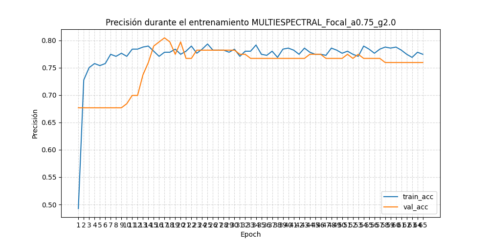

#### 1.3.2 Loss plot:
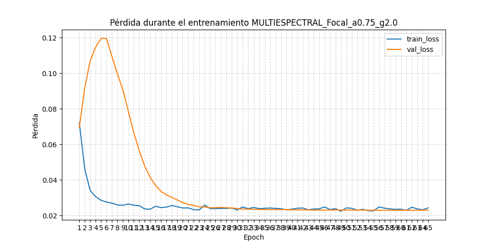

#### 1.3.2 Recall plot:
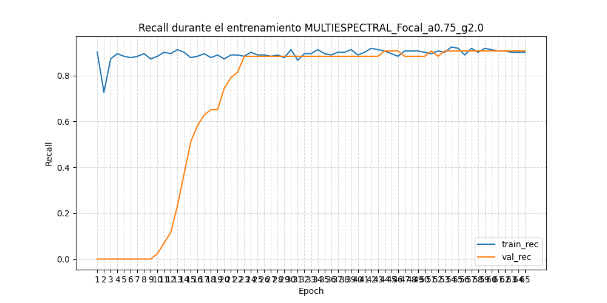

# 2. BINARY CROSS ENTROPY MULTIESPECTRAL (BCE MS)
### 2.1 Comando:

````bash
python src\pest_detection_models\train.py data\multiespectral\TTADDA-dataset\TTADDA_NARO_2023_F1\drone_data -lt binary_crossentropy -e 80 -mt cnn
````

### 2.2 Consola:

````bash
2026-03-24 13:50:23.446716: I tensorflow/core/util/port.cc:153] oneDNN custom operations are on. You may see slightly different numerical results due to floating-point round-off errors from different computation orders. To turn them off, set the environment variable `TF_ENABLE_ONEDNN_OPTS=0`.
2026-03-24 13:50:25.563229: I tensorflow/core/util/port.cc:153] oneDNN custom operations are on. You may see slightly different numerical results due to floating-point round-off errors from different computation orders. To turn them off, set the environment variable `TF_ENABLE_ONEDNN_OPTS=0`.
Modelo cnn binary_crossentropy | RGB? False | alpha 0.25 | gamma 1.0

--- [Fecha/hora inicio=20260324_1350] ---

--- [T=0.00s] ---
init. Iniciando entrenamiento MULTIESPECTRAL con perdida Binary Crossentropy

--- [Fecha/hora inicio=20260324_1350] ---

--- [T=0.00s] ---
1. 1. Extrayendo datos

--- [Fecha/hora inicio=20260324_1350] ---

--- [T=0.02s] ---
1. Carga de datos cnn Multiespectral

--- [Fecha/hora inicio=20260324_1350] ---

--- [T=0.09s] ---
2. Filtrado y extracción de datos

--- [Fecha/hora inicio=20260324_1350] ---

--- [T=0.09s] ---
2.1. Iniciando procesamiento de 665 imágenes etiquetadas...

--- [Fecha/hora inicio=20260324_1350] ---

--- [T=0.09s] ---
2.2. Archivos seleccionados: ['red.tif', 'red edge.tif', 'nir.tif', 'blue.tif', 'green.tif']

--- [Fecha/hora inicio=20260324_1350] ---

--- [T=60.23s] ---
7. Extracción de imágenes completada.

Datos listos para entrenamiento. Total de muestras: 665

Resumen de Datos Multiespectrales:
Total de parches extraídos: 665
X Train/Val Split: 532 / 133
Y Train/Val Split: 532 / 133
Forma X_train: (532, 224, 224, 5)
Forma Y_train: (532,)
Shape train: (532, 224, 224, 5)
2026-03-24 13:51:28.404398: I tensorflow/core/platform/cpu_feature_guard.cc:210] This TensorFlow binary is optimized to use available CPU instructions in performance-critical operations.
To enable the following instructions: SSE3 SSE4.1 SSE4.2 AVX AVX2 AVX_VNNI FMA, in other operations, rebuild TensorFlow with the appropriate compiler flags.
Pesos de Clase Calculados: Plaga (0): 1.11, Sana (1): 1.55
------------------------------
DEBUG - Conteo: Plaga: 360, Sana: 172
RESULTADO - Pesos Finales: Plaga (0): 1.11, Sana (1): 1.55
------------------------------
Epoch 1/80
2026-03-24 13:51:28.831652: E tensorflow/core/framework/node_def_util.cc:680] NodeDef mentions attribute use_unbounded_threadpool which is not in the op definition: Op<name=MapDataset; signature=input_dataset:variant, other_arguments: -> handle:variant; attr=f:func; attr=Targuments:list(type),min=0; attr=output_types:list(type),min=1; attr=output_shapes:list(shape),min=1; attr=use_inter_op_parallelism:bool,default=true; attr=preserve_cardinality:bool,default=false; attr=force_synchronous:bool,default=false; attr=metadata:string,default=""> This may be expected if your graph generating binary is newer  than this binary. Unknown attributes will be ignored. NodeDef: {{node ParallelMapDatasetV2/_16}}
17/17 ━━━━━━━━━━━━━━━━━━━━ 0s 1s/step - accuracy: 0.4152 - auc: 0.5052 - loss: 1.0127 - precision: 0.3583 - recall: 0.94922026-03-24 13:51:54.550089: E tensorflow/core/framework/node_def_util.cc:680] NodeDef mentions attribute use_unbounded_threadpool which is not in the op definition: Op<name=MapDataset; signature=input_dataset:variant, other_arguments: -> handle:variant; attr=f:func; attr=Targuments:list(type),min=0; attr=output_types:list(type),min=1; attr=output_shapes:list(shape),min=1; attr=use_inter_op_parallelism:bool,default=true; attr=preserve_cardinality:bool,default=false; attr=force_synchronous:bool,default=false; attr=metadata:string,default=""> This may be expected if your graph generating binary is newer  than this binary. Unknown attributes will be ignored. NodeDef: {{node ParallelMapDatasetV2/_15}}

Epoch 1: val_recall improved from None to 0.00000, saving model to C:\workspace\hd-image-pest-detection-cnn-and-rf\src\pest_detection_models\best_models\best_model_final_MULTIESPECTRAL_binary_crossentropy.keras
17/17 ━━━━━━━━━━━━━━━━━━━━ 27s 2s/step - accuracy: 0.5094 - auc: 0.6175 - loss: 0.8935 - precision: 0.3826 - recall: 0.8430 - val_accuracy: 0.6767 - val_auc: 0.8713 - val_loss: 0.5553 - val_precision: 0.0000e+00 - val_recall: 0.0000e+00 - learning_rate: 1.0000e-04
Epoch 2/80
17/17 ━━━━━━━━━━━━━━━━━━━━ 0s 1s/step - accuracy: 0.7215 - auc: 0.8141 - loss: 0.7294 - precision: 0.6118 - recall: 0.4287 
Epoch 2: val_recall did not improve from 0.00000
17/17 ━━━━━━━━━━━━━━━━━━━━ 24s 1s/step - accuracy: 0.7180 - auc: 0.7995 - loss: 0.7112 - precision: 0.5873 - recall: 0.4302 - val_accuracy: 0.6767 - val_auc: 0.8760 - val_loss: 0.6083 - val_precision: 0.0000e+00 - val_recall: 0.0000e+00 - learning_rate: 1.0000e-04
Epoch 3/80
17/17 ━━━━━━━━━━━━━━━━━━━━ 0s 1s/step - accuracy: 0.7775 - auc: 0.8686 - loss: 0.6365 - precision: 0.6847 - recall: 0.6161 
Epoch 3: val_recall did not improve from 0.00000
17/17 ━━━━━━━━━━━━━━━━━━━━ 26s 2s/step - accuracy: 0.7669 - auc: 0.8526 - loss: 0.6288 - precision: 0.6364 - recall: 0.6512 - val_accuracy: 0.6767 - val_auc: 0.8722 - val_loss: 0.6807 - val_precision: 0.0000e+00 - val_recall: 0.0000e+00 - learning_rate: 1.0000e-04
Epoch 4/80
17/17 ━━━━━━━━━━━━━━━━━━━━ 0s 1s/step - accuracy: 0.7946 - auc: 0.8703 - loss: 0.5822 - precision: 0.6446 - recall: 0.8471 
Epoch 4: val_recall did not improve from 0.00000
17/17 ━━━━━━━━━━━━━━━━━━━━ 25s 1s/step - accuracy: 0.7782 - auc: 0.8543 - loss: 0.5845 - precision: 0.6184 - recall: 0.8198 - val_accuracy: 0.6767 - val_auc: 0.8690 - val_loss: 0.7362 - val_precision: 0.0000e+00 - val_recall: 0.0000e+00 - learning_rate: 1.0000e-04
Epoch 5/80
17/17 ━━━━━━━━━━━━━━━━━━━━ 0s 1s/step - accuracy: 0.7969 - auc: 0.8707 - loss: 0.5620 - precision: 0.6423 - recall: 0.8731 
Epoch 5: val_recall did not improve from 0.00000
17/17 ━━━━━━━━━━━━━━━━━━━━ 24s 1s/step - accuracy: 0.7895 - auc: 0.8612 - loss: 0.5651 - precision: 0.6316 - recall: 0.8372 - val_accuracy: 0.6767 - val_auc: 0.8708 - val_loss: 0.7718 - val_precision: 0.0000e+00 - val_recall: 0.0000e+00 - learning_rate: 1.0000e-04
Epoch 6/80
17/17 ━━━━━━━━━━━━━━━━━━━━ 0s 2s/step - accuracy: 0.8029 - auc: 0.8856 - loss: 0.5287 - precision: 0.6531 - recall: 0.8684 
Epoch 6: ReduceLROnPlateau reducing learning rate to 4.999999873689376e-05.

Epoch 6: val_recall did not improve from 0.00000
17/17 ━━━━━━━━━━━━━━━━━━━━ 28s 2s/step - accuracy: 0.7820 - auc: 0.8618 - loss: 0.5541 - precision: 0.6228 - recall: 0.8256 - val_accuracy: 0.6767 - val_auc: 0.8743 - val_loss: 0.7749 - val_precision: 0.0000e+00 - val_recall: 0.0000e+00 - learning_rate: 1.0000e-04
Epoch 7/80
17/17 ━━━━━━━━━━━━━━━━━━━━ 0s 2s/step - accuracy: 0.8125 - auc: 0.8884 - loss: 0.5140 - precision: 0.6843 - recall: 0.8093 
Epoch 7: val_recall did not improve from 0.00000
17/17 ━━━━━━━━━━━━━━━━━━━━ 28s 2s/step - accuracy: 0.7876 - auc: 0.8664 - loss: 0.5434 - precision: 0.6398 - recall: 0.7849 - val_accuracy: 0.6767 - val_auc: 0.8726 - val_loss: 0.7322 - val_precision: 0.0000e+00 - val_recall: 0.0000e+00 - learning_rate: 5.0000e-05
Epoch 8/80
17/17 ━━━━━━━━━━━━━━━━━━━━ 0s 2s/step - accuracy: 0.7705 - auc: 0.8846 - loss: 0.5266 - precision: 0.6181 - recall: 0.8068 
Epoch 8: val_recall did not improve from 0.00000
17/17 ━━━━━━━━━━━━━━━━━━━━ 28s 2s/step - accuracy: 0.7688 - auc: 0.8677 - loss: 0.5399 - precision: 0.6079 - recall: 0.8023 - val_accuracy: 0.6767 - val_auc: 0.8757 - val_loss: 0.6953 - val_precision: 0.0000e+00 - val_recall: 0.0000e+00 - learning_rate: 5.0000e-05
Epoch 9/80
17/17 ━━━━━━━━━━━━━━━━━━━━ 0s 1s/step - accuracy: 0.7949 - auc: 0.8802 - loss: 0.5175 - precision: 0.6446 - recall: 0.8491 
Epoch 9: val_recall did not improve from 0.00000
17/17 ━━━━━━━━━━━━━━━━━━━━ 25s 1s/step - accuracy: 0.7857 - auc: 0.8662 - loss: 0.5366 - precision: 0.6318 - recall: 0.8081 - val_accuracy: 0.6767 - val_auc: 0.8760 - val_loss: 0.6620 - val_precision: 0.0000e+00 - val_recall: 0.0000e+00 - learning_rate: 5.0000e-05
Epoch 10/80
17/17 ━━━━━━━━━━━━━━━━━━━━ 0s 2s/step - accuracy: 0.8149 - auc: 0.8846 - loss: 0.5180 - precision: 0.6685 - recall: 0.8751 
Epoch 10: val_recall did not improve from 0.00000
17/17 ━━━━━━━━━━━━━━━━━━━━ 28s 2s/step - accuracy: 0.7876 - auc: 0.8600 - loss: 0.5464 - precision: 0.6323 - recall: 0.8198 - val_accuracy: 0.6767 - val_auc: 0.8770 - val_loss: 0.6172 - val_precision: 0.0000e+00 - val_recall: 0.0000e+00 - learning_rate: 5.0000e-05
Epoch 11/80
17/17 ━━━━━━━━━━━━━━━━━━━━ 0s 2s/step - accuracy: 0.8051 - auc: 0.8836 - loss: 0.5140 - precision: 0.6615 - recall: 0.8437 
Epoch 11: ReduceLROnPlateau reducing learning rate to 2.499999936844688e-05.

Epoch 11: val_recall improved from 0.00000 to 0.02326, saving model to C:\workspace\hd-image-pest-detection-cnn-and-rf\src\pest_detection_models\best_models\best_model_final_MULTIESPECTRAL_binary_crossentropy.keras
17/17 ━━━━━━━━━━━━━━━━━━━━ 28s 2s/step - accuracy: 0.7932 - auc: 0.8621 - loss: 0.5386 - precision: 0.6409 - recall: 0.8198 - val_accuracy: 0.6842 - val_auc: 0.8784 - val_loss: 0.5729 - val_precision: 1.0000 - val_recall: 0.0233 - learning_rate: 5.0000e-05
Epoch 11: early stopping
Restoring model weights from the end of the best epoch: 1.

--- [Fecha/hora inicio=20260324_1350] ---

--- [T=352.94s] ---
5. Guardado y Ploteo (Usando utils_train)

Historial guardado en 'C:\workspace\hd-image-pest-detection-cnn-and-rf\src\pest_detection_models\history/MULTIESPECTRAL\history_20260324_1356_epochs_80_MULTIESPECTRAL_BCE.json'
2026-03-24 13:56:30.153747: E tensorflow/core/framework/node_def_util.cc:680] NodeDef mentions attribute use_unbounded_threadpool which is not in the op definition: Op<name=MapDataset; signature=input_dataset:variant, other_arguments: -> handle:variant; attr=f:func; attr=Targuments:list(type),min=0; attr=output_types:list(type),min=1; attr=output_shapes:list(shape),min=1; attr=use_inter_op_parallelism:bool,default=true; attr=preserve_cardinality:bool,default=false; attr=force_synchronous:bool,default=false; attr=metadata:string,default=""> This may be expected if your graph generating binary is newer  than this binary. Unknown attributes will be ignored. NodeDef: {{node ParallelMapDatasetV2/_14}}
17/17 ━━━━━━━━━━━━━━━━━━━━ 4s 234ms/step

--- ANÁLISIS DE UMBRAL ÓPTIMO ---
Mejor Umbral detectado: 0.2940

Nueva Matriz de Confusión con Umbral Óptimo:
[[275  85]
 [ 19 153]]

Reporte de Clasificación:
              precision    recall  f1-score   support

           0       0.94      0.76      0.84       360
           1       0.64      0.89      0.75       172

    accuracy                           0.80       532
   macro avg       0.79      0.83      0.79       532
weighted avg       0.84      0.80      0.81       532


Auc: 0.8829780361757107
Umbral mas optimo:  0.29402164
5/5 ━━━━━━━━━━━━━━━━━━━━ 1s 175ms/step

--- MATRIZ DE CONFUSIÓN ---
[[64 26]
 [ 7 36]]

--- REPORTE DE CLASIFICACIÓN ---
              precision    recall  f1-score   support

           0       0.90      0.71      0.80        90
           1       0.58      0.84      0.69        43

    accuracy                           0.75       133
   macro avg       0.74      0.77      0.74       133
weighted avg       0.80      0.75      0.76       133


AUC REAL: 0.8708
````

### 2.3 Resultado:
#### 2.3.1 Model Fit History:

````json
{
  "accuracy": [
    0.5093985199928284,
    0.7180451154708862,
    0.7669172883033752,
    0.7781955003738403,
    0.7894737124443054,
    0.7819548845291138,
    0.7875939607620239,
    0.768796980381012,
    0.7857142686843872,
    0.7875939607620239,
    0.7932330965995789
  ],
  "auc": [
    0.6175065040588379,
    0.7995235919952393,
    0.8525597453117371,
    0.8542554974555969,
    0.8611595630645752,
    0.8617974519729614,
    0.8664324283599854,
    0.8676760792732239,
    0.8661822080612183,
    0.8600290417671204,
    0.8621123433113098
  ],
  "loss": [
    0.8934842944145203,
    0.7111803293228149,
    0.6287882328033447,
    0.5845021605491638,
    0.5650899410247803,
    0.5540922284126282,
    0.5434390306472778,
    0.5399007201194763,
    0.5366321802139282,
    0.5463890433311462,
    0.5386449098587036
  ],
  "precision": [
    0.3825857639312744,
    0.5873016119003296,
    0.6363636255264282,
    0.6184210777282715,
    0.6315789222717285,
    0.6228070259094238,
    0.6398104429244995,
    0.607929527759552,
    0.6318181753158569,
    0.6322869658470154,
    0.6409090757369995
  ],
  "recall": [
    0.8430232405662537,
    0.43023255467414856,
    0.6511628031730652,
    0.819767415523529,
    0.8372092843055725,
    0.8255813717842102,
    0.7848837375640869,
    0.8023256063461304,
    0.8081395626068115,
    0.819767415523529,
    0.819767415523529
  ],
  "val_accuracy": [
    0.6766917109489441,
    0.6766917109489441,
    0.6766917109489441,
    0.6766917109489441,
    0.6766917109489441,
    0.6766917109489441,
    0.6766917109489441,
    0.6766917109489441,
    0.6766917109489441,
    0.6766917109489441,
    0.6842105388641357
  ],
  "val_auc": [
    0.8713178634643555,
    0.8759689927101135,
    0.8722222447395325,
    0.868992269039154,
    0.8708009719848633,
    0.874289333820343,
    0.8726098537445068,
    0.8757106065750122,
    0.8759689927101135,
    0.8770025968551636,
    0.8784237504005432
  ],
  "val_loss": [
    0.555253267288208,
    0.6082989573478699,
    0.6807368397712708,
    0.7361621260643005,
    0.7717756628990173,
    0.7748770713806152,
    0.7322303652763367,
    0.6953290104866028,
    0.6619917154312134,
    0.6171551942825317,
    0.5729148387908936
  ],
  "val_precision": [
    0.0,
    0.0,
    0.0,
    0.0,
    0.0,
    0.0,
    0.0,
    0.0,
    0.0,
    0.0,
    1.0
  ],
  "val_recall": [
    0.0,
    0.0,
    0.0,
    0.0,
    0.0,
    0.0,
    0.0,
    0.0,
    0.0,
    0.0,
    0.023255813866853714
  ],
  "learning_rate": [
    9.999999747378752e-05,
    9.999999747378752e-05,
    9.999999747378752e-05,
    9.999999747378752e-05,
    9.999999747378752e-05,
    9.999999747378752e-05,
    4.999999873689376e-05,
    4.999999873689376e-05,
    4.999999873689376e-05,
    4.999999873689376e-05,
    4.999999873689376e-05
  ]
}
````

#### 2.3.2 Accuracy plot:
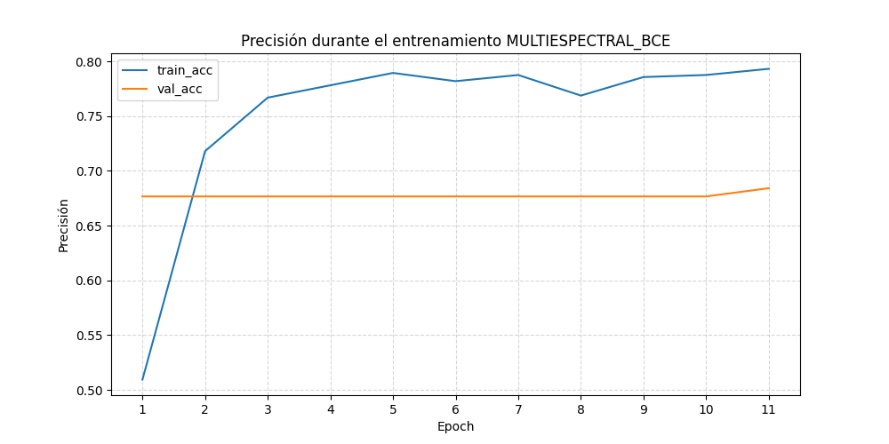

#### 2.3.2 Loss plot:
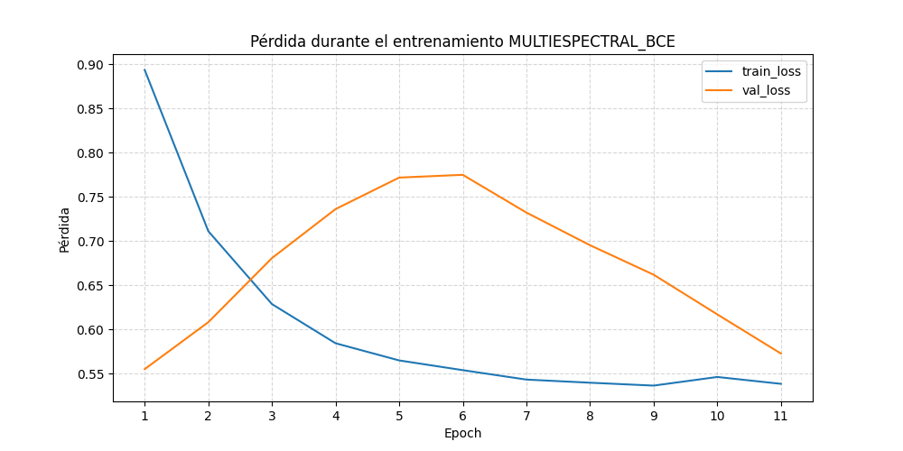

#### 2.3.2 Recall plot:
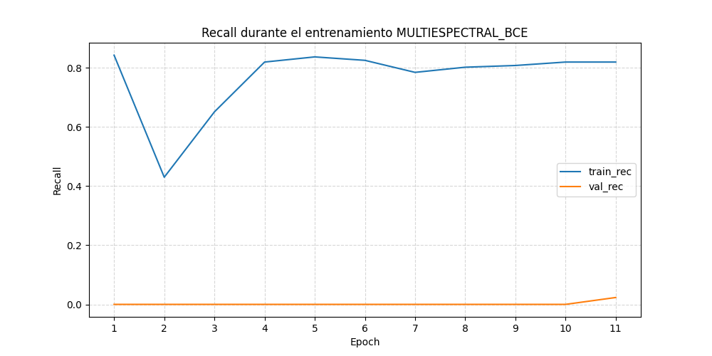

# 3. FOCAL LOSS RGB (FL RGB)
### 3.1 Comando:

````bash
python src\pest_detection_models\train.py data\multiespectral\TTADDA-dataset\TTADDA_NARO_2023_F1\drone_data -lt focal_loss -e 80 -a 0.75 -g 2.0 -mt cnn -rgb
````

### 3.2 Consola:

````bash
2026-03-24 14:00:41.429132: I tensorflow/core/util/port.cc:153] oneDNN custom operations are on. You may see slightly different numerical results due to floating-point round-off errors from different computation orders. To turn them off, set the environment variable `TF_ENABLE_ONEDNN_OPTS=0`.
2026-03-24 14:00:42.805358: I tensorflow/core/util/port.cc:153] oneDNN custom operations are on. You may see slightly different numerical results due to floating-point round-off errors from different computation orders. To turn them off, set the environment variable `TF_ENABLE_ONEDNN_OPTS=0`.
Modelo cnn focal_loss | RGB? True | alpha 0.75 | gamma 2.0

--- [Fecha/hora inicio=20260324_1400] ---

--- [T=0.00s] ---
init. Iniciando entrenamiento RGB con perdida Focal Loss

--- [Fecha/hora inicio=20260324_1400] ---

--- [T=0.00s] ---
1. 1. Extrayendo datos

--- [Fecha/hora inicio=20260324_1400] ---

--- [T=0.00s] ---
1. Carga de datos cnn RGB

--- [Fecha/hora inicio=20260324_1400] ---

--- [T=0.07s] ---
2. Filtrado y extracción de datos

--- [Fecha/hora inicio=20260324_1400] ---

--- [T=0.07s] ---
2.1. Iniciando procesamiento de 665 imágenes etiquetadas...

--- [Fecha/hora inicio=20260324_1400] ---

--- [T=0.07s] ---
2.2. Archivos seleccionados: ['RGB.tif']
Imagen inválida: 4 canales (esperado 3)
Imagen inválida: 4 canales (esperado 3)
Imagen inválida: 4 canales (esperado 3)
Imagen inválida: 4 canales (esperado 3)
Imagen inválida: 4 canales (esperado 3)
Imagen inválida: 4 canales (esperado 3)
Imagen inválida: 4 canales (esperado 3)
Imagen inválida: 4 canales (esperado 3)
Imagen inválida: 4 canales (esperado 3)
Imagen inválida: 4 canales (esperado 3)
Imagen inválida: 4 canales (esperado 3)
Imagen inválida: 4 canales (esperado 3)
Imagen inválida: 4 canales (esperado 3)
Imagen inválida: 4 canales (esperado 3)
Imagen inválida: 4 canales (esperado 3)
Imagen inválida: 4 canales (esperado 3)
Imagen inválida: 4 canales (esperado 3)
Imagen inválida: 4 canales (esperado 3)
Imagen inválida: 4 canales (esperado 3)
Imagen inválida: 4 canales (esperado 3)
Imagen inválida: 4 canales (esperado 3)
Imagen inválida: 4 canales (esperado 3)
Imagen inválida: 4 canales (esperado 3)
Imagen inválida: 4 canales (esperado 3)
Imagen inválida: 4 canales (esperado 3)
Imagen inválida: 4 canales (esperado 3)
Imagen inválida: 4 canales (esperado 3)
Imagen inválida: 4 canales (esperado 3)
Imagen inválida: 4 canales (esperado 3)
Imagen inválida: 4 canales (esperado 3)
Imagen inválida: 4 canales (esperado 3)
Imagen inválida: 4 canales (esperado 3)
Imagen inválida: 4 canales (esperado 3)
Imagen inválida: 4 canales (esperado 3)
Imagen inválida: 4 canales (esperado 3)

--- [Fecha/hora inicio=20260324_1400] ---

--- [T=38.48s] ---
7. Extracción de imágenes completada.

Datos listos para entrenamiento. Total de muestras: 630

Resumen de Datos Multiespectrales:
Total de parches extraídos: 630
X Train/Val Split: 504 / 126
Y Train/Val Split: 504 / 126
Forma X_train: (504, 224, 224, 3)
Forma Y_train: (504,)
Shape train: (504, 224, 224, 3)
2026-03-24 14:01:22.799115: I tensorflow/core/platform/cpu_feature_guard.cc:210] This TensorFlow binary is optimized to use available CPU instructions in performance-critical operations.
To enable the following instructions: SSE3 SSE4.1 SSE4.2 AVX AVX2 AVX_VNNI FMA, in other operations, rebuild TensorFlow with the appropriate compiler flags.
Pesos de Clase Calculados: Plaga (0): 1.14, Sana (1): 1.47
------------------------------
DEBUG - Conteo: Plaga: 332, Sana: 172
RESULTADO - Pesos Finales: Plaga (0): 1.14, Sana (1): 1.47
------------------------------
Epoch 1/80
2026-03-24 14:01:23.054240: E tensorflow/core/framework/node_def_util.cc:680] NodeDef mentions attribute use_unbounded_threadpool which is not in the op definition: Op<name=MapDataset; signature=input_dataset:variant, other_arguments: -> handle:variant; attr=f:func; attr=Targuments:list(type),min=0; attr=output_types:list(type),min=1; attr=output_shapes:list(shape),min=1; attr=use_inter_op_parallelism:bool,default=true; attr=preserve_cardinality:bool,default=false; attr=force_synchronous:bool,default=false; attr=metadata:string,default=""> This may be expected if your graph generating binary is newer  than this binary. Unknown attributes will be ignored. NodeDef: {{node ParallelMapDatasetV2/_15}}
16/16 ━━━━━━━━━━━━━━━━━━━━ 0s 1s/step - accuracy: 0.4059 - auc: 0.5501 - loss: 0.0917 - precision: 0.3580 - recall: 0.90082026-03-24 14:01:43.989565: E tensorflow/core/framework/node_def_util.cc:680] NodeDef mentions attribute use_unbounded_threadpool which is not in the op definition: Op<name=MapDataset; signature=input_dataset:variant, other_arguments: -> handle:variant; attr=f:func; attr=Targuments:list(type),min=0; attr=output_types:list(type),min=1; attr=output_shapes:list(shape),min=1; attr=use_inter_op_parallelism:bool,default=true; attr=preserve_cardinality:bool,default=false; attr=force_synchronous:bool,default=false; attr=metadata:string,default=""> This may be expected if your graph generating binary is newer  than this binary. Unknown attributes will be ignored. NodeDef: {{node ParallelMapDatasetV2/_15}}

Epoch 1: val_recall improved from None to 1.00000, saving model to C:\workspace\hd-image-pest-detection-cnn-and-rf\src\pest_detection_models\best_models\best_model_final_RGB_focal_loss.keras
16/16 ━━━━━━━━━━━━━━━━━━━━ 22s 1s/step - accuracy: 0.4921 - auc: 0.6077 - loss: 0.0772 - precision: 0.3871 - recall: 0.8372 - val_accuracy: 0.3413 - val_auc: 0.5361 - val_loss: 0.0726 - val_precision: 0.3413 - val_recall: 1.0000 - learning_rate: 1.0000e-04
Epoch 2/80
16/16 ━━━━━━━━━━━━━━━━━━━━ 0s 1s/step - accuracy: 0.6951 - auc: 0.7527 - loss: 0.0529 - precision: 0.5470 - recall: 0.6784 
Epoch 2: val_recall did not improve from 1.00000
16/16 ━━━━━━━━━━━━━━━━━━━━ 21s 1s/step - accuracy: 0.7262 - auc: 0.7916 - loss: 0.0474 - precision: 0.5842 - recall: 0.6860 - val_accuracy: 0.3413 - val_auc: 0.7509 - val_loss: 0.0723 - val_precision: 0.3413 - val_recall: 1.0000 - learning_rate: 1.0000e-04
Epoch 3/80
16/16 ━━━━━━━━━━━━━━━━━━━━ 0s 1s/step - accuracy: 0.7411 - auc: 0.8227 - loss: 0.0428 - precision: 0.6099 - recall: 0.6959 
Epoch 3: val_recall did not improve from 1.00000
16/16 ━━━━━━━━━━━━━━━━━━━━ 21s 1s/step - accuracy: 0.7897 - auc: 0.8617 - loss: 0.0361 - precision: 0.6719 - recall: 0.7500 - val_accuracy: 0.3413 - val_auc: 0.7574 - val_loss: 0.0725 - val_precision: 0.3413 - val_recall: 1.0000 - learning_rate: 1.0000e-04
Epoch 4/80
16/16 ━━━━━━━━━━━━━━━━━━━━ 0s 1s/step - accuracy: 0.7708 - auc: 0.8521 - loss: 0.0339 - precision: 0.6427 - recall: 0.7615 
Epoch 4: val_recall did not improve from 1.00000
16/16 ━━━━━━━━━━━━━━━━━━━━ 20s 1s/step - accuracy: 0.8095 - auc: 0.8827 - loss: 0.0291 - precision: 0.6939 - recall: 0.7907 - val_accuracy: 0.3413 - val_auc: 0.7525 - val_loss: 0.0728 - val_precision: 0.3413 - val_recall: 1.0000 - learning_rate: 1.0000e-04
Epoch 5/80
16/16 ━━━━━━━━━━━━━━━━━━━━ 0s 1s/step - accuracy: 0.7657 - auc: 0.8442 - loss: 0.0360 - precision: 0.6351 - recall: 0.7512 
Epoch 5: val_recall did not improve from 1.00000
16/16 ━━━━━━━━━━━━━━━━━━━━ 21s 1s/step - accuracy: 0.8075 - auc: 0.8860 - loss: 0.0278 - precision: 0.6812 - recall: 0.8198 - val_accuracy: 0.3413 - val_auc: 0.7548 - val_loss: 0.0733 - val_precision: 0.3413 - val_recall: 1.0000 - learning_rate: 1.0000e-04
Epoch 6/80
16/16 ━━━━━━━━━━━━━━━━━━━━ 0s 1s/step - accuracy: 0.7696 - auc: 0.8458 - loss: 0.0355 - precision: 0.6349 - recall: 0.7836 
Epoch 6: val_recall did not improve from 1.00000
16/16 ━━━━━━━━━━━━━━━━━━━━ 21s 1s/step - accuracy: 0.8194 - auc: 0.8888 - loss: 0.0270 - precision: 0.6866 - recall: 0.8663 - val_accuracy: 0.3413 - val_auc: 0.7899 - val_loss: 0.0737 - val_precision: 0.3413 - val_recall: 1.0000 - learning_rate: 1.0000e-04
Epoch 7/80
16/16 ━━━━━━━━━━━━━━━━━━━━ 0s 1s/step - accuracy: 0.7984 - auc: 0.8815 - loss: 0.0283 - precision: 0.6797 - recall: 0.7817 
Epoch 7: ReduceLROnPlateau reducing learning rate to 4.999999873689376e-05.

Epoch 7: val_recall did not improve from 1.00000
16/16 ━━━━━━━━━━━━━━━━━━━━ 21s 1s/step - accuracy: 0.8393 - auc: 0.9071 - loss: 0.0230 - precision: 0.7241 - recall: 0.8547 - val_accuracy: 0.3413 - val_auc: 0.7907 - val_loss: 0.0742 - val_precision: 0.3413 - val_recall: 1.0000 - learning_rate: 1.0000e-04
Epoch 8/80
16/16 ━━━━━━━━━━━━━━━━━━━━ 0s 1s/step - accuracy: 0.7896 - auc: 0.8467 - loss: 0.0355 - precision: 0.6544 - recall: 0.8268 
Epoch 8: val_recall did not improve from 1.00000
16/16 ━━━━━━━━━━━━━━━━━━━━ 21s 1s/step - accuracy: 0.8254 - auc: 0.8893 - loss: 0.0259 - precision: 0.6944 - recall: 0.8721 - val_accuracy: 0.3413 - val_auc: 0.7984 - val_loss: 0.0749 - val_precision: 0.3413 - val_recall: 1.0000 - learning_rate: 5.0000e-05
Epoch 9/80
16/16 ━━━━━━━━━━━━━━━━━━━━ 0s 1s/step - accuracy: 0.8053 - auc: 0.8817 - loss: 0.0267 - precision: 0.6657 - recall: 0.8744 
Epoch 9: val_recall did not improve from 1.00000
16/16 ━━━━━━━━━━━━━━━━━━━━ 21s 1s/step - accuracy: 0.8333 - auc: 0.9043 - loss: 0.0222 - precision: 0.6930 - recall: 0.9186 - val_accuracy: 0.3413 - val_auc: 0.8135 - val_loss: 0.0754 - val_precision: 0.3413 - val_recall: 1.0000 - learning_rate: 5.0000e-05
Epoch 10/80
16/16 ━━━━━━━━━━━━━━━━━━━━ 0s 1s/step - accuracy: 0.7904 - auc: 0.8669 - loss: 0.0300 - precision: 0.6654 - recall: 0.7879 
Epoch 10: val_recall did not improve from 1.00000
16/16 ━━━━━━━━━━━━━━━━━━━━ 21s 1s/step - accuracy: 0.8393 - auc: 0.9075 - loss: 0.0219 - precision: 0.7198 - recall: 0.8663 - val_accuracy: 0.3413 - val_auc: 0.8198 - val_loss: 0.0757 - val_precision: 0.3413 - val_recall: 1.0000 - learning_rate: 5.0000e-05
Epoch 11/80
16/16 ━━━━━━━━━━━━━━━━━━━━ 0s 1s/step - accuracy: 0.8148 - auc: 0.8696 - loss: 0.0285 - precision: 0.6803 - recall: 0.8751 
Epoch 11: val_recall did not improve from 1.00000
16/16 ━━━━━━━━━━━━━━━━━━━━ 21s 1s/step - accuracy: 0.8552 - auc: 0.9029 - loss: 0.0216 - precision: 0.7260 - recall: 0.9244 - val_accuracy: 0.3413 - val_auc: 0.8242 - val_loss: 0.0757 - val_precision: 0.3413 - val_recall: 1.0000 - learning_rate: 5.0000e-05
Epoch 12/80
16/16 ━━━━━━━━━━━━━━━━━━━━ 0s 1s/step - accuracy: 0.8101 - auc: 0.8702 - loss: 0.0271 - precision: 0.6724 - recall: 0.8741 
Epoch 12: ReduceLROnPlateau reducing learning rate to 2.499999936844688e-05.

Epoch 12: val_recall did not improve from 1.00000
16/16 ━━━━━━━━━━━━━━━━━━━━ 20s 1s/step - accuracy: 0.8452 - auc: 0.9033 - loss: 0.0204 - precision: 0.7080 - recall: 0.9302 - val_accuracy: 0.3413 - val_auc: 0.8383 - val_loss: 0.0757 - val_precision: 0.3413 - val_recall: 1.0000 - learning_rate: 5.0000e-05
Epoch 12: early stopping
Restoring model weights from the end of the best epoch: 2.

--- [Fecha/hora inicio=20260324_1400] ---

--- [T=290.01s] ---
5. Guardado y Ploteo (Usando utils_train)

Historial guardado en 'C:\workspace\hd-image-pest-detection-cnn-and-rf\src\pest_detection_models\history/RGB\history_20260324_1405_epochs_80_RGB_Focal_a0.75_g2.0.json'        
2026-03-24 14:06:03.627483: E tensorflow/core/framework/node_def_util.cc:680] NodeDef mentions attribute use_unbounded_threadpool which is not in the op definition: Op<name=MapDataset; signature=input_dataset:variant, other_arguments: -> handle:variant; attr=f:func; attr=Targuments:list(type),min=0; attr=output_types:list(type),min=1; attr=output_shapes:list(shape),min=1; attr=use_inter_op_parallelism:bool,default=true; attr=preserve_cardinality:bool,default=false; attr=force_synchronous:bool,default=false; attr=metadata:string,default=""> This may be expected if your graph generating binary is newer  than this binary. Unknown attributes will be ignored. NodeDef: {{node ParallelMapDatasetV2/_14}}
16/16 ━━━━━━━━━━━━━━━━━━━━ 4s 209ms/step

--- ANÁLISIS DE UMBRAL ÓPTIMO ---
Mejor Umbral detectado: 0.5180

Nueva Matriz de Confusión con Umbral Óptimo:
[[230 102]
 [ 35 137]]

Reporte de Clasificación:
              precision    recall  f1-score   support

           0       0.87      0.69      0.77       332
           1       0.57      0.80      0.67       172

    accuracy                           0.73       504
   macro avg       0.72      0.74      0.72       504
weighted avg       0.77      0.73      0.74       504


Auc: 0.7975798543009247
Umbral mas optimo:  0.5180124
4/4 ━━━━━━━━━━━━━━━━━━━━ 1s 196ms/step

--- MATRIZ DE CONFUSIÓN ---
[[53 30]
 [10 33]]

--- REPORTE DE CLASIFICACIÓN ---
              precision    recall  f1-score   support

           0       0.84      0.64      0.73        83
           1       0.52      0.77      0.62        43

    accuracy                           0.68       126
   macro avg       0.68      0.70      0.67       126
weighted avg       0.73      0.68      0.69       126


AUC REAL: 0.7504
````

### 3.3 Resultado:
#### 3.3.1 Model Fit History:

````json
{
  "accuracy": [
    0.4920634925365448,
    0.726190447807312,
    0.7896825671195984,
    0.8095238208770752,
    0.807539701461792,
    0.8194444179534912,
    0.8392857313156128,
    0.8253968358039856,
    0.8333333134651184,
    0.8392857313156128,
    0.8551587462425232,
    0.8452380895614624
  ],
  "auc": [
    0.6077420115470886,
    0.7915557622909546,
    0.8616734743118286,
    0.8827490210533142,
    0.886006236076355,
    0.8887730836868286,
    0.9071080684661865,
    0.8892984986305237,
    0.9043236970901489,
    0.9075020551681519,
    0.9029489755630493,
    0.9032992124557495
  ],
  "loss": [
    0.07717034965753555,
    0.047411076724529266,
    0.036136217415332794,
    0.029069555923342705,
    0.027779387310147285,
    0.02703135274350643,
    0.022950902581214905,
    0.025886066257953644,
    0.0221759881824255,
    0.021886108443140984,
    0.02159634232521057,
    0.02035059593617916
  ],
  "precision": [
    0.3870967626571655,
    0.5841584205627441,
    0.671875,
    0.6938775777816772,
    0.6811594367027283,
    0.6866359710693359,
    0.7241379022598267,
    0.6944444179534912,
    0.6929824352264404,
    0.7198067903518677,
    0.7260273694992065,
    0.7079645991325378
  ],
  "recall": [
    0.8372092843055725,
    0.6860465407371521,
    0.75,
    0.7906976938247681,
    0.819767415523529,
    0.8662790656089783,
    0.854651153087616,
    0.8720930218696594,
    0.9186046719551086,
    0.8662790656089783,
    0.9244186282157898,
    0.930232584476471
  ],
  "val_accuracy": [
    0.341269850730896,
    0.341269850730896,
    0.341269850730896,
    0.341269850730896,
    0.341269850730896,
    0.341269850730896,
    0.341269850730896,
    0.341269850730896,
    0.341269850730896,
    0.341269850730896,
    0.341269850730896,
    0.341269850730896
  ],
  "val_auc": [
    0.5361446142196655,
    0.7509106397628784,
    0.7573549747467041,
    0.7524516582489014,
    0.7548332810401917,
    0.7898570895195007,
    0.7906976938247681,
    0.7984029054641724,
    0.8135331869125366,
    0.8198374509811401,
    0.8241804242134094,
    0.838330090045929
  ],
  "val_loss": [
    0.07264476269483566,
    0.07228100299835205,
    0.07247969508171082,
    0.0728490799665451,
    0.07326599210500717,
    0.0737476795911789,
    0.07423986494541168,
    0.07486511766910553,
    0.07537901401519775,
    0.07571977376937866,
    0.07568908482789993,
    0.07574506103992462
  ],
  "val_precision": [
    0.341269850730896,
    0.341269850730896,
    0.341269850730896,
    0.341269850730896,
    0.341269850730896,
    0.341269850730896,
    0.341269850730896,
    0.341269850730896,
    0.341269850730896,
    0.341269850730896,
    0.341269850730896,
    0.341269850730896
  ],
  "val_recall": [
    1.0,
    1.0,
    1.0,
    1.0,
    1.0,
    1.0,
    1.0,
    1.0,
    1.0,
    1.0,
    1.0,
    1.0
  ],
  "learning_rate": [
    9.999999747378752e-05,
    9.999999747378752e-05,
    9.999999747378752e-05,
    9.999999747378752e-05,
    9.999999747378752e-05,
    9.999999747378752e-05,
    9.999999747378752e-05,
    4.999999873689376e-05,
    4.999999873689376e-05,
    4.999999873689376e-05,
    4.999999873689376e-05,
    4.999999873689376e-05
  ]
}
````

#### 3.3.2 Accuracy plot:
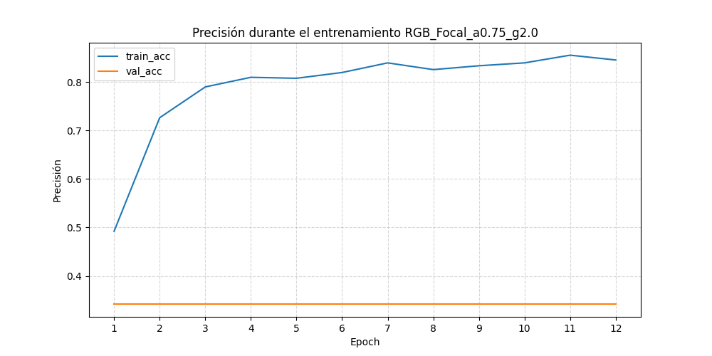

#### 3.3.2 Loss plot:
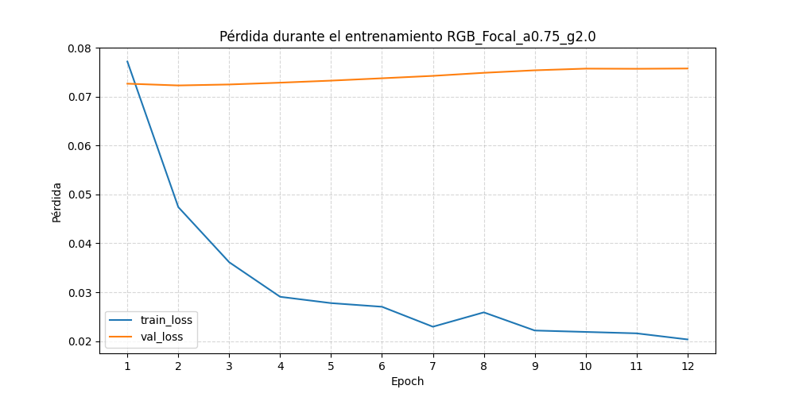

#### 3.3.2 Recall plot:
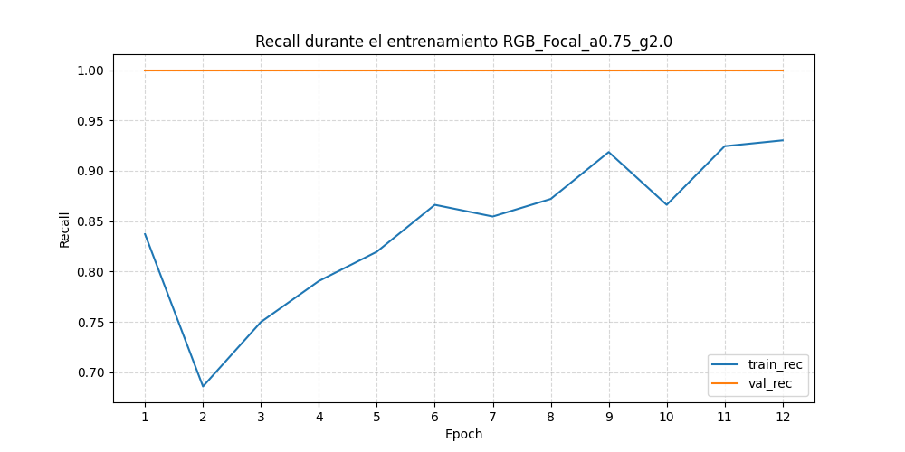

# 4. BINARY CROSS ENTROPY RGB (BCE RGB)
### 4.1 Comando:

````bash
python src\pest_detection_models\train.py data\multiespectral\TTADDA-dataset\TTADDA_NARO_2023_F1\drone_data -lt binary_crossentropy -e 80 -mt cnn -rgb
````

### 4.2 Consola:

````bash
2026-03-24 14:44:55.735693: I tensorflow/core/util/port.cc:153] oneDNN custom operations are on. You may see slightly different numerical results due to floating-point round-off errors from different computation orders. To turn them off, set the environment variable `TF_ENABLE_ONEDNN_OPTS=0`.
2026-03-24 14:44:57.159805: I tensorflow/core/util/port.cc:153] oneDNN custom operations are on. You may see slightly different numerical results due to floating-point round-off errors from different computation orders. To turn them off, set the environment variable `TF_ENABLE_ONEDNN_OPTS=0`.
Modelo cnn binary_crossentropy | RGB? True | alpha 0.75 | gamma 2.0

--- [Fecha/hora inicio=20260324_1444] ---

--- [T=0.00s] ---
init. Iniciando entrenamiento RGB con perdida Binary Crossentropy

--- [Fecha/hora inicio=20260324_1444] ---

--- [T=0.00s] ---
1. 1. Extrayendo datos

--- [Fecha/hora inicio=20260324_1444] ---

--- [T=0.00s] ---
1. Carga de datos cnn RGB

--- [Fecha/hora inicio=20260324_1444] ---

--- [T=0.04s] ---
2. Filtrado y extracción de datos

--- [Fecha/hora inicio=20260324_1444] ---

--- [T=0.04s] ---
2.1. Iniciando procesamiento de 665 imágenes etiquetadas...

--- [Fecha/hora inicio=20260324_1444] ---

--- [T=0.04s] ---
2.2. Archivos seleccionados: ['RGB.tif']
Imagen inválida: 4 canales (esperado 3)
Imagen inválida: 4 canales (esperado 3)
Imagen inválida: 4 canales (esperado 3)
Imagen inválida: 4 canales (esperado 3)
Imagen inválida: 4 canales (esperado 3)
Imagen inválida: 4 canales (esperado 3)
Imagen inválida: 4 canales (esperado 3)
Imagen inválida: 4 canales (esperado 3)
Imagen inválida: 4 canales (esperado 3)
Imagen inválida: 4 canales (esperado 3)
Imagen inválida: 4 canales (esperado 3)
Imagen inválida: 4 canales (esperado 3)
Imagen inválida: 4 canales (esperado 3)
Imagen inválida: 4 canales (esperado 3)
Imagen inválida: 4 canales (esperado 3)
Imagen inválida: 4 canales (esperado 3)
Imagen inválida: 4 canales (esperado 3)
Imagen inválida: 4 canales (esperado 3)
Imagen inválida: 4 canales (esperado 3)
Imagen inválida: 4 canales (esperado 3)
Imagen inválida: 4 canales (esperado 3)
Imagen inválida: 4 canales (esperado 3)
Imagen inválida: 4 canales (esperado 3)
Imagen inválida: 4 canales (esperado 3)
Imagen inválida: 4 canales (esperado 3)
Imagen inválida: 4 canales (esperado 3)
Imagen inválida: 4 canales (esperado 3)
Imagen inválida: 4 canales (esperado 3)
Imagen inválida: 4 canales (esperado 3)
Imagen inválida: 4 canales (esperado 3)
Imagen inválida: 4 canales (esperado 3)
Imagen inválida: 4 canales (esperado 3)
Imagen inválida: 4 canales (esperado 3)
Imagen inválida: 4 canales (esperado 3)
Imagen inválida: 4 canales (esperado 3)

--- [Fecha/hora inicio=20260324_1444] ---

--- [T=31.18s] ---
7. Extracción de imágenes completada.

Datos listos para entrenamiento. Total de muestras: 630

Resumen de Datos Multiespectrales:
Total de parches extraídos: 630
X Train/Val Split: 504 / 126
Y Train/Val Split: 504 / 126
Forma X_train: (504, 224, 224, 3)
Forma Y_train: (504,)
Shape train: (504, 224, 224, 3)
2026-03-24 14:45:29.822260: I tensorflow/core/platform/cpu_feature_guard.cc:210] This TensorFlow binary is optimized to use available CPU instructions in performance-critical operations.
To enable the following instructions: SSE3 SSE4.1 SSE4.2 AVX AVX2 AVX_VNNI FMA, in other operations, rebuild TensorFlow with the appropriate compiler flags.
Pesos de Clase Calculados: Plaga (0): 1.14, Sana (1): 1.47
------------------------------
DEBUG - Conteo: Plaga: 332, Sana: 172
RESULTADO - Pesos Finales: Plaga (0): 1.14, Sana (1): 1.47
------------------------------
Epoch 1/80
2026-03-24 14:45:30.144247: E tensorflow/core/framework/node_def_util.cc:680] NodeDef mentions attribute use_unbounded_threadpool which is not in the op definition: Op<name=MapDataset; signature=input_dataset:variant, other_arguments: -> handle:variant; attr=f:func; attr=Targuments:list(type),min=0; attr=output_types:list(type),min=1; attr=output_shapes:list(shape),min=1; attr=use_inter_op_parallelism:bool,default=true; attr=preserve_cardinality:bool,default=false; attr=force_synchronous:bool,default=false; attr=metadata:string,default=""> This may be expected if your graph generating binary is newer  than this binary. Unknown attributes will be ignored. NodeDef: {{node ParallelMapDatasetV2/_16}}
16/16 ━━━━━━━━━━━━━━━━━━━━ 0s 1s/step - accuracy: 0.4086 - auc: 0.5339 - loss: 1.0425 - precision: 0.3581 - recall: 0.88922026-03-24 14:45:51.012477: E tensorflow/core/framework/node_def_util.cc:680] NodeDef mentions attribute use_unbounded_threadpool which is not in the op definition: Op<name=MapDataset; signature=input_dataset:variant, other_arguments: -> handle:variant; attr=f:func; attr=Targuments:list(type),min=0; attr=output_types:list(type),min=1; attr=output_shapes:list(shape),min=1; attr=use_inter_op_parallelism:bool,default=true; attr=preserve_cardinality:bool,default=false; attr=force_synchronous:bool,default=false; attr=metadata:string,default=""> This may be expected if your graph generating binary is newer  than this binary. Unknown attributes will be ignored. NodeDef: {{node ParallelMapDatasetV2/_15}}

Epoch 1: val_recall improved from None to 1.00000, saving model to C:\workspace\hd-image-pest-detection-cnn-and-rf\src\pest_detection_models\best_models\best_model_final_RGB_binary_crossentropy.keras
16/16 ━━━━━━━━━━━━━━━━━━━━ 22s 1s/step - accuracy: 0.5000 - auc: 0.5745 - loss: 0.9334 - precision: 0.3864 - recall: 0.7907 - val_accuracy: 0.3413 - val_auc: 0.6084 - val_loss: 0.6950 - val_precision: 0.3413 - val_recall: 1.0000 - learning_rate: 1.0000e-04
Epoch 2/80
16/16 ━━━━━━━━━━━━━━━━━━━━ 0s 1s/step - accuracy: 0.7336 - auc: 0.7374 - loss: 0.7496 - precision: 0.6360 - recall: 0.5276 
Epoch 2: val_recall did not improve from 1.00000
16/16 ━━━━━━━━━━━━━━━━━━━━ 21s 1s/step - accuracy: 0.7560 - auc: 0.7753 - loss: 0.7126 - precision: 0.6690 - recall: 0.5640 - val_accuracy: 0.3413 - val_auc: 0.7047 - val_loss: 0.7022 - val_precision: 0.3413 - val_recall: 1.0000 - learning_rate: 1.0000e-04
Epoch 3/80
16/16 ━━━━━━━━━━━━━━━━━━━━ 0s 1s/step - accuracy: 0.7319 - auc: 0.8116 - loss: 0.6696 - precision: 0.6228 - recall: 0.5737 
Epoch 3: val_recall did not improve from 1.00000
16/16 ━━━━━━━━━━━━━━━━━━━━ 20s 1s/step - accuracy: 0.7718 - auc: 0.8477 - loss: 0.6269 - precision: 0.6887 - recall: 0.6047 - val_accuracy: 0.3413 - val_auc: 0.7237 - val_loss: 0.7136 - val_precision: 0.3413 - val_recall: 1.0000 - learning_rate: 1.0000e-04
Epoch 4/80
16/16 ━━━━━━━━━━━━━━━━━━━━ 0s 1s/step - accuracy: 0.7463 - auc: 0.8454 - loss: 0.6066 - precision: 0.6403 - recall: 0.6067 
Epoch 4: val_recall did not improve from 1.00000
16/16 ━━━━━━━━━━━━━━━━━━━━ 21s 1s/step - accuracy: 0.7798 - auc: 0.8735 - loss: 0.5691 - precision: 0.6943 - recall: 0.6337 - val_accuracy: 0.3413 - val_auc: 0.7298 - val_loss: 0.7252 - val_precision: 0.3413 - val_recall: 1.0000 - learning_rate: 1.0000e-04
Epoch 5/80
16/16 ━━━━━━━━━━━━━━━━━━━━ 0s 1s/step - accuracy: 0.7395 - auc: 0.8375 - loss: 0.6207 - precision: 0.6204 - recall: 0.6186 
Epoch 5: val_recall did not improve from 1.00000
16/16 ━━━━━━━━━━━━━━━━━━━━ 21s 1s/step - accuracy: 0.7956 - auc: 0.8799 - loss: 0.5476 - precision: 0.6927 - recall: 0.7209 - val_accuracy: 0.3413 - val_auc: 0.7859 - val_loss: 0.7366 - val_precision: 0.3413 - val_recall: 1.0000 - learning_rate: 1.0000e-04
Epoch 6/80
16/16 ━━━━━━━━━━━━━━━━━━━━ 0s 1s/step - accuracy: 0.7437 - auc: 0.8417 - loss: 0.6037 - precision: 0.6224 - recall: 0.6514 
Epoch 6: ReduceLROnPlateau reducing learning rate to 4.999999873689376e-05.

Epoch 6: val_recall did not improve from 1.00000
16/16 ━━━━━━━━━━━━━━━━━━━━ 21s 1s/step - accuracy: 0.7976 - auc: 0.8856 - loss: 0.5297 - precision: 0.6923 - recall: 0.7326 - val_accuracy: 0.3413 - val_auc: 0.8138 - val_loss: 0.7463 - val_precision: 0.3413 - val_recall: 1.0000 - learning_rate: 1.0000e-04
Epoch 7/80
16/16 ━━━━━━━━━━━━━━━━━━━━ 0s 2s/step - accuracy: 0.7897 - auc: 0.8735 - loss: 0.5608 - precision: 0.6961 - recall: 0.6928 
Epoch 7: val_recall did not improve from 1.00000
16/16 ━━━━━━━━━━━━━━━━━━━━ 30s 2s/step - accuracy: 0.8313 - auc: 0.9012 - loss: 0.5032 - precision: 0.7544 - recall: 0.7500 - val_accuracy: 0.3413 - val_auc: 0.8253 - val_loss: 0.7579 - val_precision: 0.3413 - val_recall: 1.0000 - learning_rate: 5.0000e-05
Epoch 8/80
16/16 ━━━━━━━━━━━━━━━━━━━━ 0s 1s/step - accuracy: 0.7593 - auc: 0.8451 - loss: 0.6159 - precision: 0.6439 - recall: 0.6797 
Epoch 8: val_recall did not improve from 1.00000
16/16 ━━━━━━━━━━━━━━━━━━━━ 23s 1s/step - accuracy: 0.8075 - auc: 0.8859 - loss: 0.5305 - precision: 0.7072 - recall: 0.7442 - val_accuracy: 0.3413 - val_auc: 0.8291 - val_loss: 0.7693 - val_precision: 0.3413 - val_recall: 1.0000 - learning_rate: 5.0000e-05
Epoch 9/80
16/16 ━━━━━━━━━━━━━━━━━━━━ 0s 1s/step - accuracy: 0.7898 - auc: 0.8718 - loss: 0.5543 - precision: 0.6833 - recall: 0.7245 
Epoch 9: val_recall did not improve from 1.00000
16/16 ━━━━━━━━━━━━━━━━━━━━ 23s 1s/step - accuracy: 0.8313 - auc: 0.8961 - loss: 0.5101 - precision: 0.7351 - recall: 0.7907 - val_accuracy: 0.3413 - val_auc: 0.8400 - val_loss: 0.7798 - val_precision: 0.3413 - val_recall: 1.0000 - learning_rate: 5.0000e-05
Epoch 10/80
16/16 ━━━━━━━━━━━━━━━━━━━━ 0s 1s/step - accuracy: 0.7688 - auc: 0.8611 - loss: 0.5763 - precision: 0.6594 - recall: 0.6830 
Epoch 10: val_recall did not improve from 1.00000
16/16 ━━━━━━━━━━━━━━━━━━━━ 23s 1s/step - accuracy: 0.8313 - auc: 0.9039 - loss: 0.4928 - precision: 0.7377 - recall: 0.7849 - val_accuracy: 0.3413 - val_auc: 0.8368 - val_loss: 0.7886 - val_precision: 0.3413 - val_recall: 1.0000 - learning_rate: 5.0000e-05
Epoch 11/80
16/16 ━━━━━━━━━━━━━━━━━━━━ 0s 2s/step - accuracy: 0.7609 - auc: 0.8592 - loss: 0.5658 - precision: 0.6435 - recall: 0.6815 
Epoch 11: ReduceLROnPlateau reducing learning rate to 2.499999936844688e-05.

Epoch 11: val_recall did not improve from 1.00000
16/16 ━━━━━━━━━━━━━━━━━━━━ 29s 2s/step - accuracy: 0.8274 - auc: 0.9010 - loss: 0.4896 - precision: 0.7297 - recall: 0.7849 - val_accuracy: 0.3413 - val_auc: 0.8449 - val_loss: 0.7949 - val_precision: 0.3413 - val_recall: 1.0000 - learning_rate: 5.0000e-05
Epoch 11: early stopping
Restoring model weights from the end of the best epoch: 1.

--- [Fecha/hora inicio=20260324_1444] ---

--- [T=285.25s] ---
5. Guardado y Ploteo (Usando utils_train)

Historial guardado en 'C:\workspace\hd-image-pest-detection-cnn-and-rf\src\pest_detection_models\history/RGB\history_20260324_1449_epochs_80_RGB_BCE.json'
2026-03-24 14:49:48.502642: E tensorflow/core/framework/node_def_util.cc:680] NodeDef mentions attribute use_unbounded_threadpool which is not in the op definition: Op<name=MapDataset; signature=input_dataset:variant, other_arguments: -> handle:variant; attr=f:func; attr=Targuments:list(type),min=0; attr=output_types:list(type),min=1; attr=output_shapes:list(shape),min=1; attr=use_inter_op_parallelism:bool,default=true; attr=preserve_cardinality:bool,default=false; attr=force_synchronous:bool,default=false; attr=metadata:string,default=""> This may be expected if your graph generating binary is newer  than this binary. Unknown attributes will be ignored. NodeDef: {{node ParallelMapDatasetV2/_14}}
16/16 ━━━━━━━━━━━━━━━━━━━━ 4s 222ms/step

--- ANÁLISIS DE UMBRAL ÓPTIMO ---
Mejor Umbral detectado: 0.5037

Nueva Matriz de Confusión con Umbral Óptimo:
[[183 149]
 [ 27 145]]

Reporte de Clasificación:
              precision    recall  f1-score   support

           0       0.87      0.55      0.68       332
           1       0.49      0.84      0.62       172

    accuracy                           0.65       504
   macro avg       0.68      0.70      0.65       504
weighted avg       0.74      0.65      0.66       504


Auc: 0.7228565424488652
Umbral mas optimo:  0.50366676
4/4 ━━━━━━━━━━━━━━━━━━━━ 1s 230ms/step

--- MATRIZ DE CONFUSIÓN ---
[[43 40]
 [ 9 34]]

--- REPORTE DE CLASIFICACIÓN ---
              precision    recall  f1-score   support

           0       0.83      0.52      0.64        83
           1       0.46      0.79      0.58        43

    accuracy                           0.61       126
   macro avg       0.64      0.65      0.61       126
weighted avg       0.70      0.61      0.62       126


AUC REAL: 0.6576
````

### 4.3 Resultado:
#### 4.3.1 Model Fit History:

````json
{
  "accuracy": [
    0.5,
    0.7559523582458496,
    0.77182537317276,
    0.7797619104385376,
    0.795634925365448,
    0.7976190447807312,
    0.8313491940498352,
    0.807539701461792,
    0.8313491940498352,
    0.8313491940498352,
    0.8273809552192688
  ],
  "auc": [
    0.5744781494140625,
    0.775252103805542,
    0.8476638793945312,
    0.8734852075576782,
    0.8798595666885376,
    0.8856209516525269,
    0.9012416005134583,
    0.8859274387359619,
    0.8960668444633484,
    0.9039297103881836,
    0.9009963870048523
  ],
  "loss": [
    0.9334239363670349,
    0.7126238346099854,
    0.6269177198410034,
    0.5690836310386658,
    0.5476221442222595,
    0.5296936631202698,
    0.5032134056091309,
    0.5305377840995789,
    0.5100593566894531,
    0.49281516671180725,
    0.4896389842033386
  ],
  "precision": [
    0.3863636255264282,
    0.6689655184745789,
    0.6887417435646057,
    0.6942675113677979,
    0.6927374005317688,
    0.692307710647583,
    0.7543859481811523,
    0.7071823477745056,
    0.7351351380348206,
    0.7377049326896667,
    0.7297297120094299
  ],
  "recall": [
    0.7906976938247681,
    0.5639534592628479,
    0.604651153087616,
    0.6337209343910217,
    0.7209302186965942,
    0.7325581312179565,
    0.75,
    0.7441860437393188,
    0.7906976938247681,
    0.7848837375640869,
    0.7848837375640869
  ],
  "val_accuracy": [
    0.341269850730896,
    0.341269850730896,
    0.341269850730896,
    0.341269850730896,
    0.341269850730896,
    0.341269850730896,
    0.341269850730896,
    0.341269850730896,
    0.341269850730896,
    0.341269850730896,
    0.341269850730896
  ],
  "val_auc": [
    0.608433723449707,
    0.7046791911125183,
    0.7237321138381958,
    0.729756236076355,
    0.7859344482421875,
    0.8138133883476257,
    0.8253012299537659,
    0.8290837407112122,
    0.8400112390518188,
    0.8367890119552612,
    0.8449145555496216
  ],
  "val_loss": [
    0.6950236558914185,
    0.7021607756614685,
    0.7135727405548096,
    0.7252166271209717,
    0.7365506887435913,
    0.7462589144706726,
    0.7579497694969177,
    0.769260585308075,
    0.7797540426254272,
    0.7886399626731873,
    0.794927179813385
  ],
  "val_precision": [
    0.341269850730896,
    0.341269850730896,
    0.341269850730896,
    0.341269850730896,
    0.341269850730896,
    0.341269850730896,
    0.341269850730896,
    0.341269850730896,
    0.341269850730896,
    0.341269850730896,
    0.341269850730896
  ],
  "val_recall": [
    1.0,
    1.0,
    1.0,
    1.0,
    1.0,
    1.0,
    1.0,
    1.0,
    1.0,
    1.0,
    1.0
  ],
  "learning_rate": [
    9.999999747378752e-05,
    9.999999747378752e-05,
    9.999999747378752e-05,
    9.999999747378752e-05,
    9.999999747378752e-05,
    9.999999747378752e-05,
    4.999999873689376e-05,
    4.999999873689376e-05,
    4.999999873689376e-05,
    4.999999873689376e-05,
    4.999999873689376e-05
  ]
}
````

#### 4.3.2 Accuracy plot:
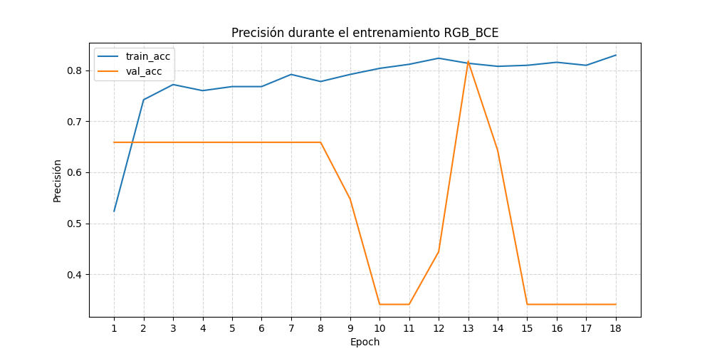

#### 4.3.2 Loss plot:
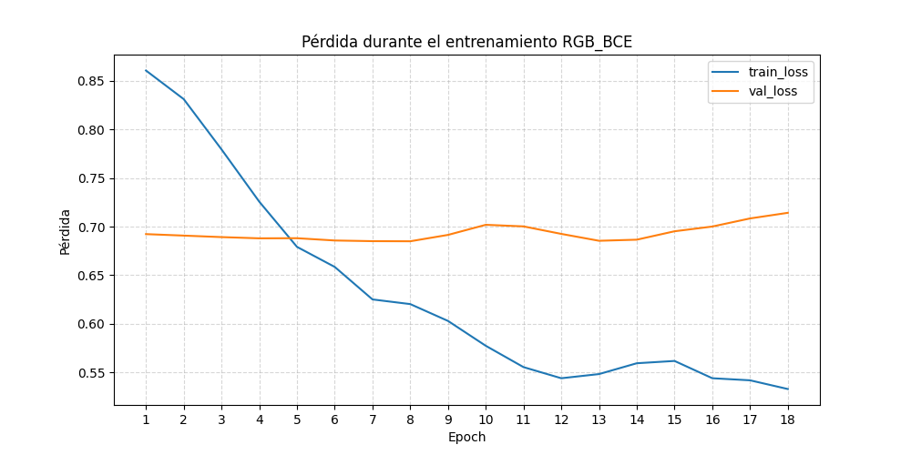

#### 4.3.2 Recall plot:
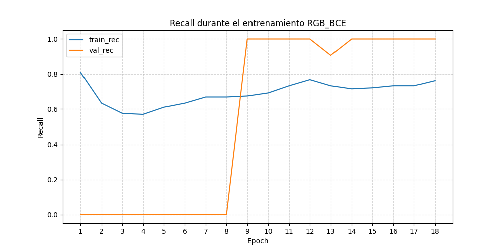

# RANDOM FOREST (RF)
## I. ENTRENAMIENTO
### - El algoritmo de entrenamiento, `train.py`, permite los siguientes argumentos:

````python
def main():
  parser = argparse.ArgumentParser(description="Entrena el modelo RGB o MULTIESPECTRAL para detección de plagas")
  parser.add_argument("data_dir", help="Directorio raíz con subcarpetas de clases")
  parser.add_argument("-e", "--epochs", type=int, default=20, help="Número máximo de épocas")
  parser.add_argument("-a", "--alpha", type=float, default=0.50, help="Alpha")
  parser.add_argument("-g", "--gamma", type=float, default=3.0, help="Gamma")
  parser.add_argument("-lt", "--loss_type", type=str, choices=["focal_loss", "binary_crossentropy"], help="Tipo de funcion de perdida")
  parser.add_argument("-rgb", "--rgb", action='store_true', default=False, help="Es RGB?")
  parser.add_argument("-mt", "--model_type", type=str, required=True, default='cnn', choices=["cnn", "rf"], help="Tipo de modelo a entrenar (cnn o rf)")
  parser.add_argument("-t", "--threshold", type=float, default=0.5, help="Umbral de decisión (0.0 a 1.0)")
  args = parser.parse_args()
  run_training(
    data_dir=args.data_dir, 
    epochs=args.epochs, 
    loss_type=args.loss_type, 
    isRgb=args.rgb, 
    alpha=args.alpha, 
    gamma=args.gamma,
    model_type=args.model_type, 
    threshold=args.threshold
    )
````

# 1. MULTIESPECTRAL (MS)
### 1.1 Comando:

````bash
python src\pest_detection_models\train.py data\multiespectral\TTADDA-dataset\TTADDA_NARO_2023_F1\drone_data -lt binary_crossentropy -e 80 -mt rf
````

### 1.2 Consola:

````bash
2026-03-24 20:49:49.328473: I tensorflow/core/util/port.cc:153] oneDNN custom operations are on. You may see slightly different numerical results due to floating-point round-off errors from different computation orders. To turn them off, set the environment variable `TF_ENABLE_ONEDNN_OPTS=0`.
2026-03-24 20:49:52.983113: I tensorflow/core/util/port.cc:153] oneDNN custom operations are on. You may see slightly different numerical results due to floating-point round-off errors from different computation orders. To turn them off, set the environment variable `TF_ENABLE_ONEDNN_OPTS=0`.
Modelo Random Forest con extracción CNN

--- [Fecha/hora inicio=20260324_2049] ---

--- [T=0.00s] ---
1. Iniciando entrenamiento Random Forest MULTIESPECTRAL

--- [Fecha/hora inicio=20260324_2049] ---

--- [T=0.00s] ---
1. Cargando datos...

--- [Fecha/hora inicio=20260324_2049] ---

--- [T=0.11s] ---
1. Carga de datos cnn Multiespectral

--- [Fecha/hora inicio=20260324_2049] ---

--- [T=0.17s] ---
2. Filtrado y extracción de datos

--- [Fecha/hora inicio=20260324_2049] ---

--- [T=0.17s] ---
2.1. Iniciando procesamiento de 665 imágenes etiquetadas...

--- [Fecha/hora inicio=20260324_2049] ---

--- [T=0.17s] ---
2.2. Archivos seleccionados: ['red.tif', 'red edge.tif', 'nir.tif', 'blue.tif', 'green.tif']

--- [Fecha/hora inicio=20260324_2049] ---

--- [T=108.67s] ---
7. Extracción de imágenes completada.

Datos listos para entrenamiento. Total de muestras: 665

Resumen de Datos Multiespectrales:
Total de parches extraídos: 665
X Train/Val Split: 532 / 133
Y Train/Val Split: 532 / 133
Forma X_train: (532, 224, 224, 5)
Forma Y_train: (532,)
Shape train: (532, 224, 224, 5)

--- [Fecha/hora inicio=20260324_2049] ---

--- [T=109.65s] ---
2. Cargando modelo CNN para extracción de features...
2026-03-24 20:51:44.888079: I tensorflow/core/platform/cpu_feature_guard.cc:210] This TensorFlow binary is optimized to use available CPU instructions in performance-critical operations.
To enable the following instructions: SSE3 SSE4.1 SSE4.2 AVX AVX2 AVX_VNNI FMA, in other operations, rebuild TensorFlow with the appropriate compiler flags.
Feature extractor listo ✔

--- [Fecha/hora inicio=20260324_2049] ---

--- [T=109.96s] ---
3. Extrayendo features con CNN...
2026-03-24 20:51:45.746648: E tensorflow/core/framework/node_def_util.cc:680] NodeDef mentions attribute use_unbounded_threadpool which is not in the op definition: Op<name=MapDataset; signature=input_dataset:variant, other_arguments: -> handle:variant; attr=f:func; attr=Targuments:list(type),min=0; attr=output_types:list(type),min=1; attr=output_shapes:list(shape),min=1; attr=use_inter_op_parallelism:bool,default=true; attr=preserve_cardinality:bool,default=false; attr=force_synchronous:bool,default=false; attr=metadata:string,default=""> This may be expected if your graph generating binary is newer  than this binary. Unknown attributes will be ignored. NodeDef: {{node ParallelMapDatasetV2/_14}}
17/17 ━━━━━━━━━━━━━━━━━━━━ 7s 361ms/step
2026-03-24 20:51:52.415924: E tensorflow/core/framework/node_def_util.cc:680] NodeDef mentions attribute use_unbounded_threadpool which is not in the op definition: Op<name=MapDataset; signature=input_dataset:variant, other_arguments: -> handle:variant; attr=f:func; attr=Targuments:list(type),min=0; attr=output_types:list(type),min=1; attr=output_shapes:list(shape),min=1; attr=use_inter_op_parallelism:bool,default=true; attr=preserve_cardinality:bool,default=false; attr=force_synchronous:bool,default=false; attr=metadata:string,default=""> This may be expected if your graph generating binary is newer  than this binary. Unknown attributes will be ignored. NodeDef: {{node ParallelMapDatasetV2/_14}}
5/5 ━━━━━━━━━━━━━━━━━━━━ 2s 284ms/step
Shape features train: (532, 64)

--- [Fecha/hora inicio=20260324_2049] ---

--- [T=118.78s] ---
4. Aplicando StandardScaler...
Pesos de Clase Calculados: Plaga (0): 1.11, Sana (1): 1.55
------------------------------
DEBUG - Conteo: Plaga: 360, Sana: 172
RESULTADO - Pesos Finales: Plaga (0): 1.11, Sana (1): 1.55
------------------------------

--- [Fecha/hora inicio=20260324_2049] ---

--- [T=118.79s] ---
5. Entrenando Random Forest...

--- [Fecha/hora inicio=20260324_2049] ---

--- [T=119.34s] ---
Finish. Entrenamiento completado ✔

--- [Fecha/hora inicio=20260324_2049] ---

--- [T=119.34s] ---
6. Evaluando modelo...

--- MATRIZ DE CONFUSIÓN ---
[[68 22]
 [15 28]]

--- REPORTE DE CLASIFICACIÓN ---
              precision    recall  f1-score   support

           0       0.82      0.76      0.79        90
           1       0.56      0.65      0.60        43

    accuracy                           0.72       133
   macro avg       0.69      0.70      0.69       133
weighted avg       0.74      0.72      0.73       133


AUC: 0.8443

--- [Fecha/hora inicio=20260324_2049] ---

--- [T=119.46s] ---
7. Guardando modelo...

Modelo RF + Scaler guardado en: C:\workspace\hd-image-pest-detection-cnn-and-rf\src\pest_detection_models\best_models\rf_pipeline_20260324_2049_MULTIESPECTRAL.joblib
````

# 2. RGB (RGB)
### 2.1 Comando:

````bash
python src\pest_detection_models\train.py data\multiespectral\TTADDA-dataset\TTADDA_NARO_2023_F1\drone_data -lt binary_crossentropy -e 80 -mt rf -rgb
````

### 2.2 Consola:

````bash
2026-03-24 21:06:18.437540: I tensorflow/core/util/port.cc:153] oneDNN custom operations are on. You may see slightly different numerical results due to floating-point round-off errors from different computation orders. To turn them off, set the environment variable `TF_ENABLE_ONEDNN_OPTS=0`.
2026-03-24 21:06:20.448869: I tensorflow/core/util/port.cc:153] oneDNN custom operations are on. You may see slightly different numerical results due to floating-point round-off errors from different computation orders. To turn them off, set the environment variable `TF_ENABLE_ONEDNN_OPTS=0`.
Modelo Random Forest con extracción CNN

--- [Fecha/hora inicio=20260324_2106] ---

--- [T=0.00s] ---
1. Iniciando entrenamiento Random Forest RGB

--- [Fecha/hora inicio=20260324_2106] ---

--- [T=0.00s] ---
1. Cargando datos...

--- [Fecha/hora inicio=20260324_2106] ---

--- [T=0.15s] ---
1. Carga de datos cnn RGB

--- [Fecha/hora inicio=20260324_2106] ---

--- [T=0.21s] ---
2. Filtrado y extracción de datos

--- [Fecha/hora inicio=20260324_2106] ---

--- [T=0.21s] ---
2.1. Iniciando procesamiento de 665 imágenes etiquetadas...

--- [Fecha/hora inicio=20260324_2106] ---

--- [T=0.21s] ---
2.2. Archivos seleccionados: ['RGB.tif']
Imagen inválida: 4 canales (esperado 3)
Imagen inválida: 4 canales (esperado 3)
Imagen inválida: 4 canales (esperado 3)
Imagen inválida: 4 canales (esperado 3)
Imagen inválida: 4 canales (esperado 3)
Imagen inválida: 4 canales (esperado 3)
Imagen inválida: 4 canales (esperado 3)
Imagen inválida: 4 canales (esperado 3)
Imagen inválida: 4 canales (esperado 3)
Imagen inválida: 4 canales (esperado 3)
Imagen inválida: 4 canales (esperado 3)
Imagen inválida: 4 canales (esperado 3)
Imagen inválida: 4 canales (esperado 3)
Imagen inválida: 4 canales (esperado 3)
Imagen inválida: 4 canales (esperado 3)
Imagen inválida: 4 canales (esperado 3)
Imagen inválida: 4 canales (esperado 3)
Imagen inválida: 4 canales (esperado 3)
Imagen inválida: 4 canales (esperado 3)
Imagen inválida: 4 canales (esperado 3)
Imagen inválida: 4 canales (esperado 3)
Imagen inválida: 4 canales (esperado 3)
Imagen inválida: 4 canales (esperado 3)
Imagen inválida: 4 canales (esperado 3)
Imagen inválida: 4 canales (esperado 3)
Imagen inválida: 4 canales (esperado 3)
Imagen inválida: 4 canales (esperado 3)
Imagen inválida: 4 canales (esperado 3)
Imagen inválida: 4 canales (esperado 3)
Imagen inválida: 4 canales (esperado 3)
Imagen inválida: 4 canales (esperado 3)
Imagen inválida: 4 canales (esperado 3)
Imagen inválida: 4 canales (esperado 3)
Imagen inválida: 4 canales (esperado 3)
Imagen inválida: 4 canales (esperado 3)

--- [Fecha/hora inicio=20260324_2106] ---

--- [T=92.08s] ---
7. Extracción de imágenes completada.

Datos listos para entrenamiento. Total de muestras: 630

Resumen de Datos Multiespectrales:
Total de parches extraídos: 630
X Train/Val Split: 504 / 126
Y Train/Val Split: 504 / 126
Forma X_train: (504, 224, 224, 3)
Forma Y_train: (504,)
Shape train: (504, 224, 224, 3)

--- [Fecha/hora inicio=20260324_2106] ---

--- [T=92.55s] ---
2. Cargando modelo CNN para extracción de features...
2026-03-24 21:07:54.996213: I tensorflow/core/platform/cpu_feature_guard.cc:210] This TensorFlow binary is optimized to use available CPU instructions in performance-critical operations.
To enable the following instructions: SSE3 SSE4.1 SSE4.2 AVX AVX2 AVX_VNNI FMA, in other operations, rebuild TensorFlow with the appropriate compiler flags.
Feature extractor listo ✔

--- [Fecha/hora inicio=20260324_2106] ---

--- [T=92.91s] ---
3. Extrayendo features con CNN...
2026-03-24 21:07:55.812984: E tensorflow/core/framework/node_def_util.cc:680] NodeDef mentions attribute use_unbounded_threadpool which is not in the op definition: Op<name=MapDataset; signature=input_dataset:variant, other_arguments: -> handle:variant; attr=f:func; attr=Targuments:list(type),min=0; attr=output_types:list(type),min=1; attr=output_shapes:list(shape),min=1; attr=use_inter_op_parallelism:bool,default=true; attr=preserve_cardinality:bool,default=false; attr=force_synchronous:bool,default=false; attr=metadata:string,default=""> This may be expected if your graph generating binary is newer  than this binary. Unknown attributes will be ignored. NodeDef: {{node ParallelMapDatasetV2/_14}}
16/16 ━━━━━━━━━━━━━━━━━━━━ 6s 355ms/step 
2026-03-24 21:08:01.996477: E tensorflow/core/framework/node_def_util.cc:680] NodeDef mentions attribute use_unbounded_threadpool which is not in the op definition: Op<name=MapDataset; signature=input_dataset:variant, other_arguments: -> handle:variant; attr=f:func; attr=Targuments:list(type),min=0; attr=output_types:list(type),min=1; attr=output_shapes:list(shape),min=1; attr=use_inter_op_parallelism:bool,default=true; attr=preserve_cardinality:bool,default=false; attr=force_synchronous:bool,default=false; attr=metadata:string,default=""> This may be expected if your graph generating binary is newer  than this binary. Unknown attributes will be ignored. NodeDef: {{node ParallelMapDatasetV2/_14}}
4/4 ━━━━━━━━━━━━━━━━━━━━ 1s 351ms/step
Shape features train: (504, 64)

--- [Fecha/hora inicio=20260324_2106] ---

--- [T=101.06s] ---
4. Aplicando StandardScaler...
Pesos de Clase Calculados: Plaga (0): 1.14, Sana (1): 1.47
------------------------------
DEBUG - Conteo: Plaga: 332, Sana: 172
RESULTADO - Pesos Finales: Plaga (0): 1.14, Sana (1): 1.47
------------------------------

--- [Fecha/hora inicio=20260324_2106] ---

--- [T=101.07s] ---
5. Entrenando Random Forest...

--- [Fecha/hora inicio=20260324_2106] ---

--- [T=101.59s] ---
Finish. Entrenamiento completado ✔

--- [Fecha/hora inicio=20260324_2106] ---

--- [T=101.59s] ---
6. Evaluando modelo...

--- MATRIZ DE CONFUSIÓN ---
[[69 14]
 [ 6 37]]

--- REPORTE DE CLASIFICACIÓN ---
              precision    recall  f1-score   support

           0       0.92      0.83      0.87        83
           1       0.73      0.86      0.79        43

    accuracy                           0.84       126
   macro avg       0.82      0.85      0.83       126
weighted avg       0.85      0.84      0.84       126


AUC: 0.9229

--- [Fecha/hora inicio=20260324_2106] ---

--- [T=101.70s] ---
7. Guardando modelo...

Modelo RF + Scaler guardado en: C:\workspace\hd-image-pest-detection-cnn-and-rf\src\pest_detection_models\best_models\rf_pipeline_20260324_2106_RGB.joblib
````

## II. EVALUACION
### - El algoritmo de evaluación, `evaluate.py`, permite los siguientes argumentos:
````python
if __name__ == "__main__":
  parser = argparse.ArgumentParser(description="Evalúa el modelo CNN con BCE/Focal RGB/MS")
  parser.add_argument("data_dir", help="Ruta al directorio de datos (raíz)")
  parser.add_argument("-m", "--model", required=True, help="Ruta al archivo del modelo Keras")
  parser.add_argument("-t", "--threshold", type=float, default=0.5, help="Umbral de decisión (0.0 a 1.0)")
  parser.add_argument("-b", "--base_dir", default=BASE_DIR, help="Directorio base para guardar resultados")
  parser.add_argument("-mt", "--model_type", type=str, required=True, choices=["cnn", "rf"], help="Tipo de modelo a entrenar (cnn o rf)")
  args = parser.parse_args()
 
  run_evaluation(args.data_dir, args.model, args.threshold, args.model_type, args.base_dir)
````

### Curva ROC:


## CNN MULTIESPECTRAL FOCAL LOSS
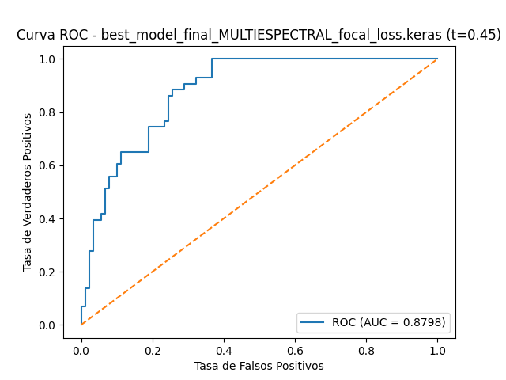

### 1 UMBRAL 0.4
#### 1.1 Comando:

````bash
python src\pest_detection_models\evaluate.py data\multiespectral\TTADDA-dataset\TTADDA_NARO_2023_F1\drone_data -m src\pest_detection_models\best_models\best_model_final_MULTIESPECTRAL_focal_loss.keras -t 0.45 -mt cnn
````

#### 1.2 Consola:
````bash
2026-03-25 11:54:38.379352: I tensorflow/core/util/port.cc:153] oneDNN custom operations are on. You may see slightly different numerical results due to floating-point round-off errors from different computation orders. To turn them off, set the environment variable `TF_ENABLE_ONEDNN_OPTS=0`.
2026-03-25 11:54:39.696820: I tensorflow/core/util/port.cc:153] oneDNN custom operations are on. You may see slightly different numerical results due to floating-point round-off errors from different computation orders. To turn them off, set the environment variable `TF_ENABLE_ONEDNN_OPTS=0`.

--- [Fecha/hora inicio=20260325_1154] ---

--- [T=0.00s] ---
init. Evaluando CNN MULTIESPECTRAL - Loss: focal_loss - Threshold: 0.45

--- [Fecha/hora inicio=20260325_1154] ---

--- [T=0.00s] ---
1. Cargando datos...

--- [Fecha/hora inicio=20260325_1154] ---

--- [T=0.00s] ---
1. Ejecutando extracción y split de datos (extract_data_to_img_for_train)

--- [Fecha/hora inicio=20260325_1154] ---

--- [T=0.00s] ---
1. Carga de datos cnn Multiespectral

--- [Fecha/hora inicio=20260325_1154] ---

--- [T=0.03s] ---
2. Filtrado y extracción de datos

--- [Fecha/hora inicio=20260325_1154] ---

--- [T=0.03s] ---
2.1. Iniciando procesamiento de 665 imágenes etiquetadas...

--- [Fecha/hora inicio=20260325_1154] ---

--- [T=0.03s] ---
2.2. Archivos seleccionados: ['red.tif', 'red edge.tif', 'nir.tif', 'blue.tif', 'green.tif']

--- [Fecha/hora inicio=20260325_1154] ---

--- [T=54.56s] ---
7. Extracción de imágenes completada.

Datos listos para entrenamiento. Total de muestras: 665

Resumen de Datos Multiespectrales:
Total de parches extraídos: 665
X Train/Val Split: 532 / 133
Y Train/Val Split: 532 / 133
Forma X_train: (532, 224, 224, 5)
Forma Y_train: (532,)

--- [Fecha/hora inicio=20260325_1154] ---

--- [T=54.91s] ---
1.1. Clases detectadas: 0: Plaga, 1: Sana

--- [Fecha/hora inicio=20260325_1154] ---

--- [T=54.91s] ---
2. Calculando pesos de clase (Estrategia: Class Weighting)

--- [Fecha/hora inicio=20260325_1154] ---

--- [T=54.92s] ---
2.1. Pesos de Clase Calculados (train_counts): {np.int64(0): np.float64(0.7388888888888889), np.int64(1): np.float64(1.5465116279069768)}

--- [Fecha/hora inicio=20260325_1154] ---

--- [T=54.94s] ---
2. Cargando modelo...

--- [Fecha/hora inicio=20260325_1154] ---

--- [T=54.98s] ---
1. ⏳ Cargando modelo desde: src\pest_detection_models\best_models\best_model_final_MULTIESPECTRAL_focal_loss.keras
2026-03-25 11:55:35.836245: I tensorflow/core/platform/cpu_feature_guard.cc:210] This TensorFlow binary is optimized to use available CPU instructions in performance-critical operations.
To enable the following instructions: SSE3 SSE4.1 SSE4.2 AVX AVX2 AVX_VNNI FMA, in other operations, rebuild TensorFlow with the appropriate compiler flags.

--- [Fecha/hora inicio=20260325_1154] ---

--- [T=55.13s] ---
2. ✅ Modelo Keras cargado exitosamente desde src\pest_detection_models\best_models\best_model_final_MULTIESPECTRAL_focal_loss.keras

--- [Fecha/hora inicio=20260325_1154] ---

--- [T=55.08s] ---
3. Prediciendo...

--- [Fecha/hora inicio=20260325_1154] ---

--- [T=55.20s] ---
1. Iniciando predicción del modelo CNN...
5/5 ━━━━━━━━━━━━━━━━━━━━ 1s 172ms/step

--- [Fecha/hora inicio=20260325_1154] ---

--- [T=56.19s] ---
4. Generando métricas...

✅ Reporte de Clasificación guardado en: C:\workspace\hd-image-pest-detection-cnn-and-rf\src\pest_detection_models\evaluation_results/CNN/MULTIESPECTRAL/focal_loss/0.45\report_best_model_final_MULTIESPECTRAL_focal_loss.keras_20260325_1155_t45.json
✅ Matriz de Confusión guardada en: C:\workspace\hd-image-pest-detection-cnn-and-rf\src\pest_detection_models\evaluation_results/CNN/MULTIESPECTRAL/focal_loss/0.45\report_best_model_final_MULTIESPECTRAL_focal_loss.keras_20260325_1155_t45_confusion.png
Matriz de confusión:
[[62 28]
 [ 4 39]]

--- RESUMEN DEL REPORTE DE CLASIFICACIÓN ---
              precision    recall  f1-score   support

       Plaga       0.94      0.69      0.79        90
        Sana       0.58      0.91      0.71        43

    accuracy                           0.76       133
   macro avg       0.76      0.80      0.75       133
weighted avg       0.82      0.76      0.77       133

✅ Reporte Markdown (Tabla) guardado en: C:\workspace\hd-image-pest-detection-cnn-and-rf\src\pest_detection_models\evaluation_results/CNN/MULTIESPECTRAL/focal_loss/0.45\report_table_best_model_final_MULTIESPECTRAL_focal_loss.keras_20260325_1155_t45.md
✅ Curva ROC guardada en: C:\workspace\hd-image-pest-detection-cnn-and-rf\src\pest_detection_models\evaluation_results/CNN/MULTIESPECTRAL/focal_loss/0.45\ROC_best_model_final_MULTIESPECTRAL_focal_loss.keras_20260325_1155_t0.45.png
ROC guardada en C:\workspace\hd-image-pest-detection-cnn-and-rf\src\pest_detection_models\evaluation_results/CNN/MULTIESPECTRAL/focal_loss/0.45\ROC_data_best_model_final_MULTIESPECTRAL_focal_loss.keras_20260325_1155_t0.45.npz (AUC=0.8798)
````

#### 1.3 Resultados:
##### 1.3.1 Reporte de clasificación json:

````json
{
    "Plaga": {
        "precision": 0.9393939393939394,
        "recall": 0.6888888888888889,
        "f1-score": 0.7948717948717948,
        "support": 90.0
    },
    "Sana": {
        "precision": 0.582089552238806,
        "recall": 0.9069767441860465,
        "f1-score": 0.7090909090909091,
        "support": 43.0
    },
    "accuracy": 0.7593984962406015,
    "macro avg": {
        "precision": 0.7607417458163728,
        "recall": 0.7979328165374677,
        "f1-score": 0.751981351981352,
        "support": 133.0
    },
    "weighted avg": {
        "precision": 0.823874475877618,
        "recall": 0.7593984962406015,
        "f1-score": 0.7671381250328618,
        "support": 133.0
    }
}
````

##### 1.3.2 Reporte de clasificación tabla

# Reporte de Clasificación - best_model_final_MULTIESPECTRAL_focal_loss.keras

- **Fecha:** 2026-03-25 11:55:39
- **Modelo:** best_model_final_MULTIESPECTRAL_focal_loss.keras
- **Umbral de decisión:** 0.45

## Métricas por Clase

```text
              precision    recall  f1-score   support

       Plaga       0.94      0.69      0.79        90
        Sana       0.58      0.91      0.71        43

    accuracy                           0.76       133
   macro avg       0.76      0.80      0.75       133
weighted avg       0.82      0.76      0.77       133

```


*Generado automáticamente por el sistema de detección de plagas.*

##### 1.3.3 Matriz de confusión
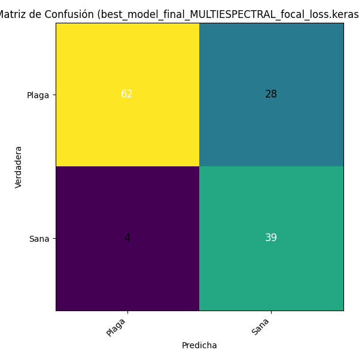

# Matriz de confusión

- **Fecha:** 2026-03-25 11:55:39
- **Modelo:** report_best_model_final_MULTIESPECTRAL_focal_loss.keras_20260325_1155_t45_confusion.md
```text
[[62 28]
 [ 4 39]]
```


*Generado automáticamente por el sistema de detección de plagas.*

### 2 UMBRAL 0.5214
#### 2.1 Comando:
````bash
python src\pest_detection_models\evaluate.py data\multiespectral\TTADDA-dataset\TTADDA_NARO_2023_F1\drone_data -m src\pest_detection_models\best_models\best_model_final_MULTIESPECTRAL_focal_loss.keras -t 0.5214 -mt cnn
````

#### 2.2 Consola:

````bash
2026-03-25 11:56:17.500472: I tensorflow/core/util/port.cc:153] oneDNN custom operations are on. You may see slightly different numerical results due to floating-point round-off errors from different computation orders. To turn them off, set the environment variable `TF_ENABLE_ONEDNN_OPTS=0`.
2026-03-25 11:56:18.825798: I tensorflow/core/util/port.cc:153] oneDNN custom operations are on. You may see slightly different numerical results due to floating-point round-off errors from different computation orders. To turn them off, set the environment variable `TF_ENABLE_ONEDNN_OPTS=0`.

--- [Fecha/hora inicio=20260325_1156] ---

--- [T=0.00s] ---
init. Evaluando CNN MULTIESPECTRAL - Loss: focal_loss - Threshold: 0.5214

--- [Fecha/hora inicio=20260325_1156] ---

--- [T=0.00s] ---
1. Cargando datos...

--- [Fecha/hora inicio=20260325_1156] ---

--- [T=0.00s] ---
1. Ejecutando extracción y split de datos (extract_data_to_img_for_train)

--- [Fecha/hora inicio=20260325_1156] ---

--- [T=0.00s] ---
1. Carga de datos cnn Multiespectral

--- [Fecha/hora inicio=20260325_1156] ---

--- [T=0.03s] ---
2. Filtrado y extracción de datos

--- [Fecha/hora inicio=20260325_1156] ---

--- [T=0.03s] ---
2.1. Iniciando procesamiento de 665 imágenes etiquetadas...

--- [Fecha/hora inicio=20260325_1156] ---

--- [T=0.03s] ---
2.2. Archivos seleccionados: ['red.tif', 'red edge.tif', 'nir.tif', 'blue.tif', 'green.tif']

--- [Fecha/hora inicio=20260325_1156] ---

--- [T=55.79s] ---
7. Extracción de imágenes completada.

Datos listos para entrenamiento. Total de muestras: 665

Resumen de Datos Multiespectrales:
Total de parches extraídos: 665
X Train/Val Split: 532 / 133
Y Train/Val Split: 532 / 133
Forma X_train: (532, 224, 224, 5)
Forma Y_train: (532,)

--- [Fecha/hora inicio=20260325_1156] ---

--- [T=56.11s] ---
1.1. Clases detectadas: 0: Plaga, 1: Sana

--- [Fecha/hora inicio=20260325_1156] ---

--- [T=56.11s] ---
2. Calculando pesos de clase (Estrategia: Class Weighting)

--- [Fecha/hora inicio=20260325_1156] ---

--- [T=56.12s] ---
2.1. Pesos de Clase Calculados (train_counts): {np.int64(0): np.float64(0.7388888888888889), np.int64(1): np.float64(1.5465116279069768)}

--- [Fecha/hora inicio=20260325_1156] ---

--- [T=56.14s] ---
2. Cargando modelo...

--- [Fecha/hora inicio=20260325_1156] ---

--- [T=56.18s] ---
1. ⏳ Cargando modelo desde: src\pest_detection_models\best_models\best_model_final_MULTIESPECTRAL_focal_loss.keras
2026-03-25 11:57:16.150520: I tensorflow/core/platform/cpu_feature_guard.cc:210] This TensorFlow binary is optimized to use available CPU instructions in performance-critical operations.
To enable the following instructions: SSE3 SSE4.1 SSE4.2 AVX AVX2 AVX_VNNI FMA, in other operations, rebuild TensorFlow with the appropriate compiler flags.

--- [Fecha/hora inicio=20260325_1156] ---

--- [T=56.32s] ---
2. ✅ Modelo Keras cargado exitosamente desde src\pest_detection_models\best_models\best_model_final_MULTIESPECTRAL_focal_loss.keras

--- [Fecha/hora inicio=20260325_1156] ---

--- [T=56.27s] ---
3. Prediciendo...

--- [Fecha/hora inicio=20260325_1156] ---

--- [T=56.40s] ---
1. Iniciando predicción del modelo CNN...
5/5 ━━━━━━━━━━━━━━━━━━━━ 1s 168ms/step

--- [Fecha/hora inicio=20260325_1156] ---

--- [T=57.37s] ---
4. Generando métricas...

✅ Reporte de Clasificación guardado en: C:\workspace\hd-image-pest-detection-cnn-and-rf\src\pest_detection_models\evaluation_results/CNN/MULTIESPECTRAL/focal_loss/0.5214\report_best_model_final_MULTIESPECTRAL_focal_loss.keras_20260325_1157_t52.json
✅ Matriz de Confusión guardada en: C:\workspace\hd-image-pest-detection-cnn-and-rf\src\pest_detection_models\evaluation_results/CNN/MULTIESPECTRAL/focal_loss/0.5214\report_best_model_final_MULTIESPECTRAL_focal_loss.keras_20260325_1157_t52_confusion.png
Matriz de confusión:
[[64 26]
 [ 5 38]]

--- RESUMEN DEL REPORTE DE CLASIFICACIÓN ---
              precision    recall  f1-score   support

       Plaga       0.93      0.71      0.81        90
        Sana       0.59      0.88      0.71        43

    accuracy                           0.77       133
   macro avg       0.76      0.80      0.76       133
weighted avg       0.82      0.77      0.77       133

✅ Reporte Markdown (Tabla) guardado en: C:\workspace\hd-image-pest-detection-cnn-and-rf\src\pest_detection_models\evaluation_results/CNN/MULTIESPECTRAL/focal_loss/0.5214\report_table_best_model_final_MULTIESPECTRAL_focal_loss.keras_20260325_1157_t52.md
✅ Curva ROC guardada en: C:\workspace\hd-image-pest-detection-cnn-and-rf\src\pest_detection_models\evaluation_results/CNN/MULTIESPECTRAL/focal_loss/0.5214\ROC_best_model_final_MULTIESPECTRAL_focal_loss.keras_20260325_1157_t0.5214.png
ROC guardada en C:\workspace\hd-image-pest-detection-cnn-and-rf\src\pest_detection_models\evaluation_results/CNN/MULTIESPECTRAL/focal_loss/0.5214\ROC_data_best_model_final_MULTIESPECTRAL_focal_loss.keras_20260325_1157_t0.5214.npz (AUC=0.8798)
````

#### 2.3 Resultados:
##### 2.3.1 Reporte de clasificación json:
````json
{
    "Plaga": {
        "precision": 0.927536231884058,
        "recall": 0.7111111111111111,
        "f1-score": 0.8050314465408805,
        "support": 90.0
    },
    "Sana": {
        "precision": 0.59375,
        "recall": 0.8837209302325582,
        "f1-score": 0.7102803738317757,
        "support": 43.0
    },
    "accuracy": 0.7669172932330827,
    "macro avg": {
        "precision": 0.760643115942029,
        "recall": 0.7974160206718346,
        "f1-score": 0.757655910186328,
        "support": 133.0
    },
    "weighted avg": {
        "precision": 0.819620382477934,
        "recall": 0.7669172932330827,
        "f1-score": 0.7743976410785383,
        "support": 133.0
    }
}
````

##### 2.3.2 Reporte de clasificación tabla
# Reporte de Clasificación - best_model_final_MULTIESPECTRAL_focal_loss.keras

- **Fecha:** 2026-03-25 11:57:24
- **Modelo:** best_model_final_MULTIESPECTRAL_focal_loss.keras
- **Umbral de decisión:** 0.5214

## Métricas por Clase

```text
              precision    recall  f1-score   support

       Plaga       0.93      0.71      0.81        90
        Sana       0.59      0.88      0.71        43

    accuracy                           0.77       133
   macro avg       0.76      0.80      0.76       133
weighted avg       0.82      0.77      0.77       133

```


*Generado automáticamente por el sistema de detección de plagas.*

##### 2.3.3 Matriz de confusión
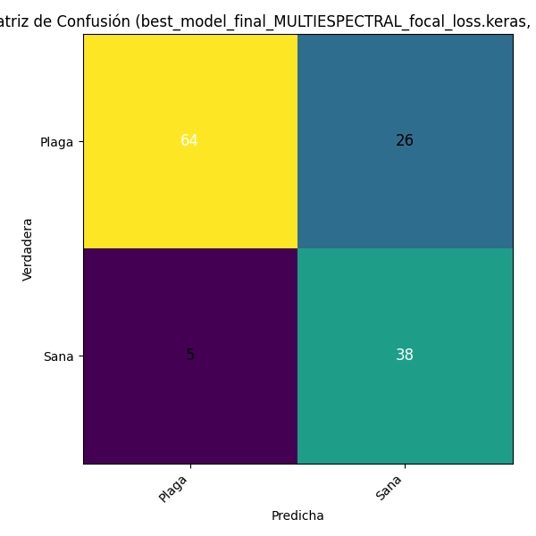

# Matriz de confusión

- **Fecha:** 2026-03-25 11:57:24
- **Modelo:** report_best_model_final_MULTIESPECTRAL_focal_loss.keras_20260325_1157_t52_confusion.md
```text
[[64 26]
 [ 5 38]]
```


*Generado automáticamente por el sistema de detección de plagas.*

### 3 UMBRAL 0.70
#### 3.1 Comando:

````bash
python src\pest_detection_models\evaluate.py data\multiespectral\TTADDA-dataset\TTADDA_NARO_2023_F1\drone_data -m src\pest_detection_models\best_models\best_model_final_MULTIESPECTRAL_focal_loss.keras -t 0.70 -mt cnn
````

#### 3.2 Consola:

````bash
2026-03-25 11:58:20.920530: I tensorflow/core/util/port.cc:153] oneDNN custom operations are on. You may see slightly different numerical results due to floating-point round-off errors from different computation orders. To turn them off, set the environment variable `TF_ENABLE_ONEDNN_OPTS=0`.
2026-03-25 11:58:22.393714: I tensorflow/core/util/port.cc:153] oneDNN custom operations are on. You may see slightly different numerical results due to floating-point round-off errors from different computation orders. To turn them off, set the environment variable `TF_ENABLE_ONEDNN_OPTS=0`.

--- [Fecha/hora inicio=20260325_1158] ---

--- [T=0.00s] ---
init. Evaluando CNN MULTIESPECTRAL - Loss: focal_loss - Threshold: 0.7

--- [Fecha/hora inicio=20260325_1158] ---

--- [T=0.00s] ---
1. Cargando datos...

--- [Fecha/hora inicio=20260325_1158] ---

--- [T=0.00s] ---
1. Ejecutando extracción y split de datos (extract_data_to_img_for_train)

--- [Fecha/hora inicio=20260325_1158] ---

--- [T=0.00s] ---
1. Carga de datos cnn Multiespectral

--- [Fecha/hora inicio=20260325_1158] ---

--- [T=0.04s] ---
2. Filtrado y extracción de datos

--- [Fecha/hora inicio=20260325_1158] ---

--- [T=0.04s] ---
2.1. Iniciando procesamiento de 665 imágenes etiquetadas...

--- [Fecha/hora inicio=20260325_1158] ---

--- [T=0.04s] ---
2.2. Archivos seleccionados: ['red.tif', 'red edge.tif', 'nir.tif', 'blue.tif', 'green.tif']

--- [Fecha/hora inicio=20260325_1158] ---

--- [T=57.84s] ---
7. Extracción de imágenes completada.

Datos listos para entrenamiento. Total de muestras: 665

Resumen de Datos Multiespectrales:
Total de parches extraídos: 665
X Train/Val Split: 532 / 133
Y Train/Val Split: 532 / 133
Forma X_train: (532, 224, 224, 5)
Forma Y_train: (532,)

--- [Fecha/hora inicio=20260325_1158] ---

--- [T=58.25s] ---
1.1. Clases detectadas: 0: Plaga, 1: Sana

--- [Fecha/hora inicio=20260325_1158] ---

--- [T=58.25s] ---
2. Calculando pesos de clase (Estrategia: Class Weighting)

--- [Fecha/hora inicio=20260325_1158] ---

--- [T=58.26s] ---
2.1. Pesos de Clase Calculados (train_counts): {np.int64(0): np.float64(0.7388888888888889), np.int64(1): np.float64(1.5465116279069768)}

--- [Fecha/hora inicio=20260325_1158] ---

--- [T=58.30s] ---
2. Cargando modelo...

--- [Fecha/hora inicio=20260325_1158] ---

--- [T=58.34s] ---
1. ⏳ Cargando modelo desde: src\pest_detection_models\best_models\best_model_final_MULTIESPECTRAL_focal_loss.keras
2026-03-25 11:59:21.889262: I tensorflow/core/platform/cpu_feature_guard.cc:210] This TensorFlow binary is optimized to use available CPU instructions in performance-critical operations.
To enable the following instructions: SSE3 SSE4.1 SSE4.2 AVX AVX2 AVX_VNNI FMA, in other operations, rebuild TensorFlow with the appropriate compiler flags.

--- [Fecha/hora inicio=20260325_1158] ---

--- [T=58.55s] ---
2. ✅ Modelo Keras cargado exitosamente desde src\pest_detection_models\best_models\best_model_final_MULTIESPECTRAL_focal_loss.keras

--- [Fecha/hora inicio=20260325_1158] ---

--- [T=58.51s] ---
3. Prediciendo...

--- [Fecha/hora inicio=20260325_1158] ---

--- [T=58.63s] ---
1. Iniciando predicción del modelo CNN...
5/5 ━━━━━━━━━━━━━━━━━━━━ 1s 207ms/step

--- [Fecha/hora inicio=20260325_1158] ---

--- [T=59.85s] ---
4. Generando métricas...

✅ Reporte de Clasificación guardado en: C:\workspace\hd-image-pest-detection-cnn-and-rf\src\pest_detection_models\evaluation_results/CNN/MULTIESPECTRAL/focal_loss/0.7\report_best_model_final_MULTIESPECTRAL_focal_loss.keras_20260325_1159_t70.json
✅ Matriz de Confusión guardada en: C:\workspace\hd-image-pest-detection-cnn-and-rf\src\pest_detection_models\evaluation_results/CNN/MULTIESPECTRAL/focal_loss/0.7\report_best_model_final_MULTIESPECTRAL_focal_loss.keras_20260325_1159_t70_confusion.png
Matriz de confusión:
[[80 10]
 [15 28]]

--- RESUMEN DEL REPORTE DE CLASIFICACIÓN ---
              precision    recall  f1-score   support

       Plaga       0.84      0.89      0.86        90
        Sana       0.74      0.65      0.69        43

    accuracy                           0.81       133
   macro avg       0.79      0.77      0.78       133
weighted avg       0.81      0.81      0.81       133

✅ Reporte Markdown (Tabla) guardado en: C:\workspace\hd-image-pest-detection-cnn-and-rf\src\pest_detection_models\evaluation_results/CNN/MULTIESPECTRAL/focal_loss/0.7\report_table_best_model_final_MULTIESPECTRAL_focal_loss.keras_20260325_1159_t70.md
✅ Curva ROC guardada en: C:\workspace\hd-image-pest-detection-cnn-and-rf\src\pest_detection_models\evaluation_results/CNN/MULTIESPECTRAL/focal_loss/0.7\ROC_best_model_final_MULTIESPECTRAL_focal_loss.keras_20260325_1159_t0.7.png
ROC guardada en C:\workspace\hd-image-pest-detection-cnn-and-rf\src\pest_detection_models\evaluation_results/CNN/MULTIESPECTRAL/focal_loss/0.7\ROC_data_best_model_final_MULTIESPECTRAL_focal_loss.keras_20260325_1159_t0.7.npz (AUC=0.8798)
````

#### 3.3 Resultados:
##### 3.3.1 Reporte de clasificación json:
````json
{
    "Plaga": {
        "precision": 0.8421052631578947,
        "recall": 0.8888888888888888,
        "f1-score": 0.8648648648648649,
        "support": 90.0
    },
    "Sana": {
        "precision": 0.7368421052631579,
        "recall": 0.6511627906976745,
        "f1-score": 0.691358024691358,
        "support": 43.0
    },
    "accuracy": 0.8120300751879699,
    "macro avg": {
        "precision": 0.7894736842105263,
        "recall": 0.7700258397932817,
        "f1-score": 0.7781114447781114,
        "support": 133.0
    },
    "weighted avg": {
        "precision": 0.8080728136129797,
        "recall": 0.8120300751879699,
        "f1-score": 0.8087686684177912,
        "support": 133.0
    }
}
````

##### 3.3.2 Reporte de clasificación tabla
# Reporte de Clasificación - best_model_final_MULTIESPECTRAL_focal_loss.keras

- **Fecha:** 2026-03-25 11:59:29
- **Modelo:** best_model_final_MULTIESPECTRAL_focal_loss.keras
- **Umbral de decisión:** 0.7

## Métricas por Clase

```text
              precision    recall  f1-score   support

       Plaga       0.84      0.89      0.86        90
        Sana       0.74      0.65      0.69        43

    accuracy                           0.81       133
   macro avg       0.79      0.77      0.78       133
weighted avg       0.81      0.81      0.81       133

```


*Generado automáticamente por el sistema de detección de plagas.*

##### 3.3.3 Matriz de confusión
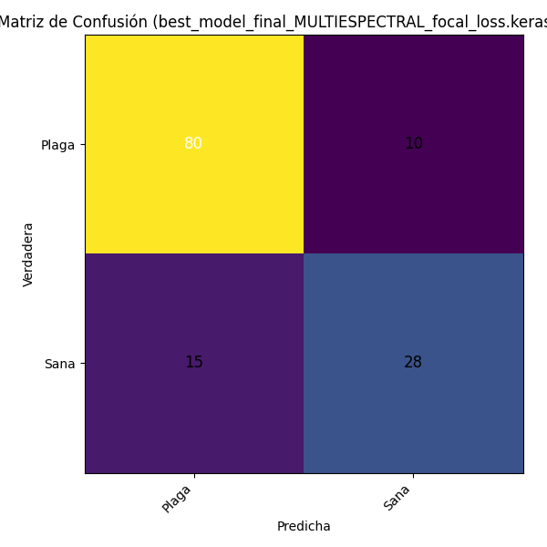

# Matriz de confusión

- **Fecha:** 2026-03-25 11:59:29
- **Modelo:** report_best_model_final_MULTIESPECTRAL_focal_loss.keras_20260325_1159_t70_confusion.md
```text
[[80 10]
 [15 28]]
```


*Generado automáticamente por el sistema de detección de plagas.*

## CNN MULTIESPECTRAL BINARY CROSS ENTROPY
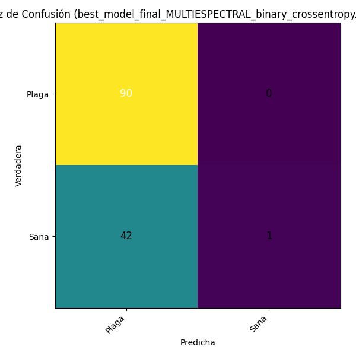

### 1 UMBRAL 0.45
#### 1.1 Comando:

````bash
python src\pest_detection_models\evaluate.py data\multiespectral\TTADDA-dataset\TTADDA_NARO_2023_F1\drone_data -m src\pest_detection_models\best_models\best_model_final_MULTIESPECTRAL_binary_crossentropy.keras -t 0.45 -mt cnn
````

#### 1.2 Consola:

````bash
2026-03-25 11:36:24.426733: I tensorflow/core/util/port.cc:153] oneDNN custom operations are on. You may see slightly different numerical results due to floating-point round-off errors from different computation orders. To turn them off, set the environment variable `TF_ENABLE_ONEDNN_OPTS=0`.
2026-03-25 11:36:25.880040: I tensorflow/core/util/port.cc:153] oneDNN custom operations are on. You may see slightly different numerical results due to floating-point round-off errors from different computation orders. To turn them off, set the environment variable `TF_ENABLE_ONEDNN_OPTS=0`.

--- [Fecha/hora inicio=20260325_1136] ---

--- [T=0.00s] ---
init. Evaluando CNN MULTIESPECTRAL - Loss: binary_crossentropy - Threshold: 0.45

--- [Fecha/hora inicio=20260325_1136] ---

--- [T=0.00s] ---
1. Cargando datos...

--- [Fecha/hora inicio=20260325_1136] ---

--- [T=0.00s] ---
1. Ejecutando extracción y split de datos (extract_data_to_img_for_train)

--- [Fecha/hora inicio=20260325_1136] ---

--- [T=0.00s] ---
1. Carga de datos cnn Multiespectral

--- [Fecha/hora inicio=20260325_1136] ---

--- [T=0.04s] ---
2. Filtrado y extracción de datos

--- [Fecha/hora inicio=20260325_1136] ---

--- [T=0.04s] ---
2.1. Iniciando procesamiento de 665 imágenes etiquetadas...

--- [Fecha/hora inicio=20260325_1136] ---

--- [T=0.04s] ---
2.2. Archivos seleccionados: ['red.tif', 'red edge.tif', 'nir.tif', 'blue.tif', 'green.tif']

--- [Fecha/hora inicio=20260325_1136] ---

--- [T=54.40s] ---
7. Extracción de imágenes completada.

Datos listos para entrenamiento. Total de muestras: 665

Resumen de Datos Multiespectrales:
Total de parches extraídos: 665
X Train/Val Split: 532 / 133
Y Train/Val Split: 532 / 133
Forma X_train: (532, 224, 224, 5)
Forma Y_train: (532,)

--- [Fecha/hora inicio=20260325_1136] ---

--- [T=54.77s] ---
1.1. Clases detectadas: 0: Plaga, 1: Sana

--- [Fecha/hora inicio=20260325_1136] ---

--- [T=54.77s] ---
2. Calculando pesos de clase (Estrategia: Class Weighting)

--- [Fecha/hora inicio=20260325_1136] ---

--- [T=54.77s] ---
2.1. Pesos de Clase Calculados (train_counts): {np.int64(0): np.float64(0.7388888888888889), np.int64(1): np.float64(1.5465116279069768)}

--- [Fecha/hora inicio=20260325_1136] ---

--- [T=54.80s] ---
2. Cargando modelo...

--- [Fecha/hora inicio=20260325_1136] ---

--- [T=54.85s] ---
1. ⏳ Cargando modelo desde: src\pest_detection_models\best_models\best_model_final_MULTIESPECTRAL_binary_crossentropy.keras
2026-03-25 11:37:21.897698: I tensorflow/core/platform/cpu_feature_guard.cc:210] This TensorFlow binary is optimized to use available CPU instructions in performance-critical operations.
To enable the following instructions: SSE3 SSE4.1 SSE4.2 AVX AVX2 AVX_VNNI FMA, in other operations, rebuild TensorFlow with the appropriate compiler flags.

--- [Fecha/hora inicio=20260325_1136] ---

--- [T=54.97s] ---
2. ✅ Modelo Keras cargado exitosamente desde src\pest_detection_models\best_models\best_model_final_MULTIESPECTRAL_binary_crossentropy.keras

--- [Fecha/hora inicio=20260325_1136] ---

--- [T=54.93s] ---
3. Prediciendo...

--- [Fecha/hora inicio=20260325_1136] ---

--- [T=55.05s] ---
1. Iniciando predicción del modelo CNN...
5/5 ━━━━━━━━━━━━━━━━━━━━ 1s 169ms/step

--- [Fecha/hora inicio=20260325_1136] ---

--- [T=56.03s] ---
4. Generando métricas...

✅ Reporte de Clasificación guardado en: C:\workspace\hd-image-pest-detection-cnn-and-rf\src\pest_detection_models\evaluation_results/CNN/MULTIESPECTRAL/binary_crossentropy/0.45\report_best_model_final_MULTIESPECTRAL_binary_crossentropy.keras_20260325_1137_t45.json
✅ Matriz de Confusión guardada en: C:\workspace\hd-image-pest-detection-cnn-and-rf\src\pest_detection_models\evaluation_results/CNN/MULTIESPECTRAL/binary_crossentropy/0.45\report_best_model_final_MULTIESPECTRAL_binary_crossentropy.keras_20260325_1137_t45_confusion.png
Matriz de confusión:
[[90  0]
 [42  1]]

--- RESUMEN DEL REPORTE DE CLASIFICACIÓN ---
              precision    recall  f1-score   support

       Plaga       0.68      1.00      0.81        90
        Sana       1.00      0.02      0.05        43

    accuracy                           0.68       133
   macro avg       0.84      0.51      0.43       133
weighted avg       0.78      0.68      0.56       133

✅ Reporte Markdown (Tabla) guardado en: C:\workspace\hd-image-pest-detection-cnn-and-rf\src\pest_detection_models\evaluation_results/CNN/MULTIESPECTRAL/binary_crossentropy/0.45\report_table_best_model_final_MULTIESPECTRAL_binary_crossentropy.keras_20260325_1137_t45.md
✅ Curva ROC guardada en: C:\workspace\hd-image-pest-detection-cnn-and-rf\src\pest_detection_models\evaluation_results/CNN/MULTIESPECTRAL/binary_crossentropy/0.45\ROC_best_model_final_MULTIESPECTRAL_binary_crossentropy.keras_20260325_1151_t0.45.png
ROC guardada en C:\workspace\hd-image-pest-detection-cnn-and-rf\src\pest_detection_models\evaluation_results/CNN/MULTIESPECTRAL/binary_crossentropy/0.45\ROC_data_best_model_final_MULTIESPECTRAL_binary_crossentropy.keras_20260325_1151_t0.45.npz (AUC=0.8780)
````

#### 1.3 Resultados:
##### 1.3.1 Reporte de clasificación json:

````json
{
    "Plaga": {
        "precision": 0.6818181818181818,
        "recall": 1.0,
        "f1-score": 0.8108108108108109,
        "support": 90.0
    },
    "Sana": {
        "precision": 1.0,
        "recall": 0.023255813953488372,
        "f1-score": 0.045454545454545456,
        "support": 43.0
    },
    "accuracy": 0.6842105263157895,
    "macro avg": {
        "precision": 0.8409090909090908,
        "recall": 0.5116279069767442,
        "f1-score": 0.42813267813267813,
        "support": 133.0
    },
    "weighted avg": {
        "precision": 0.784688995215311,
        "recall": 0.6842105263157895,
        "f1-score": 0.5633648002069055,
        "support": 133.0
    }
}
````

##### 1.3.2 Reporte de clasificación tabla
# Reporte de Clasificación - best_model_final_MULTIESPECTRAL_binary_crossentropy.keras

- **Fecha:** 2026-03-25 11:51:26
- **Modelo:** best_model_final_MULTIESPECTRAL_binary_crossentropy.keras
- **Umbral de decisión:** 0.45

## Métricas por Clase

```text
              precision    recall  f1-score   support

       Plaga       0.68      1.00      0.81        90
        Sana       1.00      0.02      0.05        43

    accuracy                           0.68       133
   macro avg       0.84      0.51      0.43       133
weighted avg       0.78      0.68      0.56       133

```


*Generado automáticamente por el sistema de detección de plagas.*

##### 1.3.3 Matriz de confusión


# Matriz de confusión

- **Fecha:** 2026-03-25 11:51:26
- **Modelo:** report_best_model_final_MULTIESPECTRAL_binary_crossentropy.keras_20260325_1137_t45_confusion.md
```text
[[90  0]
 [42  1]]
```


*Generado automáticamente por el sistema de detección de plagas.*

### 2 UMBRAL 0.50
#### 2.1 Comando:

````bash
python src\pest_detection_models\evaluate.py data\multiespectral\TTADDA-dataset\TTADDA_NARO_2023_F1\drone_data -m src\pest_detection_models\best_models\best_model_final_MULTIESPECTRAL_binary_crossentropy.keras -t 0.50 -mt cnn
````

#### 2.2 Consola:

````bash
2026-03-25 11:51:41.194668: I tensorflow/core/util/port.cc:153] oneDNN custom operations are on. You may see slightly different numerical results due to floating-point round-off errors from different computation orders. To turn them off, set the environment variable `TF_ENABLE_ONEDNN_OPTS=0`.
2026-03-25 11:51:42.698857: I tensorflow/core/util/port.cc:153] oneDNN custom operations are on. You may see slightly different numerical results due to floating-point round-off errors from different computation orders. To turn them off, set the environment variable `TF_ENABLE_ONEDNN_OPTS=0`.

--- [Fecha/hora inicio=20260325_1151] ---

--- [T=0.00s] ---
init. Evaluando CNN MULTIESPECTRAL - Loss: binary_crossentropy - Threshold: 0.5

--- [Fecha/hora inicio=20260325_1151] ---

--- [T=0.00s] ---
1. Cargando datos...

--- [Fecha/hora inicio=20260325_1151] ---

--- [T=0.00s] ---
1. Ejecutando extracción y split de datos (extract_data_to_img_for_train)

--- [Fecha/hora inicio=20260325_1151] ---

--- [T=0.00s] ---
1. Carga de datos cnn Multiespectral

--- [Fecha/hora inicio=20260325_1151] ---

--- [T=0.03s] ---
2. Filtrado y extracción de datos

--- [Fecha/hora inicio=20260325_1151] ---

--- [T=0.03s] ---
2.1. Iniciando procesamiento de 665 imágenes etiquetadas...

--- [Fecha/hora inicio=20260325_1151] ---

--- [T=0.03s] ---
2.2. Archivos seleccionados: ['red.tif', 'red edge.tif', 'nir.tif', 'blue.tif', 'green.tif']

--- [Fecha/hora inicio=20260325_1151] ---

--- [T=55.53s] ---
7. Extracción de imágenes completada.

Datos listos para entrenamiento. Total de muestras: 665

Resumen de Datos Multiespectrales:
Total de parches extraídos: 665
X Train/Val Split: 532 / 133
Y Train/Val Split: 532 / 133
Forma X_train: (532, 224, 224, 5)
Forma Y_train: (532,)

--- [Fecha/hora inicio=20260325_1151] ---

--- [T=55.99s] ---
1.1. Clases detectadas: 0: Plaga, 1: Sana

--- [Fecha/hora inicio=20260325_1151] ---

--- [T=55.99s] ---
2. Calculando pesos de clase (Estrategia: Class Weighting)

--- [Fecha/hora inicio=20260325_1151] ---

--- [T=55.99s] ---
2.1. Pesos de Clase Calculados (train_counts): {np.int64(0): np.float64(0.7388888888888889), np.int64(1): np.float64(1.5465116279069768)}

--- [Fecha/hora inicio=20260325_1151] ---

--- [T=56.03s] ---
2. Cargando modelo...

--- [Fecha/hora inicio=20260325_1151] ---

--- [T=56.08s] ---
1. ⏳ Cargando modelo desde: src\pest_detection_models\best_models\best_model_final_MULTIESPECTRAL_binary_crossentropy.keras
2026-03-25 11:52:39.938573: I tensorflow/core/platform/cpu_feature_guard.cc:210] This TensorFlow binary is optimized to use available CPU instructions in performance-critical operations.
To enable the following instructions: SSE3 SSE4.1 SSE4.2 AVX AVX2 AVX_VNNI FMA, in other operations, rebuild TensorFlow with the appropriate compiler flags.

--- [Fecha/hora inicio=20260325_1151] ---

--- [T=56.20s] ---
2. ✅ Modelo Keras cargado exitosamente desde src\pest_detection_models\best_models\best_model_final_MULTIESPECTRAL_binary_crossentropy.keras

--- [Fecha/hora inicio=20260325_1151] ---

--- [T=56.15s] ---
3. Prediciendo...

--- [Fecha/hora inicio=20260325_1151] ---

--- [T=56.28s] ---
1. Iniciando predicción del modelo CNN...
5/5 ━━━━━━━━━━━━━━━━━━━━ 1s 171ms/step

--- [Fecha/hora inicio=20260325_1151] ---

--- [T=57.24s] ---
4. Generando métricas...

✅ Reporte de Clasificación guardado en: C:\workspace\hd-image-pest-detection-cnn-and-rf\src\pest_detection_models\evaluation_results/CNN/MULTIESPECTRAL/binary_crossentropy/0.5\report_best_model_final_MULTIESPECTRAL_binary_crossentropy.keras_20260325_1152_t50.json
✅ Matriz de Confusión guardada en: C:\workspace\hd-image-pest-detection-cnn-and-rf\src\pest_detection_models\evaluation_results/CNN/MULTIESPECTRAL/binary_crossentropy/0.5\report_best_model_final_MULTIESPECTRAL_binary_crossentropy.keras_20260325_1152_t50_confusion.png
Matriz de confusión:
[[90  0]
 [42  1]]

--- RESUMEN DEL REPORTE DE CLASIFICACIÓN ---
              precision    recall  f1-score   support

       Plaga       0.68      1.00      0.81        90
        Sana       1.00      0.02      0.05        43

    accuracy                           0.68       133
   macro avg       0.84      0.51      0.43       133
weighted avg       0.78      0.68      0.56       133

✅ Reporte Markdown (Tabla) guardado en: C:\workspace\hd-image-pest-detection-cnn-and-rf\src\pest_detection_models\evaluation_results/CNN/MULTIESPECTRAL/binary_crossentropy/0.5\report_table_best_model_final_MULTIESPECTRAL_binary_crossentropy.keras_20260325_1152_t50.md
✅ Curva ROC guardada en: C:\workspace\hd-image-pest-detection-cnn-and-rf\src\pest_detection_models\evaluation_results/CNN/MULTIESPECTRAL/binary_crossentropy/0.5\ROC_best_model_final_MULTIESPECTRAL_binary_crossentropy.keras_20260325_1152_t0.5.png
ROC guardada en C:\workspace\hd-image-pest-detection-cnn-and-rf\src\pest_detection_models\evaluation_results/CNN/MULTIESPECTRAL/binary_crossentropy/0.5\ROC_data_best_model_final_MULTIESPECTRAL_binary_crossentropy.keras_20260325_1152_t0.5.npz (AUC=0.8780)
````

#### 2.3 Resultados:
##### 2.3.1 Reporte de clasificación json:

````json
{
    "Plaga": {
        "precision": 0.6818181818181818,
        "recall": 1.0,
        "f1-score": 0.8108108108108109,
        "support": 90.0
    },
    "Sana": {
        "precision": 1.0,
        "recall": 0.023255813953488372,
        "f1-score": 0.045454545454545456,
        "support": 43.0
    },
    "accuracy": 0.6842105263157895,
    "macro avg": {
        "precision": 0.8409090909090908,
        "recall": 0.5116279069767442,
        "f1-score": 0.42813267813267813,
        "support": 133.0
    },
    "weighted avg": {
        "precision": 0.784688995215311,
        "recall": 0.6842105263157895,
        "f1-score": 0.5633648002069055,
        "support": 133.0
    }
}
````

##### 2.3.2 Reporte de clasificación tabla
# Reporte de Clasificación - best_model_final_MULTIESPECTRAL_binary_crossentropy.keras

- **Fecha:** 2026-03-25 11:52:49
- **Modelo:** best_model_final_MULTIESPECTRAL_binary_crossentropy.keras
- **Umbral de decisión:** 0.5

## Métricas por Clase

```text
              precision    recall  f1-score   support

       Plaga       0.68      1.00      0.81        90
        Sana       1.00      0.02      0.05        43

    accuracy                           0.68       133
   macro avg       0.84      0.51      0.43       133
weighted avg       0.78      0.68      0.56       133

```


*Generado automáticamente por el sistema de detección de plagas.*

##### 2.3.3 Matriz de confusión


# Matriz de confusión

- **Fecha:** 2026-03-25 11:52:49
- **Modelo:** report_best_model_final_MULTIESPECTRAL_binary_crossentropy.keras_20260325_1152_t50_confusion.md
```text
[[90  0]
 [42  1]]
```


*Generado automáticamente por el sistema de detección de plagas.*

### 3 UMBRAL 0.70
#### 3.1 Comando:

````bash
python src\pest_detection_models\evaluate.py data\multiespectral\TTADDA-dataset\TTADDA_NARO_2023_F1\drone_data -m src\pest_detection_models\best_models\best_model_final_MULTIESPECTRAL_binary_crossentropy.keras -t 0.70 -mt cnn
````

#### 3.2 Consola:

````bash
2026-03-25 11:53:12.165117: I tensorflow/core/util/port.cc:153] oneDNN custom operations are on. You may see slightly different numerical results due to floating-point round-off errors from different computation orders. To turn them off, set the environment variable `TF_ENABLE_ONEDNN_OPTS=0`.
2026-03-25 11:53:13.643264: I tensorflow/core/util/port.cc:153] oneDNN custom operations are on. You may see slightly different numerical results due to floating-point round-off errors from different computation orders. To turn them off, set the environment variable `TF_ENABLE_ONEDNN_OPTS=0`.

--- [Fecha/hora inicio=20260325_1153] ---

--- [T=0.00s] ---
init. Evaluando CNN MULTIESPECTRAL - Loss: binary_crossentropy - Threshold: 0.7

--- [Fecha/hora inicio=20260325_1153] ---

--- [T=0.00s] ---
1. Cargando datos...

--- [Fecha/hora inicio=20260325_1153] ---

--- [T=0.00s] ---
1. Ejecutando extracción y split de datos (extract_data_to_img_for_train)

--- [Fecha/hora inicio=20260325_1153] ---

--- [T=0.00s] ---
1. Carga de datos cnn Multiespectral

--- [Fecha/hora inicio=20260325_1153] ---

--- [T=0.04s] ---
2. Filtrado y extracción de datos

--- [Fecha/hora inicio=20260325_1153] ---

--- [T=0.04s] ---
2.1. Iniciando procesamiento de 665 imágenes etiquetadas...

--- [Fecha/hora inicio=20260325_1153] ---

--- [T=0.04s] ---
2.2. Archivos seleccionados: ['red.tif', 'red edge.tif', 'nir.tif', 'blue.tif', 'green.tif']

--- [Fecha/hora inicio=20260325_1153] ---

--- [T=55.29s] ---
7. Extracción de imágenes completada.

Datos listos para entrenamiento. Total de muestras: 665

Resumen de Datos Multiespectrales:
Total de parches extraídos: 665
X Train/Val Split: 532 / 133
Y Train/Val Split: 532 / 133
Forma X_train: (532, 224, 224, 5)
Forma Y_train: (532,)

--- [Fecha/hora inicio=20260325_1153] ---

--- [T=55.63s] ---
1.1. Clases detectadas: 0: Plaga, 1: Sana

--- [Fecha/hora inicio=20260325_1153] ---

--- [T=55.63s] ---
2. Calculando pesos de clase (Estrategia: Class Weighting)

--- [Fecha/hora inicio=20260325_1153] ---

--- [T=55.64s] ---
2.1. Pesos de Clase Calculados (train_counts): {np.int64(0): np.float64(0.7388888888888889), np.int64(1): np.float64(1.5465116279069768)}

--- [Fecha/hora inicio=20260325_1153] ---

--- [T=55.67s] ---
2. Cargando modelo...

--- [Fecha/hora inicio=20260325_1153] ---

--- [T=55.73s] ---
1. ⏳ Cargando modelo desde: src\pest_detection_models\best_models\best_model_final_MULTIESPECTRAL_binary_crossentropy.keras
2026-03-25 11:54:10.608838: I tensorflow/core/platform/cpu_feature_guard.cc:210] This TensorFlow binary is optimized to use available CPU instructions in performance-critical operations.
To enable the following instructions: SSE3 SSE4.1 SSE4.2 AVX AVX2 AVX_VNNI FMA, in other operations, rebuild TensorFlow with the appropriate compiler flags.

--- [Fecha/hora inicio=20260325_1153] ---

--- [T=55.85s] ---
2. ✅ Modelo Keras cargado exitosamente desde src\pest_detection_models\best_models\best_model_final_MULTIESPECTRAL_binary_crossentropy.keras

--- [Fecha/hora inicio=20260325_1153] ---

--- [T=55.79s] ---
3. Prediciendo...

--- [Fecha/hora inicio=20260325_1153] ---

--- [T=55.95s] ---
1. Iniciando predicción del modelo CNN...
5/5 ━━━━━━━━━━━━━━━━━━━━ 1s 174ms/step

--- [Fecha/hora inicio=20260325_1153] ---

--- [T=56.91s] ---
4. Generando métricas...

✅ Reporte de Clasificación guardado en: C:\workspace\hd-image-pest-detection-cnn-and-rf\src\pest_detection_models\evaluation_results/CNN/MULTIESPECTRAL/binary_crossentropy/0.7\report_best_model_final_MULTIESPECTRAL_binary_crossentropy.keras_20260325_1154_t70.json
✅ Matriz de Confusión guardada en: C:\workspace\hd-image-pest-detection-cnn-and-rf\src\pest_detection_models\evaluation_results/CNN/MULTIESPECTRAL/binary_crossentropy/0.7\report_best_model_final_MULTIESPECTRAL_binary_crossentropy.keras_20260325_1154_t70_confusion.png
Matriz de confusión:
[[90  0]
 [43  0]]

--- RESUMEN DEL REPORTE DE CLASIFICACIÓN ---
              precision    recall  f1-score   support

       Plaga       0.68      1.00      0.81        90
        Sana       0.00      0.00      0.00        43

    accuracy                           0.68       133
   macro avg       0.34      0.50      0.40       133
weighted avg       0.46      0.68      0.55       133

✅ Reporte Markdown (Tabla) guardado en: C:\workspace\hd-image-pest-detection-cnn-and-rf\src\pest_detection_models\evaluation_results/CNN/MULTIESPECTRAL/binary_crossentropy/0.7\report_table_best_model_final_MULTIESPECTRAL_binary_crossentropy.keras_20260325_1154_t70.md
✅ Curva ROC guardada en: C:\workspace\hd-image-pest-detection-cnn-and-rf\src\pest_detection_models\evaluation_results/CNN/MULTIESPECTRAL/binary_crossentropy/0.7\ROC_best_model_final_MULTIESPECTRAL_binary_crossentropy.keras_20260325_1154_t0.7.png
ROC guardada en C:\workspace\hd-image-pest-detection-cnn-and-rf\src\pest_detection_models\evaluation_results/CNN/MULTIESPECTRAL/binary_crossentropy/0.7\ROC_data_best_model_final_MULTIESPECTRAL_binary_crossentropy.keras_20260325_1154_t0.7.npz (AUC=0.8780)
````

#### 3.3 Resultados:
##### 3.3.1 Reporte de clasificación json:

````json
{
    "Plaga": {
        "precision": 0.6766917293233082,
        "recall": 1.0,
        "f1-score": 0.8071748878923767,
        "support": 90.0
    },
    "Sana": {
        "precision": 0.0,
        "recall": 0.0,
        "f1-score": 0.0,
        "support": 43.0
    },
    "accuracy": 0.6766917293233082,
    "macro avg": {
        "precision": 0.3383458646616541,
        "recall": 0.5,
        "f1-score": 0.40358744394618834,
        "support": 133.0
    },
    "weighted avg": {
        "precision": 0.4579116965345695,
        "recall": 0.6766917293233082,
        "f1-score": 0.5462085707542399,
        "support": 133.0
    }
}
````

##### 3.3.2 Reporte de clasificación tabla
# Reporte de Clasificación - best_model_final_MULTIESPECTRAL_binary_crossentropy.keras

- **Fecha:** 2026-03-25 11:54:15
- **Modelo:** best_model_final_MULTIESPECTRAL_binary_crossentropy.keras
- **Umbral de decisión:** 0.7

## Métricas por Clase

```text
              precision    recall  f1-score   support

       Plaga       0.68      1.00      0.81        90
        Sana       0.00      0.00      0.00        43

    accuracy                           0.68       133
   macro avg       0.34      0.50      0.40       133
weighted avg       0.46      0.68      0.55       133

```


*Generado automáticamente por el sistema de detección de plagas.*

##### 3.3.3 Matriz de confusión

# Matriz de confusión


- **Fecha:** 2026-03-25 11:54:15
- **Modelo:** report_best_model_final_MULTIESPECTRAL_binary_crossentropy.keras_20260325_1154_t70_confusion.md
```text
[[90  0]
 [43  0]]
```


*Generado automáticamente por el sistema de detección de plagas.*

## CNN RGB FOCAL LOSS
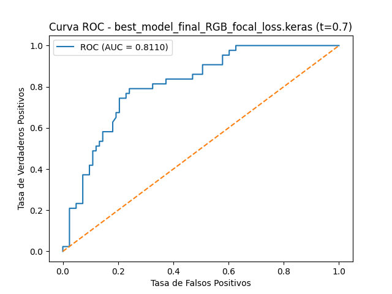

### 1 UMBRAL 0.4
#### 1.1 Comando:

````bash
python src\pest_detection_models\evaluate.py data\multiespectral\TTADDA-dataset\TTADDA_NARO_2023_F1\drone_data -m src\pest_detection_models\best_models\best_model_final_RGB_focal_loss.keras -t 0.45 -mt cnn
````

#### 1.2 Consola:

````bash
2026-03-25 14:25:08.962150: I tensorflow/core/util/port.cc:153] oneDNN custom operations are on. You may see slightly different numerical results due to floating-point round-off errors from different computation orders. To turn them off, set the environment variable `TF_ENABLE_ONEDNN_OPTS=0`.
2026-03-25 14:25:10.199941: I tensorflow/core/util/port.cc:153] oneDNN custom operations are on. You may see slightly different numerical results due to floating-point round-off errors from different computation orders. To turn them off, set the environment variable `TF_ENABLE_ONEDNN_OPTS=0`.

--- [Fecha/hora inicio=20260325_1425] ---

--- [T=0.00s] ---
init. Evaluando CNN RGB - Loss: focal_loss - Threshold: 0.45

--- [Fecha/hora inicio=20260325_1425] ---

--- [T=0.00s] ---
1. Extrayendo datos (MISMO pipeline que training)...

--- [Fecha/hora inicio=20260325_1425] ---

--- [T=0.00s] ---
1. Carga de datos cnn RGB

--- [Fecha/hora inicio=20260325_1425] ---

--- [T=0.03s] ---
2. Filtrado y extracción de datos

--- [Fecha/hora inicio=20260325_1425] ---

--- [T=0.03s] ---
2.1. Iniciando procesamiento de 665 imágenes etiquetadas...

--- [Fecha/hora inicio=20260325_1425] ---

--- [T=0.03s] ---
2.2. Archivos seleccionados: ['RGB.tif']
Imagen inválida: 4 canales (esperado 3)
Imagen inválida: 4 canales (esperado 3)
Imagen inválida: 4 canales (esperado 3)
Imagen inválida: 4 canales (esperado 3)
Imagen inválida: 4 canales (esperado 3)
Imagen inválida: 4 canales (esperado 3)
Imagen inválida: 4 canales (esperado 3)
Imagen inválida: 4 canales (esperado 3)
Imagen inválida: 4 canales (esperado 3)
Imagen inválida: 4 canales (esperado 3)
Imagen inválida: 4 canales (esperado 3)
Imagen inválida: 4 canales (esperado 3)
Imagen inválida: 4 canales (esperado 3)
Imagen inválida: 4 canales (esperado 3)
Imagen inválida: 4 canales (esperado 3)
Imagen inválida: 4 canales (esperado 3)
Imagen inválida: 4 canales (esperado 3)
Imagen inválida: 4 canales (esperado 3)
Imagen inválida: 4 canales (esperado 3)
Imagen inválida: 4 canales (esperado 3)
Imagen inválida: 4 canales (esperado 3)
Imagen inválida: 4 canales (esperado 3)
Imagen inválida: 4 canales (esperado 3)
Imagen inválida: 4 canales (esperado 3)
Imagen inválida: 4 canales (esperado 3)
Imagen inválida: 4 canales (esperado 3)
Imagen inválida: 4 canales (esperado 3)
Imagen inválida: 4 canales (esperado 3)
Imagen inválida: 4 canales (esperado 3)
Imagen inválida: 4 canales (esperado 3)
Imagen inválida: 4 canales (esperado 3)
Imagen inválida: 4 canales (esperado 3)
Imagen inválida: 4 canales (esperado 3)
Imagen inválida: 4 canales (esperado 3)
Imagen inválida: 4 canales (esperado 3)

--- [Fecha/hora inicio=20260325_1425] ---

--- [T=29.28s] ---
7. Extracción de imágenes completada.

Datos listos para entrenamiento. Total de muestras: 630

Resumen de Datos Multiespectrales:
Total de parches extraídos: 630
X Train/Val Split: 504 / 126
Y Train/Val Split: 504 / 126
Forma X_train: (504, 224, 224, 3)
Forma Y_train: (504,)
Distribución y_val: {np.int64(0): np.int64(83), np.int64(1): np.int64(43)}

--- [Fecha/hora inicio=20260325_1425] ---

--- [T=27.90s] ---
2. Cargando modelo...

--- [Fecha/hora inicio=20260325_1425] ---

--- [T=27.95s] ---
1. ⏳ Cargando modelo desde: src\pest_detection_models\best_models\best_model_final_RGB_focal_loss.keras
2026-03-25 14:25:38.524889: I tensorflow/core/platform/cpu_feature_guard.cc:210] This TensorFlow binary is optimized to use available CPU instructions in performance-critical operations.
To enable the following instructions: SSE3 SSE4.1 SSE4.2 AVX AVX2 AVX_VNNI FMA, in other operations, rebuild TensorFlow with the appropriate compiler flags.

--- [Fecha/hora inicio=20260325_1425] ---

--- [T=28.07s] ---
2. ✅ Modelo Keras cargado exitosamente desde src\pest_detection_models\best_models\best_model_final_RGB_focal_loss.keras

--- [Fecha/hora inicio=20260325_1425] ---

--- [T=28.02s] ---
3. Prediciendo...
4/4 ━━━━━━━━━━━━━━━━━━━━ 1s 217ms/step

--- DEBUG PROBABILIDADES ---
MIN: 0.5013404
MAX: 0.50146043
MEAN: 0.50139904
PERCENTILES: [0.50134039 0.50136393 0.50139499 0.50143668 0.50146043]
X_val stats:
MIN: 0.0
MAX: 1.0
MEAN: 0.21663862
STD: 3.75954e-05

--- [Fecha/hora inicio=20260325_1425] ---

--- [T=29.11s] ---
4. Generando métricas...

✅ Reporte de Clasificación guardado en: C:\workspace\hd-image-pest-detection-cnn-and-rf\src\pest_detection_models\evaluation_results/CNN/RGB/focal_loss/0.45\report_best_model_final_RGB_focal_loss.keras_20260325_1425_t45.json
✅ Matriz de Confusión guardada en: C:\workspace\hd-image-pest-detection-cnn-and-rf\src\pest_detection_models\evaluation_results/CNN/RGB/focal_loss/0.45\report_best_model_final_RGB_focal_loss.keras_20260325_1425_t45_confusion.png
Matriz de confusión:
[[ 0 83]
 [ 0 43]]

--- RESUMEN DEL REPORTE DE CLASIFICACIÓN ---
              precision    recall  f1-score   support

       Plaga       0.00      0.00      0.00        83
        Sana       0.34      1.00      0.51        43

    accuracy                           0.34       126
   macro avg       0.17      0.50      0.25       126
weighted avg       0.12      0.34      0.17       126

✅ Reporte Markdown (Tabla) guardado en: C:\workspace\hd-image-pest-detection-cnn-and-rf\src\pest_detection_models\evaluation_results/CNN/RGB/focal_loss/0.45\report_table_best_model_final_RGB_focal_loss.keras_20260325_1425_t45.md
✅ Curva ROC guardada en: C:\workspace\hd-image-pest-detection-cnn-and-rf\src\pest_detection_models\evaluation_results/CNN/RGB/focal_loss/0.45\ROC_best_model_final_RGB_focal_loss.keras_20260325_1426_t0.45.png
ROC guardada en C:\workspace\hd-image-pest-detection-cnn-and-rf\src\pest_detection_models\evaluation_results/CNN/RGB/focal_loss/0.45\ROC_data_best_model_final_RGB_focal_loss.keras_20260325_1426_t0.45.npz (AUC=0.8110)
````

#### 1.3 Resultados:
##### 1.3.1 Reporte de clasificación json:

````json
{
    "Plaga": {
        "precision": 0.0,
        "recall": 0.0,
        "f1-score": 0.0,
        "support": 83.0
    },
    "Sana": {
        "precision": 0.3412698412698413,
        "recall": 1.0,
        "f1-score": 0.5088757396449705,
        "support": 43.0
    },
    "accuracy": 0.3412698412698413,
    "macro avg": {
        "precision": 0.17063492063492064,
        "recall": 0.5,
        "f1-score": 0.25443786982248523,
        "support": 126.0
    },
    "weighted avg": {
        "precision": 0.11646510456034266,
        "recall": 0.3412698412698413,
        "f1-score": 0.17366394289471215,
        "support": 126.0
    }
}
````

##### 1.3.2 Reporte de clasificación tabla
# Reporte de Clasificación - best_model_final_RGB_focal_loss.keras

- **Fecha:** 2026-03-25 14:29:54
- **Modelo:** best_model_final_RGB_focal_loss.keras
- **Umbral de decisión:** 0.45

## Métricas por Clase

```text
              precision    recall  f1-score   support

       Plaga       0.00      0.00      0.00        83
        Sana       0.34      1.00      0.51        43

    accuracy                           0.34       126
   macro avg       0.17      0.50      0.25       126
weighted avg       0.12      0.34      0.17       126

```


*Generado automáticamente por el sistema de detección de plagas.*

##### 1.3.3 Matriz de confusión


# Matriz de confusión

- **Fecha:** 2026-03-25 14:29:54
- **Modelo:** report_best_model_final_RGB_focal_loss.keras_20260325_1429_t45_confusion.md
```text
[[ 0 83]
 [ 0 43]]
```


*Generado automáticamente por el sistema de detección de plagas.*

### 2 UMBRAL 0.5214
#### 2.1 Comando:

````bash
python src\pest_detection_models\evaluate.py data\multiespectral\TTADDA-dataset\TTADDA_NARO_2023_F1\drone_data -m src\pest_detection_models\best_models\best_model_final_RGB_focal_loss.keras -t 0.5214 -mt cnn
````

#### 2.2 Consola:

````bash
2026-03-25 14:40:57.244616: I tensorflow/core/util/port.cc:153] oneDNN custom operations are on. You may see slightly different numerical results due to floating-point round-off errors from different computation orders. To turn them off, set the environment variable `TF_ENABLE_ONEDNN_OPTS=0`.
2026-03-25 14:40:58.908067: I tensorflow/core/util/port.cc:153] oneDNN custom operations are on. You may see slightly different numerical results due to floating-point round-off errors from different computation orders. To turn them off, set the environment variable `TF_ENABLE_ONEDNN_OPTS=0`.

--- [Fecha/hora inicio=20260325_1440] ---

--- [T=0.00s] ---
init. Evaluando CNN RGB - Loss: focal_loss - Threshold: 0.5214

--- [Fecha/hora inicio=20260325_1440] ---

--- [T=0.00s] ---
1. Extrayendo datos (MISMO pipeline que training)...

--- [Fecha/hora inicio=20260325_1440] ---

--- [T=0.00s] ---
1. Carga de datos cnn RGB

--- [Fecha/hora inicio=20260325_1440] ---

--- [T=0.08s] ---
2. Filtrado y extracción de datos

--- [Fecha/hora inicio=20260325_1440] ---

--- [T=0.08s] ---
2.1. Iniciando procesamiento de 665 imágenes etiquetadas...

--- [Fecha/hora inicio=20260325_1440] ---

--- [T=0.08s] ---
2.2. Archivos seleccionados: ['RGB.tif']
Imagen inválida: 4 canales (esperado 3)
Imagen inválida: 4 canales (esperado 3)
Imagen inválida: 4 canales (esperado 3)
Imagen inválida: 4 canales (esperado 3)
Imagen inválida: 4 canales (esperado 3)
Imagen inválida: 4 canales (esperado 3)
Imagen inválida: 4 canales (esperado 3)
Imagen inválida: 4 canales (esperado 3)
Imagen inválida: 4 canales (esperado 3)
Imagen inválida: 4 canales (esperado 3)
Imagen inválida: 4 canales (esperado 3)
Imagen inválida: 4 canales (esperado 3)
Imagen inválida: 4 canales (esperado 3)
Imagen inválida: 4 canales (esperado 3)
Imagen inválida: 4 canales (esperado 3)
Imagen inválida: 4 canales (esperado 3)
Imagen inválida: 4 canales (esperado 3)
Imagen inválida: 4 canales (esperado 3)
Imagen inválida: 4 canales (esperado 3)
Imagen inválida: 4 canales (esperado 3)
Imagen inválida: 4 canales (esperado 3)
Imagen inválida: 4 canales (esperado 3)
Imagen inválida: 4 canales (esperado 3)
Imagen inválida: 4 canales (esperado 3)
Imagen inválida: 4 canales (esperado 3)
Imagen inválida: 4 canales (esperado 3)
Imagen inválida: 4 canales (esperado 3)
Imagen inválida: 4 canales (esperado 3)
Imagen inválida: 4 canales (esperado 3)
Imagen inválida: 4 canales (esperado 3)
Imagen inválida: 4 canales (esperado 3)
Imagen inválida: 4 canales (esperado 3)
Imagen inválida: 4 canales (esperado 3)
Imagen inválida: 4 canales (esperado 3)
Imagen inválida: 4 canales (esperado 3)

--- [Fecha/hora inicio=20260325_1440] ---

--- [T=40.11s] ---
7. Extracción de imágenes completada.

Datos listos para entrenamiento. Total de muestras: 630

Resumen de Datos Multiespectrales:
Total de parches extraídos: 630
X Train/Val Split: 504 / 126
Y Train/Val Split: 504 / 126
Forma X_train: (504, 224, 224, 3)
Forma Y_train: (504,)
Distribución y_val: {np.int64(0): np.int64(83), np.int64(1): np.int64(43)}

--- [Fecha/hora inicio=20260325_1440] ---

--- [T=37.91s] ---
2. Cargando modelo...

--- [Fecha/hora inicio=20260325_1440] ---

--- [T=38.05s] ---
1. ⏳ Cargando modelo desde: src\pest_detection_models\best_models\best_model_final_RGB_focal_loss.keras
2026-03-25 14:41:37.603179: I tensorflow/core/platform/cpu_feature_guard.cc:210] This TensorFlow binary is optimized to use available CPU instructions in performance-critical operations.
To enable the following instructions: SSE3 SSE4.1 SSE4.2 AVX AVX2 AVX_VNNI FMA, in other operations, rebuild TensorFlow with the appropriate compiler flags.

--- [Fecha/hora inicio=20260325_1440] ---

--- [T=38.18s] ---
2. ✅ Modelo Keras cargado exitosamente desde src\pest_detection_models\best_models\best_model_final_RGB_focal_loss.keras

--- [Fecha/hora inicio=20260325_1440] ---

--- [T=38.05s] ---
3. Prediciendo...
4/4 ━━━━━━━━━━━━━━━━━━━━ 1s 214ms/step

--- DEBUG PROBABILIDADES ---
MIN: 0.5013404
MAX: 0.50146043
MEAN: 0.50139904
PERCENTILES: [0.50134039 0.50136393 0.50139499 0.50143668 0.50146043]
X_val stats:
MIN: 0.0
MAX: 1.0
MEAN: 0.21663862
STD: 3.75954e-05

--- [Fecha/hora inicio=20260325_1440] ---

--- [T=39.10s] ---
4. Generando métricas...

✅ Reporte de Clasificación guardado en: C:\workspace\hd-image-pest-detection-cnn-and-rf\src\pest_detection_models\evaluation_results/CNN/RGB/focal_loss/0.5214\report_best_model_final_RGB_focal_loss.keras_20260325_1441_t52.json
✅ Matriz de Confusión guardada en: C:\workspace\hd-image-pest-detection-cnn-and-rf\src\pest_detection_models\evaluation_results/CNN/RGB/focal_loss/0.5214\report_best_model_final_RGB_focal_loss.keras_20260325_1441_t52_confusion.png
Matriz de confusión:
[[83  0]
 [43  0]]

--- RESUMEN DEL REPORTE DE CLASIFICACIÓN ---
              precision    recall  f1-score   support

       Plaga       0.66      1.00      0.79        83
        Sana       0.00      0.00      0.00        43

    accuracy                           0.66       126
   macro avg       0.33      0.50      0.40       126
weighted avg       0.43      0.66      0.52       126

✅ Reporte Markdown (Tabla) guardado en: C:\workspace\hd-image-pest-detection-cnn-and-rf\src\pest_detection_models\evaluation_results/CNN/RGB/focal_loss/0.5214\report_table_best_model_final_RGB_focal_loss.keras_20260325_1441_t52.md
✅ Curva ROC guardada en: C:\workspace\hd-image-pest-detection-cnn-and-rf\src\pest_detection_models\evaluation_results/CNN/RGB/focal_loss/0.5214\ROC_best_model_final_RGB_focal_loss.keras_20260325_1442_t0.5214.png
ROC guardada en C:\workspace\hd-image-pest-detection-cnn-and-rf\src\pest_detection_models\evaluation_results/CNN/RGB/focal_loss/0.5214\ROC_data_best_model_final_RGB_focal_loss.keras_20260325_1442_t0.5214.npz (AUC=0.8110)
````

#### 2.3 Resultados:
##### 2.3.1 Reporte de clasificación json:

````json
{
    "Plaga": {
        "precision": 0.6587301587301587,
        "recall": 1.0,
        "f1-score": 0.7942583732057417,
        "support": 83.0
    },
    "Sana": {
        "precision": 0.0,
        "recall": 0.0,
        "f1-score": 0.0,
        "support": 43.0
    },
    "accuracy": 0.6587301587301587,
    "macro avg": {
        "precision": 0.32936507936507936,
        "recall": 0.5,
        "f1-score": 0.39712918660287083,
        "support": 126.0
    },
    "weighted avg": {
        "precision": 0.4339254220206601,
        "recall": 0.6587301587301587,
        "f1-score": 0.5232019442545758,
        "support": 126.0
    }
}
````

##### 2.3.2 Reporte de clasificación tabla
# Reporte de Clasificación - best_model_final_RGB_focal_loss.keras

- **Fecha:** 2026-03-25 14:42:25
- **Modelo:** best_model_final_RGB_focal_loss.keras
- **Umbral de decisión:** 0.5214

## Métricas por Clase

```text
              precision    recall  f1-score   support

       Plaga       0.66      1.00      0.79        83
        Sana       0.00      0.00      0.00        43

    accuracy                           0.66       126
   macro avg       0.33      0.50      0.40       126
weighted avg       0.43      0.66      0.52       126

```


*Generado automáticamente por el sistema de detección de plagas.*

##### 2.3.3 Matriz de confusión
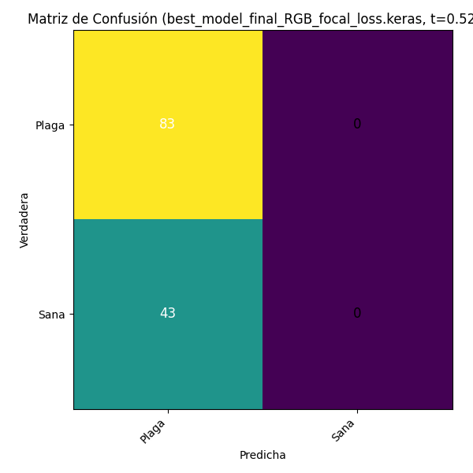

# Matriz de confusión

- **Fecha:** 2026-03-25 14:42:25
- **Modelo:** report_best_model_final_RGB_focal_loss.keras_20260325_1441_t52_confusion.md
```text
[[83  0]
 [43  0]]
```


*Generado automáticamente por el sistema de detección de plagas.*


### 3 UMBRAL 0.70
#### 3.1 Comando:

````bash
python src\pest_detection_models\evaluate.py data\multiespectral\TTADDA-dataset\TTADDA_NARO_2023_F1\drone_data -m src\pest_detection_models\best_models\best_model_final_RGB_focal_loss.keras -t 0.70 -mt cnn
````

#### 3.2 Consola:

````bash
2026-03-25 14:43:29.855790: I tensorflow/core/util/port.cc:153] oneDNN custom operations are on. You may see slightly different numerical results due to floating-point round-off errors from different computation orders. To turn them off, set the environment variable `TF_ENABLE_ONEDNN_OPTS=0`.
2026-03-25 14:43:31.164865: I tensorflow/core/util/port.cc:153] oneDNN custom operations are on. You may see slightly different numerical results due to floating-point round-off errors from different computation orders. To turn them off, set the environment variable `TF_ENABLE_ONEDNN_OPTS=0`.

--- [Fecha/hora inicio=20260325_1443] ---

--- [T=0.00s] ---
init. Evaluando CNN RGB - Loss: focal_loss - Threshold: 0.7

--- [Fecha/hora inicio=20260325_1443] ---

--- [T=0.00s] ---
1. Extrayendo datos (MISMO pipeline que training)...

--- [Fecha/hora inicio=20260325_1443] ---

--- [T=0.00s] ---
1. Carga de datos cnn RGB

--- [Fecha/hora inicio=20260325_1443] ---

--- [T=0.03s] ---
2. Filtrado y extracción de datos

--- [Fecha/hora inicio=20260325_1443] ---

--- [T=0.03s] ---
2.1. Iniciando procesamiento de 665 imágenes etiquetadas...

--- [Fecha/hora inicio=20260325_1443] ---

--- [T=0.03s] ---
2.2. Archivos seleccionados: ['RGB.tif']
Imagen inválida: 4 canales (esperado 3)
Imagen inválida: 4 canales (esperado 3)
Imagen inválida: 4 canales (esperado 3)
Imagen inválida: 4 canales (esperado 3)
Imagen inválida: 4 canales (esperado 3)
Imagen inválida: 4 canales (esperado 3)
Imagen inválida: 4 canales (esperado 3)
Imagen inválida: 4 canales (esperado 3)
Imagen inválida: 4 canales (esperado 3)
Imagen inválida: 4 canales (esperado 3)
Imagen inválida: 4 canales (esperado 3)
Imagen inválida: 4 canales (esperado 3)
Imagen inválida: 4 canales (esperado 3)
Imagen inválida: 4 canales (esperado 3)
Imagen inválida: 4 canales (esperado 3)
Imagen inválida: 4 canales (esperado 3)
Imagen inválida: 4 canales (esperado 3)
Imagen inválida: 4 canales (esperado 3)
Imagen inválida: 4 canales (esperado 3)
Imagen inválida: 4 canales (esperado 3)
Imagen inválida: 4 canales (esperado 3)
Imagen inválida: 4 canales (esperado 3)
Imagen inválida: 4 canales (esperado 3)
Imagen inválida: 4 canales (esperado 3)
Imagen inválida: 4 canales (esperado 3)
Imagen inválida: 4 canales (esperado 3)
Imagen inválida: 4 canales (esperado 3)
Imagen inválida: 4 canales (esperado 3)
Imagen inválida: 4 canales (esperado 3)
Imagen inválida: 4 canales (esperado 3)
Imagen inválida: 4 canales (esperado 3)
Imagen inválida: 4 canales (esperado 3)
Imagen inválida: 4 canales (esperado 3)
Imagen inválida: 4 canales (esperado 3)
Imagen inválida: 4 canales (esperado 3)

--- [Fecha/hora inicio=20260325_1443] ---

--- [T=31.00s] ---
7. Extracción de imágenes completada.

Datos listos para entrenamiento. Total de muestras: 630

Resumen de Datos Multiespectrales:
Total de parches extraídos: 630
X Train/Val Split: 504 / 126
Y Train/Val Split: 504 / 126
Forma X_train: (504, 224, 224, 3)
Forma Y_train: (504,)
Distribución y_val: {np.int64(0): np.int64(83), np.int64(1): np.int64(43)}

--- [Fecha/hora inicio=20260325_1443] ---

--- [T=29.44s] ---
2. Cargando modelo...

--- [Fecha/hora inicio=20260325_1443] ---

--- [T=29.51s] ---
1. ⏳ Cargando modelo desde: src\pest_detection_models\best_models\best_model_final_RGB_focal_loss.keras
2026-03-25 14:44:01.062842: I tensorflow/core/platform/cpu_feature_guard.cc:210] This TensorFlow binary is optimized to use available CPU instructions in performance-critical operations.
To enable the following instructions: SSE3 SSE4.1 SSE4.2 AVX AVX2 AVX_VNNI FMA, in other operations, rebuild TensorFlow with the appropriate compiler flags.

--- [Fecha/hora inicio=20260325_1443] ---

--- [T=29.59s] ---
2. ✅ Modelo Keras cargado exitosamente desde src\pest_detection_models\best_models\best_model_final_RGB_focal_loss.keras

--- [Fecha/hora inicio=20260325_1443] ---

--- [T=29.52s] ---
3. Prediciendo...
4/4 ━━━━━━━━━━━━━━━━━━━━ 1s 206ms/step

--- DEBUG PROBABILIDADES ---
MIN: 0.5013404
MAX: 0.50146043
MEAN: 0.50139904
PERCENTILES: [0.50134039 0.50136393 0.50139499 0.50143668 0.50146043]
X_val stats:
MIN: 0.0
MAX: 1.0
MEAN: 0.21663862
STD: 3.75954e-05

--- [Fecha/hora inicio=20260325_1443] ---

--- [T=30.51s] ---
4. Generando métricas...

✅ Reporte de Clasificación guardado en: C:\workspace\hd-image-pest-detection-cnn-and-rf\src\pest_detection_models\evaluation_results/CNN/RGB/focal_loss/0.7\report_best_model_final_RGB_focal_loss.keras_20260325_1444_t70.json
✅ Matriz de Confusión guardada en: C:\workspace\hd-image-pest-detection-cnn-and-rf\src\pest_detection_models\evaluation_results/CNN/RGB/focal_loss/0.7\report_best_model_final_RGB_focal_loss.keras_20260325_1444_t70_confusion.png
Matriz de confusión:
[[83  0]
 [43  0]]

--- RESUMEN DEL REPORTE DE CLASIFICACIÓN ---
              precision    recall  f1-score   support

       Plaga       0.66      1.00      0.79        83
        Sana       0.00      0.00      0.00        43

    accuracy                           0.66       126
   macro avg       0.33      0.50      0.40       126
weighted avg       0.43      0.66      0.52       126

✅ Reporte Markdown (Tabla) guardado en: C:\workspace\hd-image-pest-detection-cnn-and-rf\src\pest_detection_models\evaluation_results/CNN/RGB/focal_loss/0.7\report_table_best_model_final_RGB_focal_loss.keras_20260325_1444_t70.md
✅ Curva ROC guardada en: C:\workspace\hd-image-pest-detection-cnn-and-rf\src\pest_detection_models\evaluation_results/CNN/RGB/focal_loss/0.7\ROC_best_model_final_RGB_focal_loss.keras_20260325_1445_t0.7.png
ROC guardada en C:\workspace\hd-image-pest-detection-cnn-and-rf\src\pest_detection_models\evaluation_results/CNN/RGB/focal_loss/0.7\ROC_data_best_model_final_RGB_focal_loss.keras_20260325_1445_t0.7.npz (AUC=0.8110)
````

#### 3.3 Resultados:
##### 3.3.1 Reporte de clasificación json:

````json
{
    "Plaga": {
        "precision": 0.6587301587301587,
        "recall": 1.0,
        "f1-score": 0.7942583732057417,
        "support": 83.0
    },
    "Sana": {
        "precision": 0.0,
        "recall": 0.0,
        "f1-score": 0.0,
        "support": 43.0
    },
    "accuracy": 0.6587301587301587,
    "macro avg": {
        "precision": 0.32936507936507936,
        "recall": 0.5,
        "f1-score": 0.39712918660287083,
        "support": 126.0
    },
    "weighted avg": {
        "precision": 0.4339254220206601,
        "recall": 0.6587301587301587,
        "f1-score": 0.5232019442545758,
        "support": 126.0
    }
}
````

##### 3.3.2 Reporte de clasificación tabla
# Reporte de Clasificación - best_model_final_RGB_focal_loss.keras

- **Fecha:** 2026-03-25 14:45:13
- **Modelo:** best_model_final_RGB_focal_loss.keras
- **Umbral de decisión:** 0.7

## Métricas por Clase

```text
              precision    recall  f1-score   support

       Plaga       0.66      1.00      0.79        83
        Sana       0.00      0.00      0.00        43

    accuracy                           0.66       126
   macro avg       0.33      0.50      0.40       126
weighted avg       0.43      0.66      0.52       126

```


*Generado automáticamente por el sistema de detección de plagas.*

##### 3.3.3 Matriz de confusión


# Matriz de confusión

- **Fecha:** 2026-03-25 14:45:13
- **Modelo:** report_best_model_final_RGB_focal_loss.keras_20260325_1444_t70_confusion.md
```text
[[83  0]
 [43  0]]
```


*Generado automáticamente por el sistema de detección de plagas.*

## CNN RGB BINARY CROSS ENTROPY
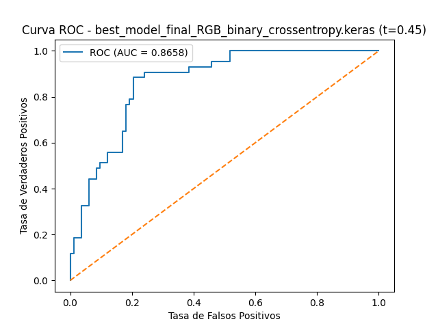

### 1 UMBRAL 0.4
#### 1.1 Comando:

````bash
python src\pest_detection_models\evaluate.py data\multiespectral\TTADDA-dataset\TTADDA_NARO_2023_F1\drone_data -m src\pest_detection_models\best_models\best_model_final_RGB_binary_crossentropy.keras -t 0.45 -mt cnn
````

#### 1.2 Consola:

````bash
2026-03-25 15:03:37.136602: I tensorflow/core/util/port.cc:153] oneDNN custom operations are on. You may see slightly different numerical results due to floating-point round-off errors from different computation orders. To turn them off, set the environment variable `TF_ENABLE_ONEDNN_OPTS=0`.
2026-03-25 15:03:38.368497: I tensorflow/core/util/port.cc:153] oneDNN custom operations are on. You may see slightly different numerical results due to floating-point round-off errors from different computation orders. To turn them off, set the environment variable `TF_ENABLE_ONEDNN_OPTS=0`.

--- [Fecha/hora inicio=20260325_1503] ---

--- [T=0.00s] ---
init. Evaluando CNN RGB - Loss: binary_crossentropy - Threshold: 0.45

--- [Fecha/hora inicio=20260325_1503] ---

--- [T=0.00s] ---
1. Extrayendo datos (MISMO pipeline que training)...

--- [Fecha/hora inicio=20260325_1503] ---

--- [T=0.00s] ---
1. Carga de datos cnn RGB

--- [Fecha/hora inicio=20260325_1503] ---

--- [T=0.03s] ---
2. Filtrado y extracción de datos

--- [Fecha/hora inicio=20260325_1503] ---

--- [T=0.03s] ---
2.1. Iniciando procesamiento de 665 imágenes etiquetadas...

--- [Fecha/hora inicio=20260325_1503] ---

--- [T=0.03s] ---
2.2. Archivos seleccionados: ['RGB.tif']
Imagen inválida: 4 canales (esperado 3)
Imagen inválida: 4 canales (esperado 3)
Imagen inválida: 4 canales (esperado 3)
Imagen inválida: 4 canales (esperado 3)
Imagen inválida: 4 canales (esperado 3)
Imagen inválida: 4 canales (esperado 3)
Imagen inválida: 4 canales (esperado 3)
Imagen inválida: 4 canales (esperado 3)
Imagen inválida: 4 canales (esperado 3)
Imagen inválida: 4 canales (esperado 3)
Imagen inválida: 4 canales (esperado 3)
Imagen inválida: 4 canales (esperado 3)
Imagen inválida: 4 canales (esperado 3)
Imagen inválida: 4 canales (esperado 3)
Imagen inválida: 4 canales (esperado 3)
Imagen inválida: 4 canales (esperado 3)
Imagen inválida: 4 canales (esperado 3)
Imagen inválida: 4 canales (esperado 3)
Imagen inválida: 4 canales (esperado 3)
Imagen inválida: 4 canales (esperado 3)
Imagen inválida: 4 canales (esperado 3)
Imagen inválida: 4 canales (esperado 3)
Imagen inválida: 4 canales (esperado 3)
Imagen inválida: 4 canales (esperado 3)
Imagen inválida: 4 canales (esperado 3)
Imagen inválida: 4 canales (esperado 3)
Imagen inválida: 4 canales (esperado 3)
Imagen inválida: 4 canales (esperado 3)
Imagen inválida: 4 canales (esperado 3)
Imagen inválida: 4 canales (esperado 3)
Imagen inválida: 4 canales (esperado 3)
Imagen inválida: 4 canales (esperado 3)
Imagen inválida: 4 canales (esperado 3)
Imagen inválida: 4 canales (esperado 3)
Imagen inválida: 4 canales (esperado 3)

--- [Fecha/hora inicio=20260325_1503] ---

--- [T=38.60s] ---
7. Extracción de imágenes completada.

Datos listos para entrenamiento. Total de muestras: 630

Resumen de Datos Multiespectrales:
Total de parches extraídos: 630
X Train/Val Split: 504 / 126
Y Train/Val Split: 504 / 126
Forma X_train: (504, 224, 224, 3)
Forma Y_train: (504,)
Distribución y_val: {np.int64(0): np.int64(83), np.int64(1): np.int64(43)}

--- [Fecha/hora inicio=20260325_1503] ---

--- [T=37.16s] ---
2. Cargando modelo...

--- [Fecha/hora inicio=20260325_1503] ---

--- [T=37.21s] ---
1. ⏳ Cargando modelo desde: src\pest_detection_models\best_models\best_model_final_RGB_binary_crossentropy.keras
2026-03-25 15:04:15.984252: I tensorflow/core/platform/cpu_feature_guard.cc:210] This TensorFlow binary is optimized to use available CPU instructions in performance-critical operations.
To enable the following instructions: SSE3 SSE4.1 SSE4.2 AVX AVX2 AVX_VNNI FMA, in other operations, rebuild TensorFlow with the appropriate compiler flags.

--- [Fecha/hora inicio=20260325_1503] ---

--- [T=37.34s] ---
2. ✅ Modelo Keras cargado exitosamente desde src\pest_detection_models\best_models\best_model_final_RGB_binary_crossentropy.keras

--- [Fecha/hora inicio=20260325_1503] ---

--- [T=37.29s] ---
3. Prediciendo...
4/4 ━━━━━━━━━━━━━━━━━━━━ 2s 361ms/step

--- DEBUG PROBABILIDADES ---
MIN: 0.49760857
MAX: 0.50683403
MEAN: 0.502261
PERCENTILES: [0.49760857 0.5005665  0.50172877 0.50449479 0.50683403]
X_val stats:
MIN: 0.0
MAX: 1.0
MEAN: 0.21663862
STD: 0.002675977

--- [Fecha/hora inicio=20260325_1503] ---

--- [T=38.98s] ---
4. Generando métricas...

✅ Reporte de Clasificación guardado en: C:\workspace\hd-image-pest-detection-cnn-and-rf\src\pest_detection_models\evaluation_results/CNN/RGB/binary_crossentropy/0.45\report_best_model_final_RGB_binary_crossentropy.keras_20260325_1504_t45.json
✅ Matriz de Confusión guardada en: C:\workspace\hd-image-pest-detection-cnn-and-rf\src\pest_detection_models\evaluation_results/CNN/RGB/binary_crossentropy/0.45\report_best_model_final_RGB_binary_crossentropy.keras_20260325_1504_t45_confusion.png
Matriz de confusión:
[[ 0 83]
 [ 0 43]]

--- RESUMEN DEL REPORTE DE CLASIFICACIÓN ---
              precision    recall  f1-score   support

       Plaga       0.00      0.00      0.00        83
        Sana       0.34      1.00      0.51        43

    accuracy                           0.34       126
   macro avg       0.17      0.50      0.25       126
weighted avg       0.12      0.34      0.17       126

✅ Reporte Markdown (Tabla) guardado en: C:\workspace\hd-image-pest-detection-cnn-and-rf\src\pest_detection_models\evaluation_results/CNN/RGB/binary_crossentropy/0.45\report_table_best_model_final_RGB_binary_crossentropy.keras_20260325_1504_t45.md
✅ Curva ROC guardada en: C:\workspace\hd-image-pest-detection-cnn-and-rf\src\pest_detection_models\evaluation_results/CNN/RGB/binary_crossentropy/0.45\ROC_best_model_final_RGB_binary_crossentropy.keras_20260325_1504_t0.45.png
ROC guardada en C:\workspace\hd-image-pest-detection-cnn-and-rf\src\pest_detection_models\evaluation_results/CNN/RGB/binary_crossentropy/0.45\ROC_data_best_model_final_RGB_binary_crossentropy.keras_20260325_1504_t0.45.npz (AUC=0.8658)
````

#### 1.3 Resultados:
##### 1.3.1 Reporte de clasificación json:

````json
{
    "Plaga": {
        "precision": 0.0,
        "recall": 0.0,
        "f1-score": 0.0,
        "support": 83.0
    },
    "Sana": {
        "precision": 0.3412698412698413,
        "recall": 1.0,
        "f1-score": 0.5088757396449705,
        "support": 43.0
    },
    "accuracy": 0.3412698412698413,
    "macro avg": {
        "precision": 0.17063492063492064,
        "recall": 0.5,
        "f1-score": 0.25443786982248523,
        "support": 126.0
    },
    "weighted avg": {
        "precision": 0.11646510456034266,
        "recall": 0.3412698412698413,
        "f1-score": 0.17366394289471215,
        "support": 126.0
    }
}
````

##### 1.3.2 Reporte de clasificación tabla
# Reporte de Clasificación - best_model_final_RGB_binary_crossentropy.keras

- **Fecha:** 2026-03-25 15:04:57
- **Modelo:** best_model_final_RGB_binary_crossentropy.keras
- **Umbral de decisión:** 0.45

## Métricas por Clase

```text
              precision    recall  f1-score   support

       Plaga       0.00      0.00      0.00        83
        Sana       0.34      1.00      0.51        43

    accuracy                           0.34       126
   macro avg       0.17      0.50      0.25       126
weighted avg       0.12      0.34      0.17       126

```


*Generado automáticamente por el sistema de detección de plagas.*

##### 1.3.3 Matriz de confusión
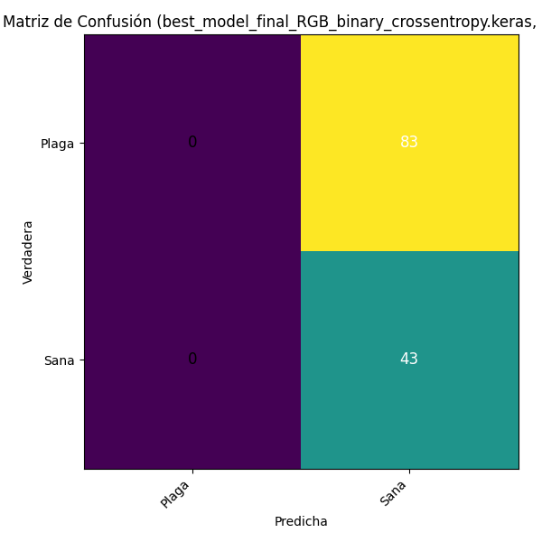

# Matriz de confusión

- **Fecha:** 2026-03-25 15:04:57
- **Modelo:** report_best_model_final_RGB_binary_crossentropy.keras_20260325_1504_t45_confusion.md
```text
[[ 0 83]
 [ 0 43]]
```


*Generado automáticamente por el sistema de detección de plagas.*

### 2 UMBRAL 0.5214
#### 2.1 Comando:

````bash
python src\pest_detection_models\evaluate.py data\multiespectral\TTADDA-dataset\TTADDA_NARO_2023_F1\drone_data -m src\pest_detection_models\best_models\best_model_final_RGB_binary_crossentropy.keras -t 0.5214 -mt cnn
````

#### 2.2 Consola:

````bash
2026-03-25 15:07:29.572147: I tensorflow/core/util/port.cc:153] oneDNN custom operations are on. You may see slightly different numerical results due to floating-point round-off errors from different computation orders. To turn them off, set the environment variable `TF_ENABLE_ONEDNN_OPTS=0`.
2026-03-25 15:07:30.740660: I tensorflow/core/util/port.cc:153] oneDNN custom operations are on. You may see slightly different numerical results due to floating-point round-off errors from different computation orders. To turn them off, set the environment variable `TF_ENABLE_ONEDNN_OPTS=0`.

--- [Fecha/hora inicio=20260325_1507] ---

--- [T=0.00s] ---
init. Evaluando CNN RGB - Loss: binary_crossentropy - Threshold: 0.5214

--- [Fecha/hora inicio=20260325_1507] ---

--- [T=0.00s] ---
1. Extrayendo datos (MISMO pipeline que training)...

--- [Fecha/hora inicio=20260325_1507] ---

--- [T=0.00s] ---
1. Carga de datos cnn RGB

--- [Fecha/hora inicio=20260325_1507] ---

--- [T=0.03s] ---
2. Filtrado y extracción de datos

--- [Fecha/hora inicio=20260325_1507] ---

--- [T=0.04s] ---
2.1. Iniciando procesamiento de 665 imágenes etiquetadas...

--- [Fecha/hora inicio=20260325_1507] ---

--- [T=0.04s] ---
2.2. Archivos seleccionados: ['RGB.tif']
Imagen inválida: 4 canales (esperado 3)
Imagen inválida: 4 canales (esperado 3)
Imagen inválida: 4 canales (esperado 3)
Imagen inválida: 4 canales (esperado 3)
Imagen inválida: 4 canales (esperado 3)
Imagen inválida: 4 canales (esperado 3)
Imagen inválida: 4 canales (esperado 3)
Imagen inválida: 4 canales (esperado 3)
Imagen inválida: 4 canales (esperado 3)
Imagen inválida: 4 canales (esperado 3)
Imagen inválida: 4 canales (esperado 3)
Imagen inválida: 4 canales (esperado 3)
Imagen inválida: 4 canales (esperado 3)
Imagen inválida: 4 canales (esperado 3)
Imagen inválida: 4 canales (esperado 3)
Imagen inválida: 4 canales (esperado 3)
Imagen inválida: 4 canales (esperado 3)
Imagen inválida: 4 canales (esperado 3)
Imagen inválida: 4 canales (esperado 3)
Imagen inválida: 4 canales (esperado 3)
Imagen inválida: 4 canales (esperado 3)
Imagen inválida: 4 canales (esperado 3)
Imagen inválida: 4 canales (esperado 3)
Imagen inválida: 4 canales (esperado 3)
Imagen inválida: 4 canales (esperado 3)
Imagen inválida: 4 canales (esperado 3)
Imagen inválida: 4 canales (esperado 3)
Imagen inválida: 4 canales (esperado 3)
Imagen inválida: 4 canales (esperado 3)
Imagen inválida: 4 canales (esperado 3)
Imagen inválida: 4 canales (esperado 3)
Imagen inválida: 4 canales (esperado 3)
Imagen inválida: 4 canales (esperado 3)
Imagen inválida: 4 canales (esperado 3)
Imagen inválida: 4 canales (esperado 3)

--- [Fecha/hora inicio=20260325_1507] ---

--- [T=29.33s] ---
7. Extracción de imágenes completada.

Datos listos para entrenamiento. Total de muestras: 630

Resumen de Datos Multiespectrales:
Total de parches extraídos: 630
X Train/Val Split: 504 / 126
Y Train/Val Split: 504 / 126
Forma X_train: (504, 224, 224, 3)
Forma Y_train: (504,)
Distribución y_val: {np.int64(0): np.int64(83), np.int64(1): np.int64(43)}

--- [Fecha/hora inicio=20260325_1507] ---

--- [T=27.98s] ---
2. Cargando modelo...

--- [Fecha/hora inicio=20260325_1507] ---

--- [T=28.03s] ---
1. ⏳ Cargando modelo desde: src\pest_detection_models\best_models\best_model_final_RGB_binary_crossentropy.keras
2026-03-25 15:07:59.121480: I tensorflow/core/platform/cpu_feature_guard.cc:210] This TensorFlow binary is optimized to use available CPU instructions in performance-critical operations.
To enable the following instructions: SSE3 SSE4.1 SSE4.2 AVX AVX2 AVX_VNNI FMA, in other operations, rebuild TensorFlow with the appropriate compiler flags.

--- [Fecha/hora inicio=20260325_1507] ---

--- [T=28.15s] ---
2. ✅ Modelo Keras cargado exitosamente desde src\pest_detection_models\best_models\best_model_final_RGB_binary_crossentropy.keras

--- [Fecha/hora inicio=20260325_1507] ---

--- [T=28.10s] ---
3. Prediciendo...
4/4 ━━━━━━━━━━━━━━━━━━━━ 1s 235ms/step

--- DEBUG PROBABILIDADES ---
MIN: 0.49760857
MAX: 0.50683403
MEAN: 0.502261
PERCENTILES: [0.49760857 0.5005665  0.50172877 0.50449479 0.50683403]
X_val stats:
MIN: 0.0
MAX: 1.0
MEAN: 0.21663862
STD: 0.002675977

--- [Fecha/hora inicio=20260325_1507] ---

--- [T=29.34s] ---
4. Generando métricas...

✅ Reporte de Clasificación guardado en: C:\workspace\hd-image-pest-detection-cnn-and-rf\src\pest_detection_models\evaluation_results/CNN/RGB/binary_crossentropy/0.5214\report_best_model_final_RGB_binary_crossentropy.keras_20260325_1508_t52.json
✅ Matriz de Confusión guardada en: C:\workspace\hd-image-pest-detection-cnn-and-rf\src\pest_detection_models\evaluation_results/CNN/RGB/binary_crossentropy/0.5214\report_best_model_final_RGB_binary_crossentropy.keras_20260325_1508_t52_confusion.png
Matriz de confusión:
[[83  0]
 [43  0]]

--- RESUMEN DEL REPORTE DE CLASIFICACIÓN ---
              precision    recall  f1-score   support

       Plaga       0.66      1.00      0.79        83
        Sana       0.00      0.00      0.00        43

    accuracy                           0.66       126
   macro avg       0.33      0.50      0.40       126
weighted avg       0.43      0.66      0.52       126

✅ Reporte Markdown (Tabla) guardado en: C:\workspace\hd-image-pest-detection-cnn-and-rf\src\pest_detection_models\evaluation_results/CNN/RGB/binary_crossentropy/0.5214\report_table_best_model_final_RGB_binary_crossentropy.keras_20260325_1508_t52.md
✅ Curva ROC guardada en: C:\workspace\hd-image-pest-detection-cnn-and-rf\src\pest_detection_models\evaluation_results/CNN/RGB/binary_crossentropy/0.5214\ROC_best_model_final_RGB_binary_crossentropy.keras_20260325_1508_t0.5214.png
ROC guardada en C:\workspace\hd-image-pest-detection-cnn-and-rf\src\pest_detection_models\evaluation_results/CNN/RGB/binary_crossentropy/0.5214\ROC_data_best_model_final_RGB_binary_crossentropy.keras_20260325_1508_t0.5214.npz (AUC=0.8658)
````

#### 2.3 Resultados:
##### 2.3.1 Reporte de clasificación json:

````json
{
    "Plaga": {
        "precision": 0.6587301587301587,
        "recall": 1.0,
        "f1-score": 0.7942583732057417,
        "support": 83.0
    },
    "Sana": {
        "precision": 0.0,
        "recall": 0.0,
        "f1-score": 0.0,
        "support": 43.0
    },
    "accuracy": 0.6587301587301587,
    "macro avg": {
        "precision": 0.32936507936507936,
        "recall": 0.5,
        "f1-score": 0.39712918660287083,
        "support": 126.0
    },
    "weighted avg": {
        "precision": 0.4339254220206601,
        "recall": 0.6587301587301587,
        "f1-score": 0.5232019442545758,
        "support": 126.0
    }
}
````

##### 2.3.2 Reporte de clasificación tabla
# Reporte de Clasificación - best_model_final_RGB_binary_crossentropy.keras

- **Fecha:** 2026-03-25 15:08:02
- **Modelo:** best_model_final_RGB_binary_crossentropy.keras
- **Umbral de decisión:** 0.5214

## Métricas por Clase

```text
              precision    recall  f1-score   support

       Plaga       0.66      1.00      0.79        83
        Sana       0.00      0.00      0.00        43

    accuracy                           0.66       126
   macro avg       0.33      0.50      0.40       126
weighted avg       0.43      0.66      0.52       126

```


*Generado automáticamente por el sistema de detección de plagas.*

##### 2.3.3 Matriz de confusión
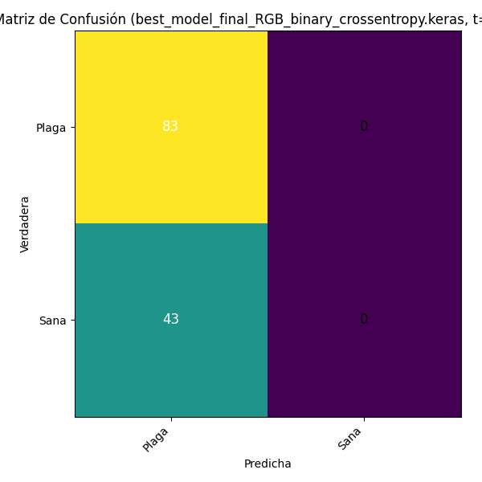

# Matriz de confusión

- **Fecha:** 2026-03-25 15:08:02
- **Modelo:** report_best_model_final_RGB_binary_crossentropy.keras_20260325_1508_t52_confusion.md
```text
[[83  0]
 [43  0]]
```


*Generado automáticamente por el sistema de detección de plagas.*

### 3 UMBRAL 0.70
#### 3.1 Comando:

````bash
python src\pest_detection_models\evaluate.py data\multiespectral\TTADDA-dataset\TTADDA_NARO_2023_F1\drone_data -m src\pest_detection_models\best_models\best_model_final_RGB_binary_crossentropy.keras -t 0.70 -mt cnn
````

#### 3.2 Consola:

````bash
2026-03-25 15:09:03.388378: I tensorflow/core/util/port.cc:153] oneDNN custom operations are on. You may see slightly different numerical results due to floating-point round-off errors from different computation orders. To turn them off, set the environment variable `TF_ENABLE_ONEDNN_OPTS=0`.
2026-03-25 15:09:04.587774: I tensorflow/core/util/port.cc:153] oneDNN custom operations are on. You may see slightly different numerical results due to floating-point round-off errors from different computation orders. To turn them off, set the environment variable `TF_ENABLE_ONEDNN_OPTS=0`.

--- [Fecha/hora inicio=20260325_1509] ---

--- [T=0.00s] ---
init. Evaluando CNN RGB - Loss: binary_crossentropy - Threshold: 0.7

--- [Fecha/hora inicio=20260325_1509] ---

--- [T=0.00s] ---
1. Extrayendo datos (MISMO pipeline que training)...

--- [Fecha/hora inicio=20260325_1509] ---

--- [T=0.00s] ---
1. Carga de datos cnn RGB

--- [Fecha/hora inicio=20260325_1509] ---

--- [T=0.04s] ---
2. Filtrado y extracción de datos

--- [Fecha/hora inicio=20260325_1509] ---

--- [T=0.04s] ---
2.1. Iniciando procesamiento de 665 imágenes etiquetadas...

--- [Fecha/hora inicio=20260325_1509] ---

--- [T=0.04s] ---
2.2. Archivos seleccionados: ['RGB.tif']
Imagen inválida: 4 canales (esperado 3)
Imagen inválida: 4 canales (esperado 3)
Imagen inválida: 4 canales (esperado 3)
Imagen inválida: 4 canales (esperado 3)
Imagen inválida: 4 canales (esperado 3)
Imagen inválida: 4 canales (esperado 3)
Imagen inválida: 4 canales (esperado 3)
Imagen inválida: 4 canales (esperado 3)
Imagen inválida: 4 canales (esperado 3)
Imagen inválida: 4 canales (esperado 3)
Imagen inválida: 4 canales (esperado 3)
Imagen inválida: 4 canales (esperado 3)
Imagen inválida: 4 canales (esperado 3)
Imagen inválida: 4 canales (esperado 3)
Imagen inválida: 4 canales (esperado 3)
Imagen inválida: 4 canales (esperado 3)
Imagen inválida: 4 canales (esperado 3)
Imagen inválida: 4 canales (esperado 3)
Imagen inválida: 4 canales (esperado 3)
Imagen inválida: 4 canales (esperado 3)
Imagen inválida: 4 canales (esperado 3)
Imagen inválida: 4 canales (esperado 3)
Imagen inválida: 4 canales (esperado 3)
Imagen inválida: 4 canales (esperado 3)
Imagen inválida: 4 canales (esperado 3)
Imagen inválida: 4 canales (esperado 3)
Imagen inválida: 4 canales (esperado 3)
Imagen inválida: 4 canales (esperado 3)
Imagen inválida: 4 canales (esperado 3)
Imagen inválida: 4 canales (esperado 3)
Imagen inválida: 4 canales (esperado 3)
Imagen inválida: 4 canales (esperado 3)
Imagen inválida: 4 canales (esperado 3)
Imagen inválida: 4 canales (esperado 3)
Imagen inválida: 4 canales (esperado 3)

--- [Fecha/hora inicio=20260325_1509] ---

--- [T=30.83s] ---
7. Extracción de imágenes completada.

Datos listos para entrenamiento. Total de muestras: 630

Resumen de Datos Multiespectrales:
Total de parches extraídos: 630
X Train/Val Split: 504 / 126
Y Train/Val Split: 504 / 126
Forma X_train: (504, 224, 224, 3)
Forma Y_train: (504,)
Distribución y_val: {np.int64(0): np.int64(83), np.int64(1): np.int64(43)}

--- [Fecha/hora inicio=20260325_1509] ---

--- [T=29.46s] ---
2. Cargando modelo...

--- [Fecha/hora inicio=20260325_1509] ---

--- [T=29.51s] ---
1. ⏳ Cargando modelo desde: src\pest_detection_models\best_models\best_model_final_RGB_binary_crossentropy.keras
2026-03-25 15:09:34.463606: I tensorflow/core/platform/cpu_feature_guard.cc:210] This TensorFlow binary is optimized to use available CPU instructions in performance-critical operations.
To enable the following instructions: SSE3 SSE4.1 SSE4.2 AVX AVX2 AVX_VNNI FMA, in other operations, rebuild TensorFlow with the appropriate compiler flags.

--- [Fecha/hora inicio=20260325_1509] ---

--- [T=29.59s] ---
2. ✅ Modelo Keras cargado exitosamente desde src\pest_detection_models\best_models\best_model_final_RGB_binary_crossentropy.keras

--- [Fecha/hora inicio=20260325_1509] ---

--- [T=29.55s] ---
3. Prediciendo...
4/4 ━━━━━━━━━━━━━━━━━━━━ 1s 233ms/step

--- DEBUG PROBABILIDADES ---
MIN: 0.49760857
MAX: 0.50683403
MEAN: 0.502261
PERCENTILES: [0.49760857 0.5005665  0.50172877 0.50449479 0.50683403]
X_val stats:
MIN: 0.0
MAX: 1.0
MEAN: 0.21663862
STD: 0.002675977

--- [Fecha/hora inicio=20260325_1509] ---

--- [T=30.66s] ---
4. Generando métricas...

✅ Reporte de Clasificación guardado en: C:\workspace\hd-image-pest-detection-cnn-and-rf\src\pest_detection_models\evaluation_results/CNN/RGB/binary_crossentropy/0.7\report_best_model_final_RGB_binary_crossentropy.keras_20260325_1509_t70.json
✅ Matriz de Confusión guardada en: C:\workspace\hd-image-pest-detection-cnn-and-rf\src\pest_detection_models\evaluation_results/CNN/RGB/binary_crossentropy/0.7\report_best_model_final_RGB_binary_crossentropy.keras_20260325_1509_t70_confusion.png
Matriz de confusión:
[[83  0]
 [43  0]]

--- RESUMEN DEL REPORTE DE CLASIFICACIÓN ---
              precision    recall  f1-score   support

       Plaga       0.66      1.00      0.79        83
        Sana       0.00      0.00      0.00        43

    accuracy                           0.66       126
   macro avg       0.33      0.50      0.40       126
weighted avg       0.43      0.66      0.52       126

✅ Reporte Markdown (Tabla) guardado en: C:\workspace\hd-image-pest-detection-cnn-and-rf\src\pest_detection_models\evaluation_results/CNN/RGB/binary_crossentropy/0.7\report_table_best_model_final_RGB_binary_crossentropy.keras_20260325_1509_t70.md
✅ Curva ROC guardada en: C:\workspace\hd-image-pest-detection-cnn-and-rf\src\pest_detection_models\evaluation_results/CNN/RGB/binary_crossentropy/0.7\ROC_best_model_final_RGB_binary_crossentropy.keras_20260325_1509_t0.7.png
ROC guardada en C:\workspace\hd-image-pest-detection-cnn-and-rf\src\pest_detection_models\evaluation_results/CNN/RGB/binary_crossentropy/0.7\ROC_data_best_model_final_RGB_binary_crossentropy.keras_20260325_1509_t0.7.npz (AUC=0.8658)
````

#### 3.3 Resultados:
##### 3.3.1 Reporte de clasificación json:

````json
{
    "Plaga": {
        "precision": 0.6587301587301587,
        "recall": 1.0,
        "f1-score": 0.7942583732057417,
        "support": 83.0
    },
    "Sana": {
        "precision": 0.0,
        "recall": 0.0,
        "f1-score": 0.0,
        "support": 43.0
    },
    "accuracy": 0.6587301587301587,
    "macro avg": {
        "precision": 0.32936507936507936,
        "recall": 0.5,
        "f1-score": 0.39712918660287083,
        "support": 126.0
    },
    "weighted avg": {
        "precision": 0.4339254220206601,
        "recall": 0.6587301587301587,
        "f1-score": 0.5232019442545758,
        "support": 126.0
    }
}
````

##### 3.3.2 Reporte de clasificación tabla
# Reporte de Clasificación - best_model_final_RGB_binary_crossentropy.keras

- **Fecha:** 2026-03-25 15:09:37
- **Modelo:** best_model_final_RGB_binary_crossentropy.keras
- **Umbral de decisión:** 0.7

## Métricas por Clase

```text
              precision    recall  f1-score   support

       Plaga       0.66      1.00      0.79        83
        Sana       0.00      0.00      0.00        43

    accuracy                           0.66       126
   macro avg       0.33      0.50      0.40       126
weighted avg       0.43      0.66      0.52       126

```


*Generado automáticamente por el sistema de detección de plagas.*

##### 3.3.3 Matriz de confusión


# Matriz de confusión

- **Fecha:** 2026-03-25 15:09:37
- **Modelo:** report_best_model_final_RGB_binary_crossentropy.keras_20260325_1509_t70_confusion.md
```text
[[83  0]
 [43  0]]
```


*Generado automáticamente por el sistema de detección de plagas.*

## CNN + RANDOM FOREST MULTIESPECTRAL
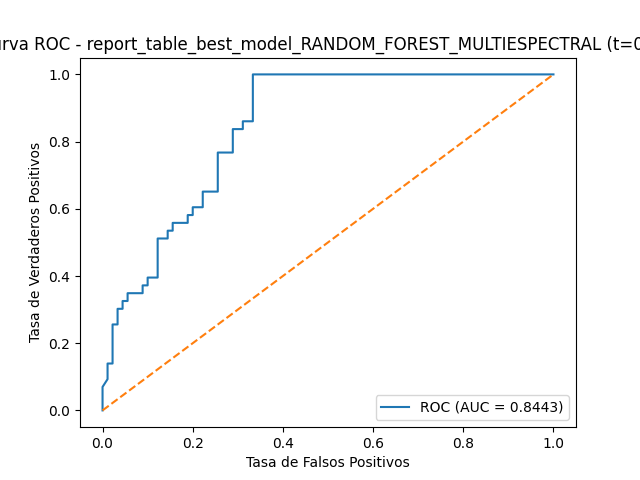

### 1 UMBRAL 0.4
#### 1.1 Comando:

````bash
python src\pest_detection_models\evaluate.py data\multiespectral\TTADDA-dataset\TTADDA_NARO_2023_F1\drone_data -m src\pest_detection_models\best_models\best_model_final_random_forest_MULTIESPECTRAL_20260325_1611.joblib -mt rf -t 0.45
````

#### 1.2 Consola:

````bash
2026-03-25 16:14:24.537635: I tensorflow/core/util/port.cc:153] oneDNN custom operations are on. You may see slightly different numerical results due to floating-point round-off errors from different computation orders. To turn them off, set the environment variable `TF_ENABLE_ONEDNN_OPTS=0`.
2026-03-25 16:14:25.706544: I tensorflow/core/util/port.cc:153] oneDNN custom operations are on. You may see slightly different numerical results due to floating-point round-off errors from different computation orders. To turn them off, set the environment variable `TF_ENABLE_ONEDNN_OPTS=0`.

--- [Fecha/hora inicio=20260325_1614] ---

--- [T=0.00s] ---
init. Evaluando RANDOM FOREST MULTIESPECTRAL

--- [Fecha/hora inicio=20260325_1614] ---

--- [T=0.00s] ---
1. Carga de datos cnn Multiespectral

--- [Fecha/hora inicio=20260325_1614] ---

--- [T=0.03s] ---
2. Filtrado y extracción de datos

--- [Fecha/hora inicio=20260325_1614] ---

--- [T=0.04s] ---
2.1. Iniciando procesamiento de 665 imágenes etiquetadas...

--- [Fecha/hora inicio=20260325_1614] ---

--- [T=0.04s] ---
2.2. Archivos seleccionados: ['red.tif', 'red edge.tif', 'nir.tif', 'blue.tif', 'green.tif']

--- [Fecha/hora inicio=20260325_1614] ---

--- [T=57.48s] ---
7. Extracción de imágenes completada.

Datos listos para entrenamiento. Total de muestras: 665

Resumen de Datos Multiespectrales:
Total de parches extraídos: 665
X Train/Val Split: 532 / 133
Y Train/Val Split: 532 / 133
Forma X_train: (532, 224, 224, 5)
Forma Y_train: (532,)
Distribución y_val: {np.int64(0): np.int64(90), np.int64(1): np.int64(43)}

--- [Fecha/hora inicio=20260325_1614] ---

--- [T=56.58s] ---
2. Cargando modelo...
2026-03-25 16:15:22.847390: I tensorflow/core/platform/cpu_feature_guard.cc:210] This TensorFlow binary is optimized to use available CPU instructions in performance-critical operations.
To enable the following instructions: SSE3 SSE4.1 SSE4.2 AVX AVX2 AVX_VNNI FMA, in other operations, rebuild TensorFlow with the appropriate compiler flags.

--- DEBUG RF ---
X_val shape: (133, 224, 224, 5)
X_val min: -3020207.8
X_val max: 1.0

--- [Fecha/hora inicio=20260325_1614] ---

--- [T=56.83s] ---
3. Extrayendo features...
5/5 ━━━━━━━━━━━━━━━━━━━━ 1s 187ms/step
Features shape: (133, 64)

--- [Fecha/hora inicio=20260325_1614] ---

--- [T=57.97s] ---
4. Prediciendo...

--- DEBUG PROB ---
MIN: 0.0
MAX: 1.0
STD: 0.3479576397721457
✅ Matriz de Confusión guardada en: C:\workspace\hd-image-pest-detection-cnn-and-rf\src\pest_detection_models\evaluation_results/RF_MULTIESPECTRAL\cm_RF_MULTIESPECTRAL_20260325_1614.png
Matriz de confusión:
[[67 23]
 [13 30]]

--- REPORTE ---
              precision    recall  f1-score   support

       Plaga       0.84      0.74      0.79        90
        Sana       0.57      0.70      0.62        43

    accuracy                           0.73       133
   macro avg       0.70      0.72      0.71       133
weighted avg       0.75      0.73      0.74       133

✅ Curva ROC guardada en: C:\workspace\hd-image-pest-detection-cnn-and-rf\src\pest_detection_models\evaluation_results/RF_MULTIESPECTRAL\ROC_RF_MULTIESPECTRAL_20260325_1614_20260325_1615_t0.45.png
ROC guardada en C:\workspace\hd-image-pest-detection-cnn-and-rf\src\pest_detection_models\evaluation_results/RF_MULTIESPECTRAL\ROC_data_RF_MULTIESPECTRAL_20260325_1614_20260325_1615_t0.45.npz (AUC=0.8443)
````

#### 1.3 Resultados:
##### 1.3.1 Reporte de clasificación json:

````json
{
  "Plaga": {
    "precision": 0.8375,
    "recall": 0.7444444444444445,
    "f1-score": 0.788235294117647,
    "support": 90.0
  },
  "Sana": {
    "precision": 0.5660377358490566,
    "recall": 0.6976744186046512,
    "f1-score": 0.625,
    "support": 43.0
  },
  "accuracy": 0.7293233082706767,
  "macro avg": {
    "precision": 0.7017688679245283,
    "recall": 0.7210594315245478,
    "f1-score": 0.7066176470588235,
    "support": 133.0
  },
  "weighted avg": {
    "precision": 0.7497340048233793,
    "recall": 0.7293233082706767,
    "f1-score": 0.7354599734630695,
    "support": 133.0
  }
}
````

##### 1.3.2 Reporte de clasificación tabla
# Reporte de Clasificación - RANDOM_FOREST_MULTIESPECTRAL_20260325_1625

- **Fecha:** 2026-03-25 16:27:04
- **Modelo:** RANDOM_FOREST_MULTIESPECTRAL_20260325_1625
- **Umbral de decisión:** por defecto 0.5

## Métricas por Clase

```text
              precision    recall  f1-score   support

       Plaga       0.84      0.74      0.79        90
        Sana       0.57      0.70      0.62        43

    accuracy                           0.73       133
   macro avg       0.70      0.72      0.71       133
weighted avg       0.75      0.73      0.74       133

```


*Generado automáticamente por el sistema de detección de plagas.*

##### 1.3.3 Matriz de confusión


# Matriz de confusión
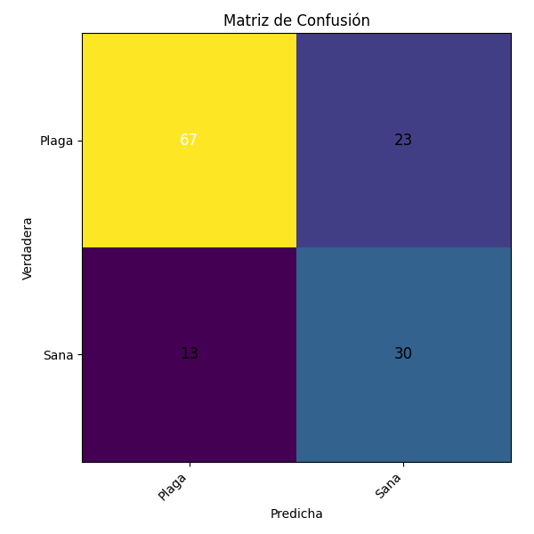

- **Fecha:** 2026-03-25 16:27:04
- **Modelo:** report_best_model_RANDOM_FOREST_MULTIESPECTRAL_20260325_1625.md
```text
[[67 23]
 [13 30]]
```


*Generado automáticamente por el sistema de detección de plagas.*

### 2 UMBRAL 0.5214
#### 2.1 Comando:

````bash
python src\pest_detection_models\evaluate.py data\multiespectral\TTADDA-dataset\TTADDA_NARO_2023_F1\drone_data -m src\pest_detection_models\best_models\best_model_final_random_forest_MULTIESPECTRAL_20260325_1611.joblib -mt rf -t 0.5214
````

#### 2.2 Consola:

````bash
2026-03-25 16:30:09.467949: I tensorflow/core/util/port.cc:153] oneDNN custom operations are on. You may see slightly different numerical results due to floating-point round-off errors from different computation orders. To turn them off, set the environment variable `TF_ENABLE_ONEDNN_OPTS=0`.
2026-03-25 16:30:10.768347: I tensorflow/core/util/port.cc:153] oneDNN custom operations are on. You may see slightly different numerical results due to floating-point round-off errors from different computation orders. To turn them off, set the environment variable `TF_ENABLE_ONEDNN_OPTS=0`.

--- [Fecha/hora inicio=20260325_1630] ---

--- [T=0.00s] ---
init. Evaluando RANDOM FOREST MULTIESPECTRAL

--- [Fecha/hora inicio=20260325_1630] ---

--- [T=0.00s] ---
1. Carga de datos cnn Multiespectral

--- [Fecha/hora inicio=20260325_1630] ---

--- [T=0.06s] ---
2. Filtrado y extracción de datos

--- [Fecha/hora inicio=20260325_1630] ---

--- [T=0.07s] ---
2.1. Iniciando procesamiento de 665 imágenes etiquetadas...

--- [Fecha/hora inicio=20260325_1630] ---

--- [T=0.07s] ---
2.2. Archivos seleccionados: ['red.tif', 'red edge.tif', 'nir.tif', 'blue.tif', 'green.tif']

--- [Fecha/hora inicio=20260325_1630] ---

--- [T=59.86s] ---
7. Extracción de imágenes completada.

Datos listos para entrenamiento. Total de muestras: 665

Resumen de Datos Multiespectrales:
Total de parches extraídos: 665
X Train/Val Split: 532 / 133
Y Train/Val Split: 532 / 133
Forma X_train: (532, 224, 224, 5)
Forma Y_train: (532,)
Distribución y_val: {np.int64(0): np.int64(90), np.int64(1): np.int64(43)}

--- [Fecha/hora inicio=20260325_1630] ---

--- [T=58.51s] ---
2. Cargando modelo...
2026-03-25 16:31:10.022663: I tensorflow/core/platform/cpu_feature_guard.cc:210] This TensorFlow binary is optimized to use available CPU instructions in performance-critical operations.
To enable the following instructions: SSE3 SSE4.1 SSE4.2 AVX AVX2 AVX_VNNI FMA, in other operations, rebuild TensorFlow with the appropriate compiler flags.

--- DEBUG RF ---
X_val shape: (133, 224, 224, 5)
X_val min: -3020207.8
X_val max: 1.0

--- [Fecha/hora inicio=20260325_1630] ---

--- [T=58.83s] ---
3. Extrayendo features...
5/5 ━━━━━━━━━━━━━━━━━━━━ 1s 187ms/step
Features shape: (133, 64)

--- [Fecha/hora inicio=20260325_1630] ---

--- [T=60.13s] ---
4. Prediciendo...

--- DEBUG PROB ---
MIN: 0.0
MAX: 1.0
STD: 0.3479576397721457
✅ Matriz de Confusión guardada en: C:\workspace\hd-image-pest-detection-cnn-and-rf\src\pest_detection_models\evaluation_results/RANDOM_FOREST/MULTIESPECTRAL/0.5214\report_best_model_RANDOM_FOREST_MULTIESPECTRAL_20260325_1630.png
Matriz de confusión:
[[70 20]
 [16 27]]

--- REPORTE ---
              precision    recall  f1-score   support

       Plaga       0.81      0.78      0.80        90
        Sana       0.57      0.63      0.60        43

    accuracy                           0.73       133
   macro avg       0.69      0.70      0.70       133
weighted avg       0.74      0.73      0.73       133


Reporte guardado en 'C:\workspace\hd-image-pest-detection-cnn-and-rf\src\pest_detection_models\evaluation_results/RANDOM_FOREST/MULTIESPECTRAL/0.5214\report_best_model_RANDOM_FOREST_MULTIESPECTRAL_20260325_1630.json'

--- [Fecha/hora inicio=20260325_1630] ---

--- [T=68.81s] ---
4. Evaluación y Reporte de Random Forest...

--- RESUMEN DEL REPORTE DE CLASIFICACIÓN ---
              precision    recall  f1-score   support

       Plaga       0.81      0.78      0.80        90
        Sana       0.57      0.63      0.60        43

    accuracy                           0.73       133
   macro avg       0.69      0.70      0.70       133
weighted avg       0.74      0.73      0.73       133

✅ Reporte Markdown (Tabla) guardado en: C:\workspace\hd-image-pest-detection-cnn-and-rf\src\pest_detection_models\evaluation_results/RANDOM_FOREST/MULTIESPECTRAL/0.5214\report_table_best_model_RANDOM_FOREST_MULTIESPECTRAL_20260325_1630.md
✅ Curva ROC guardada en: C:\workspace\hd-image-pest-detection-cnn-and-rf\src\pest_detection_models\evaluation_results/RANDOM_FOREST/MULTIESPECTRAL/0.5214\ROC_report_table_best_model_RANDOM_FOREST_MULTIESPECTRAL_20260325_1631_t0.5214.png
ROC guardada en C:\workspace\hd-image-pest-detection-cnn-and-rf\src\pest_detection_models\evaluation_results/RANDOM_FOREST/MULTIESPECTRAL/0.5214\ROC_data_report_table_best_model_RANDOM_FOREST_MULTIESPECTRAL_20260325_1631_t0.5214.npz (AUC=0.8443)
````

#### 2.3 Resultados:
##### 2.3.1 Reporte de clasificación json:

````json
{
  "Plaga": {
    "precision": 0.813953488372093,
    "recall": 0.7777777777777778,
    "f1-score": 0.7954545454545454,
    "support": 90.0
  },
  "Sana": {
    "precision": 0.574468085106383,
    "recall": 0.627906976744186,
    "f1-score": 0.6,
    "support": 43.0
  },
  "accuracy": 0.7293233082706767,
  "macro avg": {
    "precision": 0.694210786739238,
    "recall": 0.702842377260982,
    "f1-score": 0.6977272727272728,
    "support": 133.0
  },
  "weighted avg": {
    "precision": 0.7365258767899462,
    "recall": 0.7293233082706767,
    "f1-score": 0.7322624743677375,
    "support": 133.0
  }
}
````

##### 2.3.2 Reporte de clasificación tabla
# Reporte de Clasificación - RANDOM_FOREST_MULTIESPECTRAL_20260325_1630

- **Fecha:** 2026-03-25 16:31:20
- **Modelo:** RANDOM_FOREST_MULTIESPECTRAL_20260325_1630
- **Umbral de decisión:** por defecto 0.5

## Métricas por Clase

```text
              precision    recall  f1-score   support

       Plaga       0.81      0.78      0.80        90
        Sana       0.57      0.63      0.60        43

    accuracy                           0.73       133
   macro avg       0.69      0.70      0.70       133
weighted avg       0.74      0.73      0.73       133

```


*Generado automáticamente por el sistema de detección de plagas.*

##### 2.3.3 Matriz de confusión
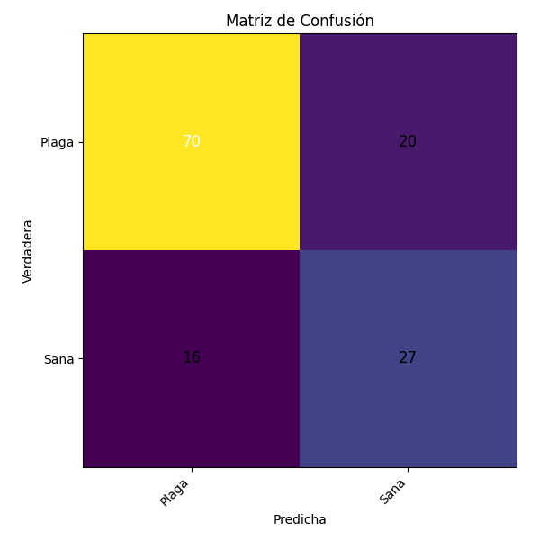

# Matriz de confusión

- **Fecha:** 2026-03-25 16:31:20
- **Modelo:** report_best_model_RANDOM_FOREST_MULTIESPECTRAL_20260325_1630.md
```text
[[70 20]
 [16 27]]
```


*Generado automáticamente por el sistema de detección de plagas.*

### 3 UMBRAL 0.70
#### 3.1 Comando:

````bash
python src\pest_detection_models\evaluate.py data\multiespectral\TTADDA-dataset\TTADDA_NARO_2023_F1\drone_data -m src\pest_detection_models\best_models\best_model_final_random_forest_MULTIESPECTRAL_20260325_1611.joblib -mt rf -t 0.7
````

#### 3.2 Consola:

````bash
2026-03-25 16:32:50.536965: I tensorflow/core/util/port.cc:153] oneDNN custom operations are on. You may see slightly different numerical results due to floating-point round-off errors from different computation orders. To turn them off, set the environment variable `TF_ENABLE_ONEDNN_OPTS=0`.
2026-03-25 16:32:52.101914: I tensorflow/core/util/port.cc:153] oneDNN custom operations are on. You may see slightly different numerical results due to floating-point round-off errors from different computation orders. To turn them off, set the environment variable `TF_ENABLE_ONEDNN_OPTS=0`.

--- [Fecha/hora inicio=20260325_1632] ---

--- [T=0.00s] ---
init. Evaluando RANDOM FOREST MULTIESPECTRAL

--- [Fecha/hora inicio=20260325_1632] ---

--- [T=0.00s] ---
1. Carga de datos cnn Multiespectral

--- [Fecha/hora inicio=20260325_1632] ---

--- [T=0.04s] ---
2. Filtrado y extracción de datos

--- [Fecha/hora inicio=20260325_1632] ---

--- [T=0.04s] ---
2.1. Iniciando procesamiento de 665 imágenes etiquetadas...

--- [Fecha/hora inicio=20260325_1632] ---

--- [T=0.04s] ---
2.2. Archivos seleccionados: ['red.tif', 'red edge.tif', 'nir.tif', 'blue.tif', 'green.tif']

--- [Fecha/hora inicio=20260325_1632] ---

--- [T=61.02s] ---
7. Extracción de imágenes completada.

Datos listos para entrenamiento. Total de muestras: 665

Resumen de Datos Multiespectrales:
Total de parches extraídos: 665
X Train/Val Split: 532 / 133
Y Train/Val Split: 532 / 133
Forma X_train: (532, 224, 224, 5)
Forma Y_train: (532,)
Distribución y_val: {np.int64(0): np.int64(90), np.int64(1): np.int64(43)}

--- [Fecha/hora inicio=20260325_1632] ---

--- [T=59.50s] ---
2. Cargando modelo...
2026-03-25 16:33:52.276349: I tensorflow/core/platform/cpu_feature_guard.cc:210] This TensorFlow binary is optimized to use available CPU instructions in performance-critical operations.
To enable the following instructions: SSE3 SSE4.1 SSE4.2 AVX AVX2 AVX_VNNI FMA, in other operations, rebuild TensorFlow with the appropriate compiler flags.

--- DEBUG RF ---
X_val shape: (133, 224, 224, 5)
X_val min: -3020207.8
X_val max: 1.0

--- [Fecha/hora inicio=20260325_1632] ---

--- [T=59.84s] ---
3. Extrayendo features...
5/5 ━━━━━━━━━━━━━━━━━━━━ 1s 177ms/step
Features shape: (133, 64)

--- [Fecha/hora inicio=20260325_1632] ---

--- [T=61.05s] ---
4. Prediciendo...

--- DEBUG PROB ---
MIN: 0.0
MAX: 1.0
STD: 0.3479576397721457
✅ Matriz de Confusión guardada en: C:\workspace\hd-image-pest-detection-cnn-and-rf\src\pest_detection_models\evaluation_results/RANDOM_FOREST/MULTIESPECTRAL/0.7\report_best_model_RANDOM_FOREST_MULTIESPECTRAL_20260325_1632.png
Matriz de confusión:
[[79 11]
 [25 18]]

--- REPORTE ---
              precision    recall  f1-score   support

       Plaga       0.76      0.88      0.81        90
        Sana       0.62      0.42      0.50        43

    accuracy                           0.73       133
   macro avg       0.69      0.65      0.66       133
weighted avg       0.71      0.73      0.71       133


Reporte guardado en 'C:\workspace\hd-image-pest-detection-cnn-and-rf\src\pest_detection_models\evaluation_results/RANDOM_FOREST/MULTIESPECTRAL/0.7\report_best_model_RANDOM_FOREST_MULTIESPECTRAL_20260325_1632.json'

--- [Fecha/hora inicio=20260325_1632] ---

--- [T=69.54s] ---
4. Evaluación y Reporte de Random Forest...

--- RESUMEN DEL REPORTE DE CLASIFICACIÓN ---
              precision    recall  f1-score   support

       Plaga       0.76      0.88      0.81        90
        Sana       0.62      0.42      0.50        43

    accuracy                           0.73       133
   macro avg       0.69      0.65      0.66       133
weighted avg       0.71      0.73      0.71       133

✅ Reporte Markdown (Tabla) guardado en: C:\workspace\hd-image-pest-detection-cnn-and-rf\src\pest_detection_models\evaluation_results/RANDOM_FOREST/MULTIESPECTRAL/0.7\report_table_best_model_RANDOM_FOREST_MULTIESPECTRAL_20260325_1632.md
✅ Curva ROC guardada en: C:\workspace\hd-image-pest-detection-cnn-and-rf\src\pest_detection_models\evaluation_results/RANDOM_FOREST/MULTIESPECTRAL/0.7\ROC_report_table_best_model_RANDOM_FOREST_MULTIESPECTRAL_20260325_1634_t0.7.png
ROC guardada en C:\workspace\hd-image-pest-detection-cnn-and-rf\src\pest_detection_models\evaluation_results/RANDOM_FOREST/MULTIESPECTRAL/0.7\ROC_data_report_table_best_model_RANDOM_FOREST_MULTIESPECTRAL_20260325_1634_t0.7.npz (AUC=0.8443)
````

#### 3.3 Resultados:
##### 3.3.1 Reporte de clasificación json:

````json
{
  "Plaga": {
    "precision": 0.7596153846153846,
    "recall": 0.8777777777777778,
    "f1-score": 0.8144329896907216,
    "support": 90.0
  },
  "Sana": {
    "precision": 0.6206896551724138,
    "recall": 0.4186046511627907,
    "f1-score": 0.5,
    "support": 43.0
  },
  "accuracy": 0.7293233082706767,
  "macro avg": {
    "precision": 0.6901525198938991,
    "recall": 0.6481912144702843,
    "f1-score": 0.6572164948453608,
    "support": 133.0
  },
  "weighted avg": {
    "precision": 0.7146995472766797,
    "recall": 0.7293233082706767,
    "f1-score": 0.7127742035501125,
    "support": 133.0
  }
}
````

##### 3.3.2 Reporte de clasificación tabla
# Reporte de Clasificación - RANDOM_FOREST_MULTIESPECTRAL_20260325_1632

- **Fecha:** 2026-03-25 16:34:02
- **Modelo:** RANDOM_FOREST_MULTIESPECTRAL_20260325_1632
- **Umbral de decisión:** por defecto 0.5

## Métricas por Clase

```text
              precision    recall  f1-score   support

       Plaga       0.76      0.88      0.81        90
        Sana       0.62      0.42      0.50        43

    accuracy                           0.73       133
   macro avg       0.69      0.65      0.66       133
weighted avg       0.71      0.73      0.71       133

```


*Generado automáticamente por el sistema de detección de plagas.*

##### 3.3.3 Matriz de confusión
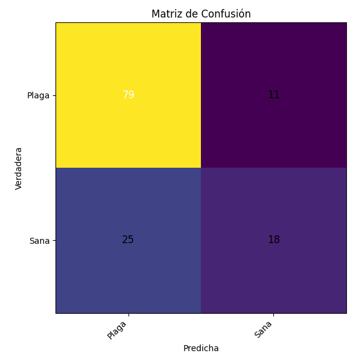

# Matriz de confusión

- **Fecha:** 2026-03-25 16:34:02
- **Modelo:** report_best_model_RANDOM_FOREST_MULTIESPECTRAL_20260325_1632.md
```text
[[79 11]
 [25 18]]
```


*Generado automáticamente por el sistema de detección de plagas.*

## CNN + RANDOM FOREST RGB
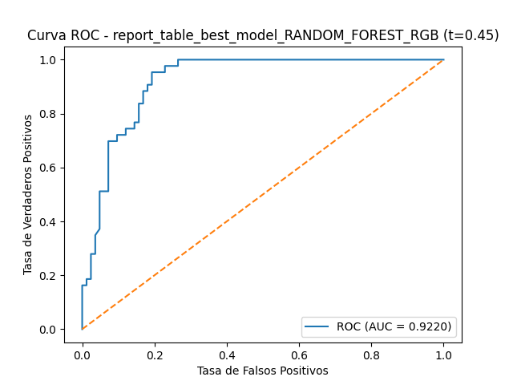

### 1 UMBRAL 0.45
#### 1.1 Comando:

````bash
python src\pest_detection_models\evaluate.py data\multiespectral\TTADDA-dataset\TTADDA_NARO_2023_F1\drone_data -m src\pest_detection_models\best_models\best_model_final_random_forest_RGB_20260325_1637.joblib -mt rf -t 0.45
````

#### 1.2 Consola:

````bash
2026-03-25 16:38:44.481041: I tensorflow/core/util/port.cc:153] oneDNN custom operations are on. You may see slightly different numerical results due to floating-point round-off errors from different computation orders. To turn them off, set the environment variable `TF_ENABLE_ONEDNN_OPTS=0`.
2026-03-25 16:38:45.737168: I tensorflow/core/util/port.cc:153] oneDNN custom operations are on. You may see slightly different numerical results due to floating-point round-off errors from different computation orders. To turn them off, set the environment variable `TF_ENABLE_ONEDNN_OPTS=0`.

--- [Fecha/hora inicio=20260325_1638] ---

--- [T=0.00s] ---
init. Evaluando RANDOM FOREST RGB

--- [Fecha/hora inicio=20260325_1638] ---

--- [T=0.00s] ---
1. Carga de datos cnn RGB

--- [Fecha/hora inicio=20260325_1638] ---

--- [T=0.03s] ---
2. Filtrado y extracción de datos

--- [Fecha/hora inicio=20260325_1638] ---

--- [T=0.03s] ---
2.1. Iniciando procesamiento de 665 imágenes etiquetadas...

--- [Fecha/hora inicio=20260325_1638] ---

--- [T=0.03s] ---
2.2. Archivos seleccionados: ['RGB.tif']
Imagen inválida: 4 canales (esperado 3)
Imagen inválida: 4 canales (esperado 3)
Imagen inválida: 4 canales (esperado 3)
Imagen inválida: 4 canales (esperado 3)
Imagen inválida: 4 canales (esperado 3)
Imagen inválida: 4 canales (esperado 3)
Imagen inválida: 4 canales (esperado 3)
Imagen inválida: 4 canales (esperado 3)
Imagen inválida: 4 canales (esperado 3)
Imagen inválida: 4 canales (esperado 3)
Imagen inválida: 4 canales (esperado 3)
Imagen inválida: 4 canales (esperado 3)
Imagen inválida: 4 canales (esperado 3)
Imagen inválida: 4 canales (esperado 3)
Imagen inválida: 4 canales (esperado 3)
Imagen inválida: 4 canales (esperado 3)
Imagen inválida: 4 canales (esperado 3)
Imagen inválida: 4 canales (esperado 3)
Imagen inválida: 4 canales (esperado 3)
Imagen inválida: 4 canales (esperado 3)
Imagen inválida: 4 canales (esperado 3)
Imagen inválida: 4 canales (esperado 3)
Imagen inválida: 4 canales (esperado 3)
Imagen inválida: 4 canales (esperado 3)
Imagen inválida: 4 canales (esperado 3)
Imagen inválida: 4 canales (esperado 3)
Imagen inválida: 4 canales (esperado 3)
Imagen inválida: 4 canales (esperado 3)
Imagen inválida: 4 canales (esperado 3)
Imagen inválida: 4 canales (esperado 3)
Imagen inválida: 4 canales (esperado 3)
Imagen inválida: 4 canales (esperado 3)
Imagen inválida: 4 canales (esperado 3)
Imagen inválida: 4 canales (esperado 3)
Imagen inválida: 4 canales (esperado 3)

--- [Fecha/hora inicio=20260325_1638] ---

--- [T=29.26s] ---
7. Extracción de imágenes completada.

Datos listos para entrenamiento. Total de muestras: 630

Resumen de Datos Multiespectrales:
Total de parches extraídos: 630
X Train/Val Split: 504 / 126
Y Train/Val Split: 504 / 126
Forma X_train: (504, 224, 224, 3)
Forma Y_train: (504,)
Distribución y_val: {np.int64(0): np.int64(83), np.int64(1): np.int64(43)}

--- [Fecha/hora inicio=20260325_1638] ---

--- [T=27.95s] ---
2. Cargando modelo...
2026-03-25 16:39:14.220507: I tensorflow/core/platform/cpu_feature_guard.cc:210] This TensorFlow binary is optimized to use available CPU instructions in performance-critical operations.
To enable the following instructions: SSE3 SSE4.1 SSE4.2 AVX AVX2 AVX_VNNI FMA, in other operations, rebuild TensorFlow with the appropriate compiler flags.

--- DEBUG RF ---
X_val shape: (126, 224, 224, 3)
X_val min: 0.0
X_val max: 1.0

--- [Fecha/hora inicio=20260325_1638] ---

--- [T=28.18s] ---
3. Extrayendo features...
4/4 ━━━━━━━━━━━━━━━━━━━━ 1s 224ms/step
Features shape: (126, 64)

--- [Fecha/hora inicio=20260325_1638] ---

--- [T=29.22s] ---
4. Prediciendo...

--- DEBUG PROB ---
MIN: 0.0
MAX: 1.0
STD: 0.3760748937006677
✅ Matriz de Confusión guardada en: C:\workspace\hd-image-pest-detection-cnn-and-rf\src\pest_detection_models\evaluation_results/RANDOM_FOREST/RGB/0.45\report_best_model_RANDOM_FOREST_RGB_20260325_1638.png
Matriz de confusión:
[[69 14]
 [ 6 37]]

--- REPORTE ---
              precision    recall  f1-score   support

       Plaga       0.92      0.83      0.87        83
        Sana       0.73      0.86      0.79        43

    accuracy                           0.84       126
   macro avg       0.82      0.85      0.83       126
weighted avg       0.85      0.84      0.84       126


Reporte guardado en 'C:\workspace\hd-image-pest-detection-cnn-and-rf\src\pest_detection_models\evaluation_results/RANDOM_FOREST/RGB/0.45\report_best_model_RANDOM_FOREST_RGB_20260325_1638.json'

--- [Fecha/hora inicio=20260325_1638] ---

--- [T=33.37s] ---
4. Evaluación y Reporte de Random Forest...

--- RESUMEN DEL REPORTE DE CLASIFICACIÓN ---
              precision    recall  f1-score   support

       Plaga       0.92      0.83      0.87        83
        Sana       0.73      0.86      0.79        43

    accuracy                           0.84       126
   macro avg       0.82      0.85      0.83       126
weighted avg       0.85      0.84      0.84       126

✅ Reporte Markdown (Tabla) guardado en: C:\workspace\hd-image-pest-detection-cnn-and-rf\src\pest_detection_models\evaluation_results/RANDOM_FOREST/RGB/0.45\report_table_best_model_RANDOM_FOREST_RGB_20260325_1638.md
✅ Curva ROC guardada en: C:\workspace\hd-image-pest-detection-cnn-and-rf\src\pest_detection_models\evaluation_results/RANDOM_FOREST/RGB/0.45\ROC_report_table_best_model_RANDOM_FOREST_RGB_20260325_1639_t0.45.png
ROC guardada en C:\workspace\hd-image-pest-detection-cnn-and-rf\src\pest_detection_models\evaluation_results/RANDOM_FOREST/RGB/0.45\ROC_data_report_table_best_model_RANDOM_FOREST_RGB_20260325_1639_t0.45.npz (AUC=0.9220)
````

#### 1.3 Resultados:
##### 1.3.1 Reporte de clasificación json:

````json
{
  "Plaga": {
    "precision": 0.92,
    "recall": 0.8313253012048193,
    "f1-score": 0.8734177215189873,
    "support": 83.0
  },
  "Sana": {
    "precision": 0.7254901960784313,
    "recall": 0.8604651162790697,
    "f1-score": 0.7872340425531915,
    "support": 43.0
  },
  "accuracy": 0.8412698412698413,
  "macro avg": {
    "precision": 0.8227450980392157,
    "recall": 0.8458952087419445,
    "f1-score": 0.8303258820360895,
    "support": 126.0
  },
  "weighted avg": {
    "precision": 0.8536196700902584,
    "recall": 0.8412698412698413,
    "f1-score": 0.8440058310782792,
    "support": 126.0
  }
}
````

##### 1.3.2 Reporte de clasificación tabla
# Reporte de Clasificación - RANDOM_FOREST_RGB_20260325_1638

- **Fecha:** 2026-03-25 16:39:19
- **Modelo:** RANDOM_FOREST_RGB_20260325_1638
- **Umbral de decisión:** por defecto 0.5

## Métricas por Clase

```text
              precision    recall  f1-score   support

       Plaga       0.92      0.83      0.87        83
        Sana       0.73      0.86      0.79        43

    accuracy                           0.84       126
   macro avg       0.82      0.85      0.83       126
weighted avg       0.85      0.84      0.84       126

```


*Generado automáticamente por el sistema de detección de plagas.*

##### 1.3.3 Matriz de confusión
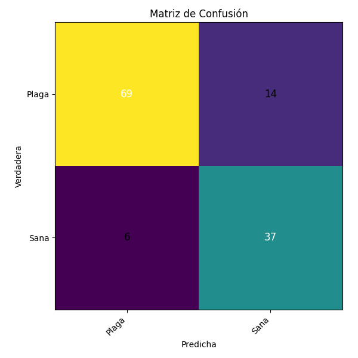

# Matriz de confusión

- **Fecha:** 2026-03-25 16:39:19
- **Modelo:** report_best_model_RANDOM_FOREST_RGB_20260325_1638.md
```text
[[69 14]
 [ 6 37]]
```


*Generado automáticamente por el sistema de detección de plagas.*

### 2 UMBRAL 0.5214
#### 2.1 Comando:

````bash
python src\pest_detection_models\evaluate.py data\multiespectral\TTADDA-dataset\TTADDA_NARO_2023_F1\drone_data -m src\pest_detection_models\best_models\best_model_final_random_forest_RGB_20260325_1637.joblib -mt rf -t 0.5214
````

#### 2.2 Consola:

````bash
2026-03-25 16:41:08.598837: I tensorflow/core/util/port.cc:153] oneDNN custom operations are on. You may see slightly different numerical results due to floating-point round-off errors from different computation orders. To turn them off, set the environment variable `TF_ENABLE_ONEDNN_OPTS=0`.
2026-03-25 16:41:09.830692: I tensorflow/core/util/port.cc:153] oneDNN custom operations are on. You may see slightly different numerical results due to floating-point round-off errors from different computation orders. To turn them off, set the environment variable `TF_ENABLE_ONEDNN_OPTS=0`.

--- [Fecha/hora inicio=20260325_1641] ---

--- [T=0.00s] ---
init. Evaluando RANDOM FOREST RGB

--- [Fecha/hora inicio=20260325_1641] ---

--- [T=0.00s] ---
1. Carga de datos cnn RGB

--- [Fecha/hora inicio=20260325_1641] ---

--- [T=0.04s] ---
2. Filtrado y extracción de datos

--- [Fecha/hora inicio=20260325_1641] ---

--- [T=0.04s] ---
2.1. Iniciando procesamiento de 665 imágenes etiquetadas...

--- [Fecha/hora inicio=20260325_1641] ---

--- [T=0.04s] ---
2.2. Archivos seleccionados: ['RGB.tif']
Imagen inválida: 4 canales (esperado 3)
Imagen inválida: 4 canales (esperado 3)
Imagen inválida: 4 canales (esperado 3)
Imagen inválida: 4 canales (esperado 3)
Imagen inválida: 4 canales (esperado 3)
Imagen inválida: 4 canales (esperado 3)
Imagen inválida: 4 canales (esperado 3)
Imagen inválida: 4 canales (esperado 3)
Imagen inválida: 4 canales (esperado 3)
Imagen inválida: 4 canales (esperado 3)
Imagen inválida: 4 canales (esperado 3)
Imagen inválida: 4 canales (esperado 3)
Imagen inválida: 4 canales (esperado 3)
Imagen inválida: 4 canales (esperado 3)
Imagen inválida: 4 canales (esperado 3)
Imagen inválida: 4 canales (esperado 3)
Imagen inválida: 4 canales (esperado 3)
Imagen inválida: 4 canales (esperado 3)
Imagen inválida: 4 canales (esperado 3)
Imagen inválida: 4 canales (esperado 3)
Imagen inválida: 4 canales (esperado 3)
Imagen inválida: 4 canales (esperado 3)
Imagen inválida: 4 canales (esperado 3)
Imagen inválida: 4 canales (esperado 3)
Imagen inválida: 4 canales (esperado 3)
Imagen inválida: 4 canales (esperado 3)
Imagen inválida: 4 canales (esperado 3)
Imagen inválida: 4 canales (esperado 3)
Imagen inválida: 4 canales (esperado 3)
Imagen inválida: 4 canales (esperado 3)
Imagen inválida: 4 canales (esperado 3)
Imagen inválida: 4 canales (esperado 3)
Imagen inválida: 4 canales (esperado 3)
Imagen inválida: 4 canales (esperado 3)
Imagen inválida: 4 canales (esperado 3)

--- [Fecha/hora inicio=20260325_1641] ---

--- [T=30.69s] ---
7. Extracción de imágenes completada.

Datos listos para entrenamiento. Total de muestras: 630

Resumen de Datos Multiespectrales:
Total de parches extraídos: 630
X Train/Val Split: 504 / 126
Y Train/Val Split: 504 / 126
Forma X_train: (504, 224, 224, 3)
Forma Y_train: (504,)
Distribución y_val: {np.int64(0): np.int64(83), np.int64(1): np.int64(43)}

--- [Fecha/hora inicio=20260325_1641] ---

--- [T=29.30s] ---
2. Cargando modelo...
2026-03-25 16:41:39.702051: I tensorflow/core/platform/cpu_feature_guard.cc:210] This TensorFlow binary is optimized to use available CPU instructions in performance-critical operations.
To enable the following instructions: SSE3 SSE4.1 SSE4.2 AVX AVX2 AVX_VNNI FMA, in other operations, rebuild TensorFlow with the appropriate compiler flags.

--- DEBUG RF ---
X_val shape: (126, 224, 224, 3)
X_val min: 0.0
X_val max: 1.0

--- [Fecha/hora inicio=20260325_1641] ---

--- [T=29.53s] ---
3. Extrayendo features...
4/4 ━━━━━━━━━━━━━━━━━━━━ 1s 234ms/step
Features shape: (126, 64)

--- [Fecha/hora inicio=20260325_1641] ---

--- [T=30.64s] ---
4. Prediciendo...

--- DEBUG PROB ---
MIN: 0.0
MAX: 1.0
STD: 0.3760748937006677
✅ Matriz de Confusión guardada en: C:\workspace\hd-image-pest-detection-cnn-and-rf\src\pest_detection_models\evaluation_results/RANDOM_FOREST/RGB/0.5214\report_best_model_RANDOM_FOREST_RGB_20260325_1641.png
Matriz de confusión:
[[70 13]
 [ 9 34]]

--- REPORTE ---
              precision    recall  f1-score   support

       Plaga       0.89      0.84      0.86        83
        Sana       0.72      0.79      0.76        43

    accuracy                           0.83       126
   macro avg       0.80      0.82      0.81       126
weighted avg       0.83      0.83      0.83       126


Reporte guardado en 'C:\workspace\hd-image-pest-detection-cnn-and-rf\src\pest_detection_models\evaluation_results/RANDOM_FOREST/RGB/0.5214\report_best_model_RANDOM_FOREST_RGB_20260325_1641.json'

--- [Fecha/hora inicio=20260325_1641] ---

--- [T=35.17s] ---
4. Evaluación y Reporte de Random Forest...

--- RESUMEN DEL REPORTE DE CLASIFICACIÓN ---
              precision    recall  f1-score   support

       Plaga       0.89      0.84      0.86        83
        Sana       0.72      0.79      0.76        43

    accuracy                           0.83       126
   macro avg       0.80      0.82      0.81       126
weighted avg       0.83      0.83      0.83       126

✅ Reporte Markdown (Tabla) guardado en: C:\workspace\hd-image-pest-detection-cnn-and-rf\src\pest_detection_models\evaluation_results/RANDOM_FOREST/RGB/0.5214\report_table_best_model_RANDOM_FOREST_RGB_20260325_1641.md
✅ Curva ROC guardada en: C:\workspace\hd-image-pest-detection-cnn-and-rf\src\pest_detection_models\evaluation_results/RANDOM_FOREST/RGB/0.5214\ROC_report_table_best_model_RANDOM_FOREST_RGB_20260325_1641_t0.5214.png
ROC guardada en C:\workspace\hd-image-pest-detection-cnn-and-rf\src\pest_detection_models\evaluation_results/RANDOM_FOREST/RGB/0.5214\ROC_data_report_table_best_model_RANDOM_FOREST_RGB_20260325_1641_t0.5214.npz (AUC=0.9220)
````

#### 2.3 Resultados:
##### 2.3.1 Reporte de clasificación json:

````json
{
  "Plaga": {
    "precision": 0.8860759493670886,
    "recall": 0.8433734939759037,
    "f1-score": 0.8641975308641975,
    "support": 83.0
  },
  "Sana": {
    "precision": 0.723404255319149,
    "recall": 0.7906976744186046,
    "f1-score": 0.7555555555555555,
    "support": 43.0
  },
  "accuracy": 0.8253968253968254,
  "macro avg": {
    "precision": 0.8047401023431188,
    "recall": 0.8170355841972541,
    "f1-score": 0.8098765432098765,
    "support": 126.0
  },
  "weighted avg": {
    "precision": 0.830561006160252,
    "recall": 0.8253968253968254,
    "f1-score": 0.8271213011953753,
    "support": 126.0
  }
}
````

##### 2.3.2 Reporte de clasificación tabla
# Reporte de Clasificación - RANDOM_FOREST_RGB_20260325_1641

- **Fecha:** 2026-03-25 16:41:45
- **Modelo:** RANDOM_FOREST_RGB_20260325_1641
- **Umbral de decisión:** por defecto 0.5

## Métricas por Clase

```text
              precision    recall  f1-score   support

       Plaga       0.89      0.84      0.86        83
        Sana       0.72      0.79      0.76        43

    accuracy                           0.83       126
   macro avg       0.80      0.82      0.81       126
weighted avg       0.83      0.83      0.83       126

```


*Generado automáticamente por el sistema de detección de plagas.*

##### 2.3.3 Matriz de confusión

# Matriz de confusión


- **Fecha:** 2026-03-25 16:41:45
- **Modelo:** report_best_model_RANDOM_FOREST_RGB_20260325_1641.md
```text
[[70 13]
 [ 9 34]]
```


*Generado automáticamente por el sistema de detección de plagas.*

### 3 UMBRAL 0.70
#### 3.1 Comando:

````bash
python src\pest_detection_models\evaluate.py data\multiespectral\TTADDA-dataset\TTADDA_NARO_2023_F1\drone_data -m src\pest_detection_models\best_models\best_model_final_random_forest_RGB_20260325_1637.joblib -mt rf -t 0.70
````

#### 3.2 Consola:

````bash
2026-03-25 16:42:42.739415: I tensorflow/core/util/port.cc:153] oneDNN custom operations are on. You may see slightly different numerical results due to floating-point round-off errors from different computation orders. To turn them off, set the environment variable `TF_ENABLE_ONEDNN_OPTS=0`.
2026-03-25 16:42:44.205156: I tensorflow/core/util/port.cc:153] oneDNN custom operations are on. You may see slightly different numerical results due to floating-point round-off errors from different computation orders. To turn them off, set the environment variable `TF_ENABLE_ONEDNN_OPTS=0`.

--- [Fecha/hora inicio=20260325_1642] ---

--- [T=0.00s] ---
init. Evaluando RANDOM FOREST RGB

--- [Fecha/hora inicio=20260325_1642] ---

--- [T=0.00s] ---
1. Carga de datos cnn RGB

--- [Fecha/hora inicio=20260325_1642] ---

--- [T=0.04s] ---
2. Filtrado y extracción de datos

--- [Fecha/hora inicio=20260325_1642] ---

--- [T=0.04s] ---
2.1. Iniciando procesamiento de 665 imágenes etiquetadas...

--- [Fecha/hora inicio=20260325_1642] ---

--- [T=0.04s] ---
2.2. Archivos seleccionados: ['RGB.tif']
Imagen inválida: 4 canales (esperado 3)
Imagen inválida: 4 canales (esperado 3)
Imagen inválida: 4 canales (esperado 3)
Imagen inválida: 4 canales (esperado 3)
Imagen inválida: 4 canales (esperado 3)
Imagen inválida: 4 canales (esperado 3)
Imagen inválida: 4 canales (esperado 3)
Imagen inválida: 4 canales (esperado 3)
Imagen inválida: 4 canales (esperado 3)
Imagen inválida: 4 canales (esperado 3)
Imagen inválida: 4 canales (esperado 3)
Imagen inválida: 4 canales (esperado 3)
Imagen inválida: 4 canales (esperado 3)
Imagen inválida: 4 canales (esperado 3)
Imagen inválida: 4 canales (esperado 3)
Imagen inválida: 4 canales (esperado 3)
Imagen inválida: 4 canales (esperado 3)
Imagen inválida: 4 canales (esperado 3)
Imagen inválida: 4 canales (esperado 3)
Imagen inválida: 4 canales (esperado 3)
Imagen inválida: 4 canales (esperado 3)
Imagen inválida: 4 canales (esperado 3)
Imagen inválida: 4 canales (esperado 3)
Imagen inválida: 4 canales (esperado 3)
Imagen inválida: 4 canales (esperado 3)
Imagen inválida: 4 canales (esperado 3)
Imagen inválida: 4 canales (esperado 3)
Imagen inválida: 4 canales (esperado 3)
Imagen inválida: 4 canales (esperado 3)
Imagen inválida: 4 canales (esperado 3)
Imagen inválida: 4 canales (esperado 3)
Imagen inválida: 4 canales (esperado 3)
Imagen inválida: 4 canales (esperado 3)
Imagen inválida: 4 canales (esperado 3)
Imagen inválida: 4 canales (esperado 3)

--- [Fecha/hora inicio=20260325_1642] ---

--- [T=33.08s] ---
7. Extracción de imágenes completada.

Datos listos para entrenamiento. Total de muestras: 630

Resumen de Datos Multiespectrales:
Total de parches extraídos: 630
X Train/Val Split: 504 / 126
Y Train/Val Split: 504 / 126
Forma X_train: (504, 224, 224, 3)
Forma Y_train: (504,)
Distribución y_val: {np.int64(0): np.int64(83), np.int64(1): np.int64(43)}

--- [Fecha/hora inicio=20260325_1642] ---

--- [T=31.33s] ---
2. Cargando modelo...
2026-03-25 16:43:16.212797: I tensorflow/core/platform/cpu_feature_guard.cc:210] This TensorFlow binary is optimized to use available CPU instructions in performance-critical operations.
To enable the following instructions: SSE3 SSE4.1 SSE4.2 AVX AVX2 AVX_VNNI FMA, in other operations, rebuild TensorFlow with the appropriate compiler flags.

--- DEBUG RF ---
X_val shape: (126, 224, 224, 3)
X_val min: 0.0
X_val max: 1.0

--- [Fecha/hora inicio=20260325_1642] ---

--- [T=31.57s] ---
3. Extrayendo features...
4/4 ━━━━━━━━━━━━━━━━━━━━ 1s 250ms/step
Features shape: (126, 64)

--- [Fecha/hora inicio=20260325_1642] ---

--- [T=32.67s] ---
4. Prediciendo...

--- DEBUG PROB ---
MIN: 0.0
MAX: 1.0
STD: 0.3760748937006677
✅ Matriz de Confusión guardada en: C:\workspace\hd-image-pest-detection-cnn-and-rf\src\pest_detection_models\evaluation_results/RANDOM_FOREST/RGB/0.7\report_best_model_RANDOM_FOREST_RGB_20260325_1642.png
Matriz de confusión:
[[77  6]
 [17 26]]

--- REPORTE ---
              precision    recall  f1-score   support

       Plaga       0.82      0.93      0.87        83
        Sana       0.81      0.60      0.69        43

    accuracy                           0.82       126
   macro avg       0.82      0.77      0.78       126
weighted avg       0.82      0.82      0.81       126


Reporte guardado en 'C:\workspace\hd-image-pest-detection-cnn-and-rf\src\pest_detection_models\evaluation_results/RANDOM_FOREST/RGB/0.7\report_best_model_RANDOM_FOREST_RGB_20260325_1642.json'

--- [Fecha/hora inicio=20260325_1642] ---

--- [T=34.59s] ---
4. Evaluación y Reporte de Random Forest...

--- RESUMEN DEL REPORTE DE CLASIFICACIÓN ---
              precision    recall  f1-score   support

       Plaga       0.82      0.93      0.87        83
        Sana       0.81      0.60      0.69        43

    accuracy                           0.82       126
   macro avg       0.82      0.77      0.78       126
weighted avg       0.82      0.82      0.81       126

✅ Reporte Markdown (Tabla) guardado en: C:\workspace\hd-image-pest-detection-cnn-and-rf\src\pest_detection_models\evaluation_results/RANDOM_FOREST/RGB/0.7\report_table_best_model_RANDOM_FOREST_RGB_20260325_1642.md
✅ Curva ROC guardada en: C:\workspace\hd-image-pest-detection-cnn-and-rf\src\pest_detection_models\evaluation_results/RANDOM_FOREST/RGB/0.7\ROC_report_table_best_model_RANDOM_FOREST_RGB_20260325_1643_t0.7.png
ROC guardada en C:\workspace\hd-image-pest-detection-cnn-and-rf\src\pest_detection_models\evaluation_results/RANDOM_FOREST/RGB/0.7\ROC_data_report_table_best_model_RANDOM_FOREST_RGB_20260325_1643_t0.7.npz (AUC=0.9220)
````

#### 3.3 Resultados:
##### 3.3.1 Reporte de clasificación json:

````json
{
  "Plaga": {
    "precision": 0.7596153846153846,
    "recall": 0.8777777777777778,
    "f1-score": 0.8144329896907216,
    "support": 90.0
  },
  "Sana": {
    "precision": 0.6206896551724138,
    "recall": 0.4186046511627907,
    "f1-score": 0.5,
    "support": 43.0
  },
  "accuracy": 0.7293233082706767,
  "macro avg": {
    "precision": 0.6901525198938991,
    "recall": 0.6481912144702843,
    "f1-score": 0.6572164948453608,
    "support": 133.0
  },
  "weighted avg": {
    "precision": 0.7146995472766797,
    "recall": 0.7293233082706767,
    "f1-score": 0.7127742035501125,
    "support": 133.0
  }
}
````

##### 3.3.2 Reporte de clasificación tabla
# Reporte de Clasificación - RANDOM_FOREST_MULTIESPECTRAL_20260325_1632

- **Fecha:** 2026-03-25 16:34:02
- **Modelo:** RANDOM_FOREST_MULTIESPECTRAL_20260325_1632
- **Umbral de decisión:** por defecto 0.5

## Métricas por Clase

```text
              precision    recall  f1-score   support

       Plaga       0.76      0.88      0.81        90
        Sana       0.62      0.42      0.50        43

    accuracy                           0.73       133
   macro avg       0.69      0.65      0.66       133
weighted avg       0.71      0.73      0.71       133

```


*Generado automáticamente por el sistema de detección de plagas.*

##### 3.3.3 Matriz de confusión


# Matriz de confusión

- **Fecha:** 2026-03-25 16:34:02
- **Modelo:** report_best_model_RANDOM_FOREST_MULTIESPECTRAL_20260325_1632.md
```text
[[79 11]
 [25 18]]
```


*Generado automáticamente por el sistema de detección de plagas.*