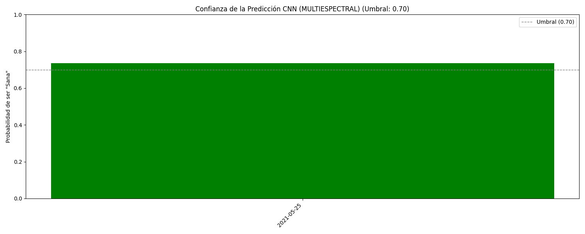
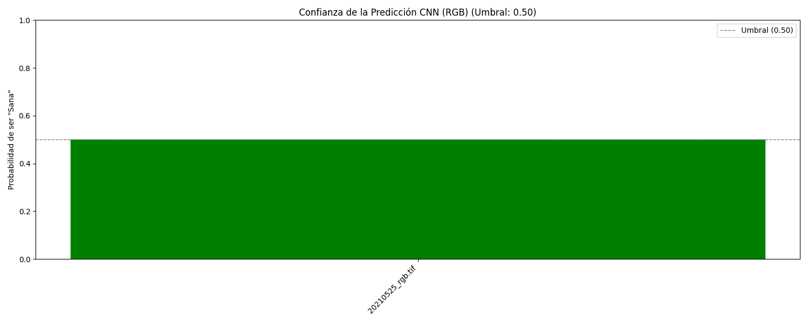
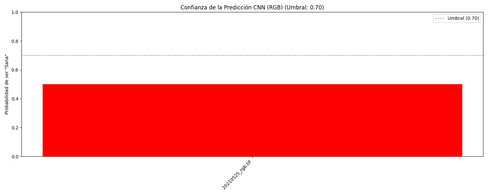
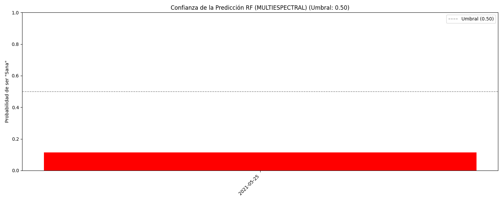
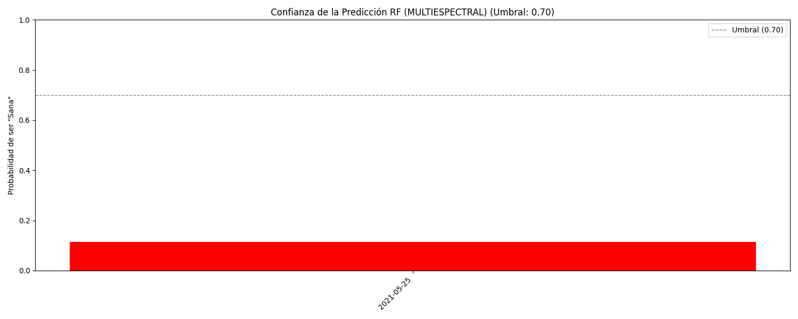
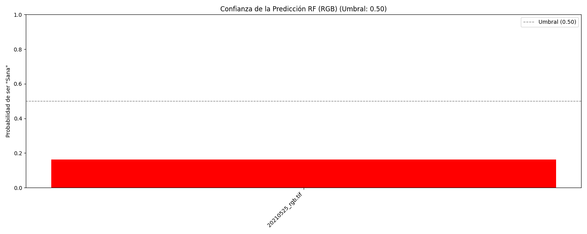
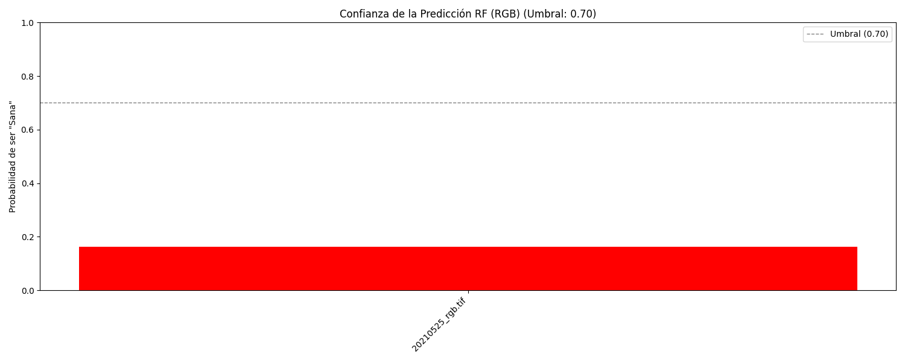

# Resultados de Inferencia
## Convolutional Neural Network (CNN) Multiespectral (MS) Focal Loss (FL)
### UMBRAL 0.45
#### Comando:

````bash
python src\pest_detection_models\inference_models.py predict-test\multiespectral\TTADDA_NARO_2021_F1\drone_data\2021-05-25 -m src\pest_detection_models\best_models\best_model_final_MULTIESPECTRAL_focal_loss.keras -t 0.45 -mt cnn
````

#### Consola/Logs:
````bash
(venv) PS C:\workspace\hd-image-pest-detection-cnn-and-rf> python src\pest_detection_models\inference_models.py predict-test\multiespectral\TTADDA_NARO_2021_F1\drone_data\2021-05-25 -m src\pest_detection_models\best_models\best_model_final_MULTIESPECTRAL_focal_loss.keras -t 0.45 -mt cnn
2026-04-17 09:17:40.593356: I tensorflow/core/util/port.cc:153] oneDNN custom operations are on. You may see slightly different numerical results due to floating-point round-off errors from different computation orders. To turn them off, set the environment variable `TF_ENABLE_ONEDNN_OPTS=0`.
2026-04-17 09:17:42.111254: I tensorflow/core/util/port.cc:153] oneDNN custom operations are on. You may see slightly different numerical results due to floating-point round-off errors from different computation orders. To turn them off, set the environment variable `TF_ENABLE_ONEDNN_OPTS=0`.

--- [Fecha/hora inicio=20260417_0917] ---

--- [T=0.00s] ---
init. 🚀 Modo: MULTIESPECTRAL | Arq: CNN | Config: Focal Loss

--- [Fecha/hora inicio=20260417_0917] ---

--- [T=0.00s] ---
1. ⏳ Cargando modelo: best_model_final_MULTIESPECTRAL_focal_loss.keras
2026-04-17 09:17:43.238058: I tensorflow/core/platform/cpu_feature_guard.cc:210] This TensorFlow binary is optimized to use available CPU instructions in performance-critical operations.
To enable the following instructions: SSE3 SSE4.1 SSE4.2 AVX AVX2 AVX_VNNI FMA, in other operations, rebuild TensorFlow with the appropriate compiler flags.

--- [Fecha/hora inicio=20260417_0917] ---

--- [T=0.08s] ---
2. 🔎 Procesando imágenes y realizando predicción...

--- [Fecha/hora inicio=20260417_0917] ---

--- [T=2.18s] ---
3. ✅ Inferencia completada. Procesados: 1 items.
📂 JSON guardado en: C:\workspace\hd-image-pest-detection-cnn-and-rf\src\pest_detection_models\inference-results/cnn/Focal Loss/MULTIESPECTRAL/0.45\results_MULTIESPECTRAL_focal_loss_t0.45_20260417_0917.json
📈 Gráfico de confianza guardado en: C:\workspace\hd-image-pest-detection-cnn-and-rf\src\pest_detection_models\inference-results/cnn/Focal Loss/MULTIESPECTRAL/0.45\inference_confidence_plot_CNN_MULTIESPECTRAL_20260417_0917.png

--- [Fecha/hora inicio=20260417_0917] ---

--- [T=2.34s] ---
END. ✨ Proceso finalizado. Resultados en: C:\workspace\hd-image-pest-detection-cnn-and-rf\src\pest_detection_models\inference-results/cnn/Focal Loss/MULTIESPECTRAL/0.45 
````

#### Resultados:
* JSON:

````json
[
    {
        "file_name": "2021-05-25",
        "prob_sana": 0.7185,
        "prob_plaga": 0.2815,
        "prediccion": "Sana",
        "umbral": 0.45,
        "modelo": "best_model_final_MULTIESPECTRAL_focal_loss.keras"
    }
]
````

* Gráfico:


### UMBRAL 0.50
#### Comando:
````bash
python src\pest_detection_models\inference_models.py predict-test\multiespectral\TTADDA_NARO_2021_F1\drone_data\2021-05-25 -m src\pest_detection_models\best_models\best_model_final_MULTIESPECTRAL_focal_loss.keras -t 0.50 -mt cnn 
````
#### Consola/Logs:
````bash
(venv) PS C:\workspace\hd-image-pest-detection-cnn-and-rf> python src\pest_detection_models\inference_models.py predict-test\multiespectral\TTADDA_NARO_2021_F1\drone_data\2021-05-25 -m src\pest_detection_models\best_models\best_model_final_MULTIESPECTRAL_focal_loss.keras -t 0.50 -mt cnn 
2026-04-17 09:17:58.930016: I tensorflow/core/util/port.cc:153] oneDNN custom operations are on. You may see slightly different numerical results due to floating-point round-off errors from different computation orders. To turn them off, set the environment variable `TF_ENABLE_ONEDNN_OPTS=0`.
2026-04-17 09:18:00.572932: I tensorflow/core/util/port.cc:153] oneDNN custom operations are on. You may see slightly different numerical results due to floating-point round-off errors from different computation orders. To turn them off, set the environment variable `TF_ENABLE_ONEDNN_OPTS=0`.

--- [Fecha/hora inicio=20260417_0918] ---

--- [T=0.00s] ---
init. 🚀 Modo: MULTIESPECTRAL | Arq: CNN | Config: Focal Loss

--- [Fecha/hora inicio=20260417_0918] ---

--- [T=0.00s] ---
1. ⏳ Cargando modelo: best_model_final_MULTIESPECTRAL_focal_loss.keras
2026-04-17 09:18:01.839408: I tensorflow/core/platform/cpu_feature_guard.cc:210] This TensorFlow binary is optimized to use available CPU instructions in performance-critical operations.
To enable the following instructions: SSE3 SSE4.1 SSE4.2 AVX AVX2 AVX_VNNI FMA, in other operations, rebuild TensorFlow with the appropriate compiler flags.

--- [Fecha/hora inicio=20260417_0918] ---

--- [T=0.09s] ---
2. 🔎 Procesando imágenes y realizando predicción...

--- [Fecha/hora inicio=20260417_0918] ---

--- [T=2.42s] ---
3. ✅ Inferencia completada. Procesados: 1 items.
📂 JSON guardado en: C:\workspace\hd-image-pest-detection-cnn-and-rf\src\pest_detection_models\inference-results/cnn/Focal Loss/MULTIESPECTRAL/0.5\results_MULTIESPECTRAL_focal_loss_t0.5_20260417_0918.json
📈 Gráfico de confianza guardado en: C:\workspace\hd-image-pest-detection-cnn-and-rf\src\pest_detection_models\inference-results/cnn/Focal Loss/MULTIESPECTRAL/0.5\inference_confidence_plot_CNN_MULTIESPECTRAL_20260417_0918.png

--- [Fecha/hora inicio=20260417_0918] ---

--- [T=2.60s] ---
END. ✨ Proceso finalizado. Resultados en: C:\workspace\hd-image-pest-detection-cnn-and-rf\src\pest_detection_models\inference-results/cnn/Focal Loss/MULTIESPECTRAL/0.5  
````

#### Resultados:
* JSON:
````json
[
    {
        "file_name": "2021-05-25",
        "prob_sana": 0.7185,
        "prob_plaga": 0.2815,
        "prediccion": "Sana",
        "umbral": 0.5,
        "modelo": "best_model_final_MULTIESPECTRAL_focal_loss.keras"
    }
]
````
* Gráfico:


### UMBRAL 0.70
#### Comando:
````bash
python src\pest_detection_models\inference_models.py predict-test\multiespectral\TTADDA_NARO_2021_F1\drone_data\2021-05-25 -m src\pest_detection_models\best_models\best_model_final_MULTIESPECTRAL_focal_loss.keras -t 0.70 -mt cnn  

````
#### Consola/Logs:
````bash
(venv) PS C:\workspace\hd-image-pest-detection-cnn-and-rf> python src\pest_detection_models\inference_models.py predict-test\multiespectral\TTADDA_NARO_2021_F1\drone_data\2021-05-25 -m src\pest_detection_models\best_models\best_model_final_MULTIESPECTRAL_focal_loss.keras -t 0.70 -mt cnn 
2026-04-17 09:18:10.066295: I tensorflow/core/util/port.cc:153] oneDNN custom operations are on. You may see slightly different numerical results due to floating-point round-off errors from different computation orders. To turn them off, set the environment variable `TF_ENABLE_ONEDNN_OPTS=0`.
2026-04-17 09:18:11.401420: I tensorflow/core/util/port.cc:153] oneDNN custom operations are on. You may see slightly different numerical results due to floating-point round-off errors from different computation orders. To turn them off, set the environment variable `TF_ENABLE_ONEDNN_OPTS=0`.

--- [Fecha/hora inicio=20260417_0918] ---

--- [T=0.00s] ---
init. 🚀 Modo: MULTIESPECTRAL | Arq: CNN | Config: Focal Loss

--- [Fecha/hora inicio=20260417_0918] ---

--- [T=0.00s] ---
1. ⏳ Cargando modelo: best_model_final_MULTIESPECTRAL_focal_loss.keras
2026-04-17 09:18:12.430643: I tensorflow/core/platform/cpu_feature_guard.cc:210] This TensorFlow binary is optimized to use available CPU instructions in performance-critical operations.
To enable the following instructions: SSE3 SSE4.1 SSE4.2 AVX AVX2 AVX_VNNI FMA, in other operations, rebuild TensorFlow with the appropriate compiler flags.

--- [Fecha/hora inicio=20260417_0918] ---

--- [T=0.08s] ---
2. 🔎 Procesando imágenes y realizando predicción...

--- [Fecha/hora inicio=20260417_0918] ---

--- [T=2.18s] ---
3. ✅ Inferencia completada. Procesados: 1 items.
📂 JSON guardado en: C:\workspace\hd-image-pest-detection-cnn-and-rf\src\pest_detection_models\inference-results/cnn/Focal Loss/MULTIESPECTRAL/0.7\results_MULTIESPECTRAL_focal_loss_t0.7_20260417_0918.json
📈 Gráfico de confianza guardado en: C:\workspace\hd-image-pest-detection-cnn-and-rf\src\pest_detection_models\inference-results/cnn/Focal Loss/MULTIESPECTRAL/0.7\inference_confidence_plot_CNN_MULTIESPECTRAL_20260417_0918.png

--- [Fecha/hora inicio=20260417_0918] ---

--- [T=2.37s] ---
END. ✨ Proceso finalizado. Resultados en: C:\workspace\hd-image-pest-detection-cnn-and-rf\src\pest_detection_models\inference-results/cnn/Focal Loss/MULTIESPECTRAL/0.7 
````

#### Resultados:
* JSON:
````json
[
    {
        "file_name": "2021-05-25",
        "prob_sana": 0.7185,
        "prob_plaga": 0.2815,
        "prediccion": "Sana",
        "umbral": 0.7,
        "modelo": "best_model_final_MULTIESPECTRAL_focal_loss.keras"
    }
]
````
* Gráfico:


## Convolutional Neural Network (CNN) Multiespectral (MS) Binary Cross Entropy (BCE)
### UMBRAL 0.45
#### Comando:
````bash
python src\pest_detection_models\inference_models.py predict-test\multiespectral\TTADDA_NARO_2021_F1\drone_data\2021-05-25 -m src\pest_detection_models\best_models\best_model_final_MULTIESPECTRAL_binary_crossentropy.keras -t 0.45 -mt cnn
````
#### Consola/Logs:
````bash
(venv) PS C:\workspace\hd-image-pest-detection-cnn-and-rf> python src\pest_detection_models\inference_models.py predict-test\multiespectral\TTADDA_NARO_2021_F1\drone_data\2021-05-25 -m src\pest_detection_models\best_models\best_model_final_MULTIESPECTRAL_binary_crossentropy.keras -t 0.45 -mt cnn 
2026-04-17 09:22:08.099920: I tensorflow/core/util/port.cc:153] oneDNN custom operations are on. You may see slightly different numerical results due to floating-point round-off errors from different computation orders. To turn them off, set the environment variable `TF_ENABLE_ONEDNN_OPTS=0`.
2026-04-17 09:22:09.564347: I tensorflow/core/util/port.cc:153] oneDNN custom operations are on. You may see slightly different numerical results due to floating-point round-off errors from different computation orders. To turn them off, set the environment variable `TF_ENABLE_ONEDNN_OPTS=0`.

--- [Fecha/hora inicio=20260417_0922] ---

--- [T=0.00s] ---
init. 🚀 Modo: MULTIESPECTRAL | Arq: CNN | Config: BCE

--- [Fecha/hora inicio=20260417_0922] ---

--- [T=0.00s] ---
1. ⏳ Cargando modelo: best_model_final_MULTIESPECTRAL_binary_crossentropy.keras
2026-04-17 09:22:10.664144: I tensorflow/core/platform/cpu_feature_guard.cc:210] This TensorFlow binary is optimized to use available CPU instructions in performance-critical operations.
To enable the following instructions: SSE3 SSE4.1 SSE4.2 AVX AVX2 AVX_VNNI FMA, in other operations, rebuild TensorFlow with the appropriate compiler flags.

--- [Fecha/hora inicio=20260417_0922] ---

--- [T=0.10s] ---
2. 🔎 Procesando imágenes y realizando predicción...

--- [Fecha/hora inicio=20260417_0922] ---

--- [T=2.24s] ---
3. ✅ Inferencia completada. Procesados: 1 items.
📂 JSON guardado en: C:\workspace\hd-image-pest-detection-cnn-and-rf\src\pest_detection_models\inference-results/cnn/BCE/MULTIESPECTRAL/0.45\results_MULTIESPECTRAL_bce_t0.45_20260417_0922.json
📈 Gráfico de confianza guardado en: C:\workspace\hd-image-pest-detection-cnn-and-rf\src\pest_detection_models\inference-results/cnn/BCE/MULTIESPECTRAL/0.45\inference_confidence_plot_CNN_MULTIESPECTRAL_20260417_0922.png

--- [Fecha/hora inicio=20260417_0922] ---

--- [T=2.40s] ---
END. ✨ Proceso finalizado. Resultados en: C:\workspace\hd-image-pest-detection-cnn-and-rf\src\pest_detection_models\inference-results/cnn/BCE/MULTIESPECTRAL/0.45 
````

#### Resultados:
* JSON:
````json
[
    {
        "file_name": "2021-05-25",
        "prob_sana": 0.7353,
        "prob_plaga": 0.2647,
        "prediccion": "Sana",
        "umbral": 0.45,
        "modelo": "best_model_final_MULTIESPECTRAL_binary_crossentropy.keras"
    }
]
````
* Gráfico:


### UMBRAL 0.50
#### Comando:
````bash
python src\pest_detection_models\inference_models.py predict-test\multiespectral\TTADDA_NARO_2021_F1\drone_data\2021-05-25 -m src\pest_detection_models\best_models\best_model_final_MULTIESPECTRAL_binary_crossentropy.keras -t 0.50 -mt cnn
````
#### Consola/Logs:
````bash
(venv) PS C:\workspace\hd-image-pest-detection-cnn-and-rf> python src\pest_detection_models\inference_models.py predict-test\multiespectral\TTADDA_NARO_2021_F1\drone_data\2021-05-25 -m src\pest_detection_models\best_models\best_model_final_MULTIESPECTRAL_binary_crossentropy.keras -t 0.50 -mt cnn 
2026-04-17 09:23:08.323879: I tensorflow/core/util/port.cc:153] oneDNN custom operations are on. You may see slightly different numerical results due to floating-point round-off errors from different computation orders. To turn them off, set the environment variable `TF_ENABLE_ONEDNN_OPTS=0`.
2026-04-17 09:23:09.666437: I tensorflow/core/util/port.cc:153] oneDNN custom operations are on. You may see slightly different numerical results due to floating-point round-off errors from different computation orders. To turn them off, set the environment variable `TF_ENABLE_ONEDNN_OPTS=0`.

--- [Fecha/hora inicio=20260417_0923] ---

--- [T=0.00s] ---
init. 🚀 Modo: MULTIESPECTRAL | Arq: CNN | Config: BCE

--- [Fecha/hora inicio=20260417_0923] ---

--- [T=0.00s] ---
1. ⏳ Cargando modelo: best_model_final_MULTIESPECTRAL_binary_crossentropy.keras
2026-04-17 09:23:10.682743: I tensorflow/core/platform/cpu_feature_guard.cc:210] This TensorFlow binary is optimized to use available CPU instructions in performance-critical operations.
To enable the following instructions: SSE3 SSE4.1 SSE4.2 AVX AVX2 AVX_VNNI FMA, in other operations, rebuild TensorFlow with the appropriate compiler flags.

--- [Fecha/hora inicio=20260417_0923] ---

--- [T=0.08s] ---
2. 🔎 Procesando imágenes y realizando predicción...

--- [Fecha/hora inicio=20260417_0923] ---

--- [T=2.24s] ---
3. ✅ Inferencia completada. Procesados: 1 items.
📂 JSON guardado en: C:\workspace\hd-image-pest-detection-cnn-and-rf\src\pest_detection_models\inference-results/cnn/BCE/MULTIESPECTRAL/0.5\results_MULTIESPECTRAL_bce_t0.5_20260417_0923.json
📈 Gráfico de confianza guardado en: C:\workspace\hd-image-pest-detection-cnn-and-rf\src\pest_detection_models\inference-results/cnn/BCE/MULTIESPECTRAL/0.5\inference_confidence_plot_CNN_MULTIESPECTRAL_20260417_0923.png

--- [Fecha/hora inicio=20260417_0923] ---

--- [T=2.41s] ---
END. ✨ Proceso finalizado. Resultados en: C:\workspace\hd-image-pest-detection-cnn-and-rf\src\pest_detection_models\inference-results/cnn/BCE/MULTIESPECTRAL/0.5
````

#### Resultados:
* JSON:
````json
[
    {
        "file_name": "2021-05-25",
        "prob_sana": 0.7353,
        "prob_plaga": 0.2647,
        "prediccion": "Sana",
        "umbral": 0.5,
        "modelo": "best_model_final_MULTIESPECTRAL_binary_crossentropy.keras"
    }
]
````
* Gráfico:


### UMBRAL 0.70
#### Comando:
````bash
python src\pest_detection_models\inference_models.py predict-test\multiespectral\TTADDA_NARO_2021_F1\drone_data\2021-05-25 -m src\pest_detection_models\best_models\best_model_final_MULTIESPECTRAL_binary_crossentropy.keras -t 0.70 -mt cnn
````
#### Consola/Logs:
````bash
(venv) PS C:\workspace\hd-image-pest-detection-cnn-and-rf> python src\pest_detection_models\inference_models.py predict-test\multiespectral\TTADDA_NARO_2021_F1\drone_data\2021-05-25 -m src\pest_detection_models\best_models\best_model_final_MULTIESPECTRAL_binary_crossentropy.keras -t 0.70 -mt cnn 
2026-04-17 09:24:40.301817: I tensorflow/core/util/port.cc:153] oneDNN custom operations are on. You may see slightly different numerical results due to floating-point round-off errors from different computation orders. To turn them off, set the environment variable `TF_ENABLE_ONEDNN_OPTS=0`.
2026-04-17 09:24:41.730094: I tensorflow/core/util/port.cc:153] oneDNN custom operations are on. You may see slightly different numerical results due to floating-point round-off errors from different computation orders. To turn them off, set the environment variable `TF_ENABLE_ONEDNN_OPTS=0`.

--- [Fecha/hora inicio=20260417_0924] ---

--- [T=0.00s] ---
init. 🚀 Modo: MULTIESPECTRAL | Arq: CNN | Config: BCE

--- [Fecha/hora inicio=20260417_0924] ---

--- [T=0.00s] ---
1. ⏳ Cargando modelo: best_model_final_MULTIESPECTRAL_binary_crossentropy.keras
2026-04-17 09:24:42.800063: I tensorflow/core/platform/cpu_feature_guard.cc:210] This TensorFlow binary is optimized to use available CPU instructions in performance-critical operations.
To enable the following instructions: SSE3 SSE4.1 SSE4.2 AVX AVX2 AVX_VNNI FMA, in other operations, rebuild TensorFlow with the appropriate compiler flags.

--- [Fecha/hora inicio=20260417_0924] ---

--- [T=0.07s] ---
2. 🔎 Procesando imágenes y realizando predicción...

--- [Fecha/hora inicio=20260417_0924] ---

--- [T=2.22s] ---
3. ✅ Inferencia completada. Procesados: 1 items.
📂 JSON guardado en: C:\workspace\hd-image-pest-detection-cnn-and-rf\src\pest_detection_models\inference-results/cnn/BCE/MULTIESPECTRAL/0.7\results_MULTIESPECTRAL_bce_t0.7_20260417_0924.json
📈 Gráfico de confianza guardado en: C:\workspace\hd-image-pest-detection-cnn-and-rf\src\pest_detection_models\inference-results/cnn/BCE/MULTIESPECTRAL/0.7\inference_confidence_plot_CNN_MULTIESPECTRAL_20260417_0924.png

--- [Fecha/hora inicio=20260417_0924] ---

--- [T=2.37s] ---
END. ✨ Proceso finalizado. Resultados en: C:\workspace\hd-image-pest-detection-cnn-and-rf\src\pest_detection_models\inference-results/cnn/BCE/MULTIESPECTRAL/0.7
````

#### Resultados:
* JSON:
````json
[
    {
        "file_name": "2021-05-25",
        "prob_sana": 0.7353,
        "prob_plaga": 0.2647,
        "prediccion": "Sana",
        "umbral": 0.7,
        "modelo": "best_model_final_MULTIESPECTRAL_binary_crossentropy.keras"
    }
]
````
* Gráfico:


## Convolutional Neural Network (CNN) RGB (RGB) Focal Loss (FL)
### UMBRAL 0.45
#### Comando:
````bash
python src\pest_detection_models\inference_models.py predict-test\multiespectral\TTADDA_NARO_2021_F1\drone_data\2021-05-25\20210525_rgb.tif -m src\pest_detection_models\best_models\best_model_final_RGB_focal_loss.keras -t 0.45 -mt cnn
````
#### Consola/Logs:
````bash
(venv) PS C:\workspace\hd-image-pest-detection-cnn-and-rf> python src\pest_detection_models\inference_models.py predict-test\multiespectral\TTADDA_NARO_2021_F1\drone_data\2021-05-25\20210525_rgb.tif -m src\pest_detection_models\best_models\best_model_final_RGB_focal_loss.keras -t 0.45 -mt cnn
2026-04-17 09:26:57.836792: I tensorflow/core/util/port.cc:153] oneDNN custom operations are on. You may see slightly different numerical results due to floating-point round-off errors from different computation orders. To turn them off, set the environment variable `TF_ENABLE_ONEDNN_OPTS=0`.
2026-04-17 09:26:59.296002: I tensorflow/core/util/port.cc:153] oneDNN custom operations are on. You may see slightly different numerical results due to floating-point round-off errors from different computation orders. To turn them off, set the environment variable `TF_ENABLE_ONEDNN_OPTS=0`.

--- [Fecha/hora inicio=20260417_0927] ---

--- [T=0.00s] ---
init. 🚀 Modo: RGB | Arq: CNN | Config: Focal Loss

--- [Fecha/hora inicio=20260417_0927] ---

--- [T=0.00s] ---
1. ⏳ Cargando modelo: best_model_final_RGB_focal_loss.keras
2026-04-17 09:27:00.489656: I tensorflow/core/platform/cpu_feature_guard.cc:210] This TensorFlow binary is optimized to use available CPU instructions in performance-critical operations.
To enable the following instructions: SSE3 SSE4.1 SSE4.2 AVX AVX2 AVX_VNNI FMA, in other operations, rebuild TensorFlow with the appropriate compiler flags.

--- [Fecha/hora inicio=20260417_0927] ---

--- [T=0.09s] ---
2. 🔎 Procesando imágenes y realizando predicción...

--- [Fecha/hora inicio=20260417_0927] ---

--- [T=0.76s] ---
3. ✅ Inferencia completada. Procesados: 1 items.
📂 JSON guardado en: C:\workspace\hd-image-pest-detection-cnn-and-rf\src\pest_detection_models\inference-results/cnn/Focal Loss/RGB/0.45\results_RGB_focal_loss_t0.45_20260417_0927.json
📈 Gráfico de confianza guardado en: C:\workspace\hd-image-pest-detection-cnn-and-rf\src\pest_detection_models\inference-results/cnn/Focal Loss/RGB/0.45\inference_confidence_plot_CNN_RGB_20260417_0927.png

--- [Fecha/hora inicio=20260417_0927] ---

--- [T=0.91s] ---
END. ✨ Proceso finalizado. Resultados en: C:\workspace\hd-image-pest-detection-cnn-and-rf\src\pest_detection_models\inference-results/cnn/Focal Loss/RGB/0.45
````

#### Resultados:
* JSON:
````json
[
    {
        "file_name": "20210525_rgb.tif",
        "prob_sana": 0.5014,
        "prob_plaga": 0.4986,
        "prediccion": "Sana",
        "umbral": 0.45,
        "modelo": "best_model_final_RGB_focal_loss.keras"
    }
]
````
* Gráfico:


### UMBRAL 0.50
#### Comando:
````bash
python src\pest_detection_models\inference_models.py predict-test\multiespectral\TTADDA_NARO_2021_F1\drone_data\2021-05-25\20210525_rgb.tif -m src\pest_detection_models\best_models\best_model_final_RGB_focal_loss.keras -t 0.50 -mt cnn
````
#### Consola/Logs:
````bash
(venv) PS C:\workspace\hd-image-pest-detection-cnn-and-rf> python src\pest_detection_models\inference_models.py predict-test\multiespectral\TTADDA_NARO_2021_F1\drone_data\2021-05-25\20210525_rgb.tif -m src\pest_detection_models\best_models\best_model_final_RGB_focal_loss.keras -t 0.50 -mt cnn 
2026-04-17 09:28:49.212846: I tensorflow/core/util/port.cc:153] oneDNN custom operations are on. You may see slightly different numerical results due to floating-point round-off errors from different computation orders. To turn them off, set the environment variable `TF_ENABLE_ONEDNN_OPTS=0`.
2026-04-17 09:28:50.627257: I tensorflow/core/util/port.cc:153] oneDNN custom operations are on. You may see slightly different numerical results due to floating-point round-off errors from different computation orders. To turn them off, set the environment variable `TF_ENABLE_ONEDNN_OPTS=0`.

--- [Fecha/hora inicio=20260417_0928] ---

--- [T=0.00s] ---
init. 🚀 Modo: RGB | Arq: CNN | Config: Focal Loss

--- [Fecha/hora inicio=20260417_0928] ---

--- [T=0.00s] ---
1. ⏳ Cargando modelo: best_model_final_RGB_focal_loss.keras
2026-04-17 09:28:51.694486: I tensorflow/core/platform/cpu_feature_guard.cc:210] This TensorFlow binary is optimized to use available CPU instructions in performance-critical operations.
To enable the following instructions: SSE3 SSE4.1 SSE4.2 AVX AVX2 AVX_VNNI FMA, in other operations, rebuild TensorFlow with the appropriate compiler flags.

--- [Fecha/hora inicio=20260417_0928] ---

--- [T=0.08s] ---
2. 🔎 Procesando imágenes y realizando predicción...

--- [Fecha/hora inicio=20260417_0928] ---

--- [T=0.65s] ---
3. ✅ Inferencia completada. Procesados: 1 items.
📂 JSON guardado en: C:\workspace\hd-image-pest-detection-cnn-and-rf\src\pest_detection_models\inference-results/cnn/Focal Loss/RGB/0.5\results_RGB_focal_loss_t0.5_20260417_0928.json
📈 Gráfico de confianza guardado en: C:\workspace\hd-image-pest-detection-cnn-and-rf\src\pest_detection_models\inference-results/cnn/Focal Loss/RGB/0.5\inference_confidence_plot_CNN_RGB_20260417_0928.png

--- [Fecha/hora inicio=20260417_0928] ---

--- [T=0.82s] ---
END. ✨ Proceso finalizado. Resultados en: C:\workspace\hd-image-pest-detection-cnn-and-rf\src\pest_detection_models\inference-results/cnn/Focal Loss/RGB/0.5
````

#### Resultados:
* JSON:
````json
[
    {
        "file_name": "20210525_rgb.tif",
        "prob_sana": 0.5014,
        "prob_plaga": 0.4986,
        "prediccion": "Sana",
        "umbral": 0.5,
        "modelo": "best_model_final_RGB_focal_loss.keras"
    }
]
````
* Gráfico:


### UMBRAL 0.70
#### Comando:
````bash
python src\pest_detection_models\inference_models.py predict-test\multiespectral\TTADDA_NARO_2021_F1\drone_data\2021-05-25\20210525_rgb.tif -m src\pest_detection_models\best_models\best_model_final_RGB_focal_loss.keras -t 0.70 -mt cnn
````
#### Consola/Logs:
````bash
(venv) PS C:\workspace\hd-image-pest-detection-cnn-and-rf> python src\pest_detection_models\inference_models.py predict-test\multiespectral\TTADDA_NARO_2021_F1\drone_data\2021-05-25\20210525_rgb.tif -m src\pest_detection_models\best_models\best_model_final_RGB_focal_loss.keras -t 0.70 -mt cnn 
2026-04-17 09:29:30.978480: I tensorflow/core/util/port.cc:153] oneDNN custom operations are on. You may see slightly different numerical results due to floating-point round-off errors from different computation orders. To turn them off, set the environment variable `TF_ENABLE_ONEDNN_OPTS=0`.
2026-04-17 09:29:32.310961: I tensorflow/core/util/port.cc:153] oneDNN custom operations are on. You may see slightly different numerical results due to floating-point round-off errors from different computation orders. To turn them off, set the environment variable `TF_ENABLE_ONEDNN_OPTS=0`.

--- [Fecha/hora inicio=20260417_0929] ---

--- [T=0.00s] ---
init. 🚀 Modo: RGB | Arq: CNN | Config: Focal Loss

--- [Fecha/hora inicio=20260417_0929] ---

--- [T=0.00s] ---
1. ⏳ Cargando modelo: best_model_final_RGB_focal_loss.keras
2026-04-17 09:29:33.331211: I tensorflow/core/platform/cpu_feature_guard.cc:210] This TensorFlow binary is optimized to use available CPU instructions in performance-critical operations.
To enable the following instructions: SSE3 SSE4.1 SSE4.2 AVX AVX2 AVX_VNNI FMA, in other operations, rebuild TensorFlow with the appropriate compiler flags.

--- [Fecha/hora inicio=20260417_0929] ---

--- [T=0.08s] ---
2. 🔎 Procesando imágenes y realizando predicción...

--- [Fecha/hora inicio=20260417_0929] ---

--- [T=0.64s] ---
3. ✅ Inferencia completada. Procesados: 1 items.
📂 JSON guardado en: C:\workspace\hd-image-pest-detection-cnn-and-rf\src\pest_detection_models\inference-results/cnn/Focal Loss/RGB/0.7\results_RGB_focal_loss_t0.7_20260417_0929.json
📈 Gráfico de confianza guardado en: C:\workspace\hd-image-pest-detection-cnn-and-rf\src\pest_detection_models\inference-results/cnn/Focal Loss/RGB/0.7\inference_confidence_plot_CNN_RGB_20260417_0929.png

--- [Fecha/hora inicio=20260417_0929] ---

--- [T=0.80s] ---
END. ✨ Proceso finalizado. Resultados en: C:\workspace\hd-image-pest-detection-cnn-and-rf\src\pest_detection_models\inference-results/cnn/Focal Loss/RGB/0.7
````

#### Resultados:
* JSON:
````json
[
    {
        "file_name": "20210525_rgb.tif",
        "prob_sana": 0.5014,
        "prob_plaga": 0.4986,
        "prediccion": "Plaga",
        "umbral": 0.7,
        "modelo": "best_model_final_RGB_focal_loss.keras"
    }
]
````
* Gráfico:


## Convolutional Neural Network (CNN) RGB (RGB) Binary Cross Entropy (BCE)
### UMBRAL 0.45
#### Comando:
````bash
python src\pest_detection_models\inference_models.py predict-test\multiespectral\TTADDA_NARO_2021_F1\drone_data\2021-05-25\20210525_rgb.tif -m src\pest_detection_models\best_models\best_model_final_RGB_binary_crossentropy.keras -t 0.45 -mt cnn 
````
#### Consola/Logs:
````bash
venv) PS C:\workspace\hd-image-pest-detection-cnn-and-rf> python src\pest_detection_models\inference_models.py predict-test\multiespectral\TTADDA_NARO_2021_F1\drone_data\2021-05-25\20210525_rgb.tif -m src\pest_detection_models\best_models\best_model_final_RGB_binary_crossentropy.keras -t 0.45 -mt cnn 
2026-04-17 09:30:45.687266: I tensorflow/core/util/port.cc:153] oneDNN custom operations are on. You may see slightly different numerical results due to floating-point round-off errors from different computation orders. To turn them off, set the environment variable `TF_ENABLE_ONEDNN_OPTS=0`.
2026-04-17 09:30:47.190517: I tensorflow/core/util/port.cc:153] oneDNN custom operations are on. You may see slightly different numerical results due to floating-point round-off errors from different computation orders. To turn them off, set the environment variable `TF_ENABLE_ONEDNN_OPTS=0`.

--- [Fecha/hora inicio=20260417_0930] ---

--- [T=0.00s] ---
init. 🚀 Modo: RGB | Arq: CNN | Config: BCE

--- [Fecha/hora inicio=20260417_0930] ---

--- [T=0.00s] ---
1. ⏳ Cargando modelo: best_model_final_RGB_binary_crossentropy.keras
2026-04-17 09:30:48.318231: I tensorflow/core/platform/cpu_feature_guard.cc:210] This TensorFlow binary is optimized to use available CPU instructions in performance-critical operations.
To enable the following instructions: SSE3 SSE4.1 SSE4.2 AVX AVX2 AVX_VNNI FMA, in other operations, rebuild TensorFlow with the appropriate compiler flags.

--- [Fecha/hora inicio=20260417_0930] ---

--- [T=0.11s] ---
2. 🔎 Procesando imágenes y realizando predicción...

--- [Fecha/hora inicio=20260417_0930] ---

--- [T=0.68s] ---
3. ✅ Inferencia completada. Procesados: 1 items.
📂 JSON guardado en: C:\workspace\hd-image-pest-detection-cnn-and-rf\src\pest_detection_models\inference-results/cnn/BCE/RGB/0.45\results_RGB_bce_t0.45_20260417_0930.json
📈 Gráfico de confianza guardado en: C:\workspace\hd-image-pest-detection-cnn-and-rf\src\pest_detection_models\inference-results/cnn/BCE/RGB/0.45\inference_confidence_plot_CNN_RGB_20260417_0930.png

--- [Fecha/hora inicio=20260417_0930] ---

--- [T=0.84s] ---
END. ✨ Proceso finalizado. Resultados en: C:\workspace\hd-image-pest-detection-cnn-and-rf\src\pest_detection_models\inference-results/cnn/BCE/RGB/0.45
````

#### Resultados:
* JSON:
````json
[
    {
        "file_name": "20210525_rgb.tif",
        "prob_sana": 0.5001,
        "prob_plaga": 0.4999,
        "prediccion": "Sana",
        "umbral": 0.45,
        "modelo": "best_model_final_RGB_binary_crossentropy.keras"
    }
]
````
* Gráfico:


### UMBRAL 0.50
#### Comando:
````bash
python src\pest_detection_models\inference_models.py predict-test\multiespectral\TTADDA_NARO_2021_F1\drone_data\2021-05-25\20210525_rgb.tif -m src\pest_detection_models\best_models\best_model_final_RGB_binary_crossentropy.keras -t 0.50 -mt cnn
````
#### Consola/Logs:
````bash
(venv) PS C:\workspace\hd-image-pest-detection-cnn-and-rf> python src\pest_detection_models\inference_models.py predict-test\multiespectral\TTADDA_NARO_2021_F1\drone_data\2021-05-25\20210525_rgb.tif -m src\pest_detection_models\best_models\best_model_final_RGB_binary_crossentropy.keras -t 0.50 -mt cnn 
2026-04-17 09:31:35.090020: I tensorflow/core/util/port.cc:153] oneDNN custom operations are on. You may see slightly different numerical results due to floating-point round-off errors from different computation orders. To turn them off, set the environment variable `TF_ENABLE_ONEDNN_OPTS=0`.
2026-04-17 09:31:36.422312: I tensorflow/core/util/port.cc:153] oneDNN custom operations are on. You may see slightly different numerical results due to floating-point round-off errors from different computation orders. To turn them off, set the environment variable `TF_ENABLE_ONEDNN_OPTS=0`.

--- [Fecha/hora inicio=20260417_0931] ---

--- [T=0.00s] ---
init. 🚀 Modo: RGB | Arq: CNN | Config: BCE

--- [Fecha/hora inicio=20260417_0931] ---

--- [T=0.00s] ---
1. ⏳ Cargando modelo: best_model_final_RGB_binary_crossentropy.keras
2026-04-17 09:31:37.516296: I tensorflow/core/platform/cpu_feature_guard.cc:210] This TensorFlow binary is optimized to use available CPU instructions in performance-critical operations.
To enable the following instructions: SSE3 SSE4.1 SSE4.2 AVX AVX2 AVX_VNNI FMA, in other operations, rebuild TensorFlow with the appropriate compiler flags.

--- [Fecha/hora inicio=20260417_0931] ---

--- [T=0.07s] ---
2. 🔎 Procesando imágenes y realizando predicción...

--- [Fecha/hora inicio=20260417_0931] ---

--- [T=0.65s] ---
3. ✅ Inferencia completada. Procesados: 1 items.
📂 JSON guardado en: C:\workspace\hd-image-pest-detection-cnn-and-rf\src\pest_detection_models\inference-results/cnn/BCE/RGB/0.5\results_RGB_bce_t0.5_20260417_0931.json  
📈 Gráfico de confianza guardado en: C:\workspace\hd-image-pest-detection-cnn-and-rf\src\pest_detection_models\inference-results/cnn/BCE/RGB/0.5\inference_confidence_plot_CNN_RGB_20260417_0931.png

--- [Fecha/hora inicio=20260417_0931] ---

--- [T=0.80s] ---
END. ✨ Proceso finalizado. Resultados en: C:\workspace\hd-image-pest-detection-cnn-and-rf\src\pest_detection_models\inference-results/cnn/BCE/RGB/0.5
````

#### Resultados:
* JSON:
````json
[
    {
        "file_name": "20210525_rgb.tif",
        "prob_sana": 0.5001,
        "prob_plaga": 0.4999,
        "prediccion": "Sana",
        "umbral": 0.5,
        "modelo": "best_model_final_RGB_binary_crossentropy.keras"
    }
]
````
* Gráfico:


### UMBRAL 0.70
#### Comando:
````bash
python src\pest_detection_models\inference_models.py predict-test\multiespectral\TTADDA_NARO_2021_F1\drone_data\2021-05-25\20210525_rgb.tif -m src\pest_detection_models\best_models\best_model_final_RGB_binary_crossentropy.keras -t 0.70 -mt cnn
````
#### Consola/Logs:
````bash
(venv) PS C:\workspace\hd-image-pest-detection-cnn-and-rf> python src\pest_detection_models\inference_models.py predict-test\multiespectral\TTADDA_NARO_2021_F1\drone_data\2021-05-25\20210525_rgb.tif -m src\pest_detection_models\best_models\best_model_final_RGB_binary_crossentropy.keras -t 0.70 -mt cnn 
2026-04-17 09:32:17.433849: I tensorflow/core/util/port.cc:153] oneDNN custom operations are on. You may see slightly different numerical results due to floating-point round-off errors from different computation orders. To turn them off, set the environment variable `TF_ENABLE_ONEDNN_OPTS=0`.
2026-04-17 09:32:18.803338: I tensorflow/core/util/port.cc:153] oneDNN custom operations are on. You may see slightly different numerical results due to floating-point round-off errors from different computation orders. To turn them off, set the environment variable `TF_ENABLE_ONEDNN_OPTS=0`.

--- [Fecha/hora inicio=20260417_0932] ---

--- [T=0.00s] ---
init. 🚀 Modo: RGB | Arq: CNN | Config: BCE

--- [Fecha/hora inicio=20260417_0932] ---

--- [T=0.00s] ---
1. ⏳ Cargando modelo: best_model_final_RGB_binary_crossentropy.keras
2026-04-17 09:32:19.865481: I tensorflow/core/platform/cpu_feature_guard.cc:210] This TensorFlow binary is optimized to use available CPU instructions in performance-critical operations.
To enable the following instructions: SSE3 SSE4.1 SSE4.2 AVX AVX2 AVX_VNNI FMA, in other operations, rebuild TensorFlow with the appropriate compiler flags.

--- [Fecha/hora inicio=20260417_0932] ---

--- [T=0.08s] ---
2. 🔎 Procesando imágenes y realizando predicción...

--- [Fecha/hora inicio=20260417_0932] ---

--- [T=0.64s] ---
3. ✅ Inferencia completada. Procesados: 1 items.
📂 JSON guardado en: C:\workspace\hd-image-pest-detection-cnn-and-rf\src\pest_detection_models\inference-results/cnn/BCE/RGB/0.7\results_RGB_bce_t0.7_20260417_0932.json  
📈 Gráfico de confianza guardado en: C:\workspace\hd-image-pest-detection-cnn-and-rf\src\pest_detection_models\inference-results/cnn/BCE/RGB/0.7\inference_confidence_plot_CNN_RGB_20260417_0932.png

--- [Fecha/hora inicio=20260417_0932] ---

--- [T=0.80s] ---
END. ✨ Proceso finalizado. Resultados en: C:\workspace\hd-image-pest-detection-cnn-and-rf\src\pest_detection_models\inference-results/cnn/BCE/RGB/0.7
````

#### Resultados:
* JSON:
````json
[
    {
        "file_name": "20210525_rgb.tif",
        "prob_sana": 0.5001,
        "prob_plaga": 0.4999,
        "prediccion": "Plaga",
        "umbral": 0.7,
        "modelo": "best_model_final_RGB_binary_crossentropy.keras"
    }
]
````
* Gráfico:


## Convolutional Neural Network (CNN Extractor) + Random Forest (RF classifier) Multiespectral (MS) Focal Loss (FL)
### UMBRAL 0.45
#### Comando:
````bash
python src\pest_detection_models\inference_models.py predict-test\multiespectral\TTADDA_NARO_2021_F1\drone_data\2021-05-25 -m src\pest_detection_models\best_models\best_model_final_random_forest_MULTIESPECTRAL_20260325_1611.joblib -mt rf -t 0.45 -l fl
````
#### Consola/Logs:
````bash
(venv) PS C:\workspace\hd-image-pest-detection-cnn-and-rf> python src\pest_detection_models\inference_models.py predict-test\multiespectral\TTADDA_NARO_2021_F1\drone_data\2021-05-25 -m src\pest_detection_models\best_models\best_model_final_random_forest_MULTIESPECTRAL_20260325_1611.joblib -mt rf -t 0.45 -l fl
2026-04-17 09:59:19.977559: I tensorflow/core/util/port.cc:153] oneDNN custom operations are on. You may see slightly different numerical results due to floating-point round-off errors from different computation orders. To turn them off, set the environment variable `TF_ENABLE_ONEDNN_OPTS=0`.
2026-04-17 09:59:21.176219: I tensorflow/core/util/port.cc:153] oneDNN custom operations are on. You may see slightly different numerical results due to floating-point round-off errors from different computation orders. To turn them off, set the environment variable `TF_ENABLE_ONEDNN_OPTS=0`.

--- [Fecha/hora inicio=20260417_0959] ---

--- [T=0.00s] ---
init. 🚀 Modo: MULTIESPECTRAL | Arq: RF | Config: Focal Loss

--- [Fecha/hora inicio=20260417_0959] ---

--- [T=0.00s] ---
1. ⏳ Cargando modelo: best_model_final_random_forest_MULTIESPECTRAL_20260325_1611.joblib
2026-04-17 09:59:22.189710: I tensorflow/core/platform/cpu_feature_guard.cc:210] This TensorFlow binary is optimized to use available CPU instructions in performance-critical operations.
To enable the following instructions: SSE3 SSE4.1 SSE4.2 AVX AVX2 AVX_VNNI FMA, in other operations, rebuild TensorFlow with the appropriate compiler flags.

--- [Fecha/hora inicio=20260417_0959] ---

--- [T=0.18s] ---
1.1. ⏳ Cargando extractor de features desde: best_model_final_MULTIESPECTRAL_focal_loss.keras

--- [Fecha/hora inicio=20260417_0959] ---

--- [T=0.21s] ---
2. 🔎 Procesando imágenes y realizando predicción...
DEBUG: Modelo extraído del diccionario.

--- [Fecha/hora inicio=20260417_0959] ---

--- [T=2.42s] ---
3. ✅ Inferencia completada. Procesados: 1 items.
📂 JSON guardado en: C:\workspace\hd-image-pest-detection-cnn-and-rf\src\pest_detection_models\inference-results/rf/Focal Loss/MULTIESPECTRAL/0.45\results_MULTIESPECTRAL_focal_loss_t0.45_20260417_0959.json
📈 Gráfico de confianza guardado en: C:\workspace\hd-image-pest-detection-cnn-and-rf\src\pest_detection_models\inference-results/rf/Focal Loss/MULTIESPECTRAL/0.45\inference_confidence_plot_RF_MULTIESPECTRAL_20260417_0959.png

--- [Fecha/hora inicio=20260417_0959] ---

--- [T=2.59s] ---
END. ✨ Proceso finalizado. Resultados en: C:\workspace\hd-image-pest-detection-cnn-and-rf\src\pest_detection_models\inference-results/rf/Focal Loss/MULTIESPECTRAL/0.45
````

#### Resultados:
* JSON:
````json
[
    {
        "file_name": "2021-05-25",
        "prob_sana": 0.11,
        "prob_plaga": 0.89,
        "prediccion": "Plaga",
        "umbral": 0.45,
        "modelo": "best_model_final_random_forest_MULTIESPECTRAL_20260325_1611.joblib"
    }
]
````
* Gráfico:


### UMBRAL 0.50
#### Comando:
````bash
python src\pest_detection_models\inference_models.py predict-test\multiespectral\TTADDA_NARO_2021_F1\drone_data\2021-05-25 -m src\pest_detection_models\best_models\best_model_final_random_forest_MULTIESPECTRAL_20260325_1611.joblib -mt rf -t 0.50 -l fl
````
#### Consola/Logs:
````bash
(venv) PS C:\workspace\hd-image-pest-detection-cnn-and-rf> python src\pest_detection_models\inference_models.py predict-test\multiespectral\TTADDA_NARO_2021_F1\drone_data\2021-05-25 -m src\pest_detection_models\best_models\best_model_final_random_forest_MULTIESPECTRAL_20260325_1611.joblib -mt rf -t 0.50 -l fl
2026-04-17 09:59:41.059916: I tensorflow/core/util/port.cc:153] oneDNN custom operations are on. You may see slightly different numerical results due to floating-point round-off errors from different computation orders. To turn them off, set the environment variable `TF_ENABLE_ONEDNN_OPTS=0`.
2026-04-17 09:59:42.319577: I tensorflow/core/util/port.cc:153] oneDNN custom operations are on. You may see slightly different numerical results due to floating-point round-off errors from different computation orders. To turn them off, set the environment variable `TF_ENABLE_ONEDNN_OPTS=0`.

--- [Fecha/hora inicio=20260417_0959] ---

--- [T=0.00s] ---
init. 🚀 Modo: MULTIESPECTRAL | Arq: RF | Config: Focal Loss

--- [Fecha/hora inicio=20260417_0959] ---

--- [T=0.00s] ---
1. ⏳ Cargando modelo: best_model_final_random_forest_MULTIESPECTRAL_20260325_1611.joblib
2026-04-17 09:59:43.307714: I tensorflow/core/platform/cpu_feature_guard.cc:210] This TensorFlow binary is optimized to use available CPU instructions in performance-critical operations.
To enable the following instructions: SSE3 SSE4.1 SSE4.2 AVX AVX2 AVX_VNNI FMA, in other operations, rebuild TensorFlow with the appropriate compiler flags.

--- [Fecha/hora inicio=20260417_0959] ---

--- [T=0.20s] ---
1.1. ⏳ Cargando extractor de features desde: best_model_final_MULTIESPECTRAL_focal_loss.keras

--- [Fecha/hora inicio=20260417_0959] ---

--- [T=0.24s] ---
2. 🔎 Procesando imágenes y realizando predicción...
DEBUG: Modelo extraído del diccionario.

--- [Fecha/hora inicio=20260417_0959] ---

--- [T=2.45s] ---
3. ✅ Inferencia completada. Procesados: 1 items.
📂 JSON guardado en: C:\workspace\hd-image-pest-detection-cnn-and-rf\src\pest_detection_models\inference-results/rf/Focal Loss/MULTIESPECTRAL/0.5\results_MULTIESPECTRAL_focal_loss_t0.5_20260417_0959.json
📈 Gráfico de confianza guardado en: C:\workspace\hd-image-pest-detection-cnn-and-rf\src\pest_detection_models\inference-results/rf/Focal Loss/MULTIESPECTRAL/0.5\inference_confidence_plot_RF_MULTIESPECTRAL_20260417_0959.png

--- [Fecha/hora inicio=20260417_0959] ---

--- [T=2.60s] ---
END. ✨ Proceso finalizado. Resultados en: C:\workspace\hd-image-pest-detection-cnn-and-rf\src\pest_detection_models\inference-results/rf/Focal Loss/MULTIESPECTRAL/0.5   
(venv) PS C:\workspace\hd-image-pest-detection-cnn-and-rf> python src\pest_detection_models\inference_models.py predict-test\multiespectral\TTADDA_NARO_2021_F1\drone_data\2021-05-25 -m src\pest_detection_models\best_models\best_model_final_random_forest_MULTIESPECTRAL_20260325_1611.joblib -mt rf -t 0.70 -l fl
2026-04-17 10:02:04.665275: I tensorflow/core/util/port.cc:153] oneDNN custom operations are on. You may see slightly different numerical results due to floating-point round-off errors from different computation orders. To turn them off, set the environment variable `TF_ENABLE_ONEDNN_OPTS=0`.
2026-04-17 10:02:05.924311: I tensorflow/core/util/port.cc:153] oneDNN custom operations are on. You may see slightly different numerical results due to floating-point round-off errors from different computation orders. To turn them off, set the environment variable `TF_ENABLE_ONEDNN_OPTS=0`.

--- [Fecha/hora inicio=20260417_1002] ---

--- [T=0.00s] ---
init. 🚀 Modo: MULTIESPECTRAL | Arq: RF | Config: Focal Loss

--- [Fecha/hora inicio=20260417_1002] ---

--- [T=0.00s] ---
1. ⏳ Cargando modelo: best_model_final_random_forest_MULTIESPECTRAL_20260325_1611.joblib
2026-04-17 10:02:07.012308: I tensorflow/core/platform/cpu_feature_guard.cc:210] This TensorFlow binary is optimized to use available CPU instructions in performance-critical operations.
To enable the following instructions: SSE3 SSE4.1 SSE4.2 AVX AVX2 AVX_VNNI FMA, in other operations, rebuild TensorFlow with the appropriate compiler flags.

--- [Fecha/hora inicio=20260417_1002] ---

--- [T=0.18s] ---
1.1. ⏳ Cargando extractor de features desde: best_model_final_MULTIESPECTRAL_focal_loss.keras

--- [Fecha/hora inicio=20260417_1002] ---

--- [T=0.22s] ---
2. 🔎 Procesando imágenes y realizando predicción...
DEBUG: Modelo extraído del diccionario.

--- [Fecha/hora inicio=20260417_1002] ---

--- [T=2.51s] ---
3. ✅ Inferencia completada. Procesados: 1 items.
📂 JSON guardado en: C:\workspace\hd-image-pest-detection-cnn-and-rf\src\pest_detection_models\inference-results/rf/Focal Loss/MULTIESPECTRAL/0.7\results_MULTIESPECTRAL_focal_loss_t0.7_20260417_1002.json
📈 Gráfico de confianza guardado en: C:\workspace\hd-image-pest-detection-cnn-and-rf\src\pest_detection_models\inference-results/rf/Focal Loss/MULTIESPECTRAL/0.7\inference_confidence_plot_RF_MULTIESPECTRAL_20260417_1002.png

--- [Fecha/hora inicio=20260417_1002] ---

--- [T=2.67s] ---
END. ✨ Proceso finalizado. Resultados en: C:\workspace\hd-image-pest-detection-cnn-and-rf\src\pest_detection_models\inference-results/rf/Focal Loss/MULTIESPECTRAL/0.7
````

#### Resultados:
* JSON:
````json
[
    {
        "file_name": "2021-05-25",
        "prob_sana": 0.11,
        "prob_plaga": 0.89,
        "prediccion": "Plaga",
        "umbral": 0.5,
        "modelo": "best_model_final_random_forest_MULTIESPECTRAL_20260325_1611.joblib"
    }
]
````
* Gráfico:


### UMBRAL 0.70
#### Comando:
````bash
python src\pest_detection_models\inference_models.py predict-test\multiespectral\TTADDA_NARO_2021_F1\drone_data\2021-05-25 -m src\pest_detection_models\best_models\best_model_final_random_forest_MULTIESPECTRAL_20260325_1611.joblib -mt rf -t 0.70 -l fl
````
#### Consola/Logs:
````bash
(venv) PS C:\workspace\hd-image-pest-detection-cnn-and-rf> python src\pest_detection_models\inference_models.py predict-test\multiespectral\TTADDA_NARO_2021_F1\drone_data\2021-05-25 -m src\pest_detection_models\best_models\best_model_final_random_forest_MULTIESPECTRAL_20260325_1611.joblib -mt rf -t 0.70 -l fl
2026-04-17 10:02:04.665275: I tensorflow/core/util/port.cc:153] oneDNN custom operations are on. You may see slightly different numerical results due to floating-point round-off errors from different computation orders. To turn them off, set the environment variable `TF_ENABLE_ONEDNN_OPTS=0`.
2026-04-17 10:02:05.924311: I tensorflow/core/util/port.cc:153] oneDNN custom operations are on. You may see slightly different numerical results due to floating-point round-off errors from different computation orders. To turn them off, set the environment variable `TF_ENABLE_ONEDNN_OPTS=0`.

--- [Fecha/hora inicio=20260417_1002] ---

--- [T=0.00s] ---
init. 🚀 Modo: MULTIESPECTRAL | Arq: RF | Config: Focal Loss

--- [Fecha/hora inicio=20260417_1002] ---

--- [T=0.00s] ---
1. ⏳ Cargando modelo: best_model_final_random_forest_MULTIESPECTRAL_20260325_1611.joblib
2026-04-17 10:02:07.012308: I tensorflow/core/platform/cpu_feature_guard.cc:210] This TensorFlow binary is optimized to use available CPU instructions in performance-critical operations.
To enable the following instructions: SSE3 SSE4.1 SSE4.2 AVX AVX2 AVX_VNNI FMA, in other operations, rebuild TensorFlow with the appropriate compiler flags.

--- [Fecha/hora inicio=20260417_1002] ---

--- [T=0.18s] ---
1.1. ⏳ Cargando extractor de features desde: best_model_final_MULTIESPECTRAL_focal_loss.keras

--- [Fecha/hora inicio=20260417_1002] ---

--- [T=0.22s] ---
2. 🔎 Procesando imágenes y realizando predicción...
DEBUG: Modelo extraído del diccionario.

--- [Fecha/hora inicio=20260417_1002] ---

--- [T=2.51s] ---
3. ✅ Inferencia completada. Procesados: 1 items.
📂 JSON guardado en: C:\workspace\hd-image-pest-detection-cnn-and-rf\src\pest_detection_models\inference-results/rf/Focal Loss/MULTIESPECTRAL/0.7\results_MULTIESPECTRAL_focal_loss_t0.7_20260417_1002.json
📈 Gráfico de confianza guardado en: C:\workspace\hd-image-pest-detection-cnn-and-rf\src\pest_detection_models\inference-results/rf/Focal Loss/MULTIESPECTRAL/0.7\inference_confidence_plot_RF_MULTIESPECTRAL_20260417_1002.png

--- [Fecha/hora inicio=20260417_1002] ---

--- [T=2.67s] ---
END. ✨ Proceso finalizado. Resultados en: C:\workspace\hd-image-pest-detection-cnn-and-rf\src\pest_detection_models\inference-results/rf/Focal Loss/MULTIESPECTRAL/0.7 
````

#### Resultados:
* JSON:
````json
[
    {
        "file_name": "2021-05-25",
        "prob_sana": 0.11,
        "prob_plaga": 0.89,
        "prediccion": "Plaga",
        "umbral": 0.7,
        "modelo": "best_model_final_random_forest_MULTIESPECTRAL_20260325_1611.joblib"
    }
]
````
* Gráfico:


## Convolutional Neural Network (CNN Extractor) + Random Forest (RF classifier) Multiespectral (MS) Binary Cross Entropy (BCE)
### UMBRAL 0.45
#### Comando:
````bash
python src\pest_detection_models\inference_models.py predict-test\multiespectral\TTADDA_NARO_2021_F1\drone_data\2021-05-25 -m src\pest_detection_models\best_models\best_model_final_random_forest_MULTIESPECTRAL_20260325_1611.joblib -mt rf -t 0.45 -l bc
````
#### Consola/Logs:
````bash
(venv) PS C:\workspace\hd-image-pest-detection-cnn-and-rf> python src\pest_detection_models\inference_models.py predict-test\multiespectral\TTADDA_NARO_2021_F1\drone_data\2021-05-25 -m src\pest_detection_models\best_models\best_model_final_random_forest_MULTIESPECTRAL_20260325_1611.joblib -mt rf -t 0.45 -l bce
2026-04-17 10:03:11.573804: I tensorflow/core/util/port.cc:153] oneDNN custom operations are on. You may see slightly different numerical results due to floating-point round-off errors from different computation orders. To turn them off, set the environment variable `TF_ENABLE_ONEDNN_OPTS=0`.
2026-04-17 10:03:12.843032: I tensorflow/core/util/port.cc:153] oneDNN custom operations are on. You may see slightly different numerical results due to floating-point round-off errors from different computation orders. To turn them off, set the environment variable `TF_ENABLE_ONEDNN_OPTS=0`.

--- [Fecha/hora inicio=20260417_1003] ---

--- [T=0.00s] ---
init. 🚀 Modo: MULTIESPECTRAL | Arq: RF | Config: BCE

--- [Fecha/hora inicio=20260417_1003] ---

--- [T=0.00s] ---
1. ⏳ Cargando modelo: best_model_final_random_forest_MULTIESPECTRAL_20260325_1611.joblib
2026-04-17 10:03:13.972847: I tensorflow/core/platform/cpu_feature_guard.cc:210] This TensorFlow binary is optimized to use available CPU instructions in performance-critical operations.
To enable the following instructions: SSE3 SSE4.1 SSE4.2 AVX AVX2 AVX_VNNI FMA, in other operations, rebuild TensorFlow with the appropriate compiler flags.

--- [Fecha/hora inicio=20260417_1003] ---

--- [T=0.18s] ---
1.1. ⏳ Cargando extractor de features desde: best_model_final_MULTIESPECTRAL_binary_crossentropy.keras

--- [Fecha/hora inicio=20260417_1003] ---

--- [T=0.22s] ---
2. 🔎 Procesando imágenes y realizando predicción...
DEBUG: Modelo extraído del diccionario.

--- [Fecha/hora inicio=20260417_1003] ---

--- [T=2.43s] ---
3. ✅ Inferencia completada. Procesados: 1 items.
📂 JSON guardado en: C:\workspace\hd-image-pest-detection-cnn-and-rf\src\pest_detection_models\inference-results/rf/BCE/MULTIESPECTRAL/0.45\results_MULTIESPECTRAL_bce_t0.45_20260417_1003.json
📈 Gráfico de confianza guardado en: C:\workspace\hd-image-pest-detection-cnn-and-rf\src\pest_detection_models\inference-results/rf/BCE/MULTIESPECTRAL/0.45\inference_confidence_plot_RF_MULTIESPECTRAL_20260417_1003.png

--- [Fecha/hora inicio=20260417_1003] ---

--- [T=2.63s] ---
END. ✨ Proceso finalizado. Resultados en: C:\workspace\hd-image-pest-detection-cnn-and-rf\src\pest_detection_models\inference-results/rf/BCE/MULTIESPECTRAL/0.45
````

#### Resultados:
* JSON:
````json
[
    {
        "file_name": "2021-05-25",
        "prob_sana": 0.1133,
        "prob_plaga": 0.8867,
        "prediccion": "Plaga",
        "umbral": 0.45,
        "modelo": "best_model_final_random_forest_MULTIESPECTRAL_20260325_1611.joblib"
    }
]
````
* Gráfico:


### UMBRAL 0.50
#### Comando:
````bash
python src\pest_detection_models\inference_models.py predict-test\multiespectral\TTADDA_NARO_2021_F1\drone_data\2021-05-25 -m src\pest_detection_models\best_models\best_model_final_random_forest_MULTIESPECTRAL_20260325_1611.joblib -mt rf -t 0.50 -l bce
````
#### Consola/Logs:
````bash
(venv) PS C:\workspace\hd-image-pest-detection-cnn-and-rf> python src\pest_detection_models\inference_models.py predict-test\multiespectral\TTADDA_NARO_2021_F1\drone_data\2021-05-25 -m src\pest_detection_models\best_models\best_model_final_random_forest_MULTIESPECTRAL_20260325_1611.joblib -mt rf -t 0.50 -l bce
2026-04-17 10:16:06.385029: I tensorflow/core/util/port.cc:153] oneDNN custom operations are on. You may see slightly different numerical results due to floating-point round-off errors from different computation orders. To turn them off, set the environment variable `TF_ENABLE_ONEDNN_OPTS=0`.
2026-04-17 10:16:07.660912: I tensorflow/core/util/port.cc:153] oneDNN custom operations are on. You may see slightly different numerical results due to floating-point round-off errors from different computation orders. To turn them off, set the environment variable `TF_ENABLE_ONEDNN_OPTS=0`.

--- [Fecha/hora inicio=20260417_1016] ---

--- [T=0.00s] ---
init. 🚀 Modo: MULTIESPECTRAL | Arq: RF | Config: BCE

--- [Fecha/hora inicio=20260417_1016] ---

--- [T=0.00s] ---
1. ⏳ Cargando modelo: best_model_final_random_forest_MULTIESPECTRAL_20260325_1611.joblib
2026-04-17 10:16:08.816290: I tensorflow/core/platform/cpu_feature_guard.cc:210] This TensorFlow binary is optimized to use available CPU instructions in performance-critical operations.
To enable the following instructions: SSE3 SSE4.1 SSE4.2 AVX AVX2 AVX_VNNI FMA, in other operations, rebuild TensorFlow with the appropriate compiler flags.
Load extractor for rm model: best_model_final_MULTIESPECTRAL_binary_crossentropy.keras

--- [Fecha/hora inicio=20260417_1016] ---

--- [T=0.19s] ---
1.1. ⏳ Cargando extractor de features desde: best_model_final_MULTIESPECTRAL_binary_crossentropy.keras

--- [Fecha/hora inicio=20260417_1016] ---

--- [T=0.22s] ---
2. 🔎 Procesando imágenes y realizando predicción...
DEBUG: Modelo extraído del diccionario.

--- [Fecha/hora inicio=20260417_1016] ---

--- [T=2.55s] ---
3. ✅ Inferencia completada. Procesados: 1 items.
📂 JSON guardado en: C:\workspace\hd-image-pest-detection-cnn-and-rf\src\pest_detection_models\inference-results/rf/BCE/MULTIESPECTRAL/0.5\results_MULTIESPECTRAL_bce_t0.5_20260417_1016.json
📈 Gráfico de confianza guardado en: C:\workspace\hd-image-pest-detection-cnn-and-rf\src\pest_detection_models\inference-results/rf/BCE/MULTIESPECTRAL/0.5\inference_confidence_plot_RF_MULTIESPECTRAL_20260417_1016.png

--- [Fecha/hora inicio=20260417_1016] ---

--- [T=2.73s] ---
END. ✨ Proceso finalizado. Resultados en: C:\workspace\hd-image-pest-detection-cnn-and-rf\src\pest_detection_models\inference-results/rf/BCE/MULTIESPECTRAL/0.5
````

#### Resultados:
* JSON:
````json
[
    {
        "file_name": "2021-05-25",
        "prob_sana": 0.1133,
        "prob_plaga": 0.8867,
        "prediccion": "Plaga",
        "umbral": 0.5,
        "modelo": "best_model_final_random_forest_MULTIESPECTRAL_20260325_1611.joblib"
    }
]
````
* Gráfico:


### UMBRAL 0.70
#### Comando:
````bash
python src\pest_detection_models\inference_models.py predict-test\multiespectral\TTADDA_NARO_2021_F1\drone_data\2021-05-25 -m src\pest_detection_models\best_models\best_model_final_random_forest_MULTIESPECTRAL_20260325_1611.joblib -mt rf -t 0.70 -l bce
````
#### Consola/Logs:
````bash
(venv) PS C:\workspace\hd-image-pest-detection-cnn-and-rf> python src\pest_detection_models\inference_models.py predict-test\multiespectral\TTADDA_NARO_2021_F1\drone_data\2021-05-25 -m src\pest_detection_models\best_models\best_model_final_random_forest_MULTIESPECTRAL_20260325_1611.joblib -mt rf -t 0.70 -l bce
2026-04-17 10:17:10.787894: I tensorflow/core/util/port.cc:153] oneDNN custom operations are on. You may see slightly different numerical results due to floating-point round-off errors from different computation orders. To turn them off, set the environment variable `TF_ENABLE_ONEDNN_OPTS=0`.
2026-04-17 10:17:12.107059: I tensorflow/core/util/port.cc:153] oneDNN custom operations are on. You may see slightly different numerical results due to floating-point round-off errors from different computation orders. To turn them off, set the environment variable `TF_ENABLE_ONEDNN_OPTS=0`.

--- [Fecha/hora inicio=20260417_1017] ---

--- [T=0.00s] ---
init. 🚀 Modo: MULTIESPECTRAL | Arq: RF | Config: BCE

--- [Fecha/hora inicio=20260417_1017] ---

--- [T=0.00s] ---
1. ⏳ Cargando modelo: best_model_final_random_forest_MULTIESPECTRAL_20260325_1611.joblib
2026-04-17 10:17:13.179573: I tensorflow/core/platform/cpu_feature_guard.cc:210] This TensorFlow binary is optimized to use available CPU instructions in performance-critical operations.
To enable the following instructions: SSE3 SSE4.1 SSE4.2 AVX AVX2 AVX_VNNI FMA, in other operations, rebuild TensorFlow with the appropriate compiler flags.

--- [Fecha/hora inicio=20260417_1017] ---

--- [T=0.19s] ---
1.1. ⏳ Cargando extractor de features desde: best_model_final_MULTIESPECTRAL_binary_crossentropy.keras

--- [Fecha/hora inicio=20260417_1017] ---

--- [T=0.23s] ---
2. 🔎 Procesando imágenes y realizando predicción...
DEBUG: Modelo extraído del diccionario.

--- [Fecha/hora inicio=20260417_1017] ---

--- [T=2.39s] ---
3. ✅ Inferencia completada. Procesados: 1 items.
📂 JSON guardado en: C:\workspace\hd-image-pest-detection-cnn-and-rf\src\pest_detection_models\inference-results/rf/BCE/MULTIESPECTRAL/0.7\results_MULTIESPECTRAL_bce_t0.7_20260417_1017.json
📈 Gráfico de confianza guardado en: C:\workspace\hd-image-pest-detection-cnn-and-rf\src\pest_detection_models\inference-results/rf/BCE/MULTIESPECTRAL/0.7\inference_confidence_plot_RF_MULTIESPECTRAL_20260417_1017.png

--- [Fecha/hora inicio=20260417_1017] ---

--- [T=2.56s] ---
END. ✨ Proceso finalizado. Resultados en: C:\workspace\hd-image-pest-detection-cnn-and-rf\src\pest_detection_models\inference-results/rf/BCE/MULTIESPECTRAL/0.7
````

#### Resultados:
* JSON:
````json
[
    {
        "file_name": "2021-05-25",
        "prob_sana": 0.1133,
        "prob_plaga": 0.8867,
        "prediccion": "Plaga",
        "umbral": 0.7,
        "modelo": "best_model_final_random_forest_MULTIESPECTRAL_20260325_1611.joblib"
    }
]
````
* Gráfico:


## Convolutional Neural Network (CNN Extractor) + Random Forest (RF classifier) RGB (RGB) Focal Loss (FL)
### UMBRAL 0.45
#### Comando:
````bash
python src\pest_detection_models\inference_models.py predict-test\multiespectral\TTADDA_NARO_2021_F1\drone_data\2021-05-25\20210525_rgb.tif -m src\pest_detection_models\best_models\best_model_final_random_forest_RGB_20260325_1637.joblib -mt rf -t 0.45 -l fl
````
#### Consola/Logs:
````bash
(venv) PS C:\workspace\hd-image-pest-detection-cnn-and-rf> python src\pest_detection_models\inference_models.py predict-test\multiespectral\TTADDA_NARO_2021_F1\drone_data\2021-05-25\20210525_rgb.tif -m src\pest_detection_models\best_models\best_model_final_random_forest_RGB_20260325_1637.joblib -mt rf -t 0.45 -l fl
2026-04-17 10:20:11.811991: I tensorflow/core/util/port.cc:153] oneDNN custom operations are on. You may see slightly different numerical results due to floating-point round-off errors from different computation orders. To turn them off, set the environment variable `TF_ENABLE_ONEDNN_OPTS=0`.
2026-04-17 10:20:13.225468: I tensorflow/core/util/port.cc:153] oneDNN custom operations are on. You may see slightly different numerical results due to floating-point round-off errors from different computation orders. To turn them off, set the environment variable `TF_ENABLE_ONEDNN_OPTS=0`.

--- [Fecha/hora inicio=20260417_1020] ---

--- [T=0.00s] ---
init. 🚀 Modo: RGB | Arq: RF | Config: Focal Loss

--- [Fecha/hora inicio=20260417_1020] ---

--- [T=0.01s] ---
1. ⏳ Cargando modelo: best_model_final_random_forest_RGB_20260325_1637.joblib
2026-04-17 10:20:14.423488: I tensorflow/core/platform/cpu_feature_guard.cc:210] This TensorFlow binary is optimized to use available CPU instructions in performance-critical operations.
To enable the following instructions: SSE3 SSE4.1 SSE4.2 AVX AVX2 AVX_VNNI FMA, in other operations, rebuild TensorFlow with the appropriate compiler flags.

--- [Fecha/hora inicio=20260417_1020] ---

--- [T=0.22s] ---
1.1. ⏳ Cargando extractor de features desde: best_model_final_RGB_focal_loss.keras

--- [Fecha/hora inicio=20260417_1020] ---

--- [T=0.27s] ---
2. 🔎 Procesando imágenes y realizando predicción...
DEBUG: Modelo extraído del diccionario.

--- [Fecha/hora inicio=20260417_1020] ---

--- [T=1.41s] ---
3. ✅ Inferencia completada. Procesados: 1 items.
📂 JSON guardado en: C:\workspace\hd-image-pest-detection-cnn-and-rf\src\pest_detection_models\inference-results/rf/Focal Loss/RGB/0.45\results_RGB_focal_loss_t0.45_20260417_1020.json
📈 Gráfico de confianza guardado en: C:\workspace\hd-image-pest-detection-cnn-and-rf\src\pest_detection_models\inference-results/rf/Focal Loss/RGB/0.45\inference_confidence_plot_RF_RGB_20260417_1020.png

--- [Fecha/hora inicio=20260417_1020] ---

--- [T=1.75s] ---
END. ✨ Proceso finalizado. Resultados en: C:\workspace\hd-image-pest-detection-cnn-and-rf\src\pest_detection_models\inference-results/rf/Focal Loss/RGB/0.45
````

#### Resultados:
* JSON:
````json
[
    {
        "file_name": "20210525_rgb.tif",
        "prob_sana": 0.19,
        "prob_plaga": 0.81,
        "prediccion": "Plaga",
        "umbral": 0.45,
        "modelo": "best_model_final_random_forest_RGB_20260325_1637.joblib"
    }
]
````
* Gráfico:


### UMBRAL 0.50
#### Comando:
````bash
python src\pest_detection_models\inference_models.py predict-test\multiespectral\TTADDA_NARO_2021_F1\drone_data\2021-05-25\20210525_rgb.tif -m src\pest_detection_models\best_models\best_model_final_random_forest_RGB_20260325_1637.joblib -mt rf -t 0.50 -l fl
````
#### Consola/Logs:
````bash
(venv) PS C:\workspace\hd-image-pest-detection-cnn-and-rf> python src\pest_detection_models\inference_models.py predict-test\multiespectral\TTADDA_NARO_2021_F1\drone_data\2021-05-25\20210525_rgb.tif -m src\pest_detection_models\best_models\best_model_final_random_forest_RGB_20260325_1637.joblib -mt rf -t 0.50 -l fl
2026-04-17 10:21:01.669026: I tensorflow/core/util/port.cc:153] oneDNN custom operations are on. You may see slightly different numerical results due to floating-point round-off errors from different computation orders. To turn them off, set the environment variable `TF_ENABLE_ONEDNN_OPTS=0`.
2026-04-17 10:21:02.945050: I tensorflow/core/util/port.cc:153] oneDNN custom operations are on. You may see slightly different numerical results due to floating-point round-off errors from different computation orders. To turn them off, set the environment variable `TF_ENABLE_ONEDNN_OPTS=0`.

--- [Fecha/hora inicio=20260417_1021] ---

--- [T=0.00s] ---
init. 🚀 Modo: RGB | Arq: RF | Config: Focal Loss

--- [Fecha/hora inicio=20260417_1021] ---

--- [T=0.00s] ---
1. ⏳ Cargando modelo: best_model_final_random_forest_RGB_20260325_1637.joblib
2026-04-17 10:21:04.044860: I tensorflow/core/platform/cpu_feature_guard.cc:210] This TensorFlow binary is optimized to use available CPU instructions in performance-critical operations.
To enable the following instructions: SSE3 SSE4.1 SSE4.2 AVX AVX2 AVX_VNNI FMA, in other operations, rebuild TensorFlow with the appropriate compiler flags.

--- [Fecha/hora inicio=20260417_1021] ---

--- [T=0.18s] ---
1.1. ⏳ Cargando extractor de features desde: best_model_final_RGB_focal_loss.keras

--- [Fecha/hora inicio=20260417_1021] ---

--- [T=0.22s] ---
2. 🔎 Procesando imágenes y realizando predicción...
DEBUG: Modelo extraído del diccionario.

--- [Fecha/hora inicio=20260417_1021] ---

--- [T=0.90s] ---
3. ✅ Inferencia completada. Procesados: 1 items.
📂 JSON guardado en: C:\workspace\hd-image-pest-detection-cnn-and-rf\src\pest_detection_models\inference-results/rf/Focal Loss/RGB/0.5\results_RGB_focal_loss_t0.5_20260417_1021.json
📈 Gráfico de confianza guardado en: C:\workspace\hd-image-pest-detection-cnn-and-rf\src\pest_detection_models\inference-results/rf/Focal Loss/RGB/0.5\inference_confidence_plot_RF_RGB_20260417_1021.png

--- [Fecha/hora inicio=20260417_1021] ---

--- [T=1.18s] ---
END. ✨ Proceso finalizado. Resultados en: C:\workspace\hd-image-pest-detection-cnn-and-rf\src\pest_detection_models\inference-results/rf/Focal Loss/RGB/0.5
````

#### Resultados:
* JSON:
````json
[
    {
        "file_name": "20210525_rgb.tif",
        "prob_sana": 0.19,
        "prob_plaga": 0.81,
        "prediccion": "Plaga",
        "umbral": 0.5,
        "modelo": "best_model_final_random_forest_RGB_20260325_1637.joblib"
    }
]
````
* Gráfico:


### UMBRAL 0.70
#### Comando:
````bash
python src\pest_detection_models\inference_models.py predict-test\multiespectral\TTADDA_NARO_2021_F1\drone_data\2021-05-25\20210525_rgb.tif -m src\pest_detection_models\best_models\best_model_final_random_forest_RGB_20260325_1637.joblib -mt rf -t 0.70 -l fl
````
#### Consola/Logs:
````bash
(venv) PS C:\workspace\hd-image-pest-detection-cnn-and-rf> python src\pest_detection_models\inference_models.py predict-test\multiespectral\TTADDA_NARO_2021_F1\drone_data\2021-05-25\20210525_rgb.tif -m src\pest_detection_models\best_models\best_model_final_random_forest_RGB_20260325_1637.joblib -mt rf -t 0.70 -l fl
2026-04-17 10:21:41.743123: I tensorflow/core/util/port.cc:153] oneDNN custom operations are on. You may see slightly different numerical results due to floating-point round-off errors from different computation orders. To turn them off, set the environment variable `TF_ENABLE_ONEDNN_OPTS=0`.
2026-04-17 10:21:43.062645: I tensorflow/core/util/port.cc:153] oneDNN custom operations are on. You may see slightly different numerical results due to floating-point round-off errors from different computation orders. To turn them off, set the environment variable `TF_ENABLE_ONEDNN_OPTS=0`.

--- [Fecha/hora inicio=20260417_1021] ---

--- [T=0.00s] ---
init. 🚀 Modo: RGB | Arq: RF | Config: Focal Loss

--- [Fecha/hora inicio=20260417_1021] ---

--- [T=0.00s] ---
1. ⏳ Cargando modelo: best_model_final_random_forest_RGB_20260325_1637.joblib
2026-04-17 10:21:44.165866: I tensorflow/core/platform/cpu_feature_guard.cc:210] This TensorFlow binary is optimized to use available CPU instructions in performance-critical operations.
To enable the following instructions: SSE3 SSE4.1 SSE4.2 AVX AVX2 AVX_VNNI FMA, in other operations, rebuild TensorFlow with the appropriate compiler flags.

--- [Fecha/hora inicio=20260417_1021] ---

--- [T=0.18s] ---
1.1. ⏳ Cargando extractor de features desde: best_model_final_RGB_focal_loss.keras

--- [Fecha/hora inicio=20260417_1021] ---

--- [T=0.22s] ---
2. 🔎 Procesando imágenes y realizando predicción...
DEBUG: Modelo extraído del diccionario.

--- [Fecha/hora inicio=20260417_1021] ---

--- [T=0.84s] ---
3. ✅ Inferencia completada. Procesados: 1 items.
📂 JSON guardado en: C:\workspace\hd-image-pest-detection-cnn-and-rf\src\pest_detection_models\inference-results/rf/Focal Loss/RGB/0.7\results_RGB_focal_loss_t0.7_20260417_1021.json
📈 Gráfico de confianza guardado en: C:\workspace\hd-image-pest-detection-cnn-and-rf\src\pest_detection_models\inference-results/rf/Focal Loss/RGB/0.7\inference_confidence_plot_RF_RGB_20260417_1021.png

--- [Fecha/hora inicio=20260417_1021] ---

--- [T=1.01s] ---
END. ✨ Proceso finalizado. Resultados en: C:\workspace\hd-image-pest-detection-cnn-and-rf\src\pest_detection_models\inference-results/rf/Focal Loss/RGB/0.7
````

#### Resultados:
* JSON:
````json
[
    {
        "file_name": "20210525_rgb.tif",
        "prob_sana": 0.19,
        "prob_plaga": 0.81,
        "prediccion": "Plaga",
        "umbral": 0.7,
        "modelo": "best_model_final_random_forest_RGB_20260325_1637.joblib"
    }
]
````
* Gráfico:


## Convolutional Neural Network (CNN Extractor) + Random Forest (RF classifier) RGB (RGB) Binary Cross Entropy (BCE)
### UMBRAL 0.45
#### Comando:
````bash
python src\pest_detection_models\inference_models.py predict-test\multiespectral\TTADDA_NARO_2021_F1\drone_data\2021-05-25\20210525_rgb.tif -m src\pest_detection_models\best_models\best_model_final_random_forest_RGB_20260325_1637.joblib -mt rf -t 0.45 -l bce
````
#### Consola/Logs:
````bash
(venv) PS C:\workspace\hd-image-pest-detection-cnn-and-rf> python src\pest_detection_models\inference_models.py predict-test\multiespectral\TTADDA_NARO_2021_F1\drone_data\2021-05-25\20210525_rgb.tif -m src\pest_detection_models\best_models\best_model_final_random_forest_RGB_20260325_1637.joblib -mt rf -t 0.45 -l bce
2026-04-17 10:22:22.449355: I tensorflow/core/util/port.cc:153] oneDNN custom operations are on. You may see slightly different numerical results due to floating-point round-off errors from different computation orders. To turn them off, set the environment variable `TF_ENABLE_ONEDNN_OPTS=0`.
2026-04-17 10:22:23.650644: I tensorflow/core/util/port.cc:153] oneDNN custom operations are on. You may see slightly different numerical results due to floating-point round-off errors from different computation orders. To turn them off, set the environment variable `TF_ENABLE_ONEDNN_OPTS=0`.

--- [Fecha/hora inicio=20260417_1022] ---

--- [T=0.00s] ---
init. 🚀 Modo: RGB | Arq: RF | Config: BCE

--- [Fecha/hora inicio=20260417_1022] ---

--- [T=0.00s] ---
1. ⏳ Cargando modelo: best_model_final_random_forest_RGB_20260325_1637.joblib
2026-04-17 10:22:24.670129: I tensorflow/core/platform/cpu_feature_guard.cc:210] This TensorFlow binary is optimized to use available CPU instructions in performance-critical operations.
To enable the following instructions: SSE3 SSE4.1 SSE4.2 AVX AVX2 AVX_VNNI FMA, in other operations, rebuild TensorFlow with the appropriate compiler flags.

--- [Fecha/hora inicio=20260417_1022] ---

--- [T=0.18s] ---
1.1. ⏳ Cargando extractor de features desde: best_model_final_RGB_binary_crossentropy.keras

--- [Fecha/hora inicio=20260417_1022] ---

--- [T=0.23s] ---
2. 🔎 Procesando imágenes y realizando predicción...
DEBUG: Modelo extraído del diccionario.

--- [Fecha/hora inicio=20260417_1022] ---

--- [T=0.91s] ---
3. ✅ Inferencia completada. Procesados: 1 items.
📂 JSON guardado en: C:\workspace\hd-image-pest-detection-cnn-and-rf\src\pest_detection_models\inference-results/rf/BCE/RGB/0.45\results_RGB_bce_t0.45_20260417_1022.json 
📈 Gráfico de confianza guardado en: C:\workspace\hd-image-pest-detection-cnn-and-rf\src\pest_detection_models\inference-results/rf/BCE/RGB/0.45\inference_confidence_plot_RF_RGB_20260417_1022.png

--- [Fecha/hora inicio=20260417_1022] ---

--- [T=1.13s] ---
END. ✨ Proceso finalizado. Resultados en: C:\workspace\hd-image-pest-detection-cnn-and-rf\src\pest_detection_models\inference-results/rf/BCE/RGB/0.45
````

#### Resultados:
* JSON:
````json
[
    {
        "file_name": "20210525_rgb.tif",
        "prob_sana": 0.1633,
        "prob_plaga": 0.8367,
        "prediccion": "Plaga",
        "umbral": 0.45,
        "modelo": "best_model_final_random_forest_RGB_20260325_1637.joblib"
    }
]
````
* Gráfico:


### UMBRAL 0.50
#### Comando:
````bash
python src\pest_detection_models\inference_models.py predict-test\multiespectral\TTADDA_NARO_2021_F1\drone_data\2021-05-25\20210525_rgb.tif -m src\pest_detection_models\best_models\best_model_final_random_forest_RGB_20260325_1637.joblib -mt rf -t 0.50 -l bce
````
#### Consola/Logs:
````bash
(venv) PS C:\workspace\hd-image-pest-detection-cnn-and-rf> python src\pest_detection_models\inference_models.py predict-test\multiespectral\TTADDA_NARO_2021_F1\drone_data\2021-05-25\20210525_rgb.tif -m src\pest_detection_models\best_models\best_model_final_random_forest_RGB_20260325_1637.joblib -mt rf -t 0.50 -l bce
2026-04-17 10:23:06.134729: I tensorflow/core/util/port.cc:153] oneDNN custom operations are on. You may see slightly different numerical results due to floating-point round-off errors from different computation orders. To turn them off, set the environment variable `TF_ENABLE_ONEDNN_OPTS=0`.
2026-04-17 10:23:07.379024: I tensorflow/core/util/port.cc:153] oneDNN custom operations are on. You may see slightly different numerical results due to floating-point round-off errors from different computation orders. To turn them off, set the environment variable `TF_ENABLE_ONEDNN_OPTS=0`.

--- [Fecha/hora inicio=20260417_1023] ---

--- [T=0.00s] ---
init. 🚀 Modo: RGB | Arq: RF | Config: BCE

--- [Fecha/hora inicio=20260417_1023] ---

--- [T=0.00s] ---
1. ⏳ Cargando modelo: best_model_final_random_forest_RGB_20260325_1637.joblib
2026-04-17 10:23:08.407229: I tensorflow/core/platform/cpu_feature_guard.cc:210] This TensorFlow binary is optimized to use available CPU instructions in performance-critical operations.
To enable the following instructions: SSE3 SSE4.1 SSE4.2 AVX AVX2 AVX_VNNI FMA, in other operations, rebuild TensorFlow with the appropriate compiler flags.

--- [Fecha/hora inicio=20260417_1023] ---

--- [T=0.19s] ---
1.1. ⏳ Cargando extractor de features desde: best_model_final_RGB_binary_crossentropy.keras

--- [Fecha/hora inicio=20260417_1023] ---

--- [T=0.23s] ---
2. 🔎 Procesando imágenes y realizando predicción...
DEBUG: Modelo extraído del diccionario.

--- [Fecha/hora inicio=20260417_1023] ---

--- [T=0.85s] ---
3. ✅ Inferencia completada. Procesados: 1 items.
📂 JSON guardado en: C:\workspace\hd-image-pest-detection-cnn-and-rf\src\pest_detection_models\inference-results/rf/BCE/RGB/0.5\results_RGB_bce_t0.5_20260417_1023.json   
📈 Gráfico de confianza guardado en: C:\workspace\hd-image-pest-detection-cnn-and-rf\src\pest_detection_models\inference-results/rf/BCE/RGB/0.5\inference_confidence_plot_RF_RGB_20260417_1023.png

--- [Fecha/hora inicio=20260417_1023] ---

--- [T=1.01s] ---
END. ✨ Proceso finalizado. Resultados en: C:\workspace\hd-image-pest-detection-cnn-and-rf\src\pest_detection_models\inference-results/rf/BCE/RGB/0.5
````

#### Resultados:
* JSON:
````json
[
    {
        "file_name": "20210525_rgb.tif",
        "prob_sana": 0.1633,
        "prob_plaga": 0.8367,
        "prediccion": "Plaga",
        "umbral": 0.5,
        "modelo": "best_model_final_random_forest_RGB_20260325_1637.joblib"
    }
]
````
* Gráfico:


### UMBRAL 0.70
#### Comando:
````bash
python src\pest_detection_models\inference_models.py predict-test\multiespectral\TTADDA_NARO_2021_F1\drone_data\2021-05-25\20210525_rgb.tif -m src\pest_detection_models\best_models\best_model_final_random_forest_RGB_20260325_1637.joblib -mt rf -t 0.70 -l bce
````
#### Consola/Logs:
````bash
(venv) PS C:\workspace\hd-image-pest-detection-cnn-and-rf> python src\pest_detection_models\inference_models.py predict-test\multiespectral\TTADDA_NARO_2021_F1\drone_data\2021-05-25\20210525_rgb.tif -m src\pest_detection_models\best_models\best_model_final_random_forest_RGB_20260325_1637.joblib -mt rf -t 0.70 -l bce
2026-04-17 10:23:36.474829: I tensorflow/core/util/port.cc:153] oneDNN custom operations are on. You may see slightly different numerical results due to floating-point round-off errors from different computation orders. To turn them off, set the environment variable `TF_ENABLE_ONEDNN_OPTS=0`.
2026-04-17 10:23:37.742742: I tensorflow/core/util/port.cc:153] oneDNN custom operations are on. You may see slightly different numerical results due to floating-point round-off errors from different computation orders. To turn them off, set the environment variable `TF_ENABLE_ONEDNN_OPTS=0`.

--- [Fecha/hora inicio=20260417_1023] ---

--- [T=0.00s] ---
init. 🚀 Modo: RGB | Arq: RF | Config: BCE

--- [Fecha/hora inicio=20260417_1023] ---

--- [T=0.00s] ---
1. ⏳ Cargando modelo: best_model_final_random_forest_RGB_20260325_1637.joblib
2026-04-17 10:23:38.791514: I tensorflow/core/platform/cpu_feature_guard.cc:210] This TensorFlow binary is optimized to use available CPU instructions in performance-critical operations.
To enable the following instructions: SSE3 SSE4.1 SSE4.2 AVX AVX2 AVX_VNNI FMA, in other operations, rebuild TensorFlow with the appropriate compiler flags.

--- [Fecha/hora inicio=20260417_1023] ---

--- [T=0.18s] ---
1.1. ⏳ Cargando extractor de features desde: best_model_final_RGB_binary_crossentropy.keras

--- [Fecha/hora inicio=20260417_1023] ---

--- [T=0.22s] ---
2. 🔎 Procesando imágenes y realizando predicción...
DEBUG: Modelo extraído del diccionario.

--- [Fecha/hora inicio=20260417_1023] ---

--- [T=0.81s] ---
3. ✅ Inferencia completada. Procesados: 1 items.
📂 JSON guardado en: C:\workspace\hd-image-pest-detection-cnn-and-rf\src\pest_detection_models\inference-results/rf/BCE/RGB/0.7\results_RGB_bce_t0.7_20260417_1023.json   
📈 Gráfico de confianza guardado en: C:\workspace\hd-image-pest-detection-cnn-and-rf\src\pest_detection_models\inference-results/rf/BCE/RGB/0.7\inference_confidence_plot_RF_RGB_20260417_1023.png

--- [Fecha/hora inicio=20260417_1023] ---

--- [T=0.99s] ---
END. ✨ Proceso finalizado. Resultados en: C:\workspace\hd-image-pest-detection-cnn-and-rf\src\pest_detection_models\inference-results/rf/BCE/RGB/0.7
````

#### Resultados:
* JSON:
````json
[
    {
        "file_name": "20210525_rgb.tif",
        "prob_sana": 0.1633,
        "prob_plaga": 0.8367,
        "prediccion": "Plaga",
        "umbral": 0.7,
        "modelo": "best_model_final_random_forest_RGB_20260325_1637.joblib"
    }
]
````
* Gráfico:

